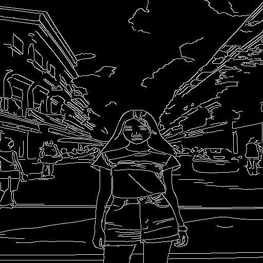
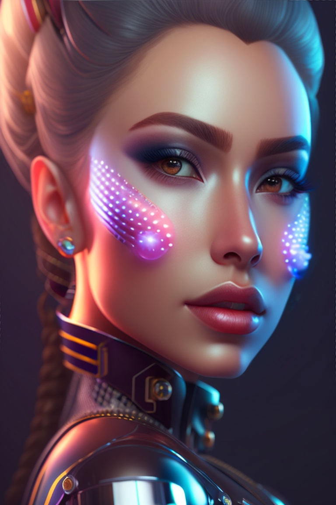
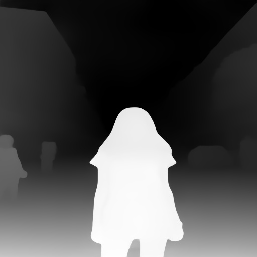
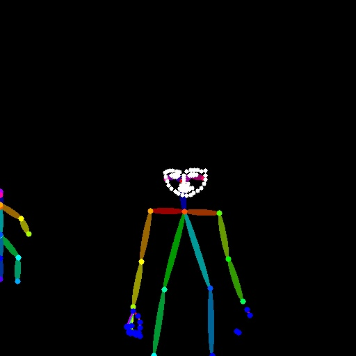
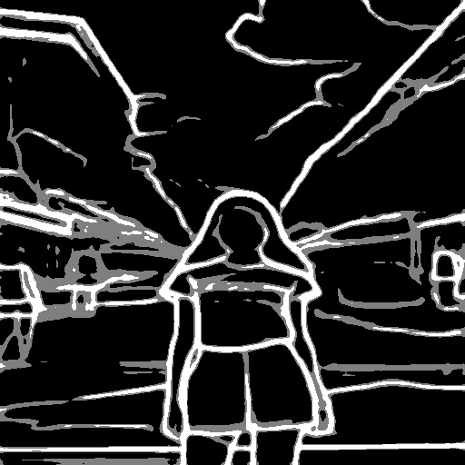
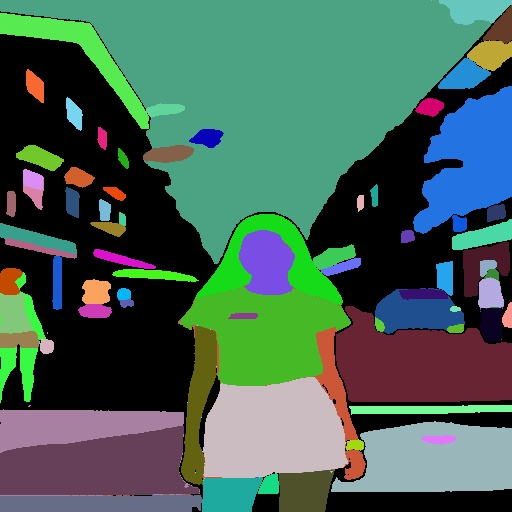

# ControlNet auxiliary models

ControlNet aux 提供了Controlnet 多种输入的预处理方法，如边缘检测，分割等。

项目地址：[GitHub](https://github.com/patrickvonplaten/controlnet_aux)

# 安装

```
pip install controlnet-aux
pip install mediapipe
```


# 使用

## 通过名称调用

```python
import requests
from PIL import Image
from io import BytesIO

from controlnet_aux.processor import Processor

# load image
url = "https://huggingface.co/lllyasviel/sd-controlnet-openpose/resolve/main/images/pose.png"

response = requests.get(url)
img = Image.open(BytesIO(response.content)).convert("RGB").resize((512, 512))

# load processor from processor_id
# options are:
# ["canny", "depth_leres", "depth_leres++", "depth_midas", "depth_zoe", "lineart_anime",
#  "lineart_coarse", "lineart_realistic", "mediapipe_face", "mlsd", "normal_bae", "normal_midas",
#  "openpose", "openpose_face", "openpose_faceonly", "openpose_full", "openpose_hand",
#  "scribble_hed, "scribble_pidinet", "shuffle", "softedge_hed", "softedge_hedsafe",
#  "softedge_pidinet", "softedge_pidsafe"]
processor_id = 'scribble_hed'
processor = Processor(processor_id)

processed_image = processor(img, to_pil=True)
```

## 通过函数调用

```python
from PIL import Image
import requests
from io import BytesIO
from controlnet_aux import HEDdetector, MidasDetector, MLSDdetector, OpenposeDetector, PidiNetDetector, NormalBaeDetector, LineartDetector, LineartAnimeDetector, CannyDetector, ContentShuffleDetector, ZoeDetector, MediapipeFaceDetector, SamDetector, LeresDetector

# load image
url = "https://huggingface.co/lllyasviel/sd-controlnet-openpose/resolve/main/images/pose.png"

response = requests.get(url)
img = Image.open(BytesIO(response.content)).convert("RGB").resize((512, 512))

# load checkpoints
hed = HEDdetector.from_pretrained("lllyasviel/Annotators")
midas = MidasDetector.from_pretrained("lllyasviel/Annotators")
mlsd = MLSDdetector.from_pretrained("lllyasviel/Annotators")
open_pose = OpenposeDetector.from_pretrained("lllyasviel/Annotators")
pidi = PidiNetDetector.from_pretrained("lllyasviel/Annotators")
normal_bae = NormalBaeDetector.from_pretrained("lllyasviel/Annotators")
lineart = LineartDetector.from_pretrained("lllyasviel/Annotators")
lineart_anime = LineartAnimeDetector.from_pretrained("lllyasviel/Annotators")
zoe = ZoeDetector.from_pretrained("lllyasviel/Annotators")
sam = SamDetector.from_pretrained("ybelkada/segment-anything", subfolder="checkpoints")
leres = LeresDetector.from_pretrained("lllyasviel/Annotators")

# instantiate
canny = CannyDetector()
content = ContentShuffleDetector()
face_detector = MediapipeFaceDetector()


# process
processed_image_hed = hed(img)
processed_image_midas = midas(img)
processed_image_mlsd = mlsd(img)
processed_image_open_pose = open_pose(img, hand_and_face=True)
processed_image_pidi = pidi(img, safe=True)
processed_image_normal_bae = normal_bae(img)
processed_image_lineart = lineart(img, coarse=True)
processed_image_lineart_anime = lineart_anime(img)
processed_image_zoe = zoe(img)
processed_image_sam = sam(img)
processed_image_leres = leres(img)

processed_image_canny = canny(img)
processed_image_content = content(img)
processed_image_mediapipe_face = face_detector(img)
```

# 示例

## 原图


## Canny



## content


## MediapipeFaceDetector

只能下图所示的检测较大的人脸，效果不太好




## HEDdetector


## MidasDetector



## MLSDdetector


## OpenposeDetector



## PidiNetDetector



## NormalBaeDetector


## LineartDetector


## LineartAnimeDetector


## ZoeDetector


## SamDetector

