# 1 图像Prompt

## 1.1 promptomania

链接 ： [https://promptomania.com/](https://link.zhihu.com/?target=https%3A//promptomania.com/)

比较全面的prompt生成器，可以提供midjourney、stable diffusion等智能AI绘画工具的文本描述模板，稳定多元，可以选择调整细节和展示效果

## 1.2 prompthero === 已爬

链接：[prompthero.com/](https://link.zhihu.com/?target=https%3A//prompthero.com/)

根据图片查询prompt，可以文字检索，界面也挺美观

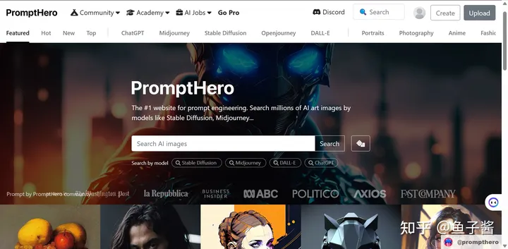

## 1.3 kalos.art

链接：[https://kalos.art/](https://link.zhihu.com/?target=https%3A//kalos.art/)

直观展示利用哪些提示词可以生成的图像风格，可以一键复制prompt

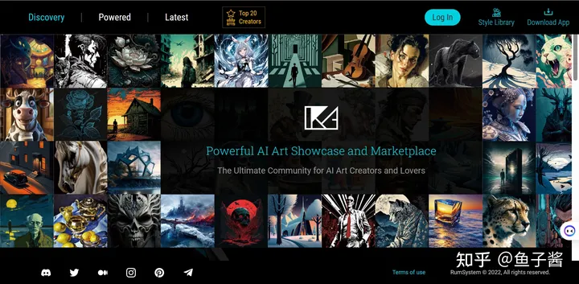

## 1.4 lexica.art === 已爬

可以基于 prompt 或者图片搜索到相关的 AI 绘画作品集，可以通过 prompt 进行 AI 绘画

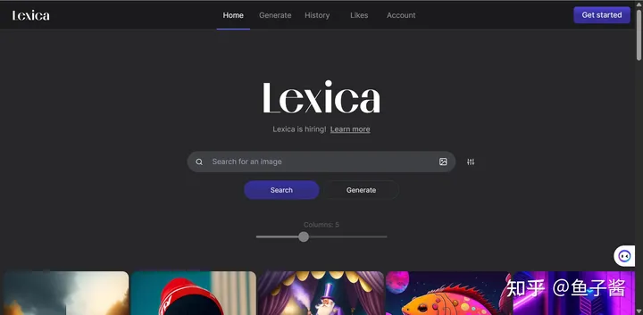

# 2 Prompt处理

## 2.1 prompt翻译

链接：[moonvy.com/apps/ops/](https://link.zhihu.com/?target=https%3A//moonvy.com/apps/ops/)

网站支持将中文prompt翻译成英文，玩midjourney时有用

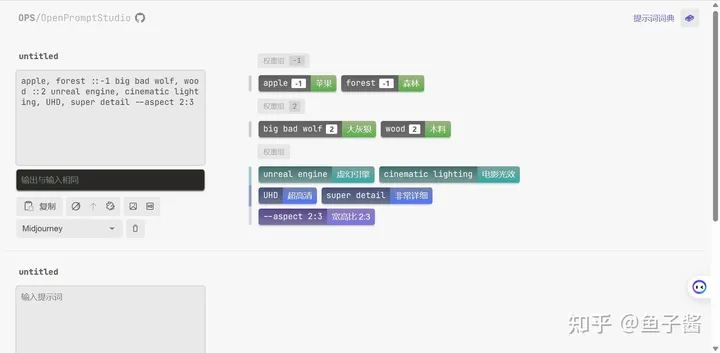

## 2.2 prompt优化

链接：[https://promptperfect.jinaai.cn](https://link.zhihu.com/?target=https%3A//promptperfect.jinaai.cn/)

帮助优化提示词的网站，比如输入一个简短的描述，可以生成更详细的prompt，免费使用20次

# 3 AIGC模型

## 3.1 Civitai

链接：[civitai](https://civitai.com/)

## 3.2 Hugging Face

链接：[Hugging Face](https://huggingface.co/)

推荐仓库：

- https://huggingface.co/stablediffusionapi
- 

## 3.3 stablediffusionapi

链接：https://stablediffusionapi.com/models

# 4 图像风格

## 4.1 urania

链接 ：[urania](https://www.urania.ai/top-sd-artists)

提供了 Stable Diffusion 1.4 中包含的 1833 种不同风格的 prompt 和示例图像，使用时可以通过 `A woman, [artist]` 来创建对应风格的图像。

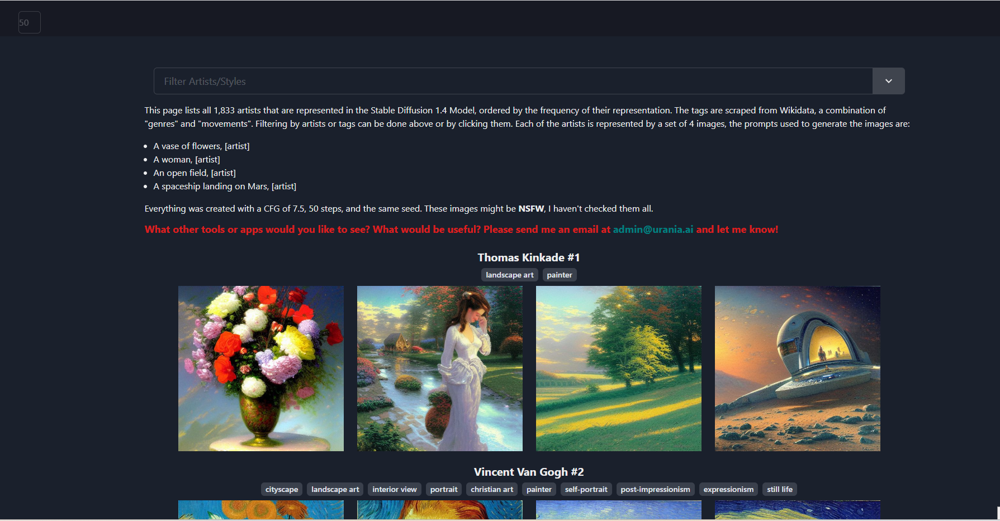

# 5 壁纸

https://zhuanlan.zhihu.com/p/594095659

## 5.1 **Awesome Wallpapers**

链接 ： https://wallhaven.cc/

- 分辨率：~8K
- 类型：创意、摄影、人物、动漫、绘画、视觉

知名壁纸网站，图片资源丰富，质量很高。分为通用、动漫、人物三大类，可以按屏幕比例和分辨率检索。

有tag

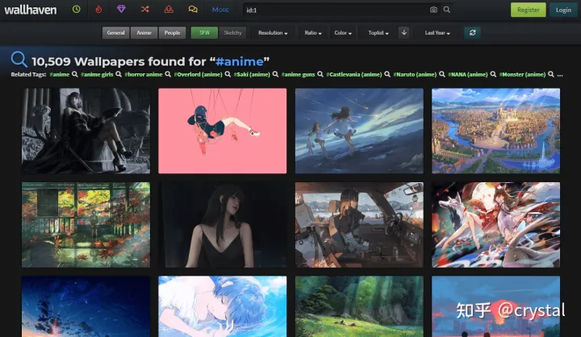

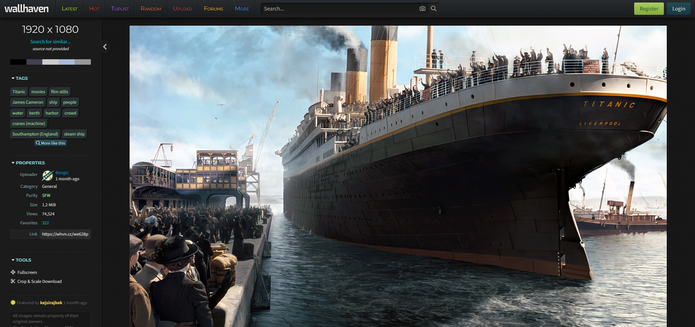

## 5.2 **极简壁纸**

链接：https://bz.zzzmh.cn/index

- 分辨率：~8K
- 类型：创意、摄影、自然、人物、二次元

极简的壁纸站点，体验不错，国内浏览速度很快。

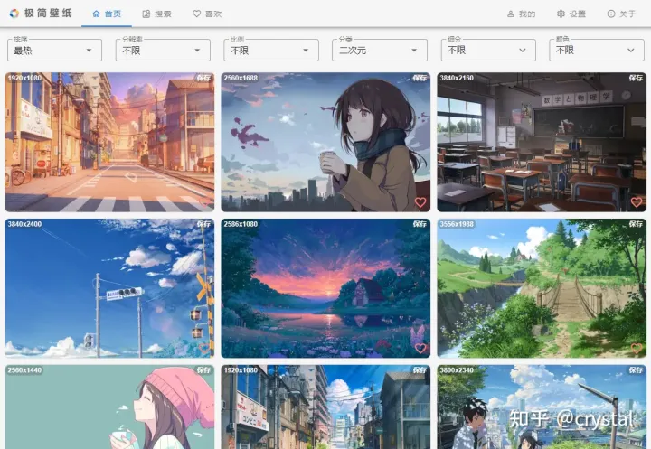

## 5.3 konachan.net

链接：https://konachan.net/post?page=1&tags=

- 分辨率：~8K
- 类型：动漫、插画、创作

全部是二次元、插画作品，都可以直接下载。

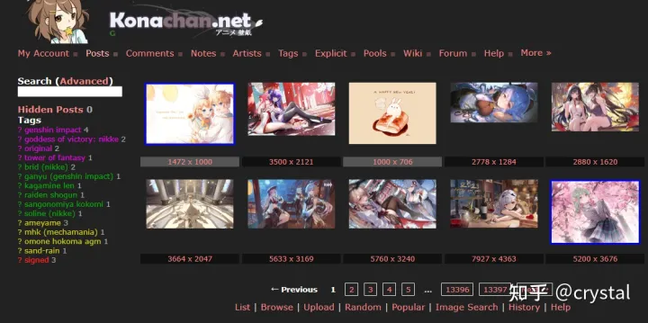

## 5.4 anime-pictures

链接：https://anime-pictures.net/posts?page=0&order_by=date&ldate=0&lang=en

- 分辨率：~8K
- 类型：动漫、插画、创作

一个很出名的动漫壁纸社区，由爱好者们自己上传壁纸，各种类型都有，壁纸分辨率也很高。

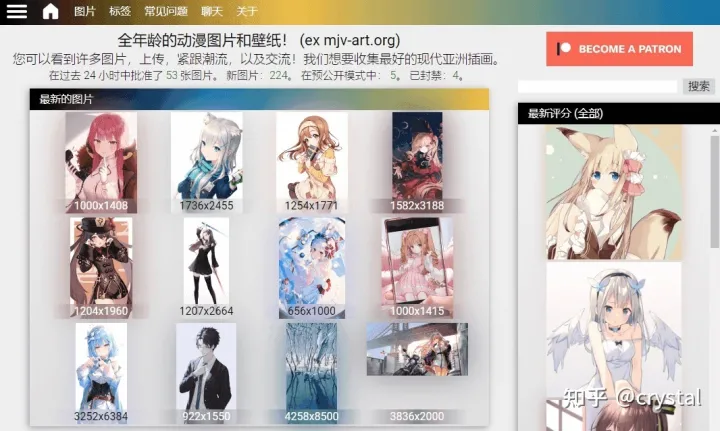

## 5.5 unsplash === 已爬

链接：https://unsplash.com/t/people

- 分辨率：~8K
- 类型：摄影

免费图片素材网站，以摄影作品为主，图片分辨率和尺寸很多。

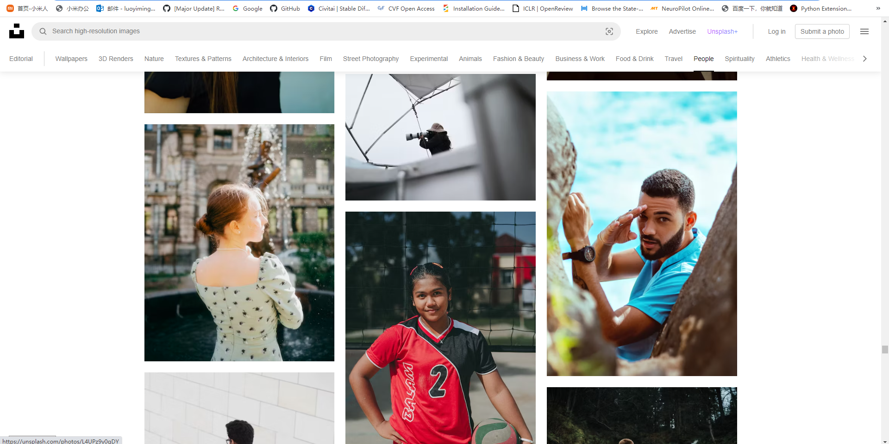

## 5.6 pexels

链接 ：https://www.pexels.com/zh-cn/

- 分辨率：~8K
- 类型：摄影

免费图片素材网站，来自全球用户上传的摄影作品。

## 5.7 wallpaperscraft

链接 ： https://wallpaperscraft.com/

- 分辨率：~4K
- 类型：各种类型都有

## 5.8 netbian

链接：https://pic.netbian.com/4krenwu/

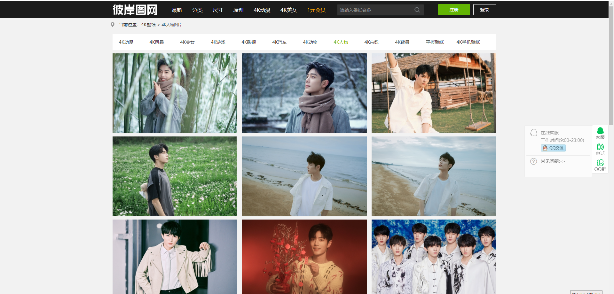

## 5.9 bizhi99

链接：https://www.bizhi99.com/c2/

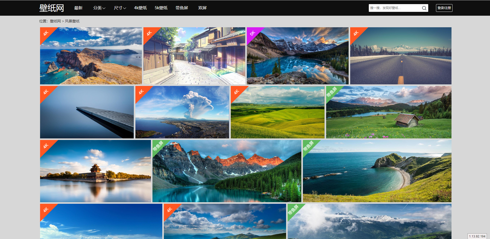

## 5.10 cgwallpapers

链接：https://www.cgwallpapers.com/index.php

游戏壁纸

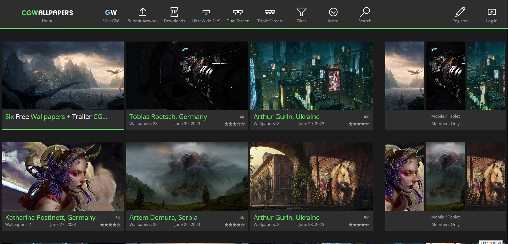

## 5.11 Poolga

链接：http://poolga.com/show/all/5

一个非常好看的插画手机壁纸网站，可以找到很多插画大师的艺术作品，网站将不同的插画进行分类整理了手机壁纸，每个壁纸图片还进行标注了创作者名字，并且还提供了审核的机型。

## 5.12 蜂鸟 === 已爬

链接：https://photo.fengniao.com/#p=7

## 5.13 图虫 ==

链接：https://stock.tuchong.com/?no_redirect=1

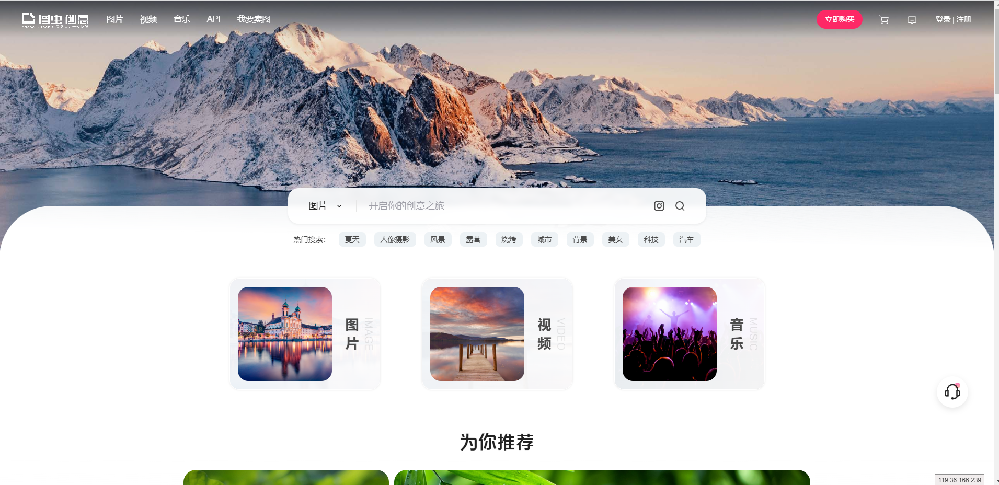

## 5.14 cnu === 已爬

链接：http://www.cnu.cc/inspirationPage/recent-111?page=67

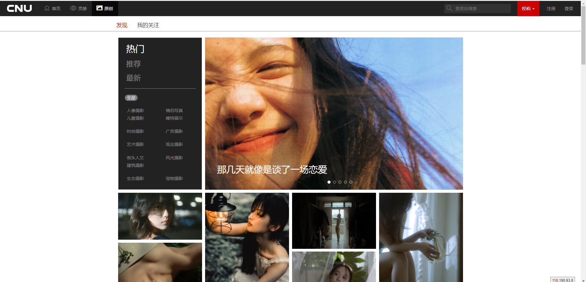

## 5.15 视觉中国 === 已爬

链接：https://www.vcg.com/creative/

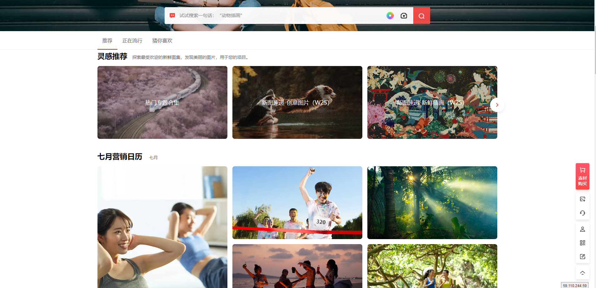
