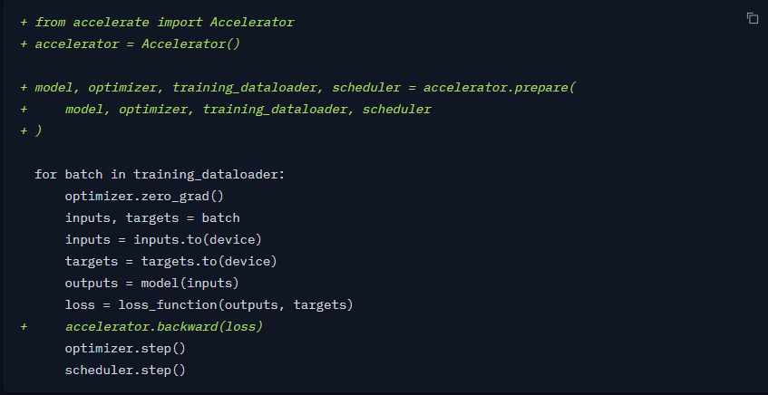

[官方文档](https://huggingface.co/docs/accelerate/index)

Accelerate能够使Pytorch代码分布式运行，并且只需要修改很简单的几行代码。简单的使用方式如下所示：



Accelerate能够使用  [DeepSpeed](https://huggingface.co/docs/accelerate/usage_guides/deepspeed) 和 [fully sharded data parallelism](https://huggingface.co/docs/accelerate/usage_guides/fsdp) ，并且支持自动的混合精度训练。

# 1 安装

-  Accelerate is tested on **Python 3.8+**

## pip安装

```bash
pip install accelerate
```

## 源码安装

```bash
pip install git+https://github.com/huggingface/accelerate
```

或者

```bash
git clone https://github.com/huggingface/accelerate
cd accelerate
pip install -e .
```

# 2 配置

使用Accelerate需要提前配置，运行如下代码，并通过命令行交互式的配置即可：

```bash
accelerate config
```

打印配置信息：

```
accelerate env
```

输出如下：

```
- `Accelerate` version: 0.11.0.dev0
- Platform: Linux-5.10.0-15-cloud-amd64-x86_64-with-debian-11.3
- Python version: 3.7.12
- Numpy version: 1.19.5
- PyTorch version (GPU?): 1.12.0+cu102 (True)
- `Accelerate` default config:
        - compute_environment: LOCAL_MACHINE
        - distributed_type: MULTI_GPU
        - mixed_precision: no
        - use_cpu: False
        - num_processes: 2
        - machine_rank: 0
        - num_machines: 1
        - main_process_ip: None
        - main_process_port: None
        - main_training_function: main
        - deepspeed_config: {}
        - fsdp_config: {}
```

# 3 Getting Start

为了使用Accelerate，需要修改四个地方：

## 3.1 导入Accelerator类并实例化

```python
from accelerate import Accelerator

accelerator = Accelerator()
```

该过程需要尽可能早的在代码中实现，这是由于Accelerator会初始化并行训练的所有需要用到的东西。并行化训练时并不需要自己手动指定需要运行的设备（如, 单卡GPU，单机多卡，多机多卡，TPU等），Accelerate库会自动检测。

## 3.2 移除Pytorch的指定设备函数

移除Pytorch**模型**和**输入数据**使用的 `.to(device)` 或 `.cuda()` 。

Accelerator对象会自动处理这些，并且把所有的模型和数据对象放在合适的设备上。

如果你非常明确你在干什么，也是可以使用 `.to(device)` 的（文档没有说能不能使用 `.cuda()`） ，但是 to 的 device 需要写成 `.to(accelerator.device)` 

**如果想完全自己控制模型和数据的设备，并完全自己指定设备，也是可以的** :

- 在初始化 `accelerator = Accelerator()` 时，设置 `device_placement=False`

## 3.3 调用 prepare() 方法

把所有训练相关的对象：

- optimizer
- model
- training dataloader
- lr_scheduler

送到 prepare() 函数中，这会保证所有的对象能够正确的用于训练：

```python
model, optimizer, train_dataloader, lr_scheduler = accelerator.prepare(
    model, optimizer, train_dataloader, lr_scheduler
)
```

**注意 ：**

- `train_dataloader` 会在多个GPU/TPU单元共享，每个单元使用训练数据中的一部分（相互不重复）。如果想自定义的使用 `shuffle=True` ，请确保每个进程的shuffle的方式完全相同。

- 实际训练的batch_size等于设置的 `batch_size x num_devices` 。如，创建pytorch的dataloader时设置的bs = 16，使用4块卡训练，实际的bs为 $4 \times 16 = 64$ 。

- 如果想要获取 `len(dataloader)` ，比如想计算总的训练steps。需要确保在 `prepare()`调用之后再调用 `len(dataloader)` 

- 可以只把 `dataloader` 送到prepare()函数中。但是最好还是把所有的模型和优化器都同时送进去。

- 对于验证集，如果想并行的运行，也可以送到 `prepare()` 中，否则可以不送。

## 3.4 修改反传函数

把

```python
loss.backward()
```

替换成

```python
accelerator.backward(loss)
```

# 4 保存/加载模型

## 4.1 保存模型

保存模型需要做一些调整：

- 首先需要等待所有进程都执行到 `accelerator.wait_for_everyone()` 的位置。
- 保存模型之前 `unwrap`  模型。这是由于模型在送到 `prepare()` 中做了一些改动。然而，`save_model` 会帮你做这件事情，并保存到指定的文件夹。

保存模型的方式如下所示：

```python
accelerator.wait_for_everyone()
accelerator.save_model(model, save_directory)
```

保存模型也可以保存 `safetensors` 模型：

```python
accelerator.wait_for_everyone()
accelerator.save_model(model, save_directory, max_shard_size="1GB", safe_serialization=True)
```

## 4.2 加载模型

- 加载模型直接使用pytorch的方法加载即可，但是注意需要在 `prepare()` 之前加载。

- 如果必须要在 `prepare()` 之后，使用一些动态的逻辑来动态的改变加载模型，需要先 `unwrap` 之后再加载：

  ```python
  unwrapped_model = accelerator.unwrap_model(model)
  path_to_checkpoint = os.path.join(save_directory,"pytorch_model.bin")
  unwrapped_model.load_state_dict(torch.load(path_to_checkpoint))
  ```

  由于所有模型参数都是tensors，unwrap并加载新的权重之后，不需要再wrap回去。

## 4.3 保存/加载状态

如果像保存模型的训练状态，如 optimizer, random generators, lr_scheduler等，可以使用 `save_state()` 和 `load_state()` 来实现。

# 5 梯度裁剪

如果想使用梯度裁剪，需要把 `pytorch` 的 `torch.nn.utils.clip_grad_norm_` 或 `torch.nn.utils.clip_grad_value_`  对应的分别替换成  [clip*grad_norm*()](https://huggingface.co/docs/accelerate/v0.21.0/en/package_reference/accelerator#accelerate.Accelerator.clip_grad_norm_) 和  [clip*grad_value*()](https://huggingface.co/docs/accelerate/v0.21.0/en/package_reference/accelerator#accelerate.Accelerator.clip_grad_value_)

# 6 混合精度训练

```python
with accelerator.autocast():
    loss = complex_loss_function(outputs, target)
```

# 7 梯度累积

使用 [accumulate()](https://huggingface.co/docs/accelerate/v0.21.0/en/package_reference/accelerator#accelerate.Accelerator.accumulate) 并指定 `gradient_accumulation_steps` ：

```python
accelerator = Accelerator(gradient_accumulation_steps=2)
model, optimizer, training_dataloader = accelerator.prepare(model, optimizer, training_dataloader)

for input, label in training_dataloader:
    with accelerator.accumulate(model):
        predictions = model(input)
        loss = loss_function(predictions, label)
        accelerator.backward(loss)
        optimizer.step()
        scheduler.step()
        optimizer.zero_grad()
```

# 8 內部机制

- 首先，accelerate会分析当前的环境，并决定使用哪种分布式设置，使用多少进程。

- 当调用 `prepare()` 时：
  - 会 wrap model(s) 
  - 会 wrap optimizer(s)  ：[AcceleratedOptimizer](https://huggingface.co/docs/accelerate/v0.21.0/en/package_reference/torch_wrappers#accelerate.optimizer.AcceleratedOptimizer)
  - 创建一个新的 dataloader(s) ：[DataLoaderShard](https://huggingface.co/docs/accelerate/v0.21.0/en/package_reference/torch_wrappers#accelerate.data_loader.DataLoaderShard) 。之所以会重新创建一个新的dataloader，是由于 pytorch 在创建 dataloader 之后，不支持改变 `batch_sampler` 。所以accelerate会通过改变batch_sampler解决不同进程之间的数据分片。