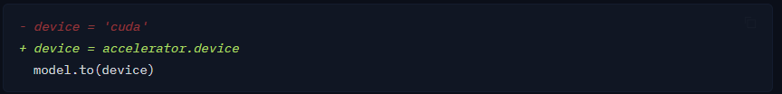
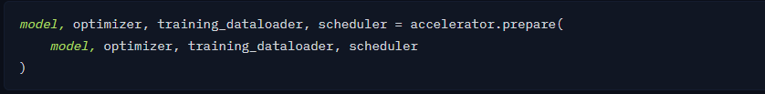
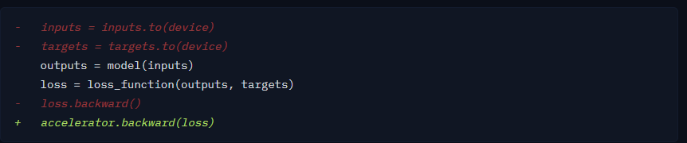
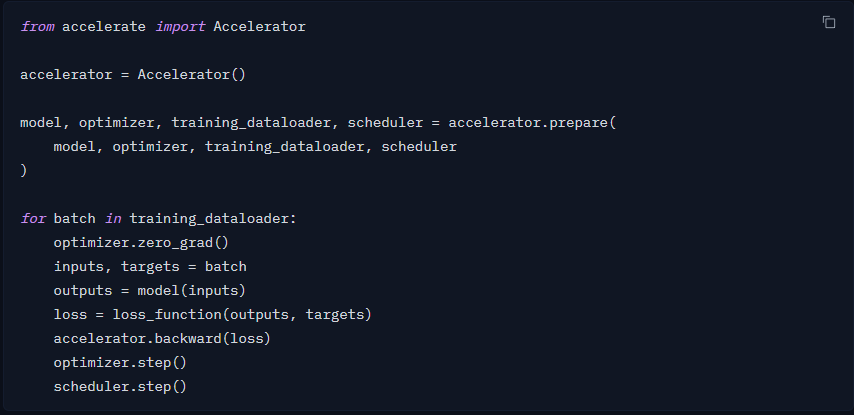

# 原始Pytorch代码

```python
device = "cuda"
model.to(device)

for batch in training_dataloader:
    optimizer.zero_grad()
    inputs, targets = batch
    inputs = inputs.to(device)
    targets = targets.to(device)
    outputs = model(inputs)
    loss = loss_function(outputs, targets)
    loss.backward()
    optimizer.step()
    scheduler.step()
```

# 创建 Accelerator 对象

```python
from accelerate import Accelerator

accelerator = Accelerator()
```

# 设置 device



```python
- device = 'cuda'
+ device = accelerator.device
  model.to(device)
```

# 准备训练对象



```python
model, optimizer, training_dataloader, scheduler = accelerator.prepare(
    model, optimizer, training_dataloader, scheduler
)
```

# 修改训练循环



```python
-   inputs = inputs.to(device)
-   targets = targets.to(device)
    outputs = model(inputs)
    loss = loss_function(outputs, targets)
-   loss.backward()
+   accelerator.backward(loss)
```

# 最终的代码

