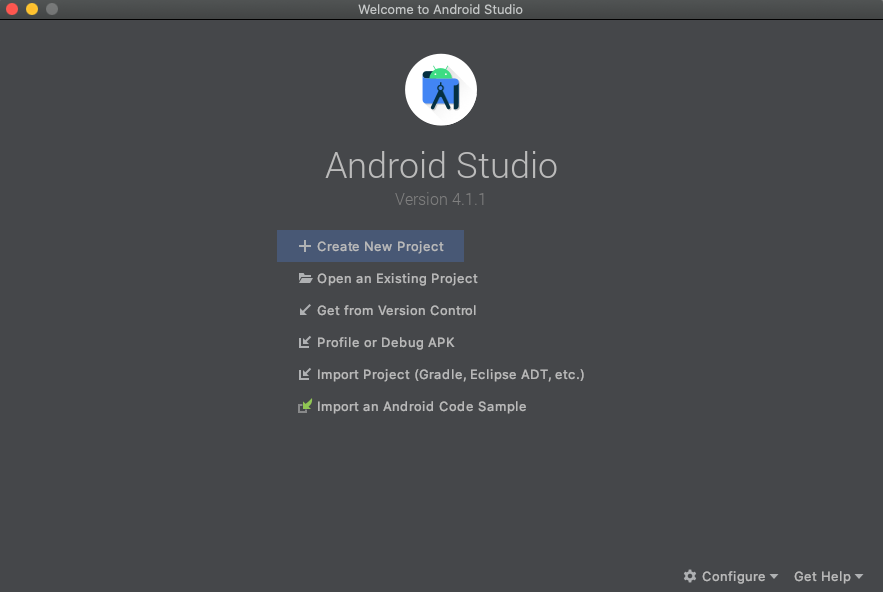
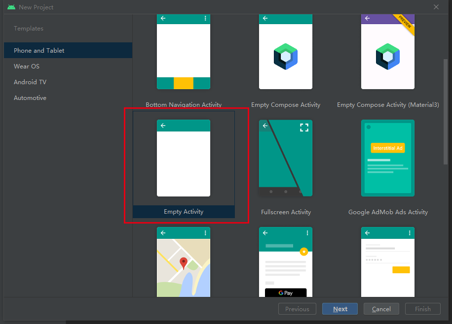
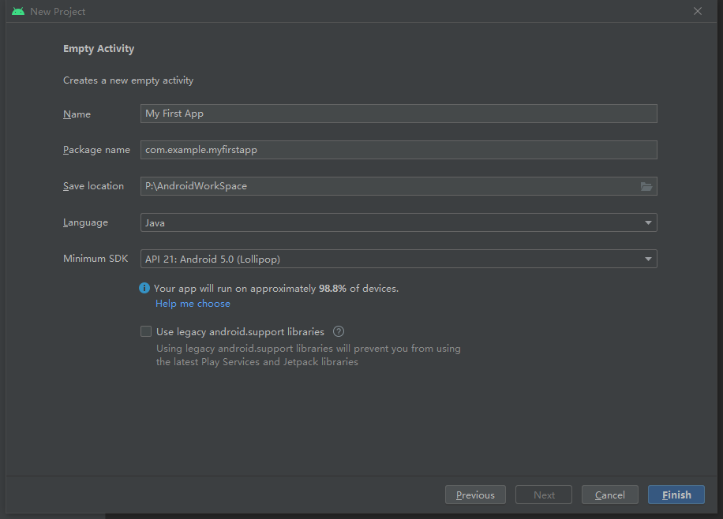
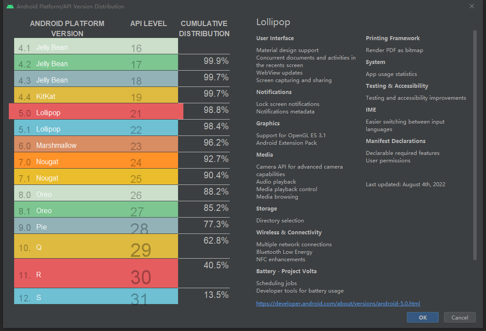
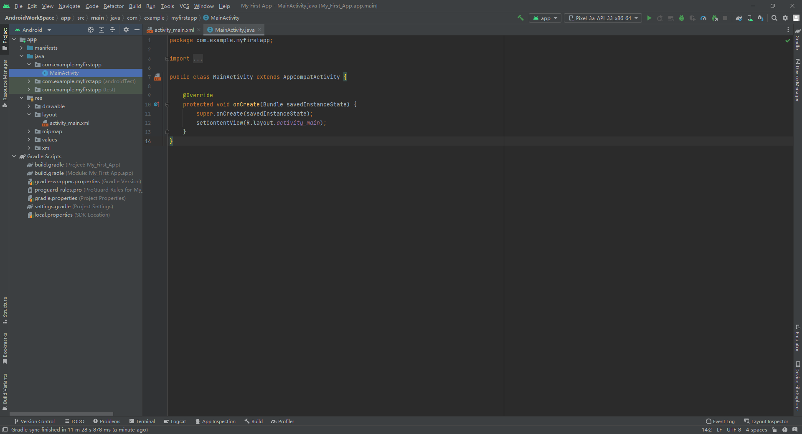
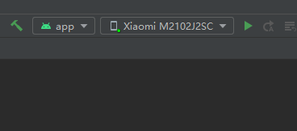
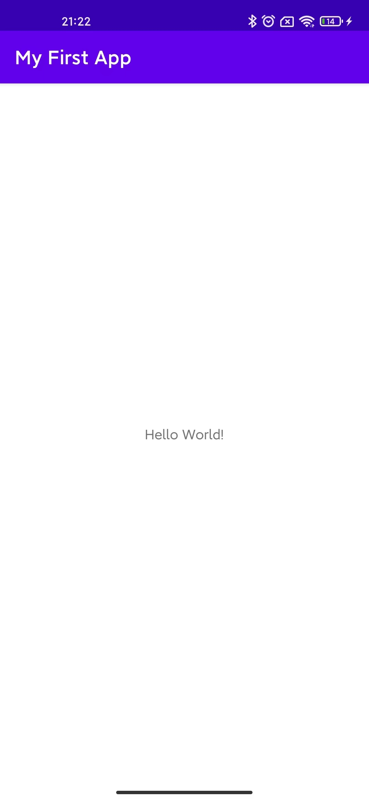
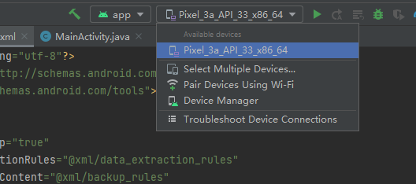
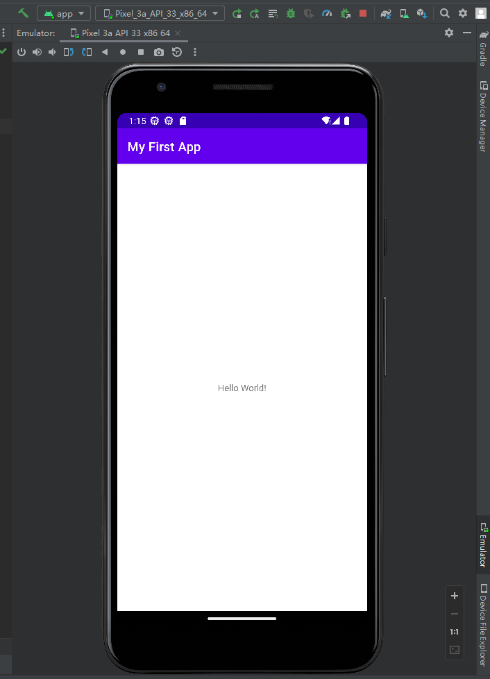

# 1 介绍

Android 应用有两个基本的概念：

+ 入口点
+ 适应不同设备

## 1.1 入口点

Android 应用都是讲各种可单独调用的组件加以组合构建而成。例如，activity 是提供界面 (UI) 的一种应用组件。

“主”activity 在用户点按您的应用图标时启动。您还可以将用户从其他位置（例如，从通知中，甚至从其他应用中）引导至某个 activity。

其他组件（如 *WorkManager*）可使应用能够在没有界面的情况下执行后台任务。

## 1.2 适应不同设备

Android 允许您为不同的设备提供不同的资源。例如，您可以针对不同的屏幕尺寸创建不同的布局。系统会根据当前设备的屏幕尺寸确定要使用的布局。

如果应用的任何功能需要使用特定的硬件（例如摄像头），您可以在运行时查询该设备是否具有该硬件，如果没有，则停用相应的功能。您可以指定应用需要使用特定的硬件，这样，Google Play 就不会允许在没有这些硬件的设备上安装应用。

# 2 创建 Android 项目

## 2.1 创建新项目

+ 如果是第一次安装 Android Studio，点击 `Creat New Project` ：

  

+ 如果已经打开了一个项目，则依次选择 `File > New > New Project` 

## 2.2 创建Activity

在 `Select a Project Template` 窗口中，选择 `Empty Activity`  ：

之后点击 `Next` 。

## 2.3 配置项目

在 `Configure your project` 窗口中：

- 在 **Name** 字段中输入“My First App”。
- 在 **Package name** 字段中输入“com.example.myfirstapp”。
- 如果您想将项目放在其他文件夹中，请更改其 **Save** 位置。
- 从 **Language** 下拉菜单中选择 **Java** 或 **Kotlin**。
- 在 **Minimum SDK** 字段中选择您希望应用支持的最低 Android 版本。
- 如果您的应用需要旧版库支持，请选中 **Use legacy android.support libraries** 复选框。
- 其他选项保持原样。
- 点击 **Finish**。

其中，`Minimum SDK` 表示支持的最低 Android 版本，可以点击 `Help me choose` 对话框。此对话框会提供有关各 Android 版本在设备间的分布情况的信息。您需要权衡的主要因素是，您想支持的 Android 设备所占的百分比，以及在这些设备所搭载的各个不同版本上维护应用所需的工作量。例如，如果您选择让应用与多个不同 Android 版本兼容，那么维护最旧版本与最新版本之间的兼容性所需的工作量就会增大：

## 完成配置

上述操作完成之后，等待一段时间，Android Studio 会下载一些必要的库。之后，Android Studio 的主窗口会出现：

其中：

+ `app > java > com.example.myfirstapp > MainActivity.java`  是主 activity。是应用的主入口。当构建和运行应用时，系统会启动此 `Activity` 的实例并加载其布局。
+ `app > res > layout > activity_main.xml` 定义了 activity 界面的UI布局。其包含一个 `TextView` 元素，其中具有 "Hello, World!" 文本。
+ `app > mainfests > AndroidManifest.xml` 是清单文件，描述了应用的基本特性，并定义了每个应用组件。

+ `Gradle Scripts > build.gradle` 。可以发现，一共有两个 `build.gradle`：
  + `Project:My First APP ` 针对项目
  + `Module:My_First_App.app` 针对应用模块。每个模块均有自己的 `build.gradle` 文件，但此项目当前仅有一个模块。使用每个模块的 `build.gradle` 文件控制 [Gradle 插件](https://developer.android.com/studio/releases/gradle-plugin)构建应用的方式。如需详细了解此文件，请参阅[配置 build](https://developer.android.com/studio/build#module-level)。

# 3 运行应用

## 3.1 在真实设备上运行

本节将以 XIAOMI 11 Pro 为例。

+ 使用一根 USB 线将设备连接到开发机器。如果您是在 Windows 上开发的，则可能需要为设备[安装合适的 USB 驱动程序](https://developer.android.com/studio/run/oem-usb)。
+ 手机上打开 `设置 > 我的设备 > 全部参数 > MIUI版本` ，连续点击 `MIUI版本` 直至出现 “处于开发者模式”
+ 手机上打开 `设置 > 更多设置 > 开发者选项` ，启用 `USB调试` 

+ 在 Android Studio 中，从工具栏中的运行/调试配置下拉菜单中选择您的应用

+ 在工具栏中，从目标设备下拉菜单中选择要用来运行应用的设备

  

+ 点击 `Run`

+ Android Studio 会在已连接的设备上安装您的应用并启动它。您现在会看到设备上的应用中显示了“Hello, World!” ：

  

## 3.2 在模拟器上运行

+ 在 Android Studio 中创建一个 Android 虚拟设备 (AVD) 。模拟器可以使用该设备安装和运行应用：

  + 按照 [创建一个 Android 虚拟设备 (AVD)](https://developer.android.com/studio/run/managing-avds#createavd) 创建虚拟设备

  + 在工具栏中，从运行/调试配置下拉菜单中选择应用

  + 从目标设备下拉菜单中，选择要用来运行应用的 AVD：

    

+ 点击 `Run` 图标

+ Android Studio 会在 AVD 上安装应用并启动模拟器。您现在会看到应用中显示了“Hello, World!” ：

  

