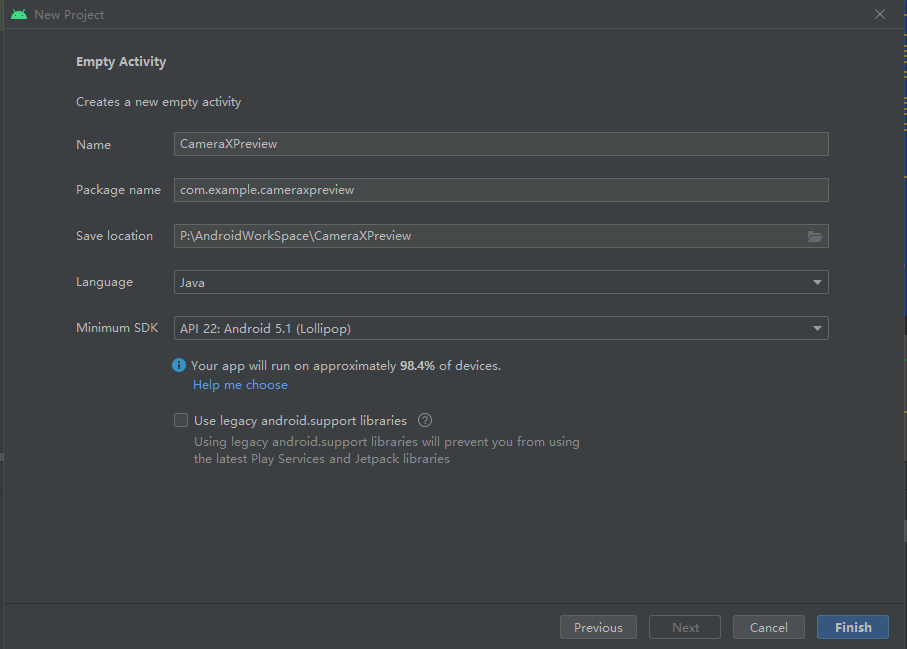

# 1 介绍

本节将展示如何在 activity 中显示相机预览 （Preview 用例）。即，使用 CameraX 显示取景器。除其他功能如拍摄、分析等内容本节将不会实现。

# 2 创建项目

1. 在 Android Studio 中，创建一个新项目，并在出现提示时选择“Empty Activity”。

2. 由于 CameraX 所需的最低版本是21，因此需要将最低 API 级别设置为 21。**然而实际测试发现，只有设置为 22 才能正常工作。**对于旧版本 Android Studio，请务必包含 AndroidX 工件支持。

   

# 3 添加 Gradle 依赖项

1. 打开 `CameraXApp.app` `Module` 的 `build.gradle` 文件，并添加 CameraX 依赖项：

```
dependencies {
  def camerax_version = "1.1.0-beta01"
  implementation "androidx.camera:camera-core:${camerax_version}"
  implementation "androidx.camera:camera-camera2:${camerax_version}"
  implementation "androidx.camera:camera-lifecycle:${camerax_version}"
  implementation "androidx.camera:camera-video:${camerax_version}"

  implementation "androidx.camera:camera-view:${camerax_version}"
  implementation "androidx.camera:camera-extensions:${camerax_version}"
}
```

2. CameraX 需要一些属于 Java 8 的方法，因此我们需要相应地设置编译选项。在 `android` 代码块的末尾，紧跟在 `buildTypes` 之后，添加以下代码：

   ```
   compileOptions {
       sourceCompatibility JavaVersion.VERSION_1_8
       targetCompatibility JavaVersion.VERSION_1_8
   }
   ```

3. 点击 **Sync Now**，我们就可以在应用中使用 CameraX 了


# 4 创建布局

创建一个 `androidx.camera.view.PreviewView` 的 `view` 。即，将原始的 `res/layout/activity_main.xml` 直接替换为：

```xml
<?xml version="1.0" encoding="utf-8"?>
<androidx.constraintlayout.widget.ConstraintLayout
    xmlns:android="http://schemas.android.com/apk/res/android"
    xmlns:app="http://schemas.android.com/apk/res-auto"
    xmlns:tools="http://schemas.android.com/tools"
    android:layout_width="match_parent"
    android:layout_height="match_parent"
    android:background="#FF000000"
    tools:context=".MainActivity">

    <androidx.camera.view.PreviewView
        android:id="@+id/previewView"
        android:layout_width="match_parent"
        android:layout_height="match_parent" />

</androidx.constraintlayout.widget.ConstraintLayout>
```


# 5 设置权限

应用需要获得用户授权才能打开相机；录制音频也需要麦克风权限；在 Android 9 (P) 及更低版本上，MediaStore 需要外部存储空间写入权限。在此步骤中，我们将实现这些必要的权限。

1. 打开 `AndroidManifest.xml`，然后将以下代码行添加到 `application` 标记之前。

   ```
   <uses-feature android:name="android.hardware.camera.any" />
   <uses-permission android:name="android.permission.CAMERA" />
   <uses-permission android:name="android.permission.RECORD_AUDIO" />
   <uses-permission android:name="android.permission.WRITE_EXTERNAL_STORAGE" />
   ```

   其中，添加 `android.hardware.camera.any` 可确保设备配有相机。指定 `.any` 表示它可以是前置摄像头，也可以是后置摄像头。如果您在未指定 `.any` 的情况下使用 `android.hardware.camera`，并且您的设备未配有后置摄像头（例如大多数 Chromebook），那么相机将无法正常运行。第二行代码会添加对该相机的使用权限。

# 6 初始设置

本节是为了最终的效果更美观，所做的一些页面配置工作，如果不做也是可以的：

1. 在 `public class MainActivity extends AppCompatActivity` 中加入一个 `initConfig` 函数：

   ```java
   import android.view.WindowManager;
   
   public class MainActivity extends AppCompatActivity {
   
       private void initConfig(){
           // 去掉导航栏
           getSupportActionBar().hide();
           // 透明状态栏
           getWindow().addFlags(WindowManager.LayoutParams.FLAG_TRANSLUCENT_STATUS);
           // 透明导航栏
           getWindow().addFlags(WindowManager.LayoutParams.FLAG_TRANSLUCENT_NAVIGATION);
           // 屏幕常亮
           getWindow().addFlags(WindowManager.LayoutParams.FLAG_KEEP_SCREEN_ON);
       }
   ```

2. 在 `onCreate` 中调用：

```
@Override
protected void onCreate(Bundle savedInstanceState) {
	super.onCreate(savedInstanceState);
	setContentView(R.layout.activity_main);

	initConfig();
}
```

# 7 全部代码

```java
package com.example.cameraxpreview;

import androidx.annotation.NonNull;
import androidx.appcompat.app.AppCompatActivity;
import androidx.camera.core.Camera;
import androidx.camera.core.CameraSelector;
import androidx.camera.core.ImageAnalysis;
import androidx.camera.core.ImageCapture;
import androidx.camera.core.ImageCaptureException;
import androidx.camera.core.Preview;
//import androidx.camera.extensions.HdrImageCaptureExtender;
import androidx.camera.lifecycle.ProcessCameraProvider;
import androidx.camera.view.PreviewView;
import androidx.core.app.ActivityCompat;
import androidx.core.content.ContextCompat;
import androidx.lifecycle.LifecycleOwner;

import android.Manifest;
import android.content.pm.PackageManager;
import android.os.Bundle;
import android.os.Environment;
import android.os.Handler;
import android.util.Log;
import android.view.View;
import android.view.WindowManager;
import android.widget.ImageView;
import android.widget.Toast;

import com.google.common.util.concurrent.ListenableFuture;

import java.io.File;
import java.text.SimpleDateFormat;
import java.util.Date;
import java.util.Locale;
import java.util.concurrent.ExecutionException;
import java.util.concurrent.Executor;
import java.util.concurrent.Executors;

public class MainActivity extends AppCompatActivity {

    PreviewView previewView;
    private ListenableFuture<ProcessCameraProvider> cameraProviderFuture;

    private final String[] REQUIRED_PERMISSIONS = new String[]{Manifest.permission.CAMERA, Manifest.permission.WRITE_EXTERNAL_STORAGE};
    private final int REQUEST_CODE_PERMISSIONS = 10;

    private void initConfig(){
        // 去掉导航栏
        getSupportActionBar().hide();
        // 透明状态栏
        getWindow().addFlags(WindowManager.LayoutParams.FLAG_TRANSLUCENT_STATUS);
        // 透明导航栏
        getWindow().addFlags(WindowManager.LayoutParams.FLAG_TRANSLUCENT_NAVIGATION);
        // 屏幕常亮
        getWindow().addFlags(WindowManager.LayoutParams.FLAG_KEEP_SCREEN_ON);
    }

    @Override
    protected void onCreate(Bundle savedInstanceState) {
        super.onCreate(savedInstanceState);
        setContentView(R.layout.activity_main);


        if(allPermissionsGranted()){
            startCamera(); //start camera if permission has been granted by user
        } else{
            ActivityCompat.requestPermissions(this, REQUIRED_PERMISSIONS, REQUEST_CODE_PERMISSIONS);
        }

        initConfig();
        previewView = findViewById(R.id.previewView);

    }

    private void startCamera() {

        cameraProviderFuture = ProcessCameraProvider.getInstance(this);


        cameraProviderFuture.addListener(() -> {
            try {
                ProcessCameraProvider cameraProvider = cameraProviderFuture.get();
                bindPreview(cameraProvider);
            } catch (ExecutionException | InterruptedException e) {
                // No errors need to be handled for this Future.
                // This should never be reached.
            }
        }, ContextCompat.getMainExecutor(this));

    }

    void bindPreview(@NonNull ProcessCameraProvider cameraProvider) {

        Preview preview = new Preview.Builder()
                .build();

        CameraSelector cameraSelector = new CameraSelector.Builder()
                .requireLensFacing(CameraSelector.LENS_FACING_BACK)
                .build();

        preview.setSurfaceProvider(previewView.getSurfaceProvider());
        Camera camera = cameraProvider.bindToLifecycle((LifecycleOwner)this, cameraSelector, preview);
    }

    private boolean allPermissionsGranted(){

        for(String permission : REQUIRED_PERMISSIONS){
            if(ContextCompat.checkSelfPermission(this, permission) != PackageManager.PERMISSION_GRANTED){
                return false;
            }
        }
        return true;
    }

    @Override
    public void onRequestPermissionsResult(int requestCode, @NonNull String[] permissions, @NonNull int[] grantResults) {

        super.onRequestPermissionsResult(requestCode, permissions, grantResults);
        if (requestCode == REQUEST_CODE_PERMISSIONS) {
            if (allPermissionsGranted()) {
                startCamera();
            } else {
                Toast.makeText(this, "Permissions not granted by the user.", Toast.LENGTH_SHORT).show();
                ActivityCompat.requestPermissions(this, REQUIRED_PERMISSIONS, REQUEST_CODE_PERMISSIONS);
                this.finish();
            }
        }
    }

}
```

