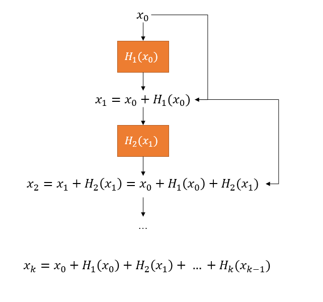
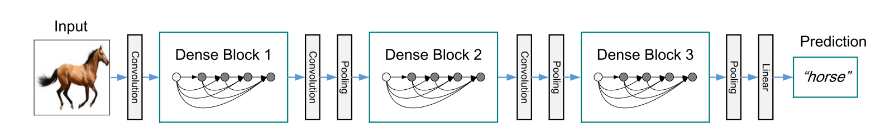
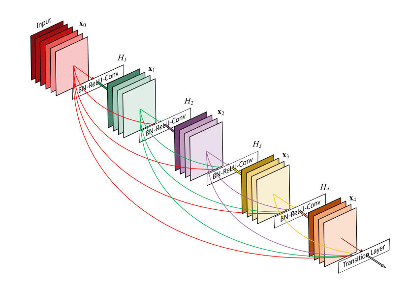
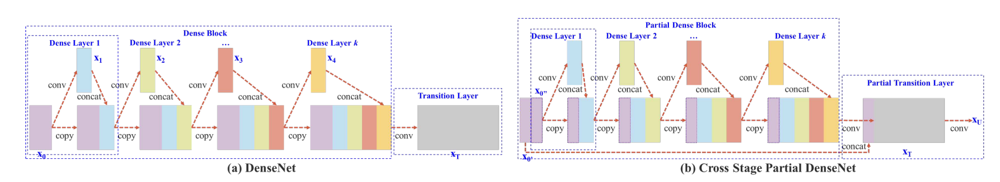

## ResNet

ResNet 第 $k$ 层的输出可以表示为：

其中，$H(\cdot)$ 表示残差块。

## DenseNet

注意，当前层传递给后续层的特征，是在当前层concat之前。

即，$x_k = [x_0, H_1(x_0), H_2(x_1), ..., H_k(x_{k-1})]$

## 分析

上述两种方法在 forward 阶段能够重用浅层的特征，增加信息的流动性并丰富特征语义。但是在 backward 时，第 $k$ 层的梯度 $g_k$ 将会传递给之前 $k-1, k-2, ..., 1$ 的所有层，而第 $k-1$ 又会将梯度 $g_k \times w_{k-1}$ 传递给之前的 $k-2, k-3, ..., 1$ 的所有层。可以发现，浅层多次利用包含  $g_k$ 的梯度信息更新权重，导致学习了许多重复冗余的信息。 

## CSPNet

