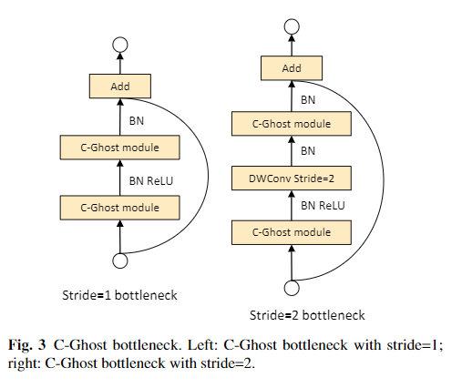
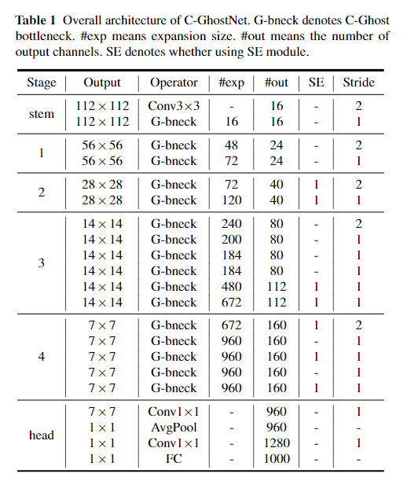
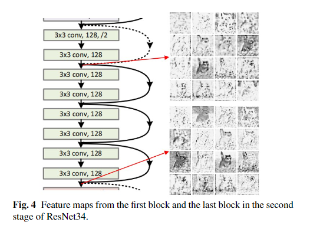
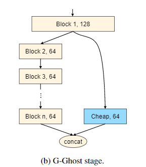
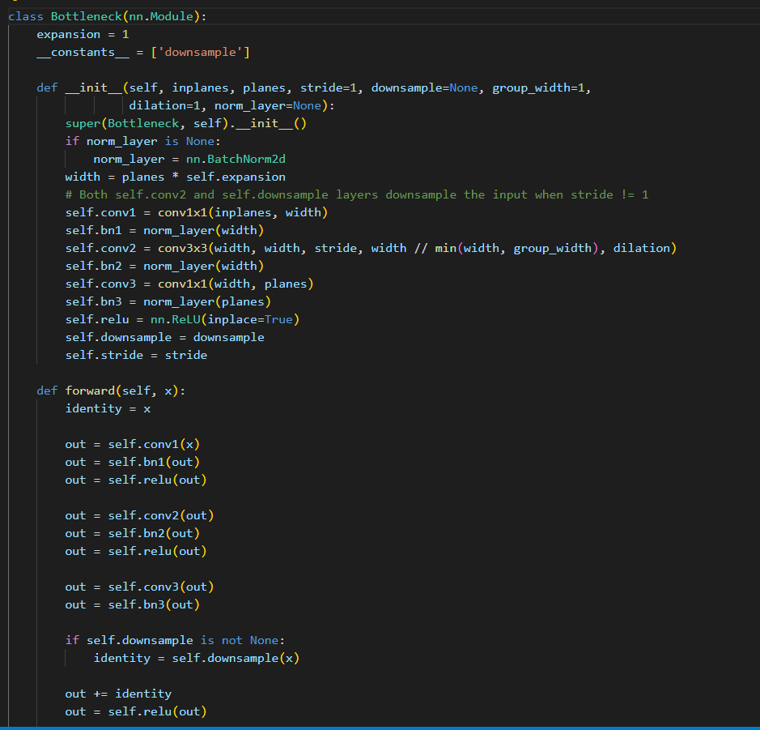
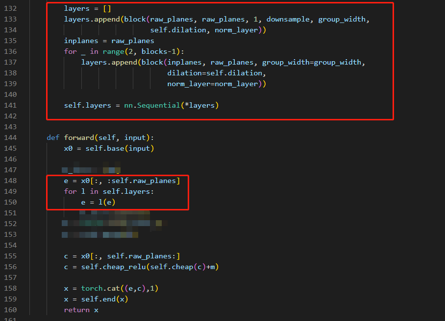
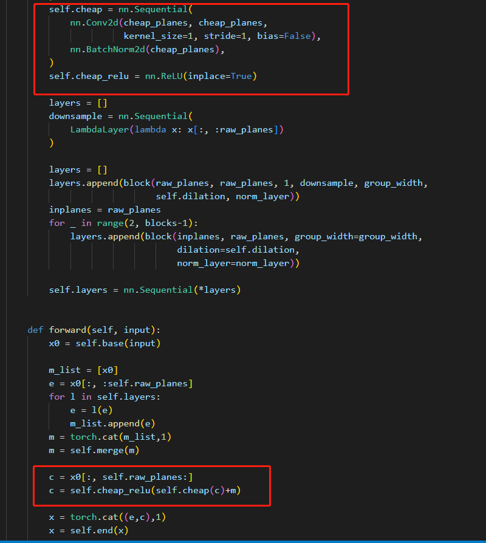
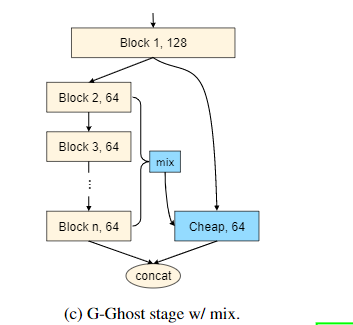
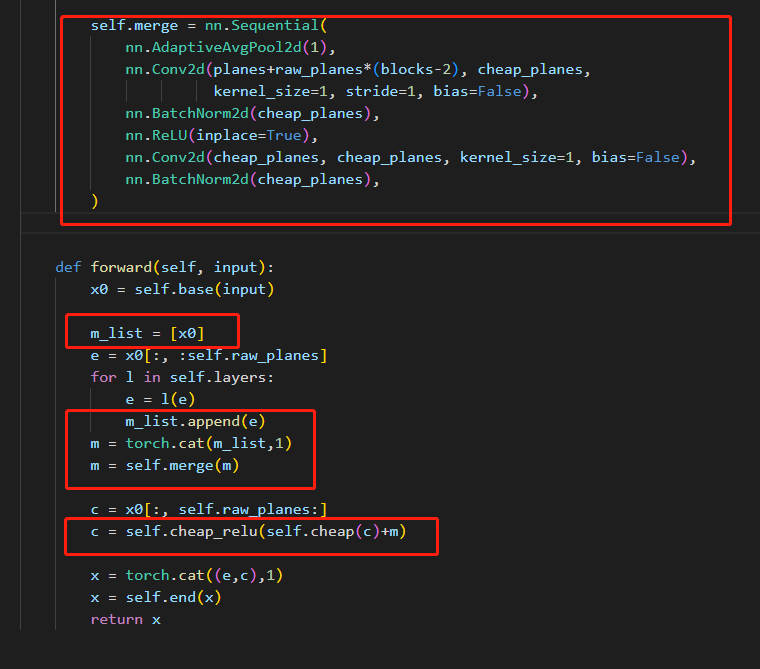
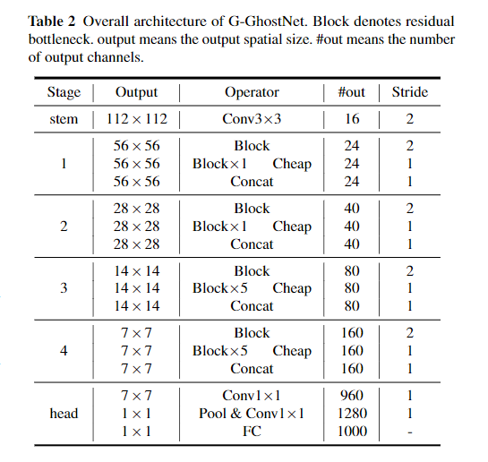

`GhostNet on Heterogeneous Devices via Cheap Operations`

# 1 贡献

+ 提出了一个 CPU-efficient Ghost (C-Ghost)
+ 提出了一个 GPU-efficient Ghost (G-Ghost)

# 2 方法

## 2.1 CPU-Efficient GhostNet

就是GhostNet-v1

## 2.2 GPU-Efficient GhostNet

+ 深度卷积在GPU上的计算效率较低，无法充分利用GPU的并行计算能力。
+ 现有方法的body of backbone通常由几个分辨率逐渐递减的stages组成，每个stage又包含几个blocks。而在GhostNet中，目标是减少stage-wise的冗余特征。

如上图所示，一个stage的最后一个block的输出特征，与该stage比较早的特征也存在冗余。因此，不是所有的特征都需要在全部block中使用大量昂贵的计算，而只需要简单的变换即可。因此，把输入特征分成 complicated 和 ghost 两部分。complicated features需要一些列blocks来处理，ghost 特征可以从浅层获取。

对于一个包含n个block的输出特征图 $Y_n \in \mathbb{R} ^ {c \times h \times w}$ ，其中 $c$ 个通道是由 complicated fetures 和 ghost features共同组成的。定义 complicated features $Y_n^{c} \in \mathbb{R}^{(1 - \lambda)c\times h \times w}$ ，ghost features $Y_n^{g} \in \mathbb{R}^{\lambda c\times h \times w}$ ，其中 $0 \le \lambda \le 1$ 是ghost特征的比例。可以通过concat来获得 $Y_n = concat([Y_n^c, Y_n^g])$ 。过程如下图所示：

其中，cheap可以是简单的 1x1卷积，或3x3卷积，etc.

以resnet为backbone，官方代码的实现中，block就是residual block：

+ complicated features就是普通的多个block堆叠，其中第一个block用于下采样：

  

+ cheap features 就是单个 conv + bn + relu （下图的merge，end暂时不用管）:

  

### 2.2.1 Intrinsic Feature Aggregation

输入特征虽然有一部分被划分成cheap，并只通过一个conv+bn+relu直接就输出了。但是显而易见，这部分特征缺乏深度信息，which需要多层layers来提取。为了解决缺乏深度信息的问题，本文还对 complicated features 特征来增强cheap操作的表达能力：

+ 对于complicated特征，每个stage的特征表示为 $Y_2^c, Y_3^c, ..., Y_n^c$ ，这些特征首先聚合到一起，得到 $\tau(Z)$ ，之后聚合到 cheap 特征 $Y_n^g$ 上。其中 $\tau$ 是转换函数。
+ 为了不引入大量的额外计算，需要尽可能保证 $\tau$ 的简单。本文只是用一个全局平均池化来获取聚合特征，之后使用一个全连接层来匹配聚合特征和 $Y_n^g$的维度。

如下图所示：

即：

+ 所有complicated 特征按通道都concat起来，之后使用全局平均池化，使得空间维度降维成1.
+ 之后使用conv来变换通道维度，使得能够与cheap的通道相同。
+ 之后使用广播的方式，与cheap特征按通道相加，如代码最后一个红框中的 self.cheap(c) + m

G-Ghosh的网络结构如下：

