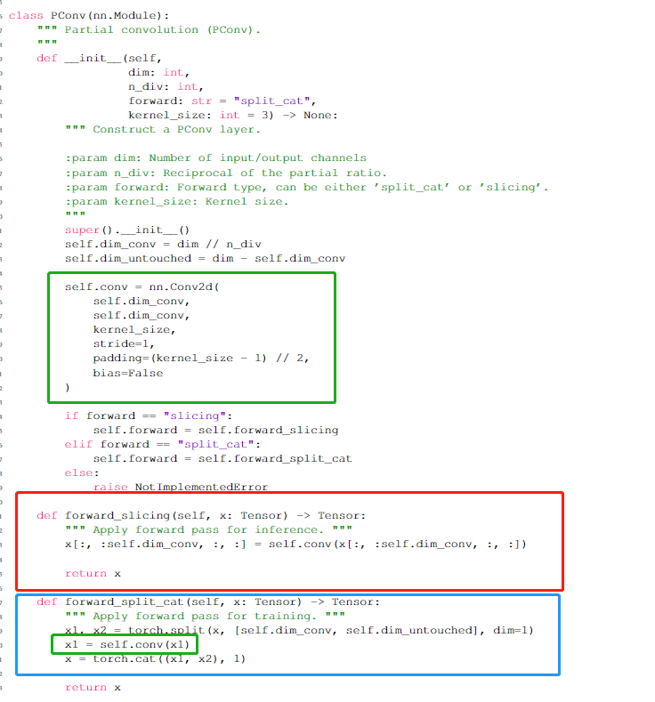
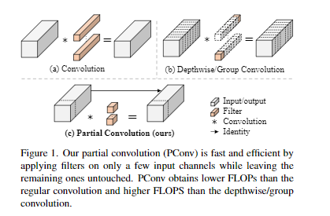
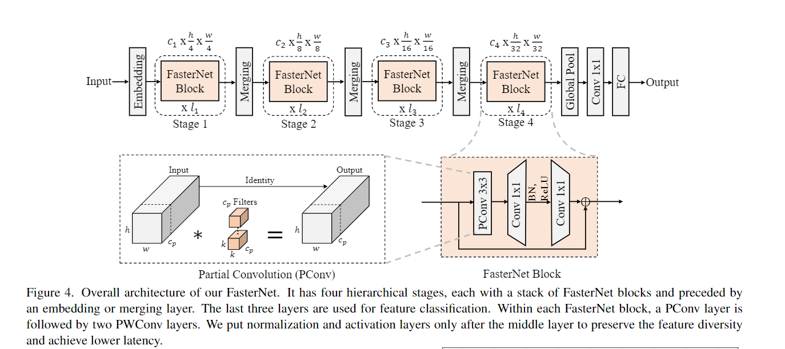
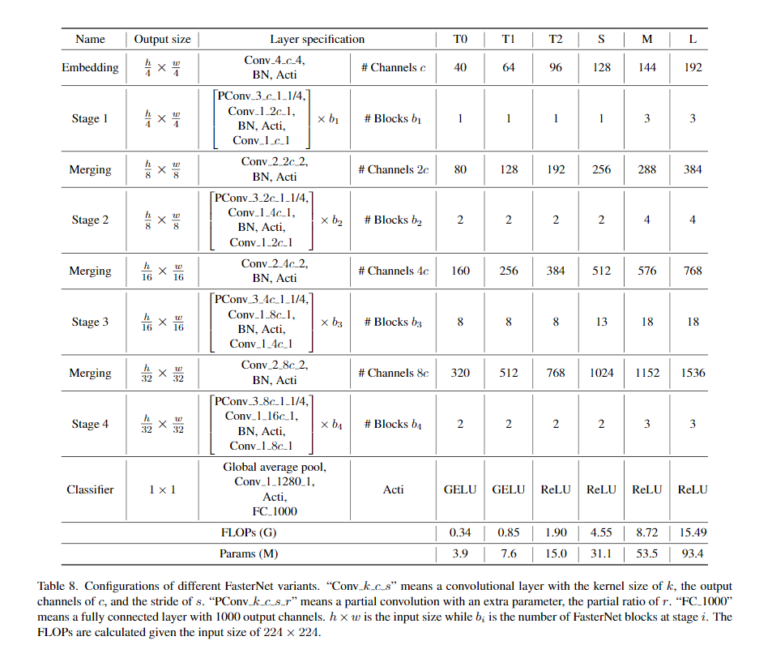
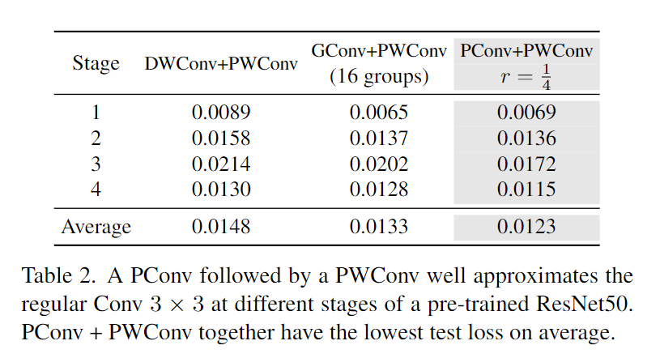
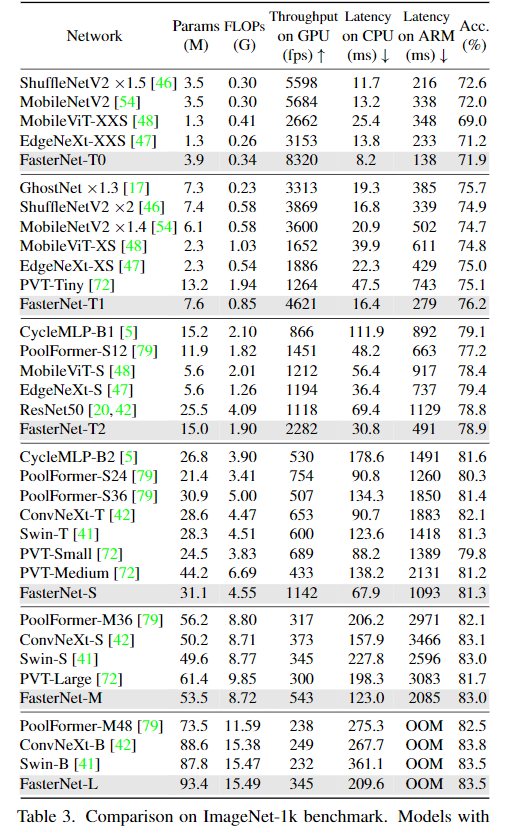
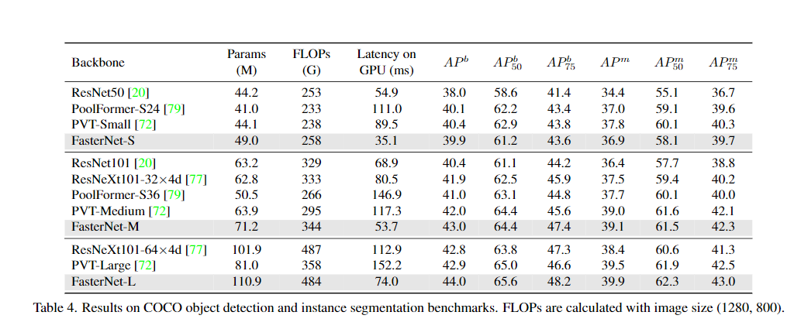

`Run, Don't Walk: Chasing Higher FLOPS for Faster Neural Networks`

# 1 动机

认为低 FLOPS主要由于频繁的内存访存，特别是深度卷积。因此提出了一个新的局部卷积 (Partial convolution, PConv) 。

# 2 方法

方法很简单，与GhostNet相似。即，使用昂贵的卷积处理一部分特征图，使用cheap的卷积处理另一部分特征图。读论文时作者未公开代码，只在附录中公布了代码片段 https://github.com/JierunChen/FasterNet：

其中：

+ `forward_slicing` 和 `forward_split_cat` 完全相同，只不过是对切分输入特征的两种实现，一种是torch.split函数，一种是直接切片。这两种实现在一些部署框架中的速度是不一样的，需要针对性的选择。
+ PConv block只有一个卷积，用于昂贵计算。
+ cheap特征直接concat

流程如下图所示：

## 2.1 网络结构

其中：

+ Embedding 是一个普通的4x4 conv, stride = 4。用于下采样和通道扩张。
+ Merging 是一个普通的2x2 conv， stride=2。用于下采样和通道扩张。
+ 作者发现最后两个stage的block的计算量更低（因为分辨率更小），因此在最后两个Stage放了最多的num blocks。
+ 每个FasterNet Block由一个PConv和两个1x1的卷积组成，第一个1x1卷积用于扩充通道(2倍)，第二个1x1卷积用于恢复通道。此外还有残差连接。

此外，作者认为BN和Act也是轻量级模型所不能容忍的。因此如上表所示，BN和Act在每个FasterNet Block中只有一个，放在第一个1x1卷积之后：

+ 使用GELU用于更小的FasterNet
+ 使用ReLU用于较大的FasterNet

# 3 实验

**实验非常惊艳。**

1. 比GhostNet计算量更少，且G-Ghost还使用了Mix操作，但是FasterNet直接使用skip conn作为cheap operation，并直接concat。

## 3.1 Pconv

+ Pconv + Point-wise Conv 比 深度可分离，组卷积+PWConv都更好

## 3.2 ImageNet

+ FasterNet-T0 的延时比mobilenet-v2快了5ms，准确率只低了0.1

## 3.3 COCO

+ FasterNet-S比ResNet50低了19.8ms，AP比ResNet50高很多。

