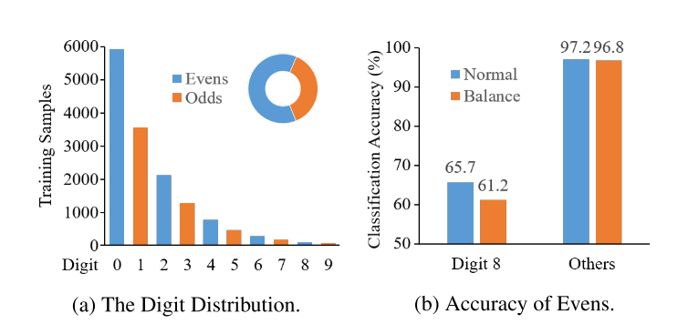
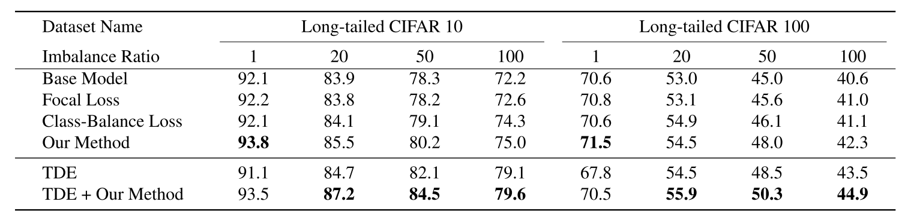

`A Re-Balancing Strategy for Class-Imbalanced Classification Based on Instance Difficulty`

# 1 动机

+ 数据通常存在类别数量不平衡的问题。神经网络模型在这些不平衡的数据上训练通产股表现较差。
+ 现有方法为了解决这个问题，通常通过 re-balance 数据分布，如给多数的类别更小的权重，给少数的类别更大的权重（class-level）：
  + Re-sampling : 调整训练样本个数（上采样少数样本，下采样多数样本）
  + Re-weighting : 给不同数量的样本不同的 loss 权重
+ 然而，多数类别中也有困难样本，减小多数类别的权重会影响困难样本的学习。

如图所示，任务是再1-10的数字中学习奇偶分类。原始的数据分布如图a所示：

+ 如图b所示，数字8只有65%的验证集分类准确率。
+ 如果采用 class-balance loss，其他偶数的分类准确率也下降了 1%，并且数字 8 的分类准确率反而下降的更明显。
+ 因此，数字8的类别不应和其他偶数类别同等对待。

在实际应用中，一个类可能有多种场景，我们很难计算每个类中的每个场景的样本数量，甚至都不知道一个类中到底有多少个场景。因此考虑给不同的场景加权重，替代class-level的方式通常是行不通的（吸烟打电话是样本数量不多，且花了大量时间）。

此外，就算知道了一个大类中的各个场景，其中的难例也是很难判断的。为什么？不能通过loss判断吗，即难例的loss大？因为在训练集中，别说难例，就算是噪声标签，都可以被正确的推理和学习。

因此，本文提出了一种实例级别 (instance-level) 的重平衡策略，根据实例学习的困难程度，动态调整实例的采样概率。

基于不同难度的实例的学习速度不同，通过研究实例的学习速度，作者发现实例的学习速度直接受数据分布影响。因此，定位低学习速度的样本作为困难实例，可以有效平衡数据分布：

+ 在每个epoch训练结束之后，记录每个实例的预测值，并且根据预测值的变化来估计实例的困难程度。
+ 然后根据实例难度来重采样数据，指定更高的权重给困难样本。

# 2 最近工作

## 2.1 Re-sampling

+ 通过上采样来增加少数类别的样本数量（重复或插值）
+ 通过下采样来减少多数类别的样本数量
+ 同时上采样和下采样

## 2.2 Re-weighting

+ 使用 inverse class frequency 作为权重
+ smoothed version of the inverse class frequency

## 2.3 其他

+ 知识迁移，从多数类别到少数类别
+ 迁移学习
+ 两阶段训练

# 3 本文方法

## 3.1 任务定义

+ $k$ 表示类别数量
+ $S := \{z_i = (x_i, y_i) : 1 \le i \le N\}$ 为训练数据， $N$ 是样本数量， $z_i$ 是 i-th 个实例
+ $y_i \in \{ 1, ..., k\}$ 表示类别标签。
+ $Net$ 表示神经网络模型（最后一层是softmax），参数是 $\theta$ 
+ $p_i = Net (x_i)$ 是对实例 $z_i$ 预测的概率分布。
+ $\arg max (p_i) = y_i$ 表示实例被正确预测了
+ $L(\theta, S) = \sum_{i=1}^{N} L(\theta, z_i)$ 是损失函数。
+ 定义 $D_{i, t}$ 是样本 $z_i$ 在训练的第 $t$ 轮的困难程度

## 3.2 Re-sampling Framework

每个样本的采样权重表示为：
$$
w_{i, t} = \frac{D_{i, t}}{\sum_{j=1}^{N} D_{j, t}}
$$
即，每个样本的归一化困难程度作为采样权重。

困难程度 $D_{i, t}$ 将在下节详细介绍。

## 3.3 实例困难程度建模

+ 网络 对 $z_i$ 在第 $t-1$ 轮预测的概率分布为 $p_{i, t-1}$ ，其中第 $j$ 个类别的概率为 $p_{i, t-1}^{j}$ 。
+ 网络 对 $z_i$ 在第 $t$ 轮预测的概率分布为 $p_{i, t}$ ，其中第 $j$ 个类别的概率为 $p_{i, t}^{j}$ 。

作者从两个方向考虑实例困难程度：

+ 困难程度 $du_{i, t}$ ，表示样本 i 在第 t 轮的困难程度
+ 容易程度 $dl_{i,t}$  ，表示样本 i 在第 t 轮的容易程度

直观理解：

+ 对于标签为 $y_i$ 的样本，如果第 $t$ 轮 $j = y_i$ 类别处的概率相较于第 $t-1$ 轮下降了，则该样本比较困难。
+ 对于标签为 $y_i$ 的样本，如果第 $t$ 轮 $j \ne y_i$ 类别处的概率相较于第 $t-1$ 轮上升了，则该样本比较困难。
+ 对于标签为 $y_i$ 的样本，如果第 $t$ 轮 $j = y_i$ 类别处的概率相较于第 $t-1$ 轮上升了，则该样本比较容易。
+ 对于标签为 $y_i$ 的样本，如果第 $t$ 轮 $j \ne y_i$ 类别处的概率相较于第 $t-1$ 轮下降了，则该样本比较容易。

将上述4个判断容易和困难的条件量化，就得到了 $du_{i,t}$ 和 $dl_{i,t}$ 的表达形式：

困难程度（不考虑简单程度）：

+ 当简单程度 > 0时，把简单程度设置为0。
  $$
  min(p_{i, t}^{y_i} - p_{i, t-1}^{y_i}, 0)
  $$
  即，当 $p_{i, t}^{y_i} - p_{i, t-1}^{y_i} > 0$ 表示简单时，把其值设为0 。之后，乘上 $ln (\frac{p_{i, t}^{y_i}}{p_{i, t-1}^{y_i}})$ ，当该项起作用时，必定有 $\frac{p_{i, t}^{y_i}}{p_{i, t-1}^{y_i}} < 1$。得到：
  $$
  min(p_{i, t}^{y_i} - p_{i, t-1}^{y_i}, 0) ln (\frac{p_{i, t}^{y_i}}{p_{i, t-1}^{y_i}})
  $$

+ 当困难程度小于0时，把困难程度设置为0。
  $$
  max(p_{i, t}^{y_j} - p_{i, t-1}^{y_j}, 0)
  $$
  即，当 $p_{i, t}^{y_j} - p_{i, t-1}^{y_j} < 0$ 表示简单（预测成不是$y_i$ 的概率在下降，也就是说预测错的概率在下降）时，把其值设为0 。之后，乘上 $ln (\frac{p_{i, t}^{y_i}}{p_{i, t-1}^{y_i}})$ ，当该项起作用时，必定有 $\frac{p_{i, t}^{y_i}}{p_{i, t-1}^{y_i}} > 1$。得到：
  $$
  max(p_{i, t}^{y_j} - p_{i, t-1}^{y_j}, 0) ln (\frac{p_{i, t}^{y_j}}{p_{i, t-1}^{y_j}})
  $$

+ 总的困难程度为

$$
du_{i,t} = min(p_{i, t}^{y_i} - p_{i, t-1}^{y_i}, 0) ln (\frac{p_{i, t}^{y_i}}{p_{i, t-1}^{y_i}}) + \sum_{j=1, j \ne y_i}^{k} max(p_{i, t}^{y_j} - p_{i, t-1}^{y_j}, 0) ln (\frac{p_{i, t}^{y_j}}{p_{i, t-1}^{y_j}})
$$

简单程度（不考虑困难程度）：

+ 与困难程度同理，总的简单程度为：
  $$
  dl_{i,t} = max(p_{i, t}^{y_i} - p_{i, t-1}^{y_i}, 0) ln (\frac{p_{i, t}^{y_i}}{p_{i, t-1}^{y_i}}) + \sum_{j=1, j \ne y_i}^{k} min(p_{i, t}^{y_j} - p_{i, t-1}^{y_j}, 0) ln (\frac{p_{i, t}^{y_j}}{p_{i, t-1}^{y_j}})
  $$

+ 综合困难程度和简单程度：
  $$
  d_{i,t} = du_{i,t} + dl_{i,t}
  $$
  

实验结果由于 Class-Balance Loss 和 Focal Loss

## 为什么不在每个样本计算loss时比较其变化？

+ 如果再每个样本计算 loss 时比较其变化：

  + 在该 epoch 内，该样本的 batch 更新梯度前比较：

    训练早期模型收敛不够，一个epoch还没计算完，甚至在第一个epoch刚开始的样本根本都还没有学习到，在更新梯度前，loss随机性太大。

  + 在该 epoch 内，该样本的 batch 更新梯度后比较：

    刚更新完梯度，网络可能拟合于该样本了，计算的 loss 偏小，没有代表意义。

+ 如果在每个 epoch 训练完后，既能够保证模型更新了一个epoch，具有一定的学习能力。又不必过于担心网络过拟合该样本（因为该样本在该epoch只参与了一次梯度，其他还有大量的样本，如果该样本是困难样本，就算该样本计算了一次梯度，还是会被其他样本的梯度给拉跑偏）
