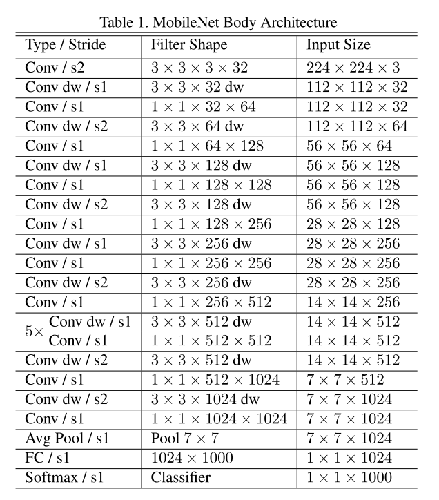
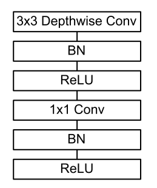
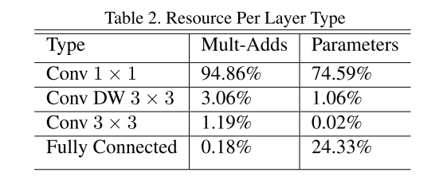
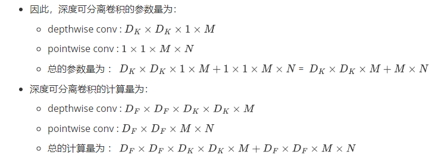

**MobileNets: Efficient Convolutional Neural Networks for Mobile Vision Applications**

深度卷积只负责提取空间特征，不负责通道间的信息交互。

pointwise 卷积只负责通道间的信息聚合。

# 1. 网络结构

## 1.1 深度可分离卷积

深度可分离卷积 （Depthwise Separable Convolutions）就是把一个标准卷积分成一个深度卷积 (depthwise convolution) 和一个 $1 \times 1$ 的 pointwise convolution。

在 MobileNets 中，一个 depthwise convolution 只有单通道 $3 \times 3 \times 1$ 的卷积核。

## 1.2 计算量

定义：

+ 输入特征图 $D_F \times D_F \times M$
+ 输出特征图  $D_F \times D_F \times N$
+ 其中，$D_F$ 是空间分辨率 ，$M$ 和 $N$ 分别表示输入输出通道数。

为了实现上述输入输出，标准卷积中的每个卷积核的尺寸为 $D_K \times D_K \times M$，一共需要 $N$ 个这样的卷积核：

+ 参数量为  $D_K \times D_K \times M \times N$ 
+ 计算量为:
  + 每个卷积核都需要在输入特征 $D_F \times D_F \times M$ 的每一个位置上计算 $D_K \times D_K$ 次 （乘法+加法）。即，每个卷积核的计算量为 $D_F \times D_F \times M \times D_K \times D_K$
  + 一共 $N$ 个这样的卷积核，总的计算量为  $D_F \times D_F \times M \times D_K \times D_K \times N$

而在 MobileNet 中：

+ 首先，每个 depthwise 的卷积核都为 $D_K \times D_K \times 1$ ，即每个卷积核只对单个输入特征的通道维度进行卷积，输入特征图共有 $M$ 个通道，则需要 $M$ 个 $D_K \times D_K \times 1$，depthwise conv 的输出特征图的尺寸仍然为 $D_F \times D_F \times M$ 。
+ 然后，对于depthwise conv 的输出特征，需要使用 $N$ 个 $1 \times 1 \times M$ 的 pointwise 的卷积来聚合通道信息。
+ 因此，深度可分离卷积的参数量为：
  + depthwise conv : $D_K \times D_K \times 1 \times M$
  + pointwise conv : $1 \times 1 \times M \times N$
  + 总的参数量为 ： $D_K \times D_K \times 1 \times M + 1 \times 1 \times M \times N$ =  $D_K \times D_K \times M + M \times N$
+ 深度可分离卷积的计算量为：
  + depthwise conv : $D_F \times D_F \times D_K \times D_K \times M$
  + pointwise conv : $D_F \times D_F \times M \times N$
  + 总的计算量为 ： $D_F \times D_F \times D_K \times D_K \times M + D_F \times D_F \times M \times N$

## 1.3 网络结构

网络结构如下表所示：

+ 第一层是标准的卷积层

+ 除了第一层之外的卷积，都是深度可分离卷积。

+ 所有层都跟了一个 BN + ReLU（depthwise跟一组，pointwise也跟一组），除了最后一个全连接层：

  

+ 下采样操作都是通过步长为2的卷积实现的，第一层的标准卷积也进行了一次下采样。

+ 最后使用全局平均池化把空间维度降维为1。

## 1.4 计算量和参数量

如上图所示，MobileNet的 $95\%$ 的计算量都在 $1\times 1$ 的 pointwise 卷积上，并且 pointwise 卷积占据了模型总参数量的 $75\%$ ：

上面写过深度可分离卷积的参数量和计算量：

+ pointwise 和 depthwise 的参数量的不同之处在于，前者是 $\times N$ ，后者是 $\times D_K \times D_K $ ，显然，通道维度一般都远大于卷积核的尺寸 $3 \times 3 = 9$ ，因此 pointwise 的参数量占据了绝大部分。
+ 计算量同理。

# 2 训练

+ 优化器 RMSprop
+ 使用了更少的正则和数据增强，因为轻量级模型不容易产生过拟合的问题。
+ 也没有使用标签平滑。
+ 并且，发现在depthwise上使用更少的权重衰减，甚至不适用权重衰减是非常重要的，因为深度卷积本身都没有多少参数。

# 3 更轻量级的 MobileNet

把输入输出通道都由 $M, N$ 变成 $\alpha M , \alpha N$ ，其中 $\alpha \in (0, 1]$ ：

+ 当 $\alpha = 1$ 时，就是标准的 MobileNet。
+ 其他 $\alpha$ 取值可以为 $1, 0.75, 0.5, 0.25$ 。
+ $\alpha$ 可以大约降低 $\alpha ^ 2$ 的计算量和参数量。

把输入特征分辨率降低 $\rho \lt 1$ 倍：

+ $D_F$ 变成 $\rho D_F$ 。
+ $\rho=1$ 是标准的 MobileNet。 
+ $\rho$ 可以把计算量降低为 $\rho ^ 2$ 倍。