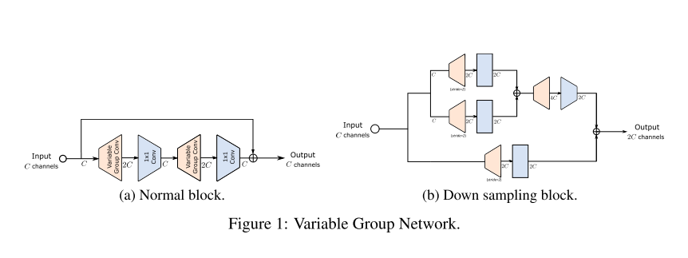
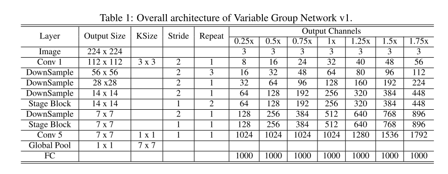

`VarGNet: Variable Group Convolutional Neural Network for Efficient Embedded Computing`

# 1 动机

为了提高计算效率，当前通常有两个研究方向：

+ 设计轻量级的网络来减小MAdds。
+ 优化硬件配置（如FPGA）或改进编译器。

+ 现有组卷积固定分组数
+ VargNet 与之相反，固定每组的通道数。这种方式的计算强度更加平衡，更有利于硬件优化。

+ 基于如果网络中操作的计算强度更均衡的启发，网络的计算图就更容易被优化。我们提出了基于深度可分离卷积的变群卷积 （Variable Group Convolution）：
  + 每个group 的输入通道数是固定的，作为一个超参数。
  + 固定通道数从编译器的角度来看更适合优化，因为计算模式和数据布局更连贯。
  + 于深度卷积相比（分组数等于通道数），Variable Group Convolution 具有更大的网络容量，从而允许更小的通道数，有助于减轻片外通信耗时。

# 设计原则

+ blocks中的特征图越小越好
+ 网络层之间的计算密度需要平均

$$
g \times Cin / g \times Cout / g \times H \times W \times k^2 \\
 = \frac{Cin}{g} \times Cin \times H \times W \times k^2
$$

$$
Cout \times Cin \times H \times W
$$

