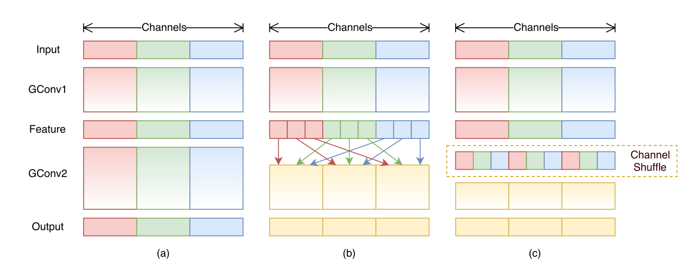

`ShuffleNet: An Extremely Efficient Convolutional Neural Network for Mobile Devices`


# 1 动机

+ 为了解决组卷积阻碍通道维度的信息流动的问题，提出了 `channel shuffle` 

+ 在 MobileNet 笔记中对比了 $3 \times 3$ 和 $1 \times 1$ 的卷积的参数量和计算量，可以发现反而 $1 \times 1$ 的卷积占据了网络 $94.86\%$ 的计算量和 $74.59\%$ 的参数量。


在同等计算复杂度下， ShuffleNet可以使用更多的通道维度，能够提取更多特征，这在小网络中是非常重要的。

# 2 最近工作

+ GoogleNet 通过增加网络宽度，相较于堆叠卷积层具有更低的复杂度。
+ ResNet 使用 bottleneck 结构提高效率。
+ ResNeXt使用组卷积，和 GoogleNet 类似。
+ MobileNet 使用深度可分离卷积。


# 3 本文方法



## 3.1 主要思想

+ 解决 $1 \times 1$ 卷积占据主要参数量和计算量的问题：
  + 最直观的方法是也做成和 $3 \times 3$ 卷积相同的分组卷积。
  + 然而这种方式会导致：一个输出通道的信息只来自于少部分的输入通道（如上图 a 所示）。这种方法阻碍了信息在通道间的流动，表达能力较差。
  + Channel Shuffle 就是为了解决该问题。

## 3.2 Channel Shuffle

Channel Shuffle 的方法是把 每组输入特征特通道维度 分割成几个小的组（同样是 g 个组），之后把不同组的输入特征组合起来，形成一个新的组，再使用组卷积，如上图 (a) 所示。

更形象的图如下图所示：

普通分组卷积：


Channel Shuffle：


Channel Shuffle 实现方式：

上图可以比较清晰的体现了增强通道间信息流动的方式。

然而上图却不好代码实现，可以等价替换成下方操作：


如，假设输入通道4个维度，分别是 0,1,2,3：

+ groups = 2，Shuffle 之后是 0, 2, 1, 3
+ groups = 4，Shuffle 之后是 0, 1, 2, 3

代码如下：

```python
def channel_shuffle(x, groups):
    batch_size, num_channels, height, width = x.data.size()

    channels_per_group = num_channels // groups

    x = x.view(batch_size, groups, channels_per_group, height, width)
    x = torch.transpose(x, 1, 2).contiguous()
    x = x.view(batch_size, -1, height, width)

    return x
```


## 3.3 ShuffleNet Unit

利用 Channel Shuffle 操作的优点，本文提出了一种新的 ShuffleNet Unit，用于设计小网络。


上图 (a) 是一个具有残差结构 bottleneck block：

+ 首先，把 $3 \times 3$ 的卷积替换成更高效的 depthwise convolution 。
+ 然后，把第一个 $1 \times 1$ 的卷积替换成 pointwise group convolution 以及一个 channel shuffle 操作。如图 (b) 所示。
+ 把第二个 $1 \times 1$ 的卷积替换成为 pointwise group convolution，但是没有 channel shuffle 操作。第二个 $1 \times 1$ 的卷积知识为了恢复通道维度，以进行残差链接。为了简单期间，没有在第二个 $1 \times 1$ 的卷积后面使用 channel shuffle 操作（加不加的效果类似）。

上图 (c) 和 图 (b) 类似，只不过是具有下采样的结构：

+ 在残差通路种添加一个 $3 \times 3$ 的平均池化下采样层，步长是2。（在 Resnet中，这一步是由一个$1\times 1$ 的卷积,s=2完成的）
+ $3 \times 3$ 的 depthwise 卷积的步长是2
+ 有下采样操作是，残差链接使用 concat 而不是 add ，更容易增加通道维度，而只隐入了少量计算量。
+ **注意：即使下采样使用 concat ，输出通道仍然是设置的通道维度** 。如，输入通道是24，输出通道是240，由于avg pool无法改变输出通道维度，因此第二个 $1 \times 1$ 的卷积层的输出通道应该是 $240 - 24 = 216$ 。**同时需要注意，第一个 $1 \times 1$ 的输出通道，以及$3 \times 3$ 的输入输出通道仍然是 $240$ 的 $1 / 4$ 。**

**更具体的使用细节详见 5 网络结构**


# 4 计算量对比

对于输入特征图 $c \times h \times w$ ，中间隐层的特征维度为 $m$ 。

## 4.1 ResNet

此处按照论文中的计算方式，不计算下采样的 bottleneck。

+ 第一个 $1 \times 1$ 的卷积层 （输入 $c \times h \times w$, 输出 $m \times h \times w$）：
  + 计算量为 $ m \times  c \times h \times w $
+ 第二个 $3 \times 3$ 的卷积层（输入 $m \times h \times w$, 输出 $m \times h \times w$）：
  + 计算量为 $m \times m \times h \times w \times 9$

+ 第三个 $1 \times 1$ 的卷积层（输入 $m \times h \times w$, 输出 $c \times h \times w$）：
  + 计算量为 $c \times m \times h \times w$

总的计算量为：
$$
m \times c \times h \times w + m^2 \times h \times w \times 9 + cm \times h \times w \\
= hw \times (cm + 9m^2 + cm) \\
= hw \times (2cm + 9m^2)
$$

## 4.2 ResNeXt

此处按照论文中的计算方式，不计算下采样的 bottleneck。

+ 第一个 $1 \times 1$ 的卷积层 （输入 $c \times h \times w$, 输出 $m \times h \times w$）：
  + 计算量为 $ m \times  c \times h \times w $
+ 第二个 $3 \times 3$ 的分组卷积层（输入 $m \times h \times w$, 输出 $m \times h \times w$）：
  + 计算量为 $g \times m/g \times m/g \times h \times w \times 9$

+ 第三个 $1 \times 1$ 的卷积层（输入 $m \times h \times w$, 输出 $c \times h \times w$）：
  + 计算量为 $c \times m \times h \times w$

总的计算量为：
$$
m \times c \times h \times w + g \times m/g \times m/g \times h \times w \times 9 + c \times m \times h \times w \\
= hw \times (cm + 9m^2/g + cm) \\
= hw(2cm + 9m^2/g)
$$

## 4.3 ShuffleNet

此处按照论文中的计算方式，不计算下采样的 bottleneck。

+ 第一个 $1 \times 1$ 的卷积层 （输入 $c \times h \times w$, 输出 $m \times h \times w$）：
  + 计算量为 $ g \times m/g \times  c/g \times h \times w $

+ 第二个 $3 \times 3$ 的depthwise卷积层（输入 $m \times h \times w$, 输出 $m \times h \times w$）：
  + 计算量为 $m \times h \times w \times 9$

+ 第三个 $1 \times 1$ 的卷积层 （输入 $m \times h \times w$, 输出 $c \times h \times w$）：
  + 计算量为 $ g \times m/g \times  c/g \times h \times w $

总的计算量为：
$$
g \times m/g \times  c/g \times h \times w + m \times h \times w \times 9 +  g \times m/g \times  c/g \times h \times w  \\
= hw \times (cm/g + 9m + cm/g) \\
= hw \times (2cm/g + 9m)
$$

# 5 网络结构


+ 通过堆叠 ShuffleNet units
+ 共包含3个stages
+ 每个stage的第一个block下采样，stride=2，该 stage 不算入每个 stage 的重复次数，如重复次数是 1, 7, 3，加入第一个下采样的 block，每个stage的实际block数量实际是 2, 8, 4 ，这点和resnet不同。
+ bottleneck中的隐层的通道维度是输出通道维度的 $1 / 4$ 

## 5.1 详解网络结构

### 5.1.1 Conv1 + MaxPool

+ Conv1 不是 depthwise 卷积，就是普通卷积，步长是2。后面跟上一个bn+relu。
+ MaxPool1 步长是2，padding是1

### 5.1.2 Stages

+ 共包含3个stages (stage2, stage3, stage4)

+ 3个 stages 中都使用的是 ShuffleNet Unit

+ 3个stages的 Unit 数量分别是 (1+3, 1+7, 1+3)

+ 1+3, 1+7, 1+3 中的 "1" 的Unit实现方式和 3, 7, 3是不同的：

  + 当且仅当 “1” 的时候进行下采样，下采样时的残差链接使用concat而不是add
  + concat 的时候需要特别注意，假设输入特征通道是24，输出特征通道是240。concat 之后的维度不是 $240 + 24 = 264$，而仍然是 $240$ 。具体分析：
    + 下采样的 AvgPool 不能改变通道维度，因此该分支参与concat 的通道维度就是输入通道维度，是 24
    + 那么卷积分支的最终输出通道维度只能是 $240 - 24 = 216$
    + 但是卷积分支的 $216$ 通道维度应该从哪来呢？实际是只有最后一个 $1 \times 1$ 才把通道维度变成 $216$ 。
    + 第一个 $1 \times 1$ 的输出通道是最终输出通道的 $1/4$ ，即 $240$ 的 $1/4$，这里不管 $216$
    + 第二个 $3 \times 3$ 的分组数是 $240$ 的 $1/4$，输入输出通道也都是 $240$ 的 $1/4$，这里也不管 $216$
    + 只有第三个 $1 \times 1$ 的卷积的输入通道是  $240$ 的 $1/4$ ，输出通道是 $216$ 。即，在第三个 $1 \times 1$ 的时候才考虑 $216$ 。

+ **同时需要特别注意：**

  + 当且仅当Stage2 的 “1” 进行下采样时，第一个 $1 \times 1$ 不使用分组卷积（无论设置的g等于几）

  + 其他Stage（Stage3, Stage4）进行下采样时，第一个 $1 \times 1$ 仍然使用分组卷积。

通过调节 $g$ ，可以控制pointwise的链接稀疏性。

在总的计算量不变的情况下（~140MFLOPs），使用更大的 $g$ 也就意味着可以使用更多通道维度，可以编码更多信息

上表2中的 $1 \times $, $0.5 \times$ 等，表示缩放通道维度。 

# 6 实验


+ 当 $g > 1$ 时，错误率小于 $g = 1$ ，这是由于使用分组卷积时，在保证计算量大致相等的情况下，能够设计更宽的网络。

+ 当 $scale factor = 0.5\times$ 时，$g = 8$ 时错误率反而上升了，可能是因为每组卷积所提取的通道特征变少，损害了表达能力
+ 当 $scale factor = 0.25\times$ 时，$g = 8$ 时错误率却又下降了，可能是因为对于小模型来说，更宽的网络能够带来性能增益。


上表证明了 Channel Shuffle 能够获得更好的表现。
