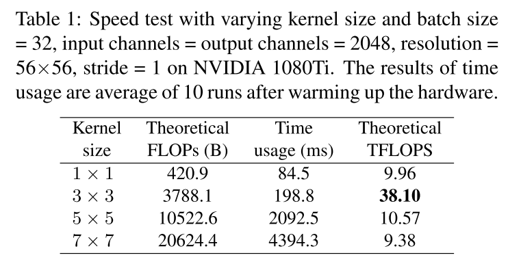
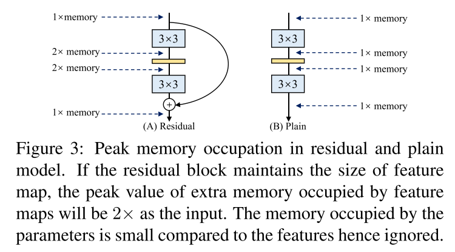
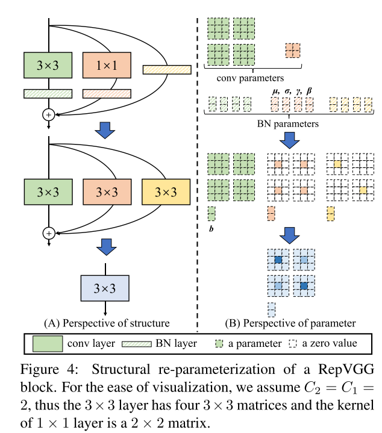
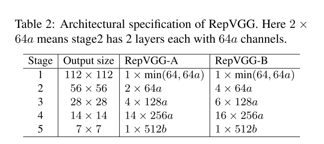
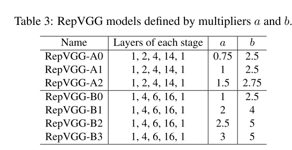

+ 推理时仅堆叠 $3 \times 3$ 的卷积层和 ReLU
+ 训练时有多分支拓扑结构

+ 训练和推理时的不同结构，是通过 Structural **Re**-**P**arameterization （结构重参数化） 技术实现的
+ RepVGG 比 ResNet50 快了 $83\%$ ，比 ResNet101快了 $101\%$ 

# 1 动机

尽管现在很多网络具有较高的准确率，但是缺点也很明显：

+ 多分支设计（如ResNet和InceptionNets）使得模型难以部署，降低了推理速度，减小了内存利用率。
+ Depthwise （如MobileNets, Xception）和Channel Shuffle（ShuffleNets）增加了内存访存开销，并且缺乏对各种设备的支持
+ FLOPs 不能精确的反应实际的计算速度

因此，本文提出了一种 VGG-style 的网络结构 RepVGG，具有以下优点：

+ 模型具有 VGG-like 的平坦拓扑结构，没有任何分支（每层都仅仅使用前一层的输出作为输入，且该层的输出只传递给下一层）
+ 模型只是用 $3 \times 3$ 的卷积核 ReLU

然而，想让一个 plain 结构的模型获得与多分支结构的网络有竞争能力的性能是非常具有挑战性的，这是由于多分支网络，如 ResNet，能够使模型隐式的聚合多种浅的模型，因此训练多分支网络避免了梯度弥散问题。

因此，多分支网络的优点都在训练过程中，缺点在推理过程。因此，本文提出了一种解耦训练时多分支，测试时plain结构的网络，通过结构重参数化。更具体的，通过变换模型参数来实现模型结构的转换：

+ 使用残差链接和 $1 \times 1$ 的分支来构建训练时网络
+ 通过结构重参数化移除分支：
  + 残差结构可以退化为 $1 \times 1$ 的卷积
  + $1 \times 1$ 的卷积又可以退化为 $3 \times 3$ 的卷积

之所以使用 $3 \times 3$ 的卷积核，是因为该卷积核在众多计算库中被高度优化了，比如英伟达的 cuDNN，英特尔的 MKL。如下表所示，理论上的浮点计算量和计算密度（FLOPS）约为其他卷积的 4 倍。



# 2 构建 RepVGG

至少有3个理由使用简单的卷积网络：

+ Fast : 多分支网络理论上比 VGG 有更少的  FLOPs，但是不一定运行的更快。如，VGG16的理论计算量比Effnet-B3多8.4倍，但是在1080ti上的速度反而比其快1.8倍。意味着计算密度比其大15倍。影响速度的因素主要有两个：

  + Memory access cost (MAC)
  + Degree of parallelism

  如，尽管concat不需要计算量，但是其内存访存开销非常显著。此外，组卷积需要大量的MAC。

+ Memory-Economical : 多分支网络需要保存中间结果，直到 addition 或 concat，因此是内存低效的。如下图所示，一个残差快需要两倍于输入特征的内存。

  

+ Flexible : 多分支限制了网络的灵活性，如残差块需要两个特征具有相同的维度。更糟糕的是，多分支结构限制了通道修剪，这是一个关键的技术来移除不重要的通道。而平坦的结构允许灵活的设置每一个卷积层，并且可以灵活的进行修剪。

## 2.1 结构重参数化



如上图所示，定义：

+ $3 \times 3$ 的卷积层的参数为 $W^{(3)} \in \mathbb{R} ^ {C_2 \times C_1 \times 3 \times 3}$ ，其中 $C_1, C_2$ 分别是输入通道和输出通道。
+ $1 \times 1$ 的卷积层的参数为 $W^{(1)} \in \mathbb{R} ^ {C_2 \times C_1}$ 

+ $\mu^{(3)}, \sigma^{(3)}, \gamma^{(3)}, \beta^{(3)}$ 分别为 $3 \times 3$ 的卷积之后的BN层的移动平均，移动标准差，缩放和偏移量。
+ $\mu^{(1)}, \sigma^{(1)}, \gamma^{(1)}, \beta^{(1)}$ 分别为 $1 \times 1$ 的卷积之后的BN层的移动平均，移动标准差，缩放和偏移量。
+ $\mu^{(0)}, \sigma^{(0)}, \gamma^{(0)}, \beta^{(0)}$ 分别为残差链接之后的BN层的移动平均，移动标准差，缩放和偏移量。
+ $M^{(1)} \in \mathbb{R} ^ {N \times C_1 \times H_1 \times W_1}$ , $M^{(2)} \in \mathbb{R} ^ {N \times C_2 \times H_2 \times W_2}$ 分别表示输入和输出特征。
+ $*$ 表示卷积操作

一般的，假设 $C_1 = C_2$ ，$H_1 = H_2$, $W_1 = W_2$ ：
$$
M^{(2)} = bn(M^{(1)} * W^{3}, \mu^{(3)}, \sigma^{(3)}, \gamma^{(3)}, \beta^{(3)}) \\
+ bn(M^{(1)} * W^{1}, \mu^{(1)}, \sigma^{(1)}, \gamma^{(1)}, \beta^{(1)})  \\
+ bn(M^{(1)}, \mu^{(0)}, \sigma^{(0)}, \gamma^{(0)}, \beta^{(0)})
$$
BN层对于输入特征 $M$ 的计算方式如下：
$$
BN(M, \mu, \sigma, \gamma, \beta)_{:, i, :, :} = (M_{:,i,:,:} - \mu_i) \frac{\gamma_i}{\sigma_i} + \beta_i
$$
再考虑卷积，上式可以写为：
$$
BN(M, \mu, \sigma, \gamma, \beta)_{:, i, :, :} = (M_{:,i,:,:} - \mu_i) \frac{\gamma_i}{\sigma_i} + \beta_i \\
= (M^{(1)} * W + b - \mu) \frac{\gamma}{\sigma} + \beta \\
= \frac{\gamma}{\sigma} M^{(1)} * W  + \frac{\gamma}{\sigma}(b - \mu) + \beta
$$


由于卷积是线性的，因此可以合并卷积和BN，合并为卷积：
$$
W'_{i, :, :, :} = \frac{\gamma_i}{\sigma_i} W_{i, :, :, :}
$$

$$
b'_{i} = \frac{\gamma_i}{\sigma_i}(b_{i} - \mu_i) + \beta_i
$$

残差分支可以看作是一个 $1 \times 1$ 的单位矩阵（每个 $1 \times 1 \times C_1$ 的卷积核中只有1个位置是1，其他是0）

因此，至此我们有了两个 $1 \times 1$ 的卷积分支，一个 $3 \times 3$ 的卷积分支。

## 2.2 网络结构

每个RepVGGBlock由3个分支构成：

+ 一个 $3 \times 3$ 卷积 + BN
+ 一个 $1 \times 1$ 卷积 + BN
+ 一个 BN

**设计原则：**

+ **当分辨率减半，特征通道增加一倍。** 显然，两种卷积即能减小分辨率，又能改变通道，但是BN怎么办？
  + 当分辨率发生变化，即通道发生变化时，移除BN层：

```python
self.rbr_identity = nn.BatchNorm2d(num_features=in_channels) if out_channels == in_channels and stride == 1 else None

======================================================
if self.rbr_identity is None:
	id_out = 0
else:
	id_out = self.rbr_identity(inputs)

return self.nonlinearity(self.se(self.rbr_dense(inputs) + self.rbr_1x1(inputs) + id_out))
```

+ **网络中全部结构都由RepVGGBlock堆叠而成** 。除此之外甚至连一个单独的卷积、池化都没有（除了分类层的全局卷积）

网络结构如下表所示：



既然主打效率，那么一定会有网络宽度和深度的缩放。上表中：

+ RepVGG-A 和 RepVGG-B 的主要差异在于深度不同：

  + RepVGG-A 5 个 stage，分别由 1, 2, 4, 14, 1 个 RepVGGBLock 堆叠而成。
  + RepVGG-B 5 个 stage的第2， 3， 4 个stage，各比-A多堆叠了两个 Block。
  + -A 和 -B 的第 1， 5 个 stage 都只堆叠 1 个 Block。这是由于刚开始的阶段特征图尺度大，因此使用更少的层来降低latency。最后的阶段特征图通道数大，因此使用更少的层来降低参数两。
  + 在第 4 个 stage （$14 \times 14$） 上堆叠了最多的 Block，这是借鉴了 ResNet 等网络的设计范式，这个阶段分辨率和通道都相对适中，且特征图的语义更加丰富。
  + 5 个 stage 的默认输出通道数分别为 64, 128, 256, 512。可以使用 $a, b$ 来对通道进行缩放。
  + $a$ 只用来缩放 1, 2, 3, 4 个阶段，$b$ 只用来缩放第 $5$ 个阶段。
  + 通道数 $\times $ $a$ / $b$ 时，向下取整。
  + 第一个阶段无论 a 设置为多少，最大都只能缩放到 64 。

+ 基于上述规则，设计出了一系列 RepVGG 结构：

  

+ 为了更进一步的减少参数量和计算量，还可以使用组卷积：
  + -A 中，第3，5，7，9， 11， 2n+1, 21 个Block中使用组卷积，分组数为 $g$ 
  + -B 在 -A 的基础上，再加上第 23, 25, 27 三层设置组卷积
  +  $g = 1, 2, 4$ 
  + $3 \times 3$ 和 $1 \times 1$ 的组卷积设置需要相同。
+ 排列组合，可以得到 $3 \times 3 + 4 \times 3 = 21$ 中 RepVGGs 

## 2.3 结构重参数化实现

### 2.3.1 $3\times 3$ 卷积+BN

包含的参数包括：

+ $3 \times 3$ 卷积的权重 $kernel$（和 BN 一块使用就不需要 bias了）
+ BN 的均值 $mean$，方差 $var$（标准差为 $std = \sqrt{var + eps}$）
+ BN的$\beta$ ，$\gamma$

根据 **2.1 结构重参数化的公式**，可以得到：

+ 融合后的 $3 \times 3$ 的新卷积核的权重为：

$$
kernel \times \frac{\gamma}{std}
$$

+ 融合后的 $3 \times 3$ 的新卷积核的偏置为：

$$
- \mu_i \frac{\gamma_i}{\sigma_i} + \beta_i
$$

代码为：

```python
def fuse_conv3x3_bn(conv3x3, bn):
	kernel = conv3x3.weight
	running_mean = bn.running_mean
	running_var = bn.running_var
	gamma = bn.weight
	beta = bn.bias
	eps = bn.eps
    
    std = (running_var + eps).sqrt()
	t = (gamma / std).reshape(-1, 1, 1, 1)
	return kernel * t, beta - running_mean * gamma / std
```

### 2.3.2 $1 \times 1$ 卷积+BN

最直观的方法是把 $1 \times 1$ 的卷积四周各 Padding 1个0，然后按照 $3 \times 3$ 的卷积去融合BN。

也等价于直接按照 $3 \times 3$ 的代码去计算新的卷积核以及偏置，再 padding 成 $3 \times 3$

无论哪种方法，2.3.1 小节中的代码是可以不经过修改直接复用的。只需要再写一个 padding 的代码即可：

```python
def pad_1x1_to_3x3_tensor(self, kernel1x1):
	return torch.nn.functional.pad(kernel1x1, [1,1,1,1])
```

### 2.3.3 BN

只有BN的情况下，为了便于理解，思路为：

+ 找到一个卷积，卷积前后特征图都不变
+ 在这个卷积后面加上BN

上述两个过程就等价于只有BN的情况。

+ 如果这个卷积是 $1 \times 1$ 的卷积，则第一个卷积的第一个通道是1，其他是0；第二个卷积的第二个通道是1，其他是0，...

+ 如果这个卷积是 $3 \times 3$ 的卷积，则第一个卷积的第一个通道的中心位置是1，其他是0；第二个卷积的第二个通道的中心位置是1，其他是0，...

上述两种卷积的结果是相同的，如果使用  $1\times1$ 的卷积，则最后再padding为 $3\times3$ 的卷积。代码如下：

 ```python
 input_dim = self.in_channels // self.groups
 kernel_value = np.zeros((self.in_channels, input_dim, 3, 3), dtype=np.float32)
 for i in range(self.in_channels):
 	kernel_value[i, i % input_dim, 1, 1] = 1
 	self.id_tensor = torch.from_numpy(kernel_value).to(branch.weight.device)
 kernel = self.id_tensor
 running_mean = branch.running_mean
 running_var = branch.running_var
 gamma = branch.weight
 beta = branch.bias
 eps = branch.eps
 std = (running_var + eps).sqrt()
 t = (gamma / std).reshape(-1, 1, 1, 1)
 return kernel * t, beta - running_mean * gamma / std
 ```

### 2.3.4 合并

3个分支都转换成为了 $3 \times 3$ 的卷积了，最后对应通道的卷积的权重、偏置分别相加即可。


# 3 量化

