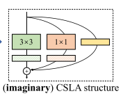
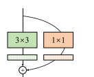
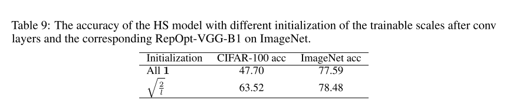

`Re-parameterizing Your Optimizers rather than Architectures`

Code : https://github.com/DingXiaoH/RepOptimizers

# 1 动机&贡献

+ 设计网络结构可以利用一些先验知识，如残差结构优于 plain 结构。
+ 此外，优化方法也是十分重要的，可以分为三类：
  + 一阶方法：如SGD
  + 更高阶的方法：如利用海瑟矩阵，但是需要大量的计算，以及存在性问题
  + 无导数方法：对于导数可能不存在的目标函数非常有效

作者观察到：

+ 尽管众多优化器能够使用不同的方法来改进训练过程，但是他们都缺少对于模型的先验知识。
+ 尽管我们能偶利用各种网络结构的优点的先验，但是我们只使用通用的，模型无关的优化器，如SGD, AdamW 。这种方式可以被成为 **特定的网络结构 + 通用的优化器** (Specific Structure + Generic Optimizer )。

因此，本文探索了另外一种不同的方法：

+ 一种 **通用的网络结构 + 特定的优化器** (Generic Structure + Specific Optimizer) 。通用的网络结构意味着模型可以使用尽可能少的先验知识。特定的优化器表示可以通过特定于模型的方式来动态的改变训练过程。
+ 一种基于 SGD 的优化方法。本文关注大尺度的非凸模型，如DNN。因此本文只考虑 SGD-based 优化器，但是顶层思想可以被扩展到高阶和无导数的方法中去。由于 SGD 利用梯度信息来更新模型参数，因此本文根据一组特定于模型的超参数，在更新模型参数之前来修改梯度信息。我们把这种方法称为 **Gradient Re-parameterization (GR)** ，基于该方法设计出的优化器称为 **RepOptimizers**。为了获得 “一组特定于模型的超参数”，本文提出了一种叫做 **Hyper-Search** 的方法。
+ 为了证明 “通用的网络结构 + 特定的优化器” 的方法的有效性，本文希望用于实验的模型越简单越好。因此，本文选择使用 VGG-style 的网络结构，虽然这种结构很长时间都被认为不如 RegNet, EffiNets，因为后者利用的大量的结构先验。但是本文使用RepOptimizers训练的 RepOpt-VGG能够达到可以与之相比的效果。

作为对比，本文使用RepVGG作为baseline，由于该方法同样也是一种VGG-style的强大的模型。RepVGG构建额外的训练时的结构，并在部署时通过结构重参数化来进行转换。本文方法与之不同的地方在于：

+ 与其他常规的模型类似，RepVGG也是在设计网络结构的过程中加入了先验知识，并且使用了通用的优化器。而RepOpt-VGG是在优化器中加入了先验。
+ 尽管RepOpt-VGG在推理过程中与RepVGG有相同的结构，但是RepVGG在训练过程中需要更多的内存和计算量来进行训练。换句话说，RepOpt-VGG在训练过程中也是plain结构，而RepVGG不是。


RepVGG具有以下优点：

+ 作为一种非常简单的结构，RepOpt-VGG需要低内存消耗；只使用$3 \times 3$ 的卷积可以在定制的芯片上获得更高的效率。
+ 更快的训练速度。如，比RepVGG的训练虚度快了1.7倍。与推理类似，使用定制的高吞吐量的训练芯片训练这样的简单模型可能比使用GPU等通用设备训练的复杂模型更有效。
+ RepOptimizers克服了结构重参数化导致的量化问题。


# 2 RepOptimizers

RepOptimizers 的设计包括三个步骤：

1. **把先验知识融合进网络结构中：**

   先验知识就是，多分支结构的表现最好，因此本文采用了与RepVGG相同的网络结构设计（$3 \times 3$ 的卷积 + $1 \times 1$ 的卷积 + 残差链接）

2. **把结构先验等价转换到 RepOptimizers 中：**

   1. 在 RepVGG 中，每个分支只包含一个线性层，本文把这种结构称为 **Constant-Scale Linear Addition (CSLA)** 
   2. 本文想要利用一个只有一个线性操作的结构来替代 CSLA，为了实现和 CSLA 完全等价的结果（对于相同的输入，该线性层的输出也完全相同），因此需要在训练的过程中对梯度使用一个常数进行缩放。本文把这种缩放梯度的常数叫做 **Grad Masks** 。

3. 利用合适的方法，来找到合适的**Grad Masks** ，使得单分支网络与RepVGG完全等价。

## 2.1 虚构一个 CSLA 结构

虽然RepOpt-VGG是单分支结构，但是在优化阶段对梯度进行调整的过程中，是以等价一个虚构的多分支结构来实现的。虚构的多分支称为 Constant-Scale Linear Addition (CSLA)。结构如下图所示：



当输入输出通道发生变化（发生了下采样）时，移除掉 Identity mapping 分支：



乍一看，RepOpt-VGG和RepVGG的结构确实完全相同。但是在BN的设置上还是存在差异：

+ RepVGG : $3 \times 3$ , $1 \times 1$ 和 Identity mapping （如果存在）三个分支在训练过程中都使用的是BN层

+ RepOpt-VGG ：$3 \times 3$ , $1 \times 1$ 和 Identity mapping （如果存在）三个分支在训练过程中都使用的是一个缩放层： $wx + b$ ，或不带偏置： $wx$ 。实际实现的过程中，都没有带偏置，即，使用了：$wx$ 作为缩放层。其中，$w$ 和 $b$ 都是等于通道维度的超参。

  ```python
  self.conv3x3 = nn.Conv2d(in_channels=in_channels, out_channels=out_channels, kernel_size=3, stride=stride, padding=1, bias=False)
  self.scale_3x3 = ScaleLayer(num_features=out_channels, use_bias=False, scale_init=conv_scale_init)
  
  self.conv_1x1 = nn.Conv2d(in_channels=in_channels, out_channels=out_channels, kernel_size=1, stride=stride, padding=0, bias=False)
  self.scale_1x1 = ScaleLayer(num_features=out_channels, use_bias=False, scale_init=conv_scale_init)
  
  if in_channels == out_channels and stride == 1:
  	self.scale_identity = ScaleLayer(num_features=out_channels, use_bias=False, scale_init=1.0)
  ```

+ RepOpt-VGG 的 BN 层是在三个分支融合之后：

  ```python
  out = self.scale_3x3(self.conv3x3(inputs)) + self.scale_1x1(self.conv_1x1(inputs))
  
  if hasattr(self, 'scale_identity'):
  	out += self.scale_identity(inputs)
      
  out = self.post_se(self.relu(self.bn(out)))
  ```

**可以看出，虚构的CSLA结构与RepVGG的不同之处在于：**

+ **把RepVGG的 BN 替换成了一个缩放层**

再回过头看论文中对CSLA的定义：

+ 每个分支只包含一个可训练的线性算子
+ 每个线性算子都跟着一个常量缩放尺度 scales
+ 如果常量缩放尺度设置的比较合适，模型的性能依然可以有效改善

```
We note an interesting phenomenon regarding the above-mentioned prior knowledge: in a special case where each branch only contains one linear trainable operator with optional constant scales, the model’s performance still improves as long as the constant scale values are set properly. We refer to such a linear block as Constant-Scale Linear Addition (CSLA)
```

 需要考虑三个疑问：

+ 为什么RepOpt-VGG把RepVGG中的 BN 替换成了一个**线性的缩放层（超参固定之后）**？
+ 为什么RepOpt-VGG的各个分支**在训练的过程中**都使用线性层，而RepVGG却不是（**BN在训练时是非线性层**）？
+ 为什么RepOpt-VGG没有使用 BN，不是直接去掉BN，而是使用了一个缩放层进行替换？

对于第三个问题, 因为需要和 BN 等价, 因此使用了一个 scales 层. 

前两个问题可以在了解RepOpt-VGG如何修改梯度，达到单分支等价于多分支的效果的原理。在下一节进行详细介绍。

## 2.2 修改梯度的基本原理

假设两个模型：

+ 每个分支都是线性的 CSLA 多分支block（为了简化问题，这里只考虑2个分支，但可以很容易扩展为任意多个分支的情况）。输入为 $X$ ，两个线性分支的线性变换矩阵（权重）分别为 $W^{(A)},W^{(B)} $  ，两个线性分支的线性算子之后的缩放层的缩放常量是 $\alpha_A, \alpha_B$ ，CSLA block 的输出为 $Y_{CSLA} = \alpha_A X*W^{(A)} + \alpha_B X * W^{(B)}$
+ 只有一个分支，一个线性算子的 RepOpt-VGG的block GR。输入为 $X$ ,线性变换矩阵（权重）为 $W'$ ，输出为 $Y_{GR} = X * W'$
+ 上述的线性算子（权重为线性变换矩阵）可以是卷积，全连接等可微的线性算子。

---

为了实现两个模型的完全等价，需要保证：

+ 两个模型的参数初始化完全一致
+ 两个模型每轮的输入完全一致
+ 两个模型每轮的输出完全一致

即， **CSLA block + regular optimizer = single operator + optimizer with GR**

---

下面，分别讨论上述三个完全等价的条件：

+ 两个模型的输入完全一致最好控制，都为 $X$ 即可。

+ 两个模型的输出完全一致 $Y_{CSLA} = Y_{GR}$：
  $$
  X * W' = \alpha_A X*W^{(A)} + \alpha_B X * W^{(B)}
  $$
  根据线性变换的可加性：
  $$
  X * W' = X * (\alpha_A W^{(A)} + \alpha_B W^{(B)})
  $$

+ 为了实现上一条“两个模型的输出完全一致”，显然需要两个模型的权重具有如下关系：
  $$
  W' = \alpha_A W^{(A)} + \alpha_B W^{(B)}
  $$

可以发现, 在手动保证输入 $X$ 的条件下, 最关键的是保证每轮训练过程中两个模型的权重具有上式的等价关系. 

到这里，又出现了之前的3个疑问的第三条：`为什么需要一个常量对各个分支的权重进行缩放？` ，而不是直接使得:
$$
W' = W^{(A)} + W^{(B)}
$$
显然上式也可以保证两个模型完全等价的三个条件

---

暂时不考虑上述三个疑问. 首先, 按照作者的思路来梳理一遍 **RepOptimizers** 的工作流程:

+ 在模型初始化阶段 (第1个iter) , 很容易控制上述三个完全等价的条件. 即, 只需要保证:
  $$
  W' = \alpha_A W^{(A)} + \alpha_B W^{(B)}
  $$
  

+ 在第 $\forall i>1$ 个阶段, $W^{(A)},W^{(B)}, W'$ 经过梯度更新,分别变成了:
  $$
  W^{(A)(i + 1)} = W^{(A)(i)} - \lambda \frac{\partial L}{\partial W^{(A)(i)}} \\
  W^{(B)(i + 1)} = W^{(B)(i)} - \lambda \frac{\partial L}{\partial W^{(B)(i)}}
  \\
  W^{'(i + 1)} = W^{'(i)} - \lambda \frac{\partial L}{\partial W^{'(i)}}
  $$
   此时, 仍然需要保证:
  $$
  W^{'(i + 1)} = \alpha_A W^{(A)(i + 1)} + \alpha_B W^{(B)(i + 1)} 
  
  \\
  \Leftrightarrow
  \\
  
  W^{'(i)} - \lambda \frac{\partial L}{\partial W^{'(i)}} = 
  
  \\
  
  \alpha_A(W^{(A)(i)} - \lambda \frac{\partial L}{\partial W^{(A)(i)}})  
  + 
  \alpha_B (W^{(B)(i)} - \lambda \frac{\partial L}{\partial W^{(B)(i)}})
  
  \\
  
  = \alpha_A W^{(A)(i)} + \alpha_B W^{(B)(i)}
  - 
  \lambda( \alpha_A\frac{\partial L}{\partial W^{(A)(i)}} + \alpha_B\frac{\partial L}{\partial W^{(B)(i)}})
  $$
  即, 需要保证:
  $$
  \frac{\partial L}{\partial W^{'(i)}}
  = 
  \alpha_A\frac{\partial L}{\partial W^{(A)(i)}} 
  + 
  \alpha_B\frac{\partial L}{\partial W^{(B)(i)}}
  $$
  即, 原本单分支的梯度为 $\frac{\partial L}{\partial W^{'(i)}}$ , 现在需要对该梯度进行调整, 使其变成 $F(\frac{\partial L}{\partial W^{'(i)}})$ , 并且:
  $$
  F(\frac{\partial L}{\partial W^{'(i)}}) =
  \alpha_A\frac{\partial L}{\partial W^{(A)(i)}} 
  + 
  \alpha_B\frac{\partial L}{\partial W^{(B)(i)}}
  $$
  由 $W' = \alpha_A W^{(A)} + \alpha_B W^{(B)}$ 可知 :
  $$
  \frac{\partial W^{'(i)}}{\partial W^{(A)(i)}} = \alpha_A
  \\
  \frac{\partial W^{'(i)}}{\partial W^{(B)(i)}} = \alpha_B
  $$
  因此:
  $$
  F(\frac{\partial L}{\partial W^{'(i)}}) =
  \alpha_A\frac{\partial L}{\partial W^{(A)(i)}} 
  + 
  \alpha_B\frac{\partial L}{\partial W^{(B)(i)}}
  \\
  
  = \alpha_A \frac{\partial L}{\partial W^{'(i)}} \frac{\partial W{'(i)}}{\partial W^{(A)(i)}} + 
  \alpha_B \frac{\partial L}{\partial W{'(i)}} \frac{\partial W{'(i)}}{\partial W^{(B)(i)}} \\
  
  = \alpha_A^2 \frac{\partial L}{\partial W{'(i)}}  + 
  \alpha_B^2 \frac{\partial L}{\partial W{'(i)}}  \\
  
  = (\alpha_A^2 + \alpha_B^2) \frac{\partial L}{\partial W{'(i)}}
  $$

+ 从上述计算可以看出, 对于单分支的梯度 $\frac{\partial L}{\partial W{'(i)}}$ , 只需要缩放为 $(\alpha_A^2 + \alpha_B^2) \frac{\partial L}{\partial W{'(i)}}$ 即可实现与多分支等价

## 2.3 解释前两个疑问

前两个疑问是:

+ 为什么RepOpt-VGG把RepVGG中的 BN 替换成了一个**线性的缩放层（超参固定之后）**？
+ 为什么RepOpt-VGG的各个分支**在训练的过程中**都使用线性层，而RepVGG却不是（**BN在训练时是非线性层**）？

可以发现, 想要使用 $WX = W_1X + W_2X + W_n X$ . 即, 使用单分支等价替换多分支的结构, 就必须要求各个分支是线性操作. 而 BN 在训练过程中是非线性的, 只有在测试过程中才是线性的. 

这就是为什么 RepOpt-VGG 把 BN 分支替换成一个线性的缩放层的原因.

此外, RepVGG 在训练过程中保持了多分支的结构,只有在测试时才 Post-Training 时才合并分支结构,此时 BN 也是一个线性层, 因此 RepVGG 使用了一个 BN 分支, 而 RepOpt-VGG 的各个虚拟分支在训练的过程中都需要是线性层.

**第三个疑问仍然保留.**

# 3 使用RepOptimizers训练CSLA

## 3.1 Grad Mask

在虚构的 CSLA block 中, 由一个 $3 \times 3$ , 一个 $1 \times 1$ 和一个 channel-wise 的常量缩放构成, 同时, 两个卷积层也都紧跟了一个 channel-wise 的常量缩放层. 

这些常量缩放层作用于各个分支的通道维度, 因此都是一个向量. 把各个分支的常量缩放向量合并在一起, 叫做 Grad Mask.

假设, 输入特征图 $X_{in} \in \mathbb{R}^{C_{in} \times H \times W}$ ,  输出特征图  $X_{out} \in \mathbb{R}^{C_{out} \times H \times W}$ :

+ 当 $C_{in} = C_{out}$ 时, 即没有做下采样, CSLA  有三个分支

+ 当 $C_{in} \ne C_{out}$ 时, 即做了下采样, CSLA 只有两个分支 (移除掉 Identity Mapping 分支)

+ 无论 $C_{in}$ 是否等于 $C_{out}$ , 两个卷积分支都使用常量缩放层:

  + 作用于 $3 \times 3$ 分支后的常量缩放向量为 $s \in \mathbb{R}^{C_{out}}$
  + 作用于 $3 \times 3$ 分支后的常量缩放向量为 $t \in \mathbb{R}^{C_{out}}$

  ```python
  self.weight = Parameter(torch.Tensor(num_features))
  if use_bias:
  	self.bias = Parameter(torch.Tensor(num_features))
      
  # =================================
  if self.bias is None:
  	return inputs * self.weight.view(1, self.num_features, 1, 1)
  else:
  	return inputs * self.weight.view(1, self.num_features, 1, 1) + self.bias.view(1, self.num_features, 1, 1)
  
  ```

---

由于常量缩放向量作用于通道维度,因此在计算的过程中实际上需要resize为:

+  $s \in \mathbb{R}^{C_{out} \times 1 \times 1}$ , $t \in \mathbb{R}^{C_{out} \times 1 \times 1}$ 
+ 卷积核的尺寸为 $conv \in \mathbb{R}^{C_{in} \times C_{out} \times k \times k}$ , 因此需要将 $s, t$ 复制 $C_{in} \times k \times k$ 份. 即 $s \in \mathbb{R}^{C_{in} \times C_{out} \times k \times k}$ , $t \in \mathbb{R}^{C_{in} \times  C_{out} \times k \times k}$ 

类似于 RepVGG, 把 $1 \times 1$ 的卷积核也padding为  $3 \times 3$ 的卷积核, 则 $s, t$ 也需要对应 padding. 

考虑只有两个卷积的情况下 (**2.3 修改梯度的基本原理** 中的推导), 需要把梯度缩放为:
$$
(\alpha_A^2 + \alpha_B^2) \frac{\partial L}{\partial W{'(i)}}
\\
=
(s^2 + t^2) \frac{\partial L}{\partial W{'(i)}}
$$
令 $Grad \quad Mask = s^2 + t^2$ 作为缩放梯度的掩码 $M \in \mathbb{R}^{C_{in} \times C_{out} \times 3 \times 3}$

---

综合考虑各种情况:

+ 当有两个分支时 (输入通道不等于输出通道), Grad Mask :
  $$
  M_{c, d, p, q} = s_c^2 + t_c^2 \quad if \quad c\ne d, p=2, q=2
  $$
  

  其中, $c \ne d$ 表示输入通道不等于输出通道, $p=2, q=2$ 表示对于 $1\times1$ 的分支, padding成 $3 \times 3$ 的卷积之后, 只有中心位置 $p=2, q=2$ 处有值, 等于对应通道的缩放常量, 其余地方都是0 . 

+ 当有三个分支时, 恒等映射分支由于没有卷积, 并且常量缩放超参在缩放梯度的过程中是固定不变的, 因此恒等映射分支在训练过程中没有可训练参数. 所以该分支的梯度该是多少就是多少 ($\times 1$) : 
  $$
  M_{c, d, p, q} = 1 + s_c^2 + t_c^2 \quad if \quad c = d, p=2, q=2
  $$

+ 当只一个分支时:
  $$
  M_{c, d, p, q} = s_c^2 \quad elsewise.
  $$
  

---

之后的目标就是, 如何获得 $s, t$ 的值?

## 3.2 Hyper-Search

由于神经网络具有非凸的性质, 只能依靠梯度下降法进行最优化. 因此为了获得 常量缩放超参, 本文采用了一种 Hyper-Search 的方式, 首先把 scales 当作为可训练参数在小型的搜索数据集 (如, CIFAR-100 ) 进行训练, 在训练完成之后, 固定下来这些 scales 超参的值, 再在目标数据集上进行单分支模型的训练.

具体流程如下:

+ 使用实例化的 CSLA 结构构建模型, 该模型是真实存在多分支的结构的, 包含 $3\times3$ , $1 \times1$ , Identity mapping 以及 各个分支的 scales. 
+ 初始化模型核 scales (比较细节, 后续单独介绍)
+ 在小型搜索数据集上 (CIFAR100) 上进行训练
+ 获得通过梯度下降法优化的 scales 超参, 固定下来作为目标数据集上, 使用真正单分支训练时的 scales. 

其中, 比较重要的就是 scales 的参数初始化:

+ 在每个 stage 中, 具有多个叠加的 CSLA blocks. 每个 stage 单独计数 CSLA block, $l = 0, 1, 2, ...$

+ 对于 $3\times 3$ 和 $1 \times 1$ 两个卷积分支的 scales 的 weight 初始化:

  + 每个 stage 的第一个 CSLA block ($l=0$) 进行下采样, 该CSLA中的 scales 的 weight 初始化为 1

  + 其他 CSLA blocks 初始化为 $\sqrt{\frac{2}{l}}$ , $l = 1, 2, ...$

  ```python
  strides = [2] + [1] * (num_blocks - 1)
  for i, stride in enumerate(strides):
  	if i + block_idx_base == 0:
  		conv_scale_init = 1.0
  	else:
  		conv_scale_init = (2.0 / (i + block_idx_base)) ** 0.5
  # ==========================================
  import torch.nn.init as init
  self.weight = Parameter(torch.Tensor(num_features))
  init.constant_(self.weight, scale_init)
  ```

+ 对于 Identity Mapping 分支的 scales 的 weight 初始化, 固定初始化为 1 

+ 所有分支的 scales 的 bias (如果使用偏置的化, 但作者实现的代码中都不使用) 均初始化为0.

  ```python
  if use_bias:
  	self.bias = Parameter(torch.Tensor(num_features))
  	init.zeros_(self.bias)
  ```

+ 这种初始化策略可能不是最优的, 但是作者观察到, 初始化策略影响较大的是在 Hyper-Search 的数据集上, 在目标数据集上的影响不大.

  

## 3.3 初始化单分支模型

+ 加载 Hyper-Search 保存的训练好的权重, 把各个 scales 的值取出来.

+ 随机初始化一个实打实的 与 Hyper-Search 的结构相同的 CSLA 模型 (注意是随机初始化, 并不加载 Hyper-Search 中的卷积核的权重)

+ 对应每个 CSLA, 创建一个 $3\times3$ + BN + ReLU 的单分支模型 RealVGG

+ 把第二步创建的模型的 $3\times 3$ 和 $1\times 1$ 的卷积的随机化初始权重拿出来, 并结合固定下来的 scales , 来确定 第三步 RealVGG Block 中的 $3 \times 3$ 的卷积的初始化权重:

  + 实际上, 由于第二步和第三步的 $3 \times 3$ 的卷积都是随机初始化的, 因此拿哪个 $3 \times 3$ 的卷积的初始化权重都一样. 代码中是直接使用 RealVGG 的权重即可. 
  + 由于直接拿 RealVGG 的 $3 \times 3$ 的权重出来即可, 那么第二部就只剩下 $1 \times 1$ 的卷积有用了. 实际上, 直接在计算真正单分支的 $3 \times 3$ 的卷积权重时, 初始化一个 $1 \times 1$ 的卷积核即可.
  + 因此, 实际上第二步可以省区. 代码中也确实没有创建第二步的过程. 这里列出来只是为了更好的理解.

+ 把随机初始化的 两种卷积 的权重, 乘上对应的 scales, 再加上 Identity Mapping 分支的 scales * 单位矩阵 , 作为单分支网络的卷积的初始化权重:

  ```python
  for scale, conv3x3 in zip(self.scales, self.convs):
      in_channels = conv3x3.in_channels
  	out_channels = conv3x3.out_channels
  	kernel_1x1 = nn.Conv2d(in_channels, out_channels, 1)
      
  	if len(scale) == 2:
  		conv3x3.weight.data = conv3x3.weight * scale[1].view(-1, 1, 1, 1) + F.pad(kernel_1x1.weight, [1, 1, 1, 1]) * scale[0].view(-1, 1, 1, 1)
  	else:
  		assert len(scale) == 3
  		assert in_channels == out_channels
  		identity = torch.eye(out_channels).reshape(out_channels, out_channels, 1, 1)
  		conv3x3.weight.data = conv3x3.weight * scale[2].view(-1, 1, 1, 1) + F.pad(kernel_1x1.weight, [1, 1, 1, 1]) * scale[1].view(-1, 1, 1, 1)
  		if self.use_identity_scales_for_reinit:     # You may initialize the imaginary CSLA block with the trained identity_scale values. Makes almost no difference.
  			identity_scale_weight = scale[0]
  			conv3x3.weight.data += F.pad(identity * identity_scale_weight.view(-1, 1, 1, 1), [1, 1, 1, 1])
  		else:
  			conv3x3.weight.data += F.pad(identity, [1, 1, 1, 1])
  ```

+ 其中, `use_identity_scales_for_reinit` 默认为 True. 

---

初始化完成之后, 还需要计算 Grad Mask : 

+ 两个卷积分支的梯度分别缩放为 $s^2, t^2$ , Identity Mapping 分支没有可训练参数, 上一层传过来的梯度直接向前传即可, 即 $(s^2 + t^2 + 1) $

  ```python
  if self.update_rule == 'sgd':
  	power = 2
  else:
  	power = 1
              
  if len(scales) == 2:
  	mask = torch.ones_like(para) * (scales[1] ** power).view(-1, 1, 1, 1)
  	mask[:, :, 1:2, 1:2] += torch.ones(para.shape[0], para.shape[1], 1, 1) * (scales[0] ** power).view(-1, 1, 1, 1)
  else:
  	mask = torch.ones_like(para) * (scales[2] ** power).view(-1, 1, 1, 1)
  	mask[:, :, 1:2, 1:2] += torch.ones(para.shape[0], para.shape[1], 1, 1) * (scales[1] ** power).view(-1, 1, 1, 1)
  	ids = np.arange(para.shape[1])
  	assert para.shape[1] == para.shape[0]
  	mask[ids, ids, 1:2, 1:2] += 1.0
  ```

  
