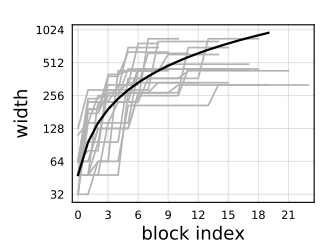
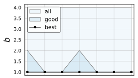

`Designing Network Design Spaces`

# 1 动机&贡献

## 1.1 目标

本文的目的是探索出一种网络结构设计的通用的准则。如：

+ 网络不同阶段的通道数是应该逐stage递增还是递减，还是不变？
+ 不同阶段的blocks的数量是应该递增还是递减还是不变？
+ ResNet的 bottleneck ratio 通常设置为2来降低计算瓶颈，有没有更好的bottleneck ratio，即不是2, 而是1, 4, 8)？
+ ResNext每组的组卷积的通道数是固定的，那么每组的通道数设置为多少最好(1, 2, ... 32)？
+ 等等。

## 1.2 通常怎么做？

为了探索最优的网络结构范式，怎么进行实验？把各种情况组合成的网络都训练一遍然后对比吗？显然枚举的方法即需要极大的资源消耗，最终也只能得到单个的最优结构。而对网络设计的一般性范式准则没有太大的指导意义。

## 1.3 本文的思路？

本文在 **设计空间 (Design Spaces)** 的角度来尝试找到一种最优的网络结构设计范式:

+ 什么是网络设计空间 (Network Design Spaces) ? ：把上述 block的数量的所有情况，bottleneck ratio的所有情况，通道数量的所有情况等等，使用组合的方式得到的所有模型就得到了一个网络设计空间的集合。

+ 这个设计空间太大，甚至是无限的。本文的目的就是逐级缩小该设计空间，并且保证效果好的模型都在缩小的设计空间中。如下图所示：

  

+ 怎么逐渐缩小设计空间，直至达到一个可接受的搜索空间来进行实验，就是本文的重点研究内容。

**需要注意，本文的目标是找到一种网络结构设计的一般性范式，而不是找到一个最优的网络结构出来。一般性范式表明使用这种规则设计出的网络结构通常都具有较好的性能，至少也不会太差。而如果非要说最优的模型的通道数是108, 各个stage的block数量必须是2,4,5,2，本文的方法是无法找到这样非常特定的网络结构的。**

**此外，本文的目标也是基于一种特定的 block 的结构，如 Residual BottleNeck BLock。在block结构固定的情况下，应该如何使用该block搭建网络结构，以及block内的超参（通道数，bottleneck ratio等值）如何取值的效果最好。而不是如何设计 block，更不是探索一个block中应该有几个卷积，block内的算子应该并联还是串联，bn放在哪，用什么激活函数等。**

# 2 Design Space Design

## 2.1 准备工作

搜索网络设计空间的过程是在逐渐缩小搜索空间的范围。在每次缩小范围的阶段，输入是较大的空间，输出是较小的空间，并且在该较小的空间中的模型的性能都较优：

**怎么对比较大的设计空间和较小的设计空间中的模型的优劣？**把两个空间中的所有模型都拿出来算一遍metrics然后对比吗？这样还是需要极大的计算资源。

本文采用的方法是统计方法，统计的方法在机器学习、深度学习等领域发挥出了巨大的作用。放在模型设计空间中的做法就是：

+ 在每个设计空间中，采样出 $n$ 个样本 （每个样本就是一个网络模型）。
+ 训练这 $n$ 个样本，为了节省计算资源，本文采用了一种 low-compute, low-epoch的训练策略。
+ 利用样本分布估计整体分布，即利用采样出的 $n$ 个样本模型，估计对应的网络设计空间的性能。

其中：

+ 第一步采样的过程也就是随机组合不同的变量（如网络宽度，blocks的数量等）。

+ 第二步的 low-compute, low-epoch就是保证每个采样出的模型的FLOPs都在400M左右，在ImageNet数据集上，每个模型只训练10个epoch。如下图所示，ResNet50的FLOPs约为4G。实验发现，训练100个400M的模型，每个模型10个epoch的时间，约等于训练ResNet50，100个epoch的时间。**但这样采样出 400M 的模型，是否就不是 i.i.d 了？能够有效代表整体？此处存疑？？？**

  

+ 第三步评估样本的性能，本文使用的是经验分布函数 (Empirical Distribution Function, EDF) ：
  $$
  F(e) = \frac{1}{n} \sum_{i=1}^{n} \mathbb{1}[e_i < e]
  $$
  其中，$n$ 是样本数量，$e_i$ 表示第 $i$ 个模型的误差。$F(e)$ 给出了模型的误差小于 $e$ 的比例。其实也就类似于概率分布函数 $P(x<p)$ 。

## 2.2 AnyNet

模型设计空间中的每一个模型，都叫做 AnyNet 。一个模型通常包括 Stem, Body 和 Head，如下图所示：


由于 Stem 和 Head 的结构通常比较固定，且主要的计算量和影响性能的地方都是在 Body。因此，本文在后续实验中固定下来一个尽可能简单的 Stem 和 Head，而主要讨论 Body 的设计范式。

本文大部分实验都是以标准的 Residual Bottleneck Block 为基础来构建模型，并把以 Residual Bottleneck Block 为基本 block 的模型称为 AnyNetX。

Body 通常包含多个 Stages，每个 Stage 包含多个 Blocks。设计空间的维度包括：

+ 一个Body包含多少个 Stages ? 不过通常大多数网络都是 4 个 Stage，因此本文在这里就直接固定下来 Stage 的数量为4，如上图 (b) 所示。
+ 每个 Stage 各自又包含多少个 blocks ?
+ 每个 Block 的宽度是多少？
+ 每个 Block 的 BottleNeck Ratio 是多少？
+ 每个 Block 中的分组卷积的宽度是多少？

综上所述，AnyNet 一共有 4 个Stage, 每个 Stage 内需要探讨：

+ Blocks 的数量 $d_i$
+ Block 的宽度 $w_i$
+ Block 的Bottleneck Ratio $b_i$
+ 组卷积的宽度 $g_i$

共有 $4 \times 4 = 16$ 个自由度。取值范围为：

+ $d_i \le 16$
+ $w_i \le 1024$, and devisible by 8
+ $b_i \in \{1, 2, 4\}$
+ $g_i \in \{1, 2, ..., 32\}$

其他配置为：

+ 输入分辨率固定为 $r = 224$
+ 从设计空间采样出 $n=500$ 个模型样本，每个样本的的计算量在 360M Flops 至 400M FLOPs 之间。

简化设计空间的过程为：

### 2.2.1 $AnyNetX_A$

AnyNetX 的初始的，无任何约束的设计空间，称为 $AnyNetX_A$ 。

AnyNetX 的初始设计空间共有 $(16 \times 128 \times 3 \times 6) ^ 4 \approx 10^{18}$ 种可能的模型配置。

### 2.2.2 $AnyNetX_B$

 $AnyNetX_A$ 的一个子空间，在该空间中，每个模型所有block的 Bottleneck Ratio 都相同，设置为 $b_i = b$ 。该子空间称为 $AnyNetX_B$ 。

从 $AnyNetX_B$ 中采样出来 500 个模型。相较于 $AnyNetX_A$ ，两个空间采样出的样本模型的 EDF 如下图所示：


可以发现：

+ 设置每个 blocks 都使用相同的 Bottleneck Ratio，模型的 EDF 几乎没有变化
+ 但是每个 blocks 都使用相同的 Bottleneck Ratio，可以缩小设计空间的范围。

此外，从下图可以发现一个反常的现象：BottleNeck Ratio 设置为 1，误差要比通常模型设置为 2 要更低。


因此，后续实验都在 所有 blocks 的 Bottleneck Ratio 相等的条件下进行。此时自由度减小为：
$$
(16 \times 128 \times 6) ^ 4 \times 3 \approx 6.8 \times 10^{16}
$$

### 2.2.3 $AnyNetX_C$

在 $AnyNetX_B$ 的基础上，把所有 blocks 的每组的卷积通道数固定为 $g_i = g$ 。结果如下图所示：


可以发现：

+ 相较于 $AnyNetX_B$ ，EDF 几乎没有变化。但是又一次的缩小了设计空间。

因此，后续所有实验都在所有 blocks 的分组卷积的通道数固定的条件下进行。此时，自由度减小为：
$$
(16 \times 128) ^ 4 \times 3 \times 6 \approx 3.2 \times 10^{14}
$$

### 2.2.4 $AnyNetX_D$

在 $AnyNetX_C$ 的基础上，分析每个 Stage 的宽度 $w_i$ ：


这里需要说明：

+ 在设计模型的过程中，就规定了 $i$ 是 Stage 的索引。因此 $w_i$ 表示每个Stage的所有Block的宽度都相同。实验也是在这个条件下开展的。因此上图中会有 “横线” 的存在。
+ 每个 Stage 中的 Blocks 的数量是随机的，可能是1，也可能是其他数。因此上图中每个子图的横坐标（表示网络所有Stage的所有Block的索引）都可能是不同的。
+ 上图的第一行是在 $AnyNetX_C$ 中挑选出的最好的模型，第二行是从中挑选出的最差的模型

可以发现：

+ 最好的模型的 4 个 Stage 的通道数量都是逐 Stage 递增的，即 $w_{i+1} \ge w_i$ 。

从下图可以看出，相较于蓝色的 $AnyNetX_C$ ，每个Stage的通道数递增能够获得红色曲线表示的更小的误差，，而递减或相等的误差都要高于基础的 $AnyNetX_C$ 。


因此，后续所有实验的 4 个 Stages 的通道数都是递增的。

### 2.2.5 $AnyNetX_E$

$AnyNetX_E$ 在 $AnyNetX_D$ 的基础上，进一步研究每个 Stage 的 Block 的数量，如下图所示：


可以看出，相较于蓝色的 $AnyNetX_D$ ，每个Stage 的 Blocks 的数量递增，可以获得红色曲线表示的更低的误差。

因此，后续所有实验的 4 个 Stages 的 Blocks 数量都是递增的。

# 3 RegNet

## 3.1 设计过程

把 $AnyNetX_E$ 中最好的20个模型拿出来，把所有Stage的所有Block的通道数画出来，如下图灰色曲线所示：



可以发现：

+ 由于之前的实验，约束了每个 Stage 的通道数是递增的。

+ 不同模型的通道数存在显著差异，如，第0个block的通道数有的是32，有的是128。

+ 其中黑色的曲线是能够较好的拟合不同 Stage 的通道数的曲线，表达式为 $w_j = 48 (j + 1)$:

  + 上式显然是一条直线，但是作者对齐取 log2，如下图所示：

    

    当下图的坐标取 $2 ^ y$ 时，如$2^{10} = 1024$ , 就是图中黑色曲线的效果。因此，基本证明了可以使用一个线性方程来拟合不同阶段的通道数。

作者的目的是找到一个函数，可以帮助我们直接输出每个 Stage 的通道数应该设置为多少，该函数用一个线性函数表示：
$$
u_j = w_0 + w_a \cdot j \quad for \quad 0 \le j \le d
$$
其中，$j$ 表示所有Stage的所有block的索引，即 $0, 1, 2, ..., d$ 。网络初始的宽度为 $w_0$ ，即第 $0$ 个Stage的宽度是 $w_0$ 。既然网络后续Stage的宽度需要递增，因此 $w_a \gt 0$ 。

Pytorch中的实现（以 regnet_x_800mf 为例：$d=16, w_0=56, w_a=35.73, g=16$）:

```python
widths_cont = torch.arange(d) * w_a + w_0
# [56.0, 91.72999572753906, 127.45999908447266, 163.19000244140625, 198.9199981689453, 234.64999389648438, 270.3800048828125, 306.1099853515625, 341.8399963378906, 377.57000732421875, 413.29998779296875, 449.0299987792969, 484.760009765625, 520.489990234375, 556.219970703125, 591.9500122070312]
```

从Pytorch官方实现的代码可以看出，这种方法有两个问题：

+ 计算出的通道数 $u_j$ 可能是是浮点数
+ 无法保证每个 Stage 中的不同的 Block 的通道数都相同。

怎么解决？大致思路是：

+ 最终计算出的通道数四舍五入即可（论文中是这样做的，要是向上向下取整应该也可以，这里就先尊重论文）。
+ 站在上帝视角，用上述线性方程最终计算出来的模型的4个stage的宽度一定是（假设我们已经解决了浮点数和不同block的通道数不同的问题了） $[w0, ..., w_0; \quad w_1, ...w_1; \quad w_2, ..., w_2; \quad w_3, ..., w_3]$ 。其中，$\frac{w_1}{w_0}$ 一定有一个比例吧，并且 $\frac{w_2}{w_0}$ 也一定有一个比例吧，$\frac{w_3}{w_0}$ 还会有一个比例吧。如果我们用一些什么方法，能够得到让每个Stage的这个比例 $ratio$，那就能够直接用 $ratio \times w_0$ 来得到该 Stage 中的每个 block 的宽度了。

具体的（四舍五入很简单，下面主要就是讨论第二个问题）：

+ 实际上，我们只知道每个 block 的宽度，而且同一个 Stage 的不同的 Block 计算出的宽度还都不相同，因此无法计算 $\frac{w1}{w0}, \frac{w2}{w0}, \frac{w3}{w0}$

+ 那我们就先来用每个 block 的实际计算出来的宽度 $u_j$ 来计算以下这个比例 $w_m^{s_j}$：
  $$
  w_m^{s_j} = \frac{u_j}{w_0}
  $$
  也就是论文中的公式 $u_j = w_0 \cdot w_m^{s_j}$ 。 这里引入了两个超参 $w_m \gt 0$ 和 $s_j$ 。由于每个 blocks 的通道数都大于0，因此 $w_m \gt 0$ 。
  
+ 然后，$s_j$ 怎么计算？很显然，求 log 即可：$s_j = \log_{w_m} (\frac{u_j}{w_0})$ 。但是python中并没有以 $w_m$ 为底的 log函数啊。Pytorch官方regnet的实现中这里比较巧妙：
  $$
  s_j = log_{w_m} (w_m^{s_j}) = \frac{log_{e}(w_m^{s_j})}{log_e(w_m)} = 
  \frac{s_jlog_{e}(w_m)}{log_e(w_m)} = s_j
  $$
  在 Pytorch 的 regnet_x_800mf 中，$w_m=2.28$ ，因此计算出的 $s_j$ 为：
  
  ```python
  torch.log(widths_cont / w_0) / math.log(w_m)
  # [0.0, 0.5987775921821594, 0.9979075789451599, 1.2977375984191895, 1.5379626750946045, 1.7383960485458374, 1.9103660583496094, 2.060960292816162, 2.1949102878570557, 2.3155317306518555, 2.425238609313965, 2.525843381881714, 2.618741512298584, 2.7050297260284424, 2.7855868339538574, 2.8611268997192383]
  ```
  
  + 这里再开启一次上帝视角，从输出结果来看，如果我们对 $s_j$ 取四舍五入，那么 $s_j$ 就刚好是 $[0.0, 1.0, 1.0, 1.0, 2.0, 2.0, 2.0, 2.0, 2.0, 2.0, 2.0, 3.0, 3.0, 3.0, 3.0, 3.0]$ ，正好对应 4 个 Stage 的索引。那么 $u_j = w_0 \cdot w_m^{s_j}$ 就可以保证每个 Stage 的通道数相同了：
  
    ```python
    block_capacity = torch.round(torch.log(widths_cont / w_0) / math.log(w_m))
    # [0.0, 1.0, 1.0, 1.0, 2.0, 2.0, 2.0, 2.0, 2.0, 2.0, 2.0, 3.0, 3.0, 3.0, 3.0, 3.0]
    ```

+ 再反推，求出 $u_j = w_0 \cdot w_m^{s_j}$ （此时 $u_j$ 不同于刚才计算的 $u_j$ 了，此时的 $u_j$ 由于每个Stage的 $s_j$ 都相同，因此每个 Stage 的 $u_j$ 也都相同了）:

  ```python
  w_0 * torch.pow(w_m, block_capacity)
  # [56.0, 127.68000030517578, 127.68000030517578, 127.68000030517578, 291.11041259765625, 291.11041259765625, 291.11041259765625, 291.11041259765625, 291.11041259765625, 291.11041259765625, 291.11041259765625, 663.731689453125, 663.731689453125, 663.731689453125, 663.731689453125, 663.731689453125]
  ```

+ 但还要保证通道数能被 8 整除，且是整数：

  ```python
  QUANT = 8
  block_widths = (torch.round(torch.divide(w_0 * torch.pow(w_m, block_capacity), QUANT)) * QUANT).int().tolist()
  # [56, 128, 128, 128, 288, 288, 288, 288, 288, 288, 288, 664, 664, 664, 664, 664]
  ```

需要特别注意：自始自终，我们都仅仅指定了网络应该有多少个 Blocks ，而并没有指定网络到底有多少个 Stages, 也没有指定每个 Stage 中有多少个 Blocks 。RegNet 中是计算出通道数之后，按照通道数的分组来确定到底有多少个 Stage ，以及每个 Stage 中有多少个 Blocks 的：

```python
num_stages = len(set(block_widths))
```

每个 Stage 的 Block 的数量：
$$
d_i = \sum_j \mathbb{1}[\lfloor s_j \rceil = i]
$$
接下来，首先梳理一遍为了确定一个 RegNet，需要哪些自由度：

+ 分组卷积的通道数 $g_i$
+ Blocks 的数量 $d = \sum d_i$
+ 初始的通道数 $w_0$
+ $w_a$
+ $w_m$

## 3.2 结论的通用性

RegNet 的 EDF 对比曲线如下图所示。可以看出 RegNet 的效果比 $AnyNetX_E$ 更好。


之后，作者做了几个实验：

---


+ $w_m = 2$ ，即后一个 block 的宽度是前一个的两倍时，效果更好
+ $w_0 = w_a$ 时效果更好，即把 $u_j = w_0 + w_a \cdot j$ 简化为 $u_j = w_a \cdot (j+1)$ 。但是实际实现还是分别选择了 $w_0$ 和 $w_a$ 。

---

后续研究其他超参，需要从 RegNet 中采样多少个模型？


+ 无论采样多少个模型，RegNetX 都比 AnyNetX_a 的效率更高（采样更少的模型，就能够获得更低的误差所在的子空间）
+ 采样 32 个模型就可以得到下一个更小的子空间的一些条件。再增大采样数量的作用并不是很大。因此后续实验都采样大约32个模型。

---

本文的结论对其他 block (不是 residual block 是否有效)：


可以看出，同样有效。

---

本文的结论是在 400MF 下做的，对更大的 FLOPs 的模型有无效果？


可以看出，同样有效。

---

本文的结论都只训练了 10 个 epoch，训练更多 epoch 时结论是否不变？


可以看出，结论不变。

---

本文的结论都是在 4 个 Stage 下做的，更多的 Stage 是否同样有效：


可以看出，结论不变。

## 3.3 网络超参设置

剩下的实验需要详细讨论超参设置，而 RegNet 的设计空间已经比较小了，因此后续的实验都采样更少的模型 （100），并训练更长的时间 （25 epohcs）。

目前的超参包括：

+ Blocks 的数量 $d = \sum d_i $
+ Block 的宽度 $w_i$，实际上只需要确定 $w_0$
+ Block 的Bottleneck Ratio $b_i$
+ 组卷积的宽度 $g_i$
+ $w_a$
+ $w_m$

超参的取值范围为：

+ $d = \sum d_i \lt 64$
+ $w_0$
+ $w_a \lt 256$
+ $1.5 \le w_m \le 3$
+ $b_i \in \{1, 2, 4\}$
+ $g_i \in \{1, 2, ..., 32\}$

### 3.3.1 模型深度

+ 最好的模型的深度都在 $d = 20$ 附近
+ 这一现象与更深的模型的效果最好的结论相反。


### 3.3.2 Bottleneck ratio

+ bottleneck 中的 $b = 1$ 最好



此外，现有轻量级网络为了避免计算瓶颈，通常 bottleneck 都使用了 $b \lt 1$ 的 bottleneck ratio，同时使用depthwise convolution ($g = 1$) 来进一步降低计算量。本文也对比了这种方法，如下图所示：


可以发现：

+ 当 $b = 1$ 时模型的效果最好。
+ 当 $b \le 1$ ，但是 $g \le 32$ 时，模型次之。
+ 当使用现在的轻量级网络的配置 $b \le 1$ ，$g = 1$ ，模型的效果非常差。

为了更有说服力的证明，作者就实打实测试了一次 $b=1$ 和 $b=\frac{1}{2}$ 的效果，如下图所示


### 3.3.3 Width mulplier

+ 最好的模型的 width mulplier 都在 $w_m = 2.5$ 附近
+ 这与现有方法：后一个 stage 的通道数是前一个 stage 的两倍相似但是不同。


### 3.3.4 Resolution


+ 当输入图像分辨率为 224 时，模型的效果最好。
+ **然而这一现象存疑。因为本来在搜索的过程中，就是使用 224 的分辨率。如果用其他分辨率进行搜索，可能网络的超参又不同了。**

### 3.3.5 SE Attention


+ 把 residual bottleneck block 组成的模型称为 $RegNetX$，把 residual bottleneck block + SE 组成的模型称为 $RegNetY$
+ 可以发现，SE 能够有效提升模型的效果。

### 3.3.6 Swish vs. ReLU


+ 当 FLOPs 较小时，Swish 的效果更好。当 FLOPs较大时，ReLU的效果更好。
+ 如果使用 $g = 1$ ，即depthwise conv，Swish 比 ReLU好的**更多**（一直都比ReLU好）。

### 3.3.7 其他超参

+ 其他超参与模型的复杂度成正比。


## 3.4 与其他方法对比

按照上述超参的规则，从具有 $d, g, w_m, w_a, w_0$ 的自由度的设计空间中，按照每个 FLOPs 量级，随机构建出25个模型，并选择其中最好的一个。对于最好的模型，训练100个 epoch，并重复5次，以获得更加鲁棒的误差估计。

-X 模型和 -Y 模型的误差分别如下图所示：


-X 和 -Y 的最好的模型的超参分别为：


从中发现的规律：

+ 更大的模型具有更多的 blocks 数量，但是最好的模型通常在第3个阶段具有最多的 blocks 数量，而在最后一个 stage 的 blocks 的数量较小。这一现象与 ResNet 的设计方式相同。
+ 模型越大（FLOPs），每组的卷积通道数量 $g$ 也越大
+ 模型越大 （FLOPs），其原因是卷积的宽度 $w_0$ 变宽了，而深度 $d$ 却先增大，随后就趋于饱和不在显著增加了。

然而，最后一个 Stage 的 blocks  数量较少（通常只有1-2个），是不是说明最后一个 Stage 不重要呢？作者做了如下图所示的实验，发现去掉最后一个 Stage，性能回显著降低


## 3.5 与其他轻量级模型对比

最难一些针对移动端设计的轻量级模型的FLOPs大约在 600MF 。对比结果如下：


然而这些超参是如何得到的？一部分是在 $AnyNetX$ 中已有的结论：

+ 不同 Stage 的 Bottleneck Ratio 都设置为相同，对模型的性能几乎没有影响。且设置为 $1$ 时的效果最好。这一点是反直觉的，即大多数网络都把 bottleneck ratio 设置为2。
+ 不同 Stage 的 group width 都设置为相同，对模型的性能几乎没有影响。
+ 每个 Stage 的宽度递增，模型的效果最好。
+ 每个 Stage 的 blocks 的数量递增，模型的效果最好。


+ 
