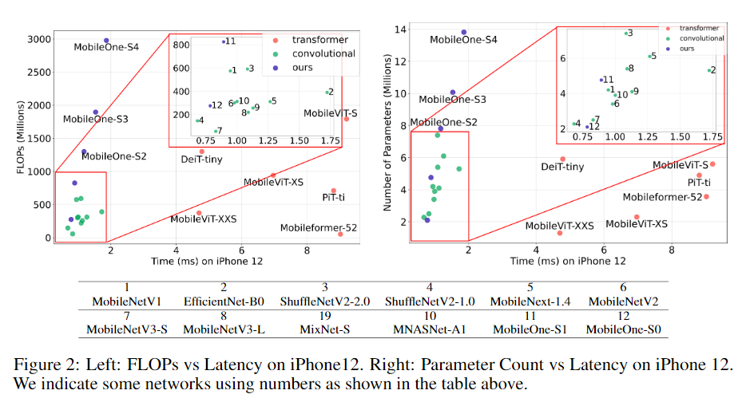
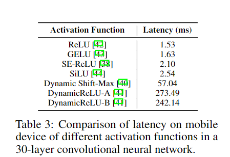
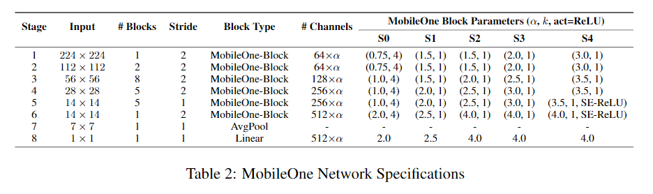
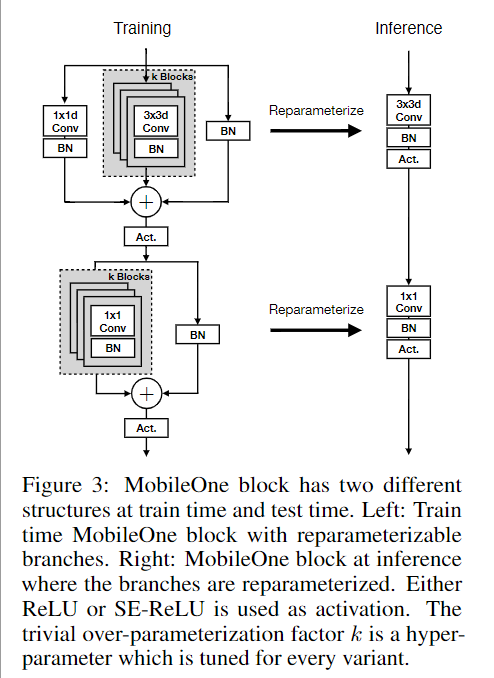
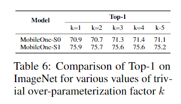
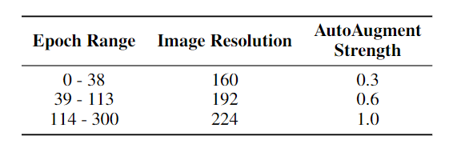

`An Improved One Millisecond Mobile Backbone`

# 1 动机

针对移动端优化的网络结构通常把 FLOPs 或 参数量当作评价指标。然而，这些指标可能对于延时是不准确的。因此本文进行了大量的分析。

MobileOne 在 iPhone 12 上具有 1ms 的推理速度, 75.9% 的 top-1 准确率。

+ FLOPs 没有考虑 MAC和并行程度
+ 参数量也和延时无关
+ 没有参数的 skip-connection会明显增加MAC

---

+ MobileOne 使用了重参数化
+ 使用了动态的正则项，防止小模型被过度正则

# 2 Related Work

+ 优化参数量：SqueezeNet, MobileViT
+ 优化FLOPs : MobileNet, MobileNeXt, ShuffleNet-V1, GhostNet, MixNet
+ 缩放深度、宽度、分辨率：EfficientNet, TinyNet
+ 优化延时：MNASNet, MobileNetV3, ShuffleNet-V2

# 3 本文方法

## 3.1 Metric相关性

用于评价模型大小的最常用的指标是 参数量 和 FLOPs，然而这些指标可能不能很好的和 延时 相关。

在分析过程中，本文使用 Pytorch 实现这些模型，并转换成 ONNX 格式，之后使用 Core ML 工具部署在 iPhon12 iOS应用上来测量时延。

可以给观察到，一些模型的参数量较高，但是时延更低，FLOPs 也具有这样的现象。此外，基于卷积的网络比基于trnasformer的模型，在具有相似的 FLOPs 的情况下，卷积模型的时延耕地。

## 3.2 主要瓶颈

### 3.2.1 激活函数

为了分析激活函数的时延，构建了一个30层的卷积网络：

如上表所示，所有模型的结构都相同，但是不同的激活函数导致时延存在巨大的差异。MobileOne 只使用 ReLU 作为激活函数。

### 3.2.2 Blocks

影响运行效率的两个关键因素是 MAC 和 并行程度。

+ 多分支结构会明显增加MAC，这是因为每个分支的输出激活值需要存储。多分支结构的内存瓶颈可以使用更少的分支来避免。
+ 需要同步操作的算子也会影响运行速度 (Synchronization cost)。比如 global pooling (SE) ，为了计算全局最大/平均值，需要存储中间结果。

因此，MobileOne没有使用分支结构（推理时），具有更高的 MAC。此外，为了提高精度，限制使用了 SE 。

## 3.3 MobileOne 结构

+ 基础的 block 基于 MobileNet-V1 的 3x3 深度卷积 + 1x1 Point-wise 卷积。在 identity 分支使用了 BN 层。在测试时，MobileOne 没有任何分支。
+ 每个卷积分支后都有BN。skip connection 分支中有一个 BN。
+ 测试时合并 conv 和 BN，skip connection 中的 BN 先转换成 1x1，再 padding k-1 个0，到卷积分支的卷积核尺寸。
+ 在获得了所有分支的转换之后的卷积之后，各分支的权重相加，偏置相加，得到最终的单个的卷积核。

+ 每个 block 中共有 k 个并联的卷积分支，推理时都可以合并成一个卷积。k 的设置对性能的影响如下表所示：

  

## 3.4 训练

+ 使用余弦衰减学习率。[imagenet : 1e-1, 300 epochs]
+ weight decay 也是余弦衰减。[imagenet : 1e-4至1e-5]
+ 训练时逐步增大输入图像分辨率

+ 使用了 EMA, decay = 0.9995
+ 目标检测使用线性 warmup，初始学习率是设置学习率的 0.001。warmup 4500 个 iters
+ 目标检测的初始学习率是 0.05, momentum=0.9, SGD, weight decay =1e-4, 8GPUs, batchsize=192 
