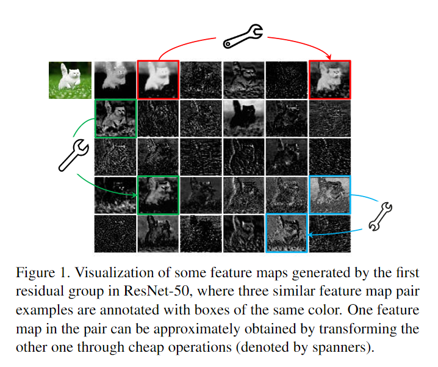
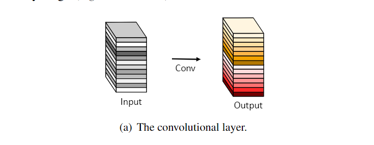
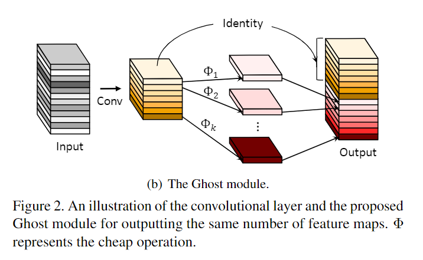
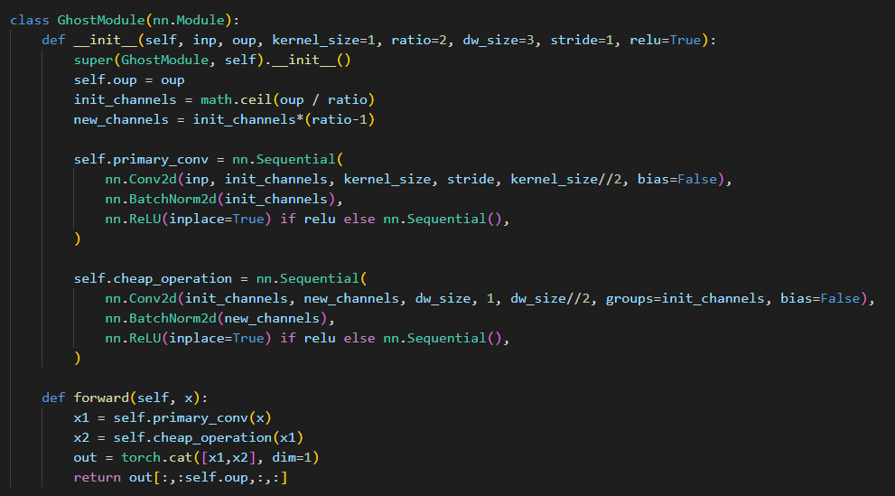
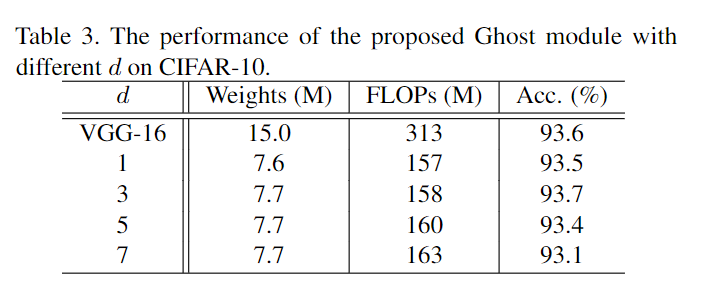
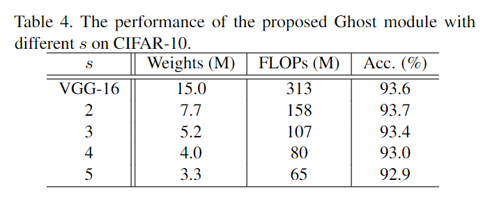
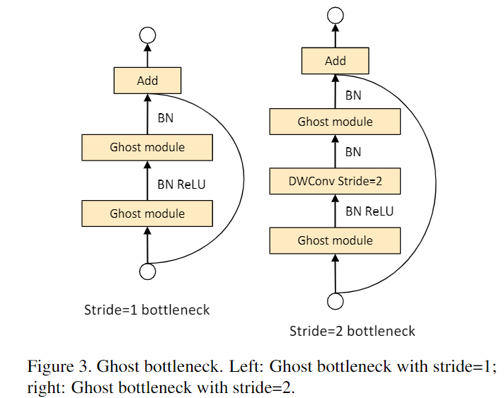
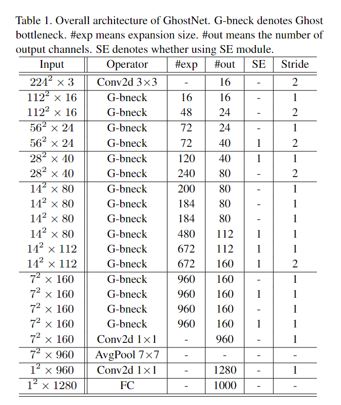
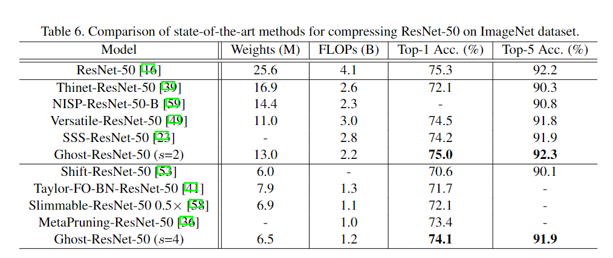
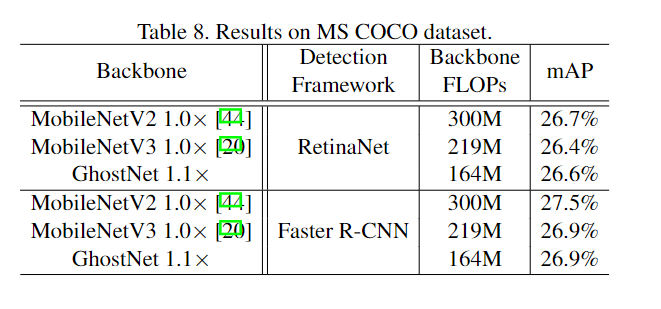

# 1 动机

根据ResNet-50的feature-map可视化结果，作者认为一个成功的CNN应该具有冗余特征。大量甚至冗余的特征能够对输入数据具有综合的理解。

# 2 方法

**目标是用尽可能少的参数/计算量来生成冗余特征。**

首先计算普通方法，对于输入 $C \times H \times W$ 的特征图，为了输出 $C' \times H' \times W'$ 的输出特征图，需要 $C \times C' \times k \times k$ 的卷积参数量。当 $C$ 或 $C'$ 很大时，参数量也会很大。普通方法的卷积过程如下图所示：

但是作者认为，既然为了获得冗余特征，那么可以使用普通方法生成一小部分特征图，再通过一种cheap的变换，从这一小部分特征图中生成剩余的冗余的ghost的特征。如，为了生成 $C'$ 个输出特征，可以先使用普通方式生成 $m$ 个通道的特征，且 $m \le C'$ ，再使用cheap的方式生成剩余 $C' - m$ 个通道的特征：

- 
- 先生成 $m$ 个通道的特征，需要的卷积参数量为 $C \times m \times k \times k$

- 对于 $m$ 个通道的其中每个通道的特征 $y_i \in \mathbb{R}^{1 \times H' \times W'}$ ，都使用 cheap 的操作 $\Phi(\cdot)$ 生成若干个ghost的冗余特征。
- 代码中使用卷积作为 $\Phi$ ，则 $m$ 个通道中的每一个都需要生成 $\frac{C' - m}{m}$ 个通道的特征。
- 最后，concat $m$ 和 $C' -m$ 个通道的特征，获得想要的 $C' = m + m \times \frac{C' - m}{m} = m + C' - m = C'$ 个通道的特征。

- 显然，由于 $\frac{C' - m}{m}$ 是卷积的输出通道数，因此 $C' -m$ 需要是 $m$ 的整数倍。即 $\frac{C' - m}{m} = \frac{C'}{m} - 1$ 中的 $\frac{C'}{m}$ 需要是整数。代码中令该整数为 $s$ 。则，昂贵特征通道数 $m = \frac{C'}{s}$ 

更统一的梳理一下：

- 对于输入特征，首先使用参数为 $C \times k \times k \times m = C \times k \times k \times \frac{C'}{s}$ 的卷积生成主要特征。

- 对于主要特征的每个特征，都使用 $\frac{C'}{s} \times d \times d \times \frac{C' - m}{m}$ 的卷积生成ghost冗余特征。把 $m$ 替换成 $\frac{C'}{s}$ ，则卷积参数为：
  $$
  \frac{C'}{s} \times d \times d \times \frac{C' - m}{m} = \\
  
  \frac{C'}{s} \times d \times d \times (\frac{C' - \frac{C'}{s}}{\frac{C'}{s}}) = \\
  
  \frac{C'}{s} \times d \times d \times (\frac{C'}{\frac{C'}{s}} - 1) = \\
  
  \frac{C'}{s} \times d \times d \times (s - 1)
  $$

 过程如下图所示：

代码如下图所示，其中 `ratio` 即为 $s$ ：

从上述代码可以发现，cheap_operation 实际上就是分组卷积，分组数等于输入通道数。然而，论文中的想法会更加自由：

- 对于 $m$ 个primary特征中的每个通道，都使用一个单独的 $\Phi$ 来生成 $\frac{C' - m}{m}$ 个通道的 ghost 特征
- 那么这里不同的 $\Phi$ 可以具有不同的结构，如 $3\times3$ 的卷积，$5\times5$ 的卷积。甚至可以部分 $\Phi$ 用卷积，而剩余 $\Phi$ 不用卷积。
- 但是处于硬件设备并行计算的考虑，作者还是对每个通道都使用了相同的 $\Phi$ ，即分组卷积。

- 然而，$\Phi$ 是作者主打的 cheap 操作，那么他的卷积核大小是多少呢（输入输出通道数一定是固定的）？作者实验如下，发现卷积核大小 $d = 3$ 最好：

最后，需要讨论 $s$ 是多少最好？ 

- 作者尝试了 $s \in {2, 3, 4, 5}$ ，结果如下图所示。可以发现 $s = 2$ 最好。
- 并且，不使用cheap操作的primary特征的输出通道为 $m = \frac{C'}{s}$ ，则 $s$ 越大，$m$ 越小，模型越快。

有了基础的 `GhostModule` ，就可以搭建 Blocks 了：

最终 blocks 搭起的网络如下所示：

# 3 实验

- 比 ResNet-50稍差一些，但是参数量和计算量几乎只有一半。

- COCO上参数两比MobileNets低很多的情况下，mAP几乎相同。