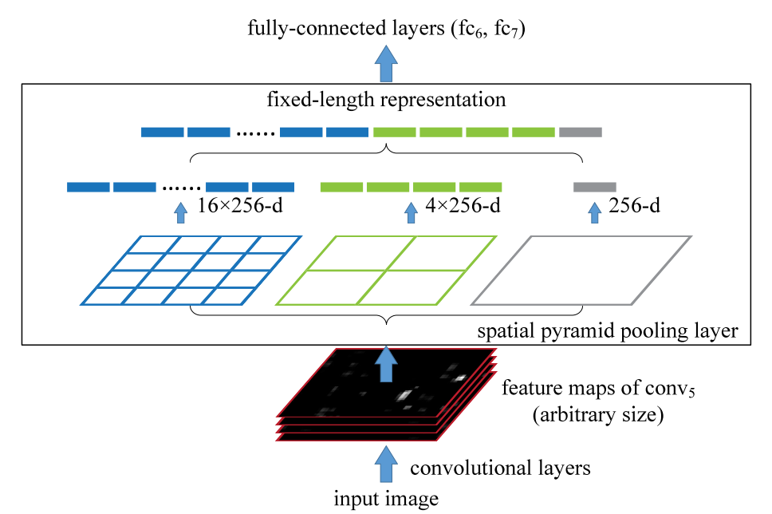

# 1 SPP

Paper : `Spatial pyramid pooling in deep convolutional networks for visual recognition`

Code : 

[C] ECCV 2014

## 1.1 贡献

+ 解决了 ConvNet + FC 只能接受固定尺寸的输入的问题。
+ 避免为了获得固定输入，采用 Crop/Warp 导致物体缺失或形变的问题。
+ 可以使用多尺度输入图像分辨率进行训练/测试，提升了尺度不变性，并且降低了过拟合风险。
+ 多个不同尺度的 Pooling 能够提升鲁棒性。
+ 解决了 R-CNN 对每个候选框都要 Resize 并使用卷积网络提取特征的 time-consuming 问题。


## 1.2 方法



假设最后一个卷积层输出的 feature-map 的通道维度是 k，SPP 的网格大小是 $M = n \times n$ ，则该尺度下的输出特征维度就是 $kM$ 。

对于上图中三个不同尺度的网格：`k=4, k=2, k=1`，以及特征图 `k=256` 。无论特征图的分辨率是多大，输出维度永远都是 `(16 + 4 + 1) \times 256` 。

**Note :** 

+ 网格大小 $n \times n$ 表示输出特征的空间分辨率，而并不是池化窗口的尺寸。
+ 池化使用的是 Max Pooling 。

对于空间分辨率为 $N \times N$  的输入特征，为了获得空间分辨率为 $n \times n$ 的输出特征：

+ 池化窗口的大小为 ： $ceil(\frac{N}{n})$
+ 池化步长为 ：$floor(\frac{N}{n})$

## 1.3 实现

+ 使用 `maxpool2d` 。

  ```python
  import torch
  import torch.nn as nn
  import math
  
  class SSP(nn.Module):
  
      def __init__(self, kernel_size, stride):
          super(SSP, self).__init__()
          self.pooling = nn.MaxPool2d(kernel_size=kernel_size, stride=stride)
  
      def forward(self, x):
          out = self.pooling(x)
          return out
  
  feature_map = torch.tensor([
      [1, 2, 3],
      [4, 5, 6],
      [7, 8, 9]
  ], dtype=torch.float32).view(1, 1, 3, 3)
  
  model = SSP(kernel_size=math.ceil(3 / 2), stride=math.floor(3 / 2))
  out = model(feature_map)
  print(out)
  
  '''
  tensor([[[[5., 6.],
            [8., 9.]]]])
  '''
  ```

+ 使用 `AdaptiveMaxPool2d`

  ```python
  import torch
  import torch.nn as nn
  import math
  
  class SSP(nn.Module):
  
      def __init__(self):
          super(SSP, self).__init__()
  
          self.pooling = nn.AdaptiveMaxPool2d(2)
  
      def forward(self, x):
          out = self.pooling(x)
  
          return out
  
  
  feature_map = torch.tensor([
      [1, 2, 3],
      [4, 5, 6],
      [7, 8, 9]
  ], dtype=torch.float32).view(1, 1, 3, 3)
  
  model = SSP()
  
  out = model(feature_map)
  print(out)
  
  '''
  tensor([[[[5., 6.],
            [8., 9.]]]])
  '''
  ```


