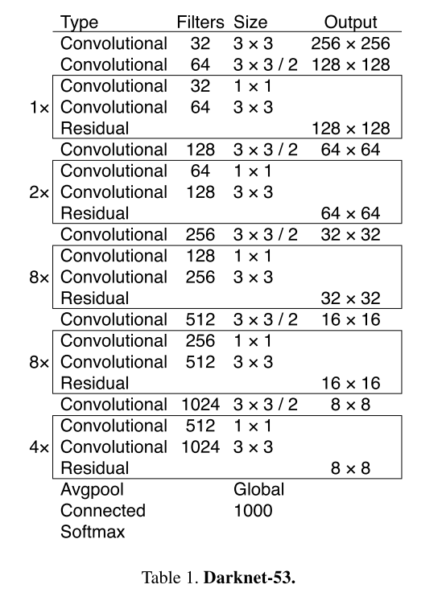
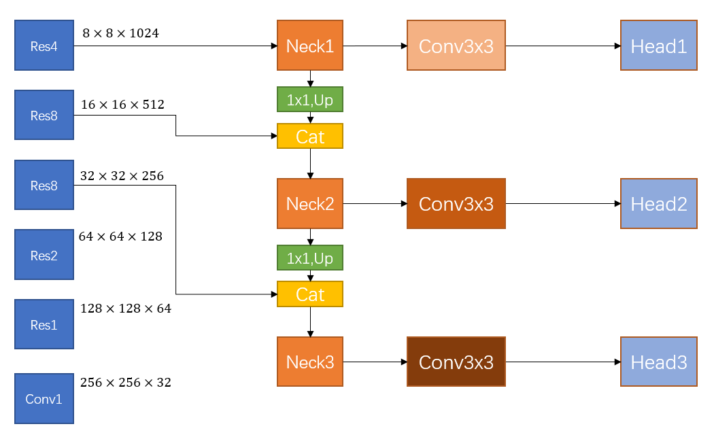
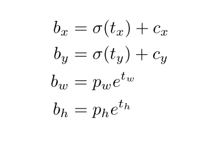

# 1 网络结构

## 1.1 Backbone 

+ Darknet-53

  

## 1.2 FPN

+ 和原始的 FPN 不同

  

+ 三个尺度中的每一个尺度的输出维度都是 $N \times N \times [3 \times (4 + 1 + 80)]$  for COCO。其中， $3$ 表示每个尺度上的 anchor 数量都是 3 ，即总共有9种 anchor 

  | $10 \times 13$  | $16 \times 30$   | $33 \times 23$   |
  | --------------- | ---------------- | ---------------- |
  | $30 \times 61$  | $62 \times 45$   | $59 \times 119$  |
  | $116 \times 90$ | $156 \times 198$ | $373 \times 326$ |

上表为 COCO 聚类出来的 9 种 anchors。

# 2 匹配正负样本

+ 如果一个 anchor (先验框) 和一个gt bbox 的 IoU 最大，则该 anchor 负责预测该  gt 。

+ 如果一个 anchor 和任意gt bbox 的 IoU 都不是最大（不负责预测任何 gt ），但是该 anchor 与某一个 gt 的 $IoU > 0.5$ ，则忽略该 anchor。忽略样本不计算任何 loss 。

+ 如果一个 anchor 没有被指定为正样本或忽略样本，则作为负样本。负样本只计算 confidence loss，标签为 0 。

+ 与 Faster 不同，在 YOLO V3 中，一个 gt 只有一个 anchor 负责预测：

  `Unlike [17] our system only assigns one bounding box prior for each ground truth object.`

# 3 Loss

+ xywh和 V2 相同，使用 Sum Square Error:

  

+ Confidence : 

  + 正样本的 gt = 1。
  + 负样本的 gt = 0。

+ Class:

  + 使用多标签（多个 sigmoid）而不使用 softmax，因为发现其对于好性能不是必须的。并且像 woman 和 Person 等类别重叠的标签，多标签更好。

# 4 实现

+ 在 `fastvison/demos` 中进行了实现。