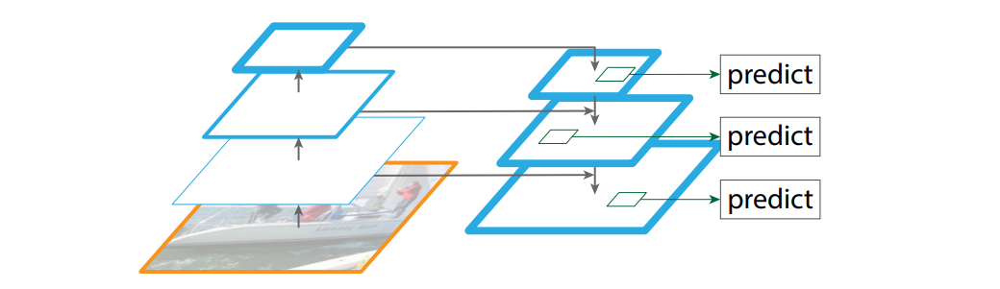

# 0 动机

## 0.1 特征分辨率和特征语义

FPN 提出了一种 Top-down 的结构，能够增强高分辨率特征图的语义信息。然而，网络顶层具有低分辨率、高语义的特征却损失了很多细粒度的原始像素信息，不利于准确的定位。因此，可以说 FPN 只解决了高分辨率的弱语义问题，但没有解决低分辨率强语义的问题：

+ 在 FPN 中，输入图像到网络顶层经过了一个 Backbone 等100多个网络层，损失了大量的原始信息。

## 0.2 如何在层级金字塔结构的特征中Pool ROI

FPN使用公式计算一个 Proposal 应该被指定到哪一个 level 的 特征图上。但是对于临界的 Proposal，可能两个 Proposal 只相差10个像素，却被指定到了两个level上了。但是这两个 Proposals 可能是非常类似的。

此外，高级特征的分辨率较低，虽然具有更大的感受野和更丰富的上下文信息，但是定位精度较差。类似的，低级特征的分辨率较大，具有更加细致和高质量的定位准确度。 FPN 仅仅简单的把一个 Proposal 指定到一个特定 level 的特征图上，不够完美。

# 1 网络结构

+ 相较于 FPN， PANet 增加了一个 Bottom-up 的路径，使得浅层特征到顶层特征一共经历不到10个网络层即可进行信息聚合，避免了原始信息的过多损失。

## 1.1 Bottom-up Path Augmentation

+ N2 直接就是 P2，without any processing。
+ $N_i$ 首先经过一个 $3 \times 3, s=2$ 的卷积进行下采样来降低空间分辨率（跟一个ReLU），之后和 $P_{i+1}$ 通过 element-wise 的加法进行融合（Lateral connection） 。最后，融合后的特征还要送到一个 $3 \times 3$ 的卷积，才得到输出 $N_{i+1}$ （可能是与FPN中的 $3\times 3$ 的作用相同，用于消除混叠效应）。
+ 在所有操作中，特征的通道数都是 256 。
+ 【待核实】FPN 中的 top-down 过程中没有使用 $3 \times 3$ 的卷积，只有在输出特征图的时候才使用 $3 \times 3 $ 的卷积消除混叠效应。而 PAN 中，在 bottom-up 的过程中就使用了 $3 \times 3$ 的卷积了。

## 1.2 Adaptive Feature Pooling

PAN 从所有 level 的特征图上都对一个 Proposal 提取特征，并融合这些特征用于后续的预测。

+ 首先，对于一个 Proposal ，把其坐标映射到所有特征图上。
+ 然后，使用 ROIAlign 分别池化每一个特征图上的特征（输出尺寸相同）。
+ 最后，使用 element-wise 的 max 或 sum 操作来融合从不同特征图上池化出来的特征（实验发现 max 更好一些）。

但是，具体实现与上述方式稍有差异，且对于后续的检测分支和分割分支的操作还不相同，下面仅介绍检测分支：

+ 首先，对于一个 Proposal ，把其坐标映射到所有特征图上。
+ 然后，使用 ROIAlign 分别池化每一个特征图上的特征（输出尺寸相同）。
+ 之后，先不融合这些池化出来的特征，而是使用一个相同的全连接层，分别对每个特征图上池化出来的特征进行特征提取。
+ 最后，融合全连接层提取出来的特征。
+ 再使用另一个全连接层进行检测（预测位置和类别）。
+ 

为了证明 adaptive feature pooling 的有效性，如上图所示。对于FPN中指定到 level1的特征，使用 max pool 融合特征之后，发现 level1 的特征仅占 30%。