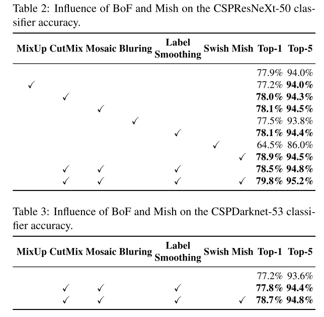

# 1 Input

+ Image
+ Patched
+ Image Pyramid

# 2 Backbone

## 2.1 GPUs

+ VGG
+ ResNet
+ ResNext
+ DenseNet
+ EfficientNet-B0/B7
+ CSPResNeXt50
+ CSPDarknet53

## 2.2 CPUs

+ SqueezeNet
+ MobileNet
+ ShuffleNet

# 3 Neck

Insert some layers between backbone and head, and these layers are usually used to collect feature maps from different stages.

Usually, a neck is composed of several bottom-up paths and several top-down paths.

## 3.1 Additional blocks

+ SPP
+ ASPP
+ RFB
+ SAM

## 3.2 Path-aggregation blocks

+ FPN
+ PAN
+ NAS-FPN
+ Fully-connected FPN
+ BiFPN
+ ASFF
+ SFAM

# 4 Head

## 4.1 Two-Stage (Sparse Prediction)

### 4.1.1 Anchor based

+ Fast R-CNN
+ Faster R-CNN
+ R-FCN
+ Libra R-CNN
+ Mask R-CNN

### 4.1.2 Anchor free

+ RepPoints

## 4.2 One-Stage (Dense Prediction)

### 4.2.1 Anchor based

+ YOLO
+ SSD
+ RetinaNet
+ RPN

### 4.2.2 Anchor free

+ CenterNet
+ CornerNet
+ FCOS

+ MatrixNet

# 5 Bag of Freebies

Methods that only change the training strategy or only increase the training cost, and without increasing the inference cost.

## 5.1 Data Augmentation

To increase the variability of the input images so that the model can be more robustness to the images obtained from different environments.

### 5.1.1 Photometric Distortions

+ Brightness
+ Contrast
+ Hue
+ Saturation
+ Noise

### 5.1.2 Geometric Distortions

+ Scale
+ Crop
+ Flip
+ Rotate

### 5.1.3 Drop Information 

+ Random Erase
+ CutOut
+ Hide-and-Seek
+ Grid mask

### 5.1.4 Mix Information

+ MixUP
+ CutMix

### 5.1.5 Style Transfer

+ Style Transfer GAN

## 5.2 Data Imbalance

+ Hard Negative Example Mining (dense prediction)
+ Online Hard Example Mining (dense prediction)
+ Focal Loss
+ Label Smooth
+ Knowledge Distillation

## 5.3 Bounding Box Regression

+ MSE

Treat points (point coordinate or offset) as independent variables, but the fact does not consider the integrity of the object itself.

+ IoU Loss
+ GIoU Loss
+ DIoU Loss
+ CIoU Loss

## 5.4 Regularization 

+ DropOut
+ DropPath
+ Spatial DropOut
+ DropBlock

# 6 Bag of Specials

Plugin modules and Post-Processing methods that only increase the inference cost by a small amount but can significantly improve the accuracy of object detection.

Generally speaking, these plugin modules are for enhancing certain attributes in a model, such as enlarging receptive field, introducing attention mechanism, or strengthening feature integration capability.

Post-Processing is a method for screening model prediction results.

## 6.1 Enlarge Receptive Field

+ SPP
+ ASPP
+ RFB

## 6.2 Attention Mechanism

+ Squeeze-and-Excitation (SE)
+ Spatial Attention Module (SAM)

## 6.3 Feature Integration

+ Skip Connection

+ FPN

+ SFAM
+ ASFF
+ BiFPN

## 6.4 Activation Function

+ ReLU
+ ReLU6
+ LReLU
+ PReLU
+ Scaled Exponential Linear Unit (SELU)
+ Swish
+ hard-Swish
+ Mish

## 6.5 Post Processing

+ NMS
+ Soft NMS
+ DIoU NMS

# 5 YOLO V4

+ CSPDarkNet53

  + By numerous experiments, CSPDarknet53 is the optimal model of [CSPResNeXt50, CSPDarknet53, EfficientNet B3] as the backbone for a detector.

    

+ SPP

  + It significantly increases the receptive field, separates out the most significant context features and causes almost no reduction of the network operation speed.

+ PANet

  + As the parameter aggregation from different backbone's feature-map levels for different detector levels.

+ YOLOv3 as the head.

+ Class Label Smoothing

+ DropBlock

  + Since DropBlock have compared their method with other regularization methods, and has won a lot. So we did not hesitate to choose DropBlock as our regularization method.

+ Mish

  + Since PReLU and SELU are more difficult to train, and ReLU6 is specifically designed for quantization network.

+ Modified SAM

  + We modify SAM from spatial-wise attention to point-wise attention
  + 

+ Modified PAN

  + Replace shortcut connection of PAN to concatenation.
  + 

+ Cross mini-Batch Normalization (CmBN)

  + A CBM modified version.
  + 

+ Data Augmentation

  + Mosaic (mixes 4 training images)
    + This allows detection of objects outside their normal context.
    + BN calculates activation statistics from 4 different images on each layer, this significantly reduces the need for a large mini-batch size.
  + Self-Adversarial Training (SAT) 
    + In the 1st stage, the neral network alters the original image instead of the network weights. In this way the neural network executes an adversarial attack on itself, altering the original image to create the deception that there is no desired object on the image.
    + In the 2nd stage, the neural network is trained to detect an object on this modified image in the normal way.
    + CutMix

+ Using genetic algorithms for selecting optimal hyper-parameters.

## 5.1 Backbone

CSPDarknet53

+ Bag of Freebies:
  + CutMix
  + Mosaic 
  + DropBlock
  + Class Label Smoothing
+ Bag of Specials:
  + Mish
  + CSP
  + Multi-input weighted residual connections (MiWRC)

## 5.2 Detector

Neck : SPP, PAN

Head : YOLOv3

+ Bag of Freebies:
  + CIoU-loss
  + CmBN
  + DropBlock
  + Mosaic
  + Self-Adversarial Training
  + Eliminate grid sensitivity
  + Using multiple anchors for a single gt
  + Cosine annealing scheduler
  + Optimal hyper-parameters
  + Random training shapes
+ Bag of Specials:
  + Mish
  + SPP-block
  + SAM-block
  + PAN path -aggregation block
  + DIoU-NMS

## 5.3 Training

+ Dataset:

  + ILSVRC2012 val for classifier test
  + COCO test-dev 2017 for detector test

+ Classification : 

  + training steps is 8,000,000
  + Batch size and mini-batch size are 128 and 32
  + Polynomial decay learning rate :
    + initial learning rate = 0.1
    + warm-up steps is 1000
  + momentum = 09
  + weight decay = 0.05

  + All of BoS experiments use the default setting that described above.

  + All of BoF experiments add an additional 50% training steps.

  

+ Detection : 

  + training steps is 500,500

  + initial learning rate = 0.01, multiply with a factor 0.1 at the 400,000 steps and the 450,000 steps

  + momentum = 0.9

  + weight decay = 5e-4

  + a single GPU

  + multi-scale training

  + batch size = 64, mini-batch size is 8 or 4 depend on the architectures and GPU memory limitation.

    

    + S : Eliminate Grid Sensitivity
    + M : Mosaic 4-image
    + IT : IoU threshold - using multiple anchors for a single gt : IoU (gt, anchor) > IoU_threshold
    + GA : Genetic algorithms
    + LS : Class Label Smoothing for sigmoid activation
    + CBN : CmBN - Collecting statistics inside the entire batch, instead of collecting statistics inside a single mini-batch
    + CA : Cosine annealing scheduler
    + DM : Dynamic mini-batch size - automatic increase of mini-batch size during small resolution training by using Random training shapes
    + OA : Optimized Anchors - using the optimized anchors for training with the 512x512 network resolution

    

# 6 网络结构图示

## 6.1 Backbone (CSPDarknet53)

其中：

+ CBM :

  

+ CSP1 :

  

+ CSP 2-5 :

  

## 6.2 Neck

其中，

+ SPP :

  

+ CBL :

+ CBL x 5 :

  
