# 1 Backbone

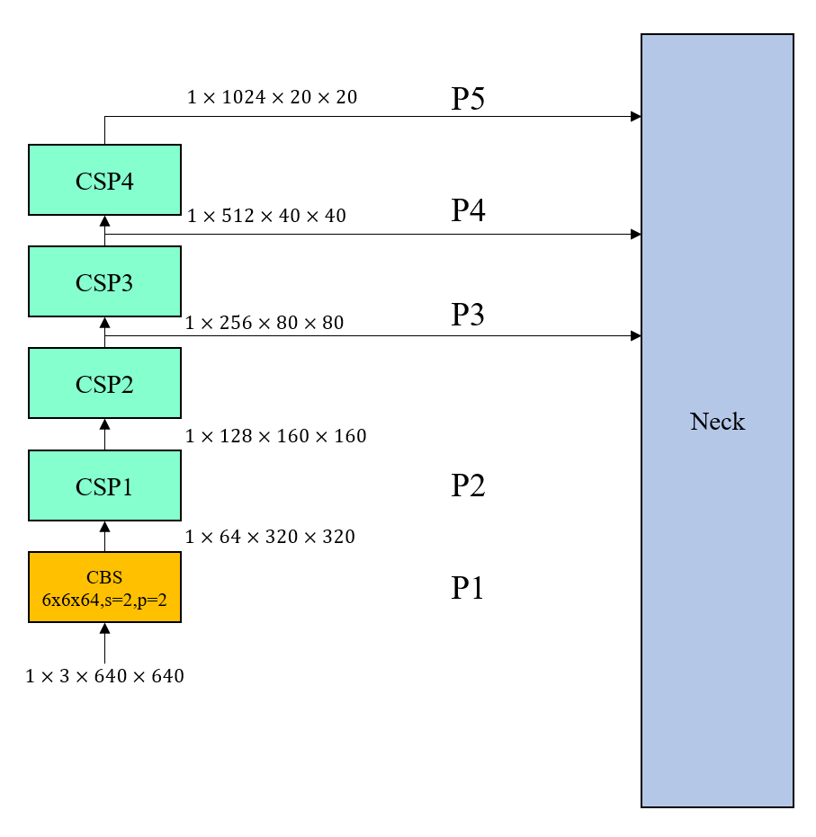

其中 ：

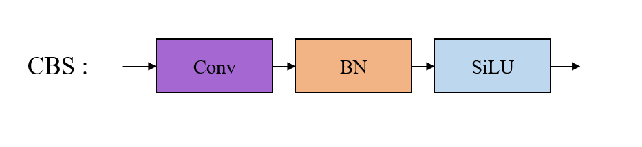

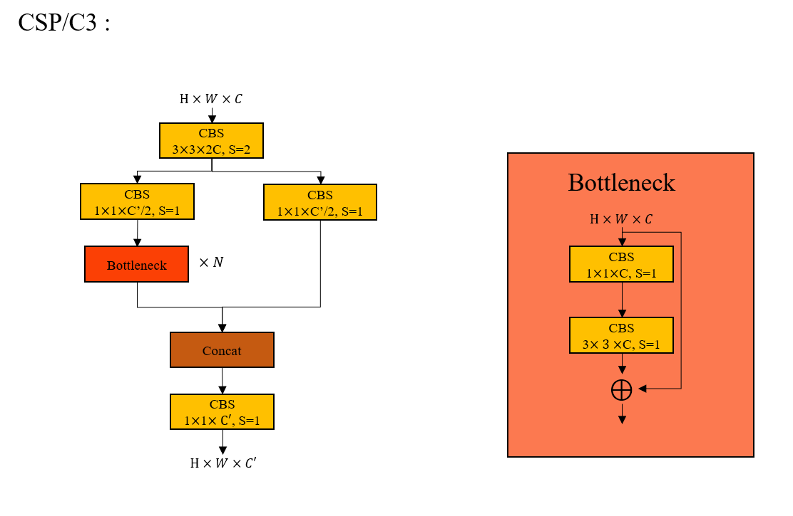


# 2 Neck & Head

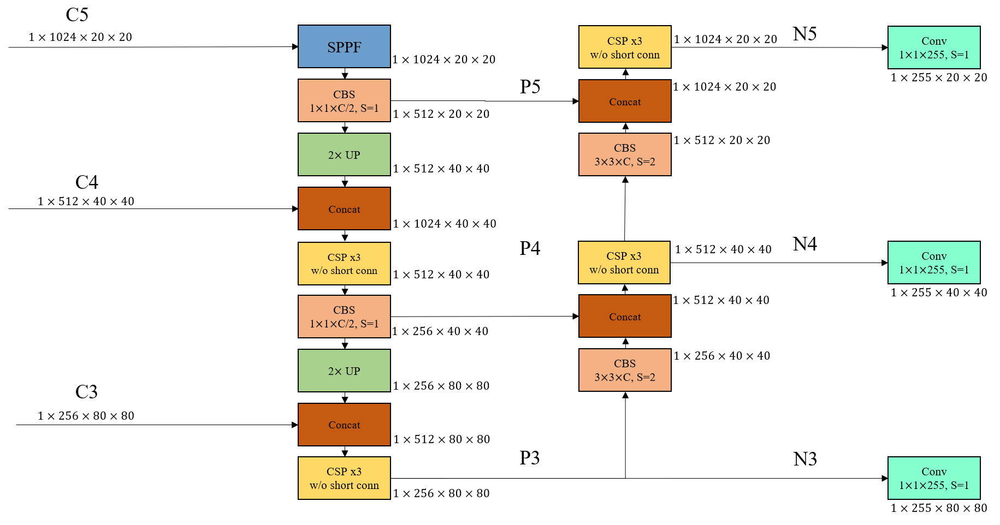

其中 ：

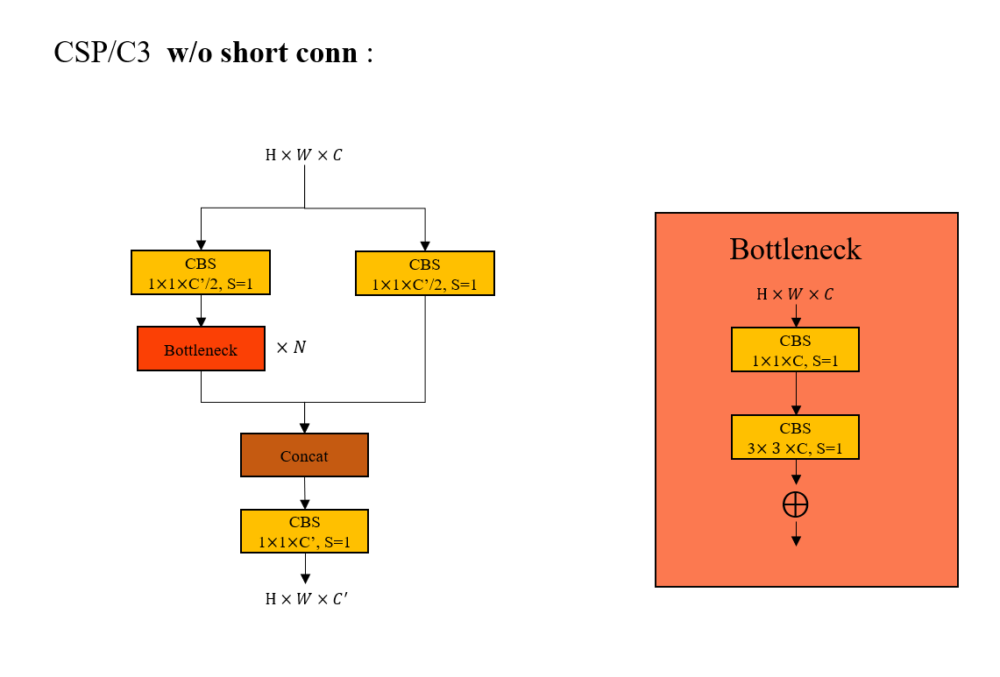


# 3 News

## 3.1 SPPF

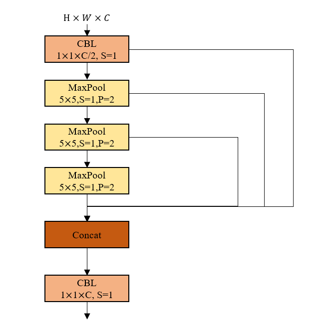

相较于 YOLOV4 的 SPP， 可以类比于 $9 \times 9$ 的卷积可以被两个 $5 \times 5$ 的卷积所替代，但是后者的计算效率更高。


# 4 U 版 YOLOV5 

## 4.1 n, s, m, l, x 的区别

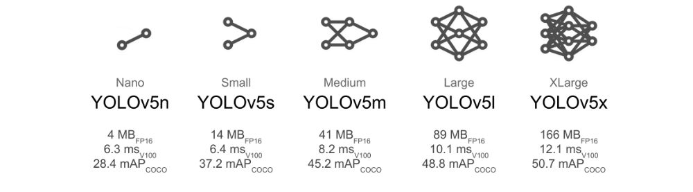

+ yolov5n : `depth_multiple=0.33, width_multiple=0.25`
+ yolov5s : `depth_multiple=0.33, width_multiple=0.50`
+ yolov5m : `depth_multiple=0.67, width_multiple=0.75`
+ yolov5l : `depth_multiple=1.0, width_multiple=1.0`
+ yolov5x : `depth_multiple=1.33, width_multiple=1.25`

其中:

`depth_multiple` 控制 num_blocks 的个数，包括 Backbone 中的 CSP x N 的 N，Head 中的 FPN 和 PAN 中 CSP 的 N，缩放方式如下：

```python
num_blocks = max(round(num_blocks * depth_multiple), 1)
```

`width_multiple` 控制 所有卷积的通道数，由于在自己实现的代码中，所有的卷积都通过初始的 `self.planes` 来调整，未指定某层实际的通道数，因此只需要调整 Backbone 中的 `self.planes` 即可，缩放方式如下：

```python
self.planes = 64 # 该值为基础值，不能修改
self.planes = math.ceil(self.planes * width_multiple / 8) * 8
```


## 4.2 模型权重转换

权重命名非常有规则：

```python
all_k_map = {'backbone.conv0.CBS.0.weight': 'model.0.conv.weight', 'backbone.conv0.CBS.1.weight': 'model.0.bn.weight', 'backbone.conv0.CBS.1.bias': 'model.0.bn.bias', 'backbone.conv0.CBS.1.running_mean': 'model.0.bn.running_mean', 'backbone.conv0.CBS.1.running_var': 'model.0.bn.running_var', 'backbone.conv0.CBS.1.num_batches_tracked': 'model.0.bn.num_batches_tracked', 'backbone.conv1.CBS.0.weight': 'model.1.conv.weight', 'backbone.conv1.CBS.1.weight': 'model.1.bn.weight', 'backbone.conv1.CBS.1.bias': 'model.1.bn.bias', 'backbone.conv1.CBS.1.running_mean': 'model.1.bn.running_mean', 'backbone.conv1.CBS.1.running_var': 'model.1.bn.running_var', 'backbone.conv1.CBS.1.num_batches_tracked': 'model.1.bn.num_batches_tracked', 'backbone.csp1.split1.CBS.0.weight': 'model.2.cv1.conv.weight', 'backbone.csp1.split1.CBS.1.weight': 'model.2.cv1.bn.weight', 'backbone.csp1.split1.CBS.1.bias': 'model.2.cv1.bn.bias', 'backbone.csp1.split1.CBS.1.running_mean': 'model.2.cv1.bn.running_mean', 'backbone.csp1.split1.CBS.1.running_var': 'model.2.cv1.bn.running_var', 'backbone.csp1.split1.CBS.1.num_batches_tracked': 'model.2.cv1.bn.num_batches_tracked', 'backbone.csp1.split2.CBS.0.weight': 'model.2.cv2.conv.weight', 'backbone.csp1.split2.CBS.1.weight': 'model.2.cv2.bn.weight', 'backbone.csp1.split2.CBS.1.bias': 'model.2.cv2.bn.bias', 'backbone.csp1.split2.CBS.1.running_mean': 'model.2.cv2.bn.running_mean', 'backbone.csp1.split2.CBS.1.running_var': 'model.2.cv2.bn.running_var', 'backbone.csp1.split2.CBS.1.num_batches_tracked': 'model.2.cv2.bn.num_batches_tracked', 'backbone.csp1.conv.CBS.0.weight': 'model.2.cv3.conv.weight', 'backbone.csp1.conv.CBS.1.weight': 'model.2.cv3.bn.weight', 'backbone.csp1.conv.CBS.1.bias': 'model.2.cv3.bn.bias', 'backbone.csp1.conv.CBS.1.running_mean': 'model.2.cv3.bn.running_mean', 'backbone.csp1.conv.CBS.1.running_var': 'model.2.cv3.bn.running_var', 'backbone.csp1.conv.CBS.1.num_batches_tracked': 'model.2.cv3.bn.num_batches_tracked', 'backbone.csp1.csp.0.conv1.CBS.0.weight': 'model.2.m.0.cv1.conv.weight', 'backbone.csp1.csp.0.conv1.CBS.1.weight': 'model.2.m.0.cv1.bn.weight', 'backbone.csp1.csp.0.conv1.CBS.1.bias': 'model.2.m.0.cv1.bn.bias', 'backbone.csp1.csp.0.conv1.CBS.1.running_mean': 'model.2.m.0.cv1.bn.running_mean', 'backbone.csp1.csp.0.conv1.CBS.1.running_var': 'model.2.m.0.cv1.bn.running_var', 'backbone.csp1.csp.0.conv1.CBS.1.num_batches_tracked': 'model.2.m.0.cv1.bn.num_batches_tracked', 'backbone.csp1.csp.0.conv2.CBS.0.weight': 'model.2.m.0.cv2.conv.weight', 'backbone.csp1.csp.0.conv2.CBS.1.weight': 'model.2.m.0.cv2.bn.weight', 'backbone.csp1.csp.0.conv2.CBS.1.bias': 'model.2.m.0.cv2.bn.bias', 'backbone.csp1.csp.0.conv2.CBS.1.running_mean': 'model.2.m.0.cv2.bn.running_mean', 'backbone.csp1.csp.0.conv2.CBS.1.running_var': 'model.2.m.0.cv2.bn.running_var', 'backbone.csp1.csp.0.conv2.CBS.1.num_batches_tracked': 'model.2.m.0.cv2.bn.num_batches_tracked', 'backbone.csp1.csp.1.conv1.CBS.0.weight': 'model.2.m.1.cv1.conv.weight', 'backbone.csp1.csp.1.conv1.CBS.1.weight': 'model.2.m.1.cv1.bn.weight', 'backbone.csp1.csp.1.conv1.CBS.1.bias': 'model.2.m.1.cv1.bn.bias', 'backbone.csp1.csp.1.conv1.CBS.1.running_mean': 'model.2.m.1.cv1.bn.running_mean', 'backbone.csp1.csp.1.conv1.CBS.1.running_var': 'model.2.m.1.cv1.bn.running_var', 'backbone.csp1.csp.1.conv1.CBS.1.num_batches_tracked': 'model.2.m.1.cv1.bn.num_batches_tracked', 'backbone.csp1.csp.1.conv2.CBS.0.weight': 'model.2.m.1.cv2.conv.weight', 'backbone.csp1.csp.1.conv2.CBS.1.weight': 'model.2.m.1.cv2.bn.weight', 'backbone.csp1.csp.1.conv2.CBS.1.bias': 'model.2.m.1.cv2.bn.bias', 'backbone.csp1.csp.1.conv2.CBS.1.running_mean': 'model.2.m.1.cv2.bn.running_mean', 'backbone.csp1.csp.1.conv2.CBS.1.running_var': 'model.2.m.1.cv2.bn.running_var', 'backbone.csp1.csp.1.conv2.CBS.1.num_batches_tracked': 'model.2.m.1.cv2.bn.num_batches_tracked', 'backbone.csp1.csp.2.conv1.CBS.0.weight': 'model.2.m.2.cv1.conv.weight', 'backbone.csp1.csp.2.conv1.CBS.1.weight': 'model.2.m.2.cv1.bn.weight', 'backbone.csp1.csp.2.conv1.CBS.1.bias': 'model.2.m.2.cv1.bn.bias', 'backbone.csp1.csp.2.conv1.CBS.1.running_mean': 'model.2.m.2.cv1.bn.running_mean', 'backbone.csp1.csp.2.conv1.CBS.1.running_var': 'model.2.m.2.cv1.bn.running_var', 'backbone.csp1.csp.2.conv1.CBS.1.num_batches_tracked': 'model.2.m.2.cv1.bn.num_batches_tracked', 'backbone.csp1.csp.2.conv2.CBS.0.weight': 'model.2.m.2.cv2.conv.weight', 'backbone.csp1.csp.2.conv2.CBS.1.weight': 'model.2.m.2.cv2.bn.weight', 'backbone.csp1.csp.2.conv2.CBS.1.bias': 'model.2.m.2.cv2.bn.bias', 'backbone.csp1.csp.2.conv2.CBS.1.running_mean': 'model.2.m.2.cv2.bn.running_mean', 'backbone.csp1.csp.2.conv2.CBS.1.running_var': 'model.2.m.2.cv2.bn.running_var', 'backbone.csp1.csp.2.conv2.CBS.1.num_batches_tracked': 'model.2.m.2.cv2.bn.num_batches_tracked', 'backbone.csp1.csp.3.conv1.CBS.0.weight': 'model.2.m.3.cv1.conv.weight', 'backbone.csp1.csp.3.conv1.CBS.1.weight': 'model.2.m.3.cv1.bn.weight', 'backbone.csp1.csp.3.conv1.CBS.1.bias': 'model.2.m.3.cv1.bn.bias', 'backbone.csp1.csp.3.conv1.CBS.1.running_mean': 'model.2.m.3.cv1.bn.running_mean', 'backbone.csp1.csp.3.conv1.CBS.1.running_var': 'model.2.m.3.cv1.bn.running_var', 'backbone.csp1.csp.3.conv1.CBS.1.num_batches_tracked': 'model.2.m.3.cv1.bn.num_batches_tracked', 'backbone.csp1.csp.3.conv2.CBS.0.weight': 'model.2.m.3.cv2.conv.weight', 'backbone.csp1.csp.3.conv2.CBS.1.weight': 'model.2.m.3.cv2.bn.weight', 'backbone.csp1.csp.3.conv2.CBS.1.bias': 'model.2.m.3.cv2.bn.bias', 'backbone.csp1.csp.3.conv2.CBS.1.running_mean': 'model.2.m.3.cv2.bn.running_mean', 'backbone.csp1.csp.3.conv2.CBS.1.running_var': 'model.2.m.3.cv2.bn.running_var', 'backbone.csp1.csp.3.conv2.CBS.1.num_batches_tracked': 'model.2.m.3.cv2.bn.num_batches_tracked', 'backbone.conv2.CBS.0.weight': 'model.3.conv.weight', 'backbone.conv2.CBS.1.weight': 'model.3.bn.weight', 'backbone.conv2.CBS.1.bias': 'model.3.bn.bias', 'backbone.conv2.CBS.1.running_mean': 'model.3.bn.running_mean', 'backbone.conv2.CBS.1.running_var': 'model.3.bn.running_var', 'backbone.conv2.CBS.1.num_batches_tracked': 'model.3.bn.num_batches_tracked', 'backbone.csp2.split1.CBS.0.weight': 'model.4.cv1.conv.weight', 'backbone.csp2.split1.CBS.1.weight': 'model.4.cv1.bn.weight', 'backbone.csp2.split1.CBS.1.bias': 'model.4.cv1.bn.bias', 'backbone.csp2.split1.CBS.1.running_mean': 'model.4.cv1.bn.running_mean', 'backbone.csp2.split1.CBS.1.running_var': 'model.4.cv1.bn.running_var', 'backbone.csp2.split1.CBS.1.num_batches_tracked': 'model.4.cv1.bn.num_batches_tracked', 'backbone.csp2.split2.CBS.0.weight': 'model.4.cv2.conv.weight', 'backbone.csp2.split2.CBS.1.weight': 'model.4.cv2.bn.weight', 'backbone.csp2.split2.CBS.1.bias': 'model.4.cv2.bn.bias', 'backbone.csp2.split2.CBS.1.running_mean': 'model.4.cv2.bn.running_mean', 'backbone.csp2.split2.CBS.1.running_var': 'model.4.cv2.bn.running_var', 'backbone.csp2.split2.CBS.1.num_batches_tracked': 'model.4.cv2.bn.num_batches_tracked', 'backbone.csp2.conv.CBS.0.weight': 'model.4.cv3.conv.weight', 'backbone.csp2.conv.CBS.1.weight': 'model.4.cv3.bn.weight', 'backbone.csp2.conv.CBS.1.bias': 'model.4.cv3.bn.bias', 'backbone.csp2.conv.CBS.1.running_mean': 'model.4.cv3.bn.running_mean', 'backbone.csp2.conv.CBS.1.running_var': 'model.4.cv3.bn.running_var', 'backbone.csp2.conv.CBS.1.num_batches_tracked': 'model.4.cv3.bn.num_batches_tracked', 'backbone.csp2.csp.0.conv1.CBS.0.weight': 'model.4.m.0.cv1.conv.weight', 'backbone.csp2.csp.0.conv1.CBS.1.weight': 'model.4.m.0.cv1.bn.weight', 'backbone.csp2.csp.0.conv1.CBS.1.bias': 'model.4.m.0.cv1.bn.bias', 'backbone.csp2.csp.0.conv1.CBS.1.running_mean': 'model.4.m.0.cv1.bn.running_mean', 'backbone.csp2.csp.0.conv1.CBS.1.running_var': 'model.4.m.0.cv1.bn.running_var', 'backbone.csp2.csp.0.conv1.CBS.1.num_batches_tracked': 'model.4.m.0.cv1.bn.num_batches_tracked', 'backbone.csp2.csp.0.conv2.CBS.0.weight': 'model.4.m.0.cv2.conv.weight', 'backbone.csp2.csp.0.conv2.CBS.1.weight': 'model.4.m.0.cv2.bn.weight', 'backbone.csp2.csp.0.conv2.CBS.1.bias': 'model.4.m.0.cv2.bn.bias', 'backbone.csp2.csp.0.conv2.CBS.1.running_mean': 'model.4.m.0.cv2.bn.running_mean', 'backbone.csp2.csp.0.conv2.CBS.1.running_var': 'model.4.m.0.cv2.bn.running_var', 'backbone.csp2.csp.0.conv2.CBS.1.num_batches_tracked': 'model.4.m.0.cv2.bn.num_batches_tracked', 'backbone.csp2.csp.1.conv1.CBS.0.weight': 'model.4.m.1.cv1.conv.weight', 'backbone.csp2.csp.1.conv1.CBS.1.weight': 'model.4.m.1.cv1.bn.weight', 'backbone.csp2.csp.1.conv1.CBS.1.bias': 'model.4.m.1.cv1.bn.bias', 'backbone.csp2.csp.1.conv1.CBS.1.running_mean': 'model.4.m.1.cv1.bn.running_mean', 'backbone.csp2.csp.1.conv1.CBS.1.running_var': 'model.4.m.1.cv1.bn.running_var', 'backbone.csp2.csp.1.conv1.CBS.1.num_batches_tracked': 'model.4.m.1.cv1.bn.num_batches_tracked', 'backbone.csp2.csp.1.conv2.CBS.0.weight': 'model.4.m.1.cv2.conv.weight', 'backbone.csp2.csp.1.conv2.CBS.1.weight': 'model.4.m.1.cv2.bn.weight', 'backbone.csp2.csp.1.conv2.CBS.1.bias': 'model.4.m.1.cv2.bn.bias', 'backbone.csp2.csp.1.conv2.CBS.1.running_mean': 'model.4.m.1.cv2.bn.running_mean', 'backbone.csp2.csp.1.conv2.CBS.1.running_var': 'model.4.m.1.cv2.bn.running_var', 'backbone.csp2.csp.1.conv2.CBS.1.num_batches_tracked': 'model.4.m.1.cv2.bn.num_batches_tracked', 'backbone.csp2.csp.2.conv1.CBS.0.weight': 'model.4.m.2.cv1.conv.weight', 'backbone.csp2.csp.2.conv1.CBS.1.weight': 'model.4.m.2.cv1.bn.weight', 'backbone.csp2.csp.2.conv1.CBS.1.bias': 'model.4.m.2.cv1.bn.bias', 'backbone.csp2.csp.2.conv1.CBS.1.running_mean': 'model.4.m.2.cv1.bn.running_mean', 'backbone.csp2.csp.2.conv1.CBS.1.running_var': 'model.4.m.2.cv1.bn.running_var', 'backbone.csp2.csp.2.conv1.CBS.1.num_batches_tracked': 'model.4.m.2.cv1.bn.num_batches_tracked', 'backbone.csp2.csp.2.conv2.CBS.0.weight': 'model.4.m.2.cv2.conv.weight', 'backbone.csp2.csp.2.conv2.CBS.1.weight': 'model.4.m.2.cv2.bn.weight', 'backbone.csp2.csp.2.conv2.CBS.1.bias': 'model.4.m.2.cv2.bn.bias', 'backbone.csp2.csp.2.conv2.CBS.1.running_mean': 'model.4.m.2.cv2.bn.running_mean', 'backbone.csp2.csp.2.conv2.CBS.1.running_var': 'model.4.m.2.cv2.bn.running_var', 'backbone.csp2.csp.2.conv2.CBS.1.num_batches_tracked': 'model.4.m.2.cv2.bn.num_batches_tracked', 'backbone.csp2.csp.3.conv1.CBS.0.weight': 'model.4.m.3.cv1.conv.weight', 'backbone.csp2.csp.3.conv1.CBS.1.weight': 'model.4.m.3.cv1.bn.weight', 'backbone.csp2.csp.3.conv1.CBS.1.bias': 'model.4.m.3.cv1.bn.bias', 'backbone.csp2.csp.3.conv1.CBS.1.running_mean': 'model.4.m.3.cv1.bn.running_mean', 'backbone.csp2.csp.3.conv1.CBS.1.running_var': 'model.4.m.3.cv1.bn.running_var', 'backbone.csp2.csp.3.conv1.CBS.1.num_batches_tracked': 'model.4.m.3.cv1.bn.num_batches_tracked', 'backbone.csp2.csp.3.conv2.CBS.0.weight': 'model.4.m.3.cv2.conv.weight', 'backbone.csp2.csp.3.conv2.CBS.1.weight': 'model.4.m.3.cv2.bn.weight', 'backbone.csp2.csp.3.conv2.CBS.1.bias': 'model.4.m.3.cv2.bn.bias', 'backbone.csp2.csp.3.conv2.CBS.1.running_mean': 'model.4.m.3.cv2.bn.running_mean', 'backbone.csp2.csp.3.conv2.CBS.1.running_var': 'model.4.m.3.cv2.bn.running_var', 'backbone.csp2.csp.3.conv2.CBS.1.num_batches_tracked': 'model.4.m.3.cv2.bn.num_batches_tracked', 'backbone.csp2.csp.4.conv1.CBS.0.weight': 'model.4.m.4.cv1.conv.weight', 'backbone.csp2.csp.4.conv1.CBS.1.weight': 'model.4.m.4.cv1.bn.weight', 'backbone.csp2.csp.4.conv1.CBS.1.bias': 'model.4.m.4.cv1.bn.bias', 'backbone.csp2.csp.4.conv1.CBS.1.running_mean': 'model.4.m.4.cv1.bn.running_mean', 'backbone.csp2.csp.4.conv1.CBS.1.running_var': 'model.4.m.4.cv1.bn.running_var', 'backbone.csp2.csp.4.conv1.CBS.1.num_batches_tracked': 'model.4.m.4.cv1.bn.num_batches_tracked', 'backbone.csp2.csp.4.conv2.CBS.0.weight': 'model.4.m.4.cv2.conv.weight', 'backbone.csp2.csp.4.conv2.CBS.1.weight': 'model.4.m.4.cv2.bn.weight', 'backbone.csp2.csp.4.conv2.CBS.1.bias': 'model.4.m.4.cv2.bn.bias', 'backbone.csp2.csp.4.conv2.CBS.1.running_mean': 'model.4.m.4.cv2.bn.running_mean', 'backbone.csp2.csp.4.conv2.CBS.1.running_var': 'model.4.m.4.cv2.bn.running_var', 'backbone.csp2.csp.4.conv2.CBS.1.num_batches_tracked': 'model.4.m.4.cv2.bn.num_batches_tracked', 'backbone.csp2.csp.5.conv1.CBS.0.weight': 'model.4.m.5.cv1.conv.weight', 'backbone.csp2.csp.5.conv1.CBS.1.weight': 'model.4.m.5.cv1.bn.weight', 'backbone.csp2.csp.5.conv1.CBS.1.bias': 'model.4.m.5.cv1.bn.bias', 'backbone.csp2.csp.5.conv1.CBS.1.running_mean': 'model.4.m.5.cv1.bn.running_mean', 'backbone.csp2.csp.5.conv1.CBS.1.running_var': 'model.4.m.5.cv1.bn.running_var', 'backbone.csp2.csp.5.conv1.CBS.1.num_batches_tracked': 'model.4.m.5.cv1.bn.num_batches_tracked', 'backbone.csp2.csp.5.conv2.CBS.0.weight': 'model.4.m.5.cv2.conv.weight', 'backbone.csp2.csp.5.conv2.CBS.1.weight': 'model.4.m.5.cv2.bn.weight', 'backbone.csp2.csp.5.conv2.CBS.1.bias': 'model.4.m.5.cv2.bn.bias', 'backbone.csp2.csp.5.conv2.CBS.1.running_mean': 'model.4.m.5.cv2.bn.running_mean', 'backbone.csp2.csp.5.conv2.CBS.1.running_var': 'model.4.m.5.cv2.bn.running_var', 'backbone.csp2.csp.5.conv2.CBS.1.num_batches_tracked': 'model.4.m.5.cv2.bn.num_batches_tracked', 'backbone.csp2.csp.6.conv1.CBS.0.weight': 'model.4.m.6.cv1.conv.weight', 'backbone.csp2.csp.6.conv1.CBS.1.weight': 'model.4.m.6.cv1.bn.weight', 'backbone.csp2.csp.6.conv1.CBS.1.bias': 'model.4.m.6.cv1.bn.bias', 'backbone.csp2.csp.6.conv1.CBS.1.running_mean': 'model.4.m.6.cv1.bn.running_mean', 'backbone.csp2.csp.6.conv1.CBS.1.running_var': 'model.4.m.6.cv1.bn.running_var', 'backbone.csp2.csp.6.conv1.CBS.1.num_batches_tracked': 'model.4.m.6.cv1.bn.num_batches_tracked', 'backbone.csp2.csp.6.conv2.CBS.0.weight': 'model.4.m.6.cv2.conv.weight', 'backbone.csp2.csp.6.conv2.CBS.1.weight': 'model.4.m.6.cv2.bn.weight', 'backbone.csp2.csp.6.conv2.CBS.1.bias': 'model.4.m.6.cv2.bn.bias', 'backbone.csp2.csp.6.conv2.CBS.1.running_mean': 'model.4.m.6.cv2.bn.running_mean', 'backbone.csp2.csp.6.conv2.CBS.1.running_var': 'model.4.m.6.cv2.bn.running_var', 'backbone.csp2.csp.6.conv2.CBS.1.num_batches_tracked': 'model.4.m.6.cv2.bn.num_batches_tracked', 'backbone.csp2.csp.7.conv1.CBS.0.weight': 'model.4.m.7.cv1.conv.weight', 'backbone.csp2.csp.7.conv1.CBS.1.weight': 'model.4.m.7.cv1.bn.weight', 'backbone.csp2.csp.7.conv1.CBS.1.bias': 'model.4.m.7.cv1.bn.bias', 'backbone.csp2.csp.7.conv1.CBS.1.running_mean': 'model.4.m.7.cv1.bn.running_mean', 'backbone.csp2.csp.7.conv1.CBS.1.running_var': 'model.4.m.7.cv1.bn.running_var', 'backbone.csp2.csp.7.conv1.CBS.1.num_batches_tracked': 'model.4.m.7.cv1.bn.num_batches_tracked', 'backbone.csp2.csp.7.conv2.CBS.0.weight': 'model.4.m.7.cv2.conv.weight', 'backbone.csp2.csp.7.conv2.CBS.1.weight': 'model.4.m.7.cv2.bn.weight', 'backbone.csp2.csp.7.conv2.CBS.1.bias': 'model.4.m.7.cv2.bn.bias', 'backbone.csp2.csp.7.conv2.CBS.1.running_mean': 'model.4.m.7.cv2.bn.running_mean', 'backbone.csp2.csp.7.conv2.CBS.1.running_var': 'model.4.m.7.cv2.bn.running_var', 'backbone.csp2.csp.7.conv2.CBS.1.num_batches_tracked': 'model.4.m.7.cv2.bn.num_batches_tracked', 'backbone.conv3.CBS.0.weight': 'model.5.conv.weight', 'backbone.conv3.CBS.1.weight': 'model.5.bn.weight', 'backbone.conv3.CBS.1.bias': 'model.5.bn.bias', 'backbone.conv3.CBS.1.running_mean': 'model.5.bn.running_mean', 'backbone.conv3.CBS.1.running_var': 'model.5.bn.running_var', 'backbone.conv3.CBS.1.num_batches_tracked': 'model.5.bn.num_batches_tracked', 'backbone.csp3.split1.CBS.0.weight': 'model.6.cv1.conv.weight', 'backbone.csp3.split1.CBS.1.weight': 'model.6.cv1.bn.weight', 'backbone.csp3.split1.CBS.1.bias': 'model.6.cv1.bn.bias', 'backbone.csp3.split1.CBS.1.running_mean': 'model.6.cv1.bn.running_mean', 'backbone.csp3.split1.CBS.1.running_var': 'model.6.cv1.bn.running_var', 'backbone.csp3.split1.CBS.1.num_batches_tracked': 'model.6.cv1.bn.num_batches_tracked', 'backbone.csp3.split2.CBS.0.weight': 'model.6.cv2.conv.weight', 'backbone.csp3.split2.CBS.1.weight': 'model.6.cv2.bn.weight', 'backbone.csp3.split2.CBS.1.bias': 'model.6.cv2.bn.bias', 'backbone.csp3.split2.CBS.1.running_mean': 'model.6.cv2.bn.running_mean', 'backbone.csp3.split2.CBS.1.running_var': 'model.6.cv2.bn.running_var', 'backbone.csp3.split2.CBS.1.num_batches_tracked': 'model.6.cv2.bn.num_batches_tracked', 'backbone.csp3.conv.CBS.0.weight': 'model.6.cv3.conv.weight', 'backbone.csp3.conv.CBS.1.weight': 'model.6.cv3.bn.weight', 'backbone.csp3.conv.CBS.1.bias': 'model.6.cv3.bn.bias', 'backbone.csp3.conv.CBS.1.running_mean': 'model.6.cv3.bn.running_mean', 'backbone.csp3.conv.CBS.1.running_var': 'model.6.cv3.bn.running_var', 'backbone.csp3.conv.CBS.1.num_batches_tracked': 'model.6.cv3.bn.num_batches_tracked', 'backbone.csp3.csp.0.conv1.CBS.0.weight': 'model.6.m.0.cv1.conv.weight', 'backbone.csp3.csp.0.conv1.CBS.1.weight': 'model.6.m.0.cv1.bn.weight', 'backbone.csp3.csp.0.conv1.CBS.1.bias': 'model.6.m.0.cv1.bn.bias', 'backbone.csp3.csp.0.conv1.CBS.1.running_mean': 'model.6.m.0.cv1.bn.running_mean', 'backbone.csp3.csp.0.conv1.CBS.1.running_var': 'model.6.m.0.cv1.bn.running_var', 'backbone.csp3.csp.0.conv1.CBS.1.num_batches_tracked': 'model.6.m.0.cv1.bn.num_batches_tracked', 'backbone.csp3.csp.0.conv2.CBS.0.weight': 'model.6.m.0.cv2.conv.weight', 'backbone.csp3.csp.0.conv2.CBS.1.weight': 'model.6.m.0.cv2.bn.weight', 'backbone.csp3.csp.0.conv2.CBS.1.bias': 'model.6.m.0.cv2.bn.bias', 'backbone.csp3.csp.0.conv2.CBS.1.running_mean': 'model.6.m.0.cv2.bn.running_mean', 'backbone.csp3.csp.0.conv2.CBS.1.running_var': 'model.6.m.0.cv2.bn.running_var', 'backbone.csp3.csp.0.conv2.CBS.1.num_batches_tracked': 'model.6.m.0.cv2.bn.num_batches_tracked', 'backbone.csp3.csp.1.conv1.CBS.0.weight': 'model.6.m.1.cv1.conv.weight', 'backbone.csp3.csp.1.conv1.CBS.1.weight': 'model.6.m.1.cv1.bn.weight', 'backbone.csp3.csp.1.conv1.CBS.1.bias': 'model.6.m.1.cv1.bn.bias', 'backbone.csp3.csp.1.conv1.CBS.1.running_mean': 'model.6.m.1.cv1.bn.running_mean', 'backbone.csp3.csp.1.conv1.CBS.1.running_var': 'model.6.m.1.cv1.bn.running_var', 'backbone.csp3.csp.1.conv1.CBS.1.num_batches_tracked': 'model.6.m.1.cv1.bn.num_batches_tracked', 'backbone.csp3.csp.1.conv2.CBS.0.weight': 'model.6.m.1.cv2.conv.weight', 'backbone.csp3.csp.1.conv2.CBS.1.weight': 'model.6.m.1.cv2.bn.weight', 'backbone.csp3.csp.1.conv2.CBS.1.bias': 'model.6.m.1.cv2.bn.bias', 'backbone.csp3.csp.1.conv2.CBS.1.running_mean': 'model.6.m.1.cv2.bn.running_mean', 'backbone.csp3.csp.1.conv2.CBS.1.running_var': 'model.6.m.1.cv2.bn.running_var', 'backbone.csp3.csp.1.conv2.CBS.1.num_batches_tracked': 'model.6.m.1.cv2.bn.num_batches_tracked', 'backbone.csp3.csp.2.conv1.CBS.0.weight': 'model.6.m.2.cv1.conv.weight', 'backbone.csp3.csp.2.conv1.CBS.1.weight': 'model.6.m.2.cv1.bn.weight', 'backbone.csp3.csp.2.conv1.CBS.1.bias': 'model.6.m.2.cv1.bn.bias', 'backbone.csp3.csp.2.conv1.CBS.1.running_mean': 'model.6.m.2.cv1.bn.running_mean', 'backbone.csp3.csp.2.conv1.CBS.1.running_var': 'model.6.m.2.cv1.bn.running_var', 'backbone.csp3.csp.2.conv1.CBS.1.num_batches_tracked': 'model.6.m.2.cv1.bn.num_batches_tracked', 'backbone.csp3.csp.2.conv2.CBS.0.weight': 'model.6.m.2.cv2.conv.weight', 'backbone.csp3.csp.2.conv2.CBS.1.weight': 'model.6.m.2.cv2.bn.weight', 'backbone.csp3.csp.2.conv2.CBS.1.bias': 'model.6.m.2.cv2.bn.bias', 'backbone.csp3.csp.2.conv2.CBS.1.running_mean': 'model.6.m.2.cv2.bn.running_mean', 'backbone.csp3.csp.2.conv2.CBS.1.running_var': 'model.6.m.2.cv2.bn.running_var', 'backbone.csp3.csp.2.conv2.CBS.1.num_batches_tracked': 'model.6.m.2.cv2.bn.num_batches_tracked', 'backbone.csp3.csp.3.conv1.CBS.0.weight': 'model.6.m.3.cv1.conv.weight', 'backbone.csp3.csp.3.conv1.CBS.1.weight': 'model.6.m.3.cv1.bn.weight', 'backbone.csp3.csp.3.conv1.CBS.1.bias': 'model.6.m.3.cv1.bn.bias', 'backbone.csp3.csp.3.conv1.CBS.1.running_mean': 'model.6.m.3.cv1.bn.running_mean', 'backbone.csp3.csp.3.conv1.CBS.1.running_var': 'model.6.m.3.cv1.bn.running_var', 'backbone.csp3.csp.3.conv1.CBS.1.num_batches_tracked': 'model.6.m.3.cv1.bn.num_batches_tracked', 'backbone.csp3.csp.3.conv2.CBS.0.weight': 'model.6.m.3.cv2.conv.weight', 'backbone.csp3.csp.3.conv2.CBS.1.weight': 'model.6.m.3.cv2.bn.weight', 'backbone.csp3.csp.3.conv2.CBS.1.bias': 'model.6.m.3.cv2.bn.bias', 'backbone.csp3.csp.3.conv2.CBS.1.running_mean': 'model.6.m.3.cv2.bn.running_mean', 'backbone.csp3.csp.3.conv2.CBS.1.running_var': 'model.6.m.3.cv2.bn.running_var', 'backbone.csp3.csp.3.conv2.CBS.1.num_batches_tracked': 'model.6.m.3.cv2.bn.num_batches_tracked', 'backbone.csp3.csp.4.conv1.CBS.0.weight': 'model.6.m.4.cv1.conv.weight', 'backbone.csp3.csp.4.conv1.CBS.1.weight': 'model.6.m.4.cv1.bn.weight', 'backbone.csp3.csp.4.conv1.CBS.1.bias': 'model.6.m.4.cv1.bn.bias', 'backbone.csp3.csp.4.conv1.CBS.1.running_mean': 'model.6.m.4.cv1.bn.running_mean', 'backbone.csp3.csp.4.conv1.CBS.1.running_var': 'model.6.m.4.cv1.bn.running_var', 'backbone.csp3.csp.4.conv1.CBS.1.num_batches_tracked': 'model.6.m.4.cv1.bn.num_batches_tracked', 'backbone.csp3.csp.4.conv2.CBS.0.weight': 'model.6.m.4.cv2.conv.weight', 'backbone.csp3.csp.4.conv2.CBS.1.weight': 'model.6.m.4.cv2.bn.weight', 'backbone.csp3.csp.4.conv2.CBS.1.bias': 'model.6.m.4.cv2.bn.bias', 'backbone.csp3.csp.4.conv2.CBS.1.running_mean': 'model.6.m.4.cv2.bn.running_mean', 'backbone.csp3.csp.4.conv2.CBS.1.running_var': 'model.6.m.4.cv2.bn.running_var', 'backbone.csp3.csp.4.conv2.CBS.1.num_batches_tracked': 'model.6.m.4.cv2.bn.num_batches_tracked', 'backbone.csp3.csp.5.conv1.CBS.0.weight': 'model.6.m.5.cv1.conv.weight', 'backbone.csp3.csp.5.conv1.CBS.1.weight': 'model.6.m.5.cv1.bn.weight', 'backbone.csp3.csp.5.conv1.CBS.1.bias': 'model.6.m.5.cv1.bn.bias', 'backbone.csp3.csp.5.conv1.CBS.1.running_mean': 'model.6.m.5.cv1.bn.running_mean', 'backbone.csp3.csp.5.conv1.CBS.1.running_var': 'model.6.m.5.cv1.bn.running_var', 'backbone.csp3.csp.5.conv1.CBS.1.num_batches_tracked': 'model.6.m.5.cv1.bn.num_batches_tracked', 'backbone.csp3.csp.5.conv2.CBS.0.weight': 'model.6.m.5.cv2.conv.weight', 'backbone.csp3.csp.5.conv2.CBS.1.weight': 'model.6.m.5.cv2.bn.weight', 'backbone.csp3.csp.5.conv2.CBS.1.bias': 'model.6.m.5.cv2.bn.bias', 'backbone.csp3.csp.5.conv2.CBS.1.running_mean': 'model.6.m.5.cv2.bn.running_mean', 'backbone.csp3.csp.5.conv2.CBS.1.running_var': 'model.6.m.5.cv2.bn.running_var', 'backbone.csp3.csp.5.conv2.CBS.1.num_batches_tracked': 'model.6.m.5.cv2.bn.num_batches_tracked', 'backbone.csp3.csp.6.conv1.CBS.0.weight': 'model.6.m.6.cv1.conv.weight', 'backbone.csp3.csp.6.conv1.CBS.1.weight': 'model.6.m.6.cv1.bn.weight', 'backbone.csp3.csp.6.conv1.CBS.1.bias': 'model.6.m.6.cv1.bn.bias', 'backbone.csp3.csp.6.conv1.CBS.1.running_mean': 'model.6.m.6.cv1.bn.running_mean', 'backbone.csp3.csp.6.conv1.CBS.1.running_var': 'model.6.m.6.cv1.bn.running_var', 'backbone.csp3.csp.6.conv1.CBS.1.num_batches_tracked': 'model.6.m.6.cv1.bn.num_batches_tracked', 'backbone.csp3.csp.6.conv2.CBS.0.weight': 'model.6.m.6.cv2.conv.weight', 'backbone.csp3.csp.6.conv2.CBS.1.weight': 'model.6.m.6.cv2.bn.weight', 'backbone.csp3.csp.6.conv2.CBS.1.bias': 'model.6.m.6.cv2.bn.bias', 'backbone.csp3.csp.6.conv2.CBS.1.running_mean': 'model.6.m.6.cv2.bn.running_mean', 'backbone.csp3.csp.6.conv2.CBS.1.running_var': 'model.6.m.6.cv2.bn.running_var', 'backbone.csp3.csp.6.conv2.CBS.1.num_batches_tracked': 'model.6.m.6.cv2.bn.num_batches_tracked', 'backbone.csp3.csp.7.conv1.CBS.0.weight': 'model.6.m.7.cv1.conv.weight', 'backbone.csp3.csp.7.conv1.CBS.1.weight': 'model.6.m.7.cv1.bn.weight', 'backbone.csp3.csp.7.conv1.CBS.1.bias': 'model.6.m.7.cv1.bn.bias', 'backbone.csp3.csp.7.conv1.CBS.1.running_mean': 'model.6.m.7.cv1.bn.running_mean', 'backbone.csp3.csp.7.conv1.CBS.1.running_var': 'model.6.m.7.cv1.bn.running_var', 'backbone.csp3.csp.7.conv1.CBS.1.num_batches_tracked': 'model.6.m.7.cv1.bn.num_batches_tracked', 'backbone.csp3.csp.7.conv2.CBS.0.weight': 'model.6.m.7.cv2.conv.weight', 'backbone.csp3.csp.7.conv2.CBS.1.weight': 'model.6.m.7.cv2.bn.weight', 'backbone.csp3.csp.7.conv2.CBS.1.bias': 'model.6.m.7.cv2.bn.bias', 'backbone.csp3.csp.7.conv2.CBS.1.running_mean': 'model.6.m.7.cv2.bn.running_mean', 'backbone.csp3.csp.7.conv2.CBS.1.running_var': 'model.6.m.7.cv2.bn.running_var', 'backbone.csp3.csp.7.conv2.CBS.1.num_batches_tracked': 'model.6.m.7.cv2.bn.num_batches_tracked', 'backbone.csp3.csp.8.conv1.CBS.0.weight': 'model.6.m.8.cv1.conv.weight', 'backbone.csp3.csp.8.conv1.CBS.1.weight': 'model.6.m.8.cv1.bn.weight', 'backbone.csp3.csp.8.conv1.CBS.1.bias': 'model.6.m.8.cv1.bn.bias', 'backbone.csp3.csp.8.conv1.CBS.1.running_mean': 'model.6.m.8.cv1.bn.running_mean', 'backbone.csp3.csp.8.conv1.CBS.1.running_var': 'model.6.m.8.cv1.bn.running_var', 'backbone.csp3.csp.8.conv1.CBS.1.num_batches_tracked': 'model.6.m.8.cv1.bn.num_batches_tracked', 'backbone.csp3.csp.8.conv2.CBS.0.weight': 'model.6.m.8.cv2.conv.weight', 'backbone.csp3.csp.8.conv2.CBS.1.weight': 'model.6.m.8.cv2.bn.weight', 'backbone.csp3.csp.8.conv2.CBS.1.bias': 'model.6.m.8.cv2.bn.bias', 'backbone.csp3.csp.8.conv2.CBS.1.running_mean': 'model.6.m.8.cv2.bn.running_mean', 'backbone.csp3.csp.8.conv2.CBS.1.running_var': 'model.6.m.8.cv2.bn.running_var', 'backbone.csp3.csp.8.conv2.CBS.1.num_batches_tracked': 'model.6.m.8.cv2.bn.num_batches_tracked', 'backbone.csp3.csp.9.conv1.CBS.0.weight': 'model.6.m.9.cv1.conv.weight', 'backbone.csp3.csp.9.conv1.CBS.1.weight': 'model.6.m.9.cv1.bn.weight', 'backbone.csp3.csp.9.conv1.CBS.1.bias': 'model.6.m.9.cv1.bn.bias', 'backbone.csp3.csp.9.conv1.CBS.1.running_mean': 'model.6.m.9.cv1.bn.running_mean', 'backbone.csp3.csp.9.conv1.CBS.1.running_var': 'model.6.m.9.cv1.bn.running_var', 'backbone.csp3.csp.9.conv1.CBS.1.num_batches_tracked': 'model.6.m.9.cv1.bn.num_batches_tracked', 'backbone.csp3.csp.9.conv2.CBS.0.weight': 'model.6.m.9.cv2.conv.weight', 'backbone.csp3.csp.9.conv2.CBS.1.weight': 'model.6.m.9.cv2.bn.weight', 'backbone.csp3.csp.9.conv2.CBS.1.bias': 'model.6.m.9.cv2.bn.bias', 'backbone.csp3.csp.9.conv2.CBS.1.running_mean': 'model.6.m.9.cv2.bn.running_mean', 'backbone.csp3.csp.9.conv2.CBS.1.running_var': 'model.6.m.9.cv2.bn.running_var', 'backbone.csp3.csp.9.conv2.CBS.1.num_batches_tracked': 'model.6.m.9.cv2.bn.num_batches_tracked', 'backbone.csp3.csp.10.conv1.CBS.0.weight': 'model.6.m.10.cv1.conv.weight', 'backbone.csp3.csp.10.conv1.CBS.1.weight': 'model.6.m.10.cv1.bn.weight', 'backbone.csp3.csp.10.conv1.CBS.1.bias': 'model.6.m.10.cv1.bn.bias', 'backbone.csp3.csp.10.conv1.CBS.1.running_mean': 'model.6.m.10.cv1.bn.running_mean', 'backbone.csp3.csp.10.conv1.CBS.1.running_var': 'model.6.m.10.cv1.bn.running_var', 'backbone.csp3.csp.10.conv1.CBS.1.num_batches_tracked': 'model.6.m.10.cv1.bn.num_batches_tracked', 'backbone.csp3.csp.10.conv2.CBS.0.weight': 'model.6.m.10.cv2.conv.weight', 'backbone.csp3.csp.10.conv2.CBS.1.weight': 'model.6.m.10.cv2.bn.weight', 'backbone.csp3.csp.10.conv2.CBS.1.bias': 'model.6.m.10.cv2.bn.bias', 'backbone.csp3.csp.10.conv2.CBS.1.running_mean': 'model.6.m.10.cv2.bn.running_mean', 'backbone.csp3.csp.10.conv2.CBS.1.running_var': 'model.6.m.10.cv2.bn.running_var', 'backbone.csp3.csp.10.conv2.CBS.1.num_batches_tracked': 'model.6.m.10.cv2.bn.num_batches_tracked', 'backbone.csp3.csp.11.conv1.CBS.0.weight': 'model.6.m.11.cv1.conv.weight', 'backbone.csp3.csp.11.conv1.CBS.1.weight': 'model.6.m.11.cv1.bn.weight', 'backbone.csp3.csp.11.conv1.CBS.1.bias': 'model.6.m.11.cv1.bn.bias', 'backbone.csp3.csp.11.conv1.CBS.1.running_mean': 'model.6.m.11.cv1.bn.running_mean', 'backbone.csp3.csp.11.conv1.CBS.1.running_var': 'model.6.m.11.cv1.bn.running_var', 'backbone.csp3.csp.11.conv1.CBS.1.num_batches_tracked': 'model.6.m.11.cv1.bn.num_batches_tracked', 'backbone.csp3.csp.11.conv2.CBS.0.weight': 'model.6.m.11.cv2.conv.weight', 'backbone.csp3.csp.11.conv2.CBS.1.weight': 'model.6.m.11.cv2.bn.weight', 'backbone.csp3.csp.11.conv2.CBS.1.bias': 'model.6.m.11.cv2.bn.bias', 'backbone.csp3.csp.11.conv2.CBS.1.running_mean': 'model.6.m.11.cv2.bn.running_mean', 'backbone.csp3.csp.11.conv2.CBS.1.running_var': 'model.6.m.11.cv2.bn.running_var', 'backbone.csp3.csp.11.conv2.CBS.1.num_batches_tracked': 'model.6.m.11.cv2.bn.num_batches_tracked', 'backbone.conv4.CBS.0.weight': 'model.7.conv.weight', 'backbone.conv4.CBS.1.weight': 'model.7.bn.weight', 'backbone.conv4.CBS.1.bias': 'model.7.bn.bias', 'backbone.conv4.CBS.1.running_mean': 'model.7.bn.running_mean', 'backbone.conv4.CBS.1.running_var': 'model.7.bn.running_var', 'backbone.conv4.CBS.1.num_batches_tracked': 'model.7.bn.num_batches_tracked', 'backbone.csp4.split1.CBS.0.weight': 'model.8.cv1.conv.weight', 'backbone.csp4.split1.CBS.1.weight': 'model.8.cv1.bn.weight', 'backbone.csp4.split1.CBS.1.bias': 'model.8.cv1.bn.bias', 'backbone.csp4.split1.CBS.1.running_mean': 'model.8.cv1.bn.running_mean', 'backbone.csp4.split1.CBS.1.running_var': 'model.8.cv1.bn.running_var', 'backbone.csp4.split1.CBS.1.num_batches_tracked': 'model.8.cv1.bn.num_batches_tracked', 'backbone.csp4.split2.CBS.0.weight': 'model.8.cv2.conv.weight', 'backbone.csp4.split2.CBS.1.weight': 'model.8.cv2.bn.weight', 'backbone.csp4.split2.CBS.1.bias': 'model.8.cv2.bn.bias', 'backbone.csp4.split2.CBS.1.running_mean': 'model.8.cv2.bn.running_mean', 'backbone.csp4.split2.CBS.1.running_var': 'model.8.cv2.bn.running_var', 'backbone.csp4.split2.CBS.1.num_batches_tracked': 'model.8.cv2.bn.num_batches_tracked', 'backbone.csp4.conv.CBS.0.weight': 'model.8.cv3.conv.weight', 'backbone.csp4.conv.CBS.1.weight': 'model.8.cv3.bn.weight', 'backbone.csp4.conv.CBS.1.bias': 'model.8.cv3.bn.bias', 'backbone.csp4.conv.CBS.1.running_mean': 'model.8.cv3.bn.running_mean', 'backbone.csp4.conv.CBS.1.running_var': 'model.8.cv3.bn.running_var', 'backbone.csp4.conv.CBS.1.num_batches_tracked': 'model.8.cv3.bn.num_batches_tracked', 'backbone.csp4.csp.0.conv1.CBS.0.weight': 'model.8.m.0.cv1.conv.weight', 'backbone.csp4.csp.0.conv1.CBS.1.weight': 'model.8.m.0.cv1.bn.weight', 'backbone.csp4.csp.0.conv1.CBS.1.bias': 'model.8.m.0.cv1.bn.bias', 'backbone.csp4.csp.0.conv1.CBS.1.running_mean': 'model.8.m.0.cv1.bn.running_mean', 'backbone.csp4.csp.0.conv1.CBS.1.running_var': 'model.8.m.0.cv1.bn.running_var', 'backbone.csp4.csp.0.conv1.CBS.1.num_batches_tracked': 'model.8.m.0.cv1.bn.num_batches_tracked', 'backbone.csp4.csp.0.conv2.CBS.0.weight': 'model.8.m.0.cv2.conv.weight', 'backbone.csp4.csp.0.conv2.CBS.1.weight': 'model.8.m.0.cv2.bn.weight', 'backbone.csp4.csp.0.conv2.CBS.1.bias': 'model.8.m.0.cv2.bn.bias', 'backbone.csp4.csp.0.conv2.CBS.1.running_mean': 'model.8.m.0.cv2.bn.running_mean', 'backbone.csp4.csp.0.conv2.CBS.1.running_var': 'model.8.m.0.cv2.bn.running_var', 'backbone.csp4.csp.0.conv2.CBS.1.num_batches_tracked': 'model.8.m.0.cv2.bn.num_batches_tracked', 'backbone.csp4.csp.1.conv1.CBS.0.weight': 'model.8.m.1.cv1.conv.weight', 'backbone.csp4.csp.1.conv1.CBS.1.weight': 'model.8.m.1.cv1.bn.weight', 'backbone.csp4.csp.1.conv1.CBS.1.bias': 'model.8.m.1.cv1.bn.bias', 'backbone.csp4.csp.1.conv1.CBS.1.running_mean': 'model.8.m.1.cv1.bn.running_mean', 'backbone.csp4.csp.1.conv1.CBS.1.running_var': 'model.8.m.1.cv1.bn.running_var', 'backbone.csp4.csp.1.conv1.CBS.1.num_batches_tracked': 'model.8.m.1.cv1.bn.num_batches_tracked', 'backbone.csp4.csp.1.conv2.CBS.0.weight': 'model.8.m.1.cv2.conv.weight', 'backbone.csp4.csp.1.conv2.CBS.1.weight': 'model.8.m.1.cv2.bn.weight', 'backbone.csp4.csp.1.conv2.CBS.1.bias': 'model.8.m.1.cv2.bn.bias', 'backbone.csp4.csp.1.conv2.CBS.1.running_mean': 'model.8.m.1.cv2.bn.running_mean', 'backbone.csp4.csp.1.conv2.CBS.1.running_var': 'model.8.m.1.cv2.bn.running_var', 'backbone.csp4.csp.1.conv2.CBS.1.num_batches_tracked': 'model.8.m.1.cv2.bn.num_batches_tracked', 'backbone.csp4.csp.2.conv1.CBS.0.weight': 'model.8.m.2.cv1.conv.weight', 'backbone.csp4.csp.2.conv1.CBS.1.weight': 'model.8.m.2.cv1.bn.weight', 'backbone.csp4.csp.2.conv1.CBS.1.bias': 'model.8.m.2.cv1.bn.bias', 'backbone.csp4.csp.2.conv1.CBS.1.running_mean': 'model.8.m.2.cv1.bn.running_mean', 'backbone.csp4.csp.2.conv1.CBS.1.running_var': 'model.8.m.2.cv1.bn.running_var', 'backbone.csp4.csp.2.conv1.CBS.1.num_batches_tracked': 'model.8.m.2.cv1.bn.num_batches_tracked', 'backbone.csp4.csp.2.conv2.CBS.0.weight': 'model.8.m.2.cv2.conv.weight', 'backbone.csp4.csp.2.conv2.CBS.1.weight': 'model.8.m.2.cv2.bn.weight', 'backbone.csp4.csp.2.conv2.CBS.1.bias': 'model.8.m.2.cv2.bn.bias', 'backbone.csp4.csp.2.conv2.CBS.1.running_mean': 'model.8.m.2.cv2.bn.running_mean', 'backbone.csp4.csp.2.conv2.CBS.1.running_var': 'model.8.m.2.cv2.bn.running_var', 'backbone.csp4.csp.2.conv2.CBS.1.num_batches_tracked': 'model.8.m.2.cv2.bn.num_batches_tracked', 'backbone.csp4.csp.3.conv1.CBS.0.weight': 'model.8.m.3.cv1.conv.weight', 'backbone.csp4.csp.3.conv1.CBS.1.weight': 'model.8.m.3.cv1.bn.weight', 'backbone.csp4.csp.3.conv1.CBS.1.bias': 'model.8.m.3.cv1.bn.bias', 'backbone.csp4.csp.3.conv1.CBS.1.running_mean': 'model.8.m.3.cv1.bn.running_mean', 'backbone.csp4.csp.3.conv1.CBS.1.running_var': 'model.8.m.3.cv1.bn.running_var', 'backbone.csp4.csp.3.conv1.CBS.1.num_batches_tracked': 'model.8.m.3.cv1.bn.num_batches_tracked', 'backbone.csp4.csp.3.conv2.CBS.0.weight': 'model.8.m.3.cv2.conv.weight', 'backbone.csp4.csp.3.conv2.CBS.1.weight': 'model.8.m.3.cv2.bn.weight', 'backbone.csp4.csp.3.conv2.CBS.1.bias': 'model.8.m.3.cv2.bn.bias', 'backbone.csp4.csp.3.conv2.CBS.1.running_mean': 'model.8.m.3.cv2.bn.running_mean', 'backbone.csp4.csp.3.conv2.CBS.1.running_var': 'model.8.m.3.cv2.bn.running_var', 'backbone.csp4.csp.3.conv2.CBS.1.num_batches_tracked': 'model.8.m.3.cv2.bn.num_batches_tracked', 'neck.SPPF.conv1.CBS.0.weight': 'model.9.cv1.conv.weight', 'neck.SPPF.conv1.CBS.1.weight': 'model.9.cv1.bn.weight', 'neck.SPPF.conv1.CBS.1.bias': 'model.9.cv1.bn.bias', 'neck.SPPF.conv1.CBS.1.running_mean': 'model.9.cv1.bn.running_mean', 'neck.SPPF.conv1.CBS.1.running_var': 'model.9.cv1.bn.running_var', 'neck.SPPF.conv1.CBS.1.num_batches_tracked': 'model.9.cv1.bn.num_batches_tracked', 'neck.SPPF.conv2.CBS.0.weight': 'model.9.cv2.conv.weight', 'neck.SPPF.conv2.CBS.1.weight': 'model.9.cv2.bn.weight', 'neck.SPPF.conv2.CBS.1.bias': 'model.9.cv2.bn.bias', 'neck.SPPF.conv2.CBS.1.running_mean': 'model.9.cv2.bn.running_mean', 'neck.SPPF.conv2.CBS.1.running_var': 'model.9.cv2.bn.running_var', 'neck.SPPF.conv2.CBS.1.num_batches_tracked': 'model.9.cv2.bn.num_batches_tracked', 'neck.FPN.conv_P5.CBS.0.weight': 'model.10.conv.weight', 'neck.FPN.conv_P5.CBS.1.weight': 'model.10.bn.weight', 'neck.FPN.conv_P5.CBS.1.bias': 'model.10.bn.bias', 'neck.FPN.conv_P5.CBS.1.running_mean': 'model.10.bn.running_mean', 'neck.FPN.conv_P5.CBS.1.running_var': 'model.10.bn.running_var', 'neck.FPN.conv_P5.CBS.1.num_batches_tracked': 'model.10.bn.num_batches_tracked', 'neck.FPN.CSP_x3_UPP5C4.split1.CBS.0.weight': 'model.13.cv1.conv.weight', 'neck.FPN.CSP_x3_UPP5C4.split1.CBS.1.weight': 'model.13.cv1.bn.weight', 'neck.FPN.CSP_x3_UPP5C4.split1.CBS.1.bias': 'model.13.cv1.bn.bias', 'neck.FPN.CSP_x3_UPP5C4.split1.CBS.1.running_mean': 'model.13.cv1.bn.running_mean', 'neck.FPN.CSP_x3_UPP5C4.split1.CBS.1.running_var': 'model.13.cv1.bn.running_var', 'neck.FPN.CSP_x3_UPP5C4.split1.CBS.1.num_batches_tracked': 'model.13.cv1.bn.num_batches_tracked', 'neck.FPN.CSP_x3_UPP5C4.split2.CBS.0.weight': 'model.13.cv2.conv.weight', 'neck.FPN.CSP_x3_UPP5C4.split2.CBS.1.weight': 'model.13.cv2.bn.weight', 'neck.FPN.CSP_x3_UPP5C4.split2.CBS.1.bias': 'model.13.cv2.bn.bias', 'neck.FPN.CSP_x3_UPP5C4.split2.CBS.1.running_mean': 'model.13.cv2.bn.running_mean', 'neck.FPN.CSP_x3_UPP5C4.split2.CBS.1.running_var': 'model.13.cv2.bn.running_var', 'neck.FPN.CSP_x3_UPP5C4.split2.CBS.1.num_batches_tracked': 'model.13.cv2.bn.num_batches_tracked', 'neck.FPN.CSP_x3_UPP5C4.conv.CBS.0.weight': 'model.13.cv3.conv.weight', 'neck.FPN.CSP_x3_UPP5C4.conv.CBS.1.weight': 'model.13.cv3.bn.weight', 'neck.FPN.CSP_x3_UPP5C4.conv.CBS.1.bias': 'model.13.cv3.bn.bias', 'neck.FPN.CSP_x3_UPP5C4.conv.CBS.1.running_mean': 'model.13.cv3.bn.running_mean', 'neck.FPN.CSP_x3_UPP5C4.conv.CBS.1.running_var': 'model.13.cv3.bn.running_var', 'neck.FPN.CSP_x3_UPP5C4.conv.CBS.1.num_batches_tracked': 'model.13.cv3.bn.num_batches_tracked', 'neck.FPN.CSP_x3_UPP5C4.csp.0.conv1.CBS.0.weight': 'model.13.m.0.cv1.conv.weight', 'neck.FPN.CSP_x3_UPP5C4.csp.0.conv1.CBS.1.weight': 'model.13.m.0.cv1.bn.weight', 'neck.FPN.CSP_x3_UPP5C4.csp.0.conv1.CBS.1.bias': 'model.13.m.0.cv1.bn.bias', 'neck.FPN.CSP_x3_UPP5C4.csp.0.conv1.CBS.1.running_mean': 'model.13.m.0.cv1.bn.running_mean', 'neck.FPN.CSP_x3_UPP5C4.csp.0.conv1.CBS.1.running_var': 'model.13.m.0.cv1.bn.running_var', 'neck.FPN.CSP_x3_UPP5C4.csp.0.conv1.CBS.1.num_batches_tracked': 'model.13.m.0.cv1.bn.num_batches_tracked', 'neck.FPN.CSP_x3_UPP5C4.csp.0.conv2.CBS.0.weight': 'model.13.m.0.cv2.conv.weight', 'neck.FPN.CSP_x3_UPP5C4.csp.0.conv2.CBS.1.weight': 'model.13.m.0.cv2.bn.weight', 'neck.FPN.CSP_x3_UPP5C4.csp.0.conv2.CBS.1.bias': 'model.13.m.0.cv2.bn.bias', 'neck.FPN.CSP_x3_UPP5C4.csp.0.conv2.CBS.1.running_mean': 'model.13.m.0.cv2.bn.running_mean', 'neck.FPN.CSP_x3_UPP5C4.csp.0.conv2.CBS.1.running_var': 'model.13.m.0.cv2.bn.running_var', 'neck.FPN.CSP_x3_UPP5C4.csp.0.conv2.CBS.1.num_batches_tracked': 'model.13.m.0.cv2.bn.num_batches_tracked', 'neck.FPN.CSP_x3_UPP5C4.csp.1.conv1.CBS.0.weight': 'model.13.m.1.cv1.conv.weight', 'neck.FPN.CSP_x3_UPP5C4.csp.1.conv1.CBS.1.weight': 'model.13.m.1.cv1.bn.weight', 'neck.FPN.CSP_x3_UPP5C4.csp.1.conv1.CBS.1.bias': 'model.13.m.1.cv1.bn.bias', 'neck.FPN.CSP_x3_UPP5C4.csp.1.conv1.CBS.1.running_mean': 'model.13.m.1.cv1.bn.running_mean', 'neck.FPN.CSP_x3_UPP5C4.csp.1.conv1.CBS.1.running_var': 'model.13.m.1.cv1.bn.running_var', 'neck.FPN.CSP_x3_UPP5C4.csp.1.conv1.CBS.1.num_batches_tracked': 'model.13.m.1.cv1.bn.num_batches_tracked', 'neck.FPN.CSP_x3_UPP5C4.csp.1.conv2.CBS.0.weight': 'model.13.m.1.cv2.conv.weight', 'neck.FPN.CSP_x3_UPP5C4.csp.1.conv2.CBS.1.weight': 'model.13.m.1.cv2.bn.weight', 'neck.FPN.CSP_x3_UPP5C4.csp.1.conv2.CBS.1.bias': 'model.13.m.1.cv2.bn.bias', 'neck.FPN.CSP_x3_UPP5C4.csp.1.conv2.CBS.1.running_mean': 'model.13.m.1.cv2.bn.running_mean', 'neck.FPN.CSP_x3_UPP5C4.csp.1.conv2.CBS.1.running_var': 'model.13.m.1.cv2.bn.running_var', 'neck.FPN.CSP_x3_UPP5C4.csp.1.conv2.CBS.1.num_batches_tracked': 'model.13.m.1.cv2.bn.num_batches_tracked', 'neck.FPN.CSP_x3_UPP5C4.csp.2.conv1.CBS.0.weight': 'model.13.m.2.cv1.conv.weight', 'neck.FPN.CSP_x3_UPP5C4.csp.2.conv1.CBS.1.weight': 'model.13.m.2.cv1.bn.weight', 'neck.FPN.CSP_x3_UPP5C4.csp.2.conv1.CBS.1.bias': 'model.13.m.2.cv1.bn.bias', 'neck.FPN.CSP_x3_UPP5C4.csp.2.conv1.CBS.1.running_mean': 'model.13.m.2.cv1.bn.running_mean', 'neck.FPN.CSP_x3_UPP5C4.csp.2.conv1.CBS.1.running_var': 'model.13.m.2.cv1.bn.running_var', 'neck.FPN.CSP_x3_UPP5C4.csp.2.conv1.CBS.1.num_batches_tracked': 'model.13.m.2.cv1.bn.num_batches_tracked', 'neck.FPN.CSP_x3_UPP5C4.csp.2.conv2.CBS.0.weight': 'model.13.m.2.cv2.conv.weight', 'neck.FPN.CSP_x3_UPP5C4.csp.2.conv2.CBS.1.weight': 'model.13.m.2.cv2.bn.weight', 'neck.FPN.CSP_x3_UPP5C4.csp.2.conv2.CBS.1.bias': 'model.13.m.2.cv2.bn.bias', 'neck.FPN.CSP_x3_UPP5C4.csp.2.conv2.CBS.1.running_mean': 'model.13.m.2.cv2.bn.running_mean', 'neck.FPN.CSP_x3_UPP5C4.csp.2.conv2.CBS.1.running_var': 'model.13.m.2.cv2.bn.running_var', 'neck.FPN.CSP_x3_UPP5C4.csp.2.conv2.CBS.1.num_batches_tracked': 'model.13.m.2.cv2.bn.num_batches_tracked', 'neck.FPN.CSP_x3_UPP5C4.csp.3.conv1.CBS.0.weight': 'model.13.m.3.cv1.conv.weight', 'neck.FPN.CSP_x3_UPP5C4.csp.3.conv1.CBS.1.weight': 'model.13.m.3.cv1.bn.weight', 'neck.FPN.CSP_x3_UPP5C4.csp.3.conv1.CBS.1.bias': 'model.13.m.3.cv1.bn.bias', 'neck.FPN.CSP_x3_UPP5C4.csp.3.conv1.CBS.1.running_mean': 'model.13.m.3.cv1.bn.running_mean', 'neck.FPN.CSP_x3_UPP5C4.csp.3.conv1.CBS.1.running_var': 'model.13.m.3.cv1.bn.running_var', 'neck.FPN.CSP_x3_UPP5C4.csp.3.conv1.CBS.1.num_batches_tracked': 'model.13.m.3.cv1.bn.num_batches_tracked', 'neck.FPN.CSP_x3_UPP5C4.csp.3.conv2.CBS.0.weight': 'model.13.m.3.cv2.conv.weight', 'neck.FPN.CSP_x3_UPP5C4.csp.3.conv2.CBS.1.weight': 'model.13.m.3.cv2.bn.weight', 'neck.FPN.CSP_x3_UPP5C4.csp.3.conv2.CBS.1.bias': 'model.13.m.3.cv2.bn.bias', 'neck.FPN.CSP_x3_UPP5C4.csp.3.conv2.CBS.1.running_mean': 'model.13.m.3.cv2.bn.running_mean', 'neck.FPN.CSP_x3_UPP5C4.csp.3.conv2.CBS.1.running_var': 'model.13.m.3.cv2.bn.running_var', 'neck.FPN.CSP_x3_UPP5C4.csp.3.conv2.CBS.1.num_batches_tracked': 'model.13.m.3.cv2.bn.num_batches_tracked', 'neck.FPN.conv_P4.CBS.0.weight': 'model.14.conv.weight', 'neck.FPN.conv_P4.CBS.1.weight': 'model.14.bn.weight', 'neck.FPN.conv_P4.CBS.1.bias': 'model.14.bn.bias', 'neck.FPN.conv_P4.CBS.1.running_mean': 'model.14.bn.running_mean', 'neck.FPN.conv_P4.CBS.1.running_var': 'model.14.bn.running_var', 'neck.FPN.conv_P4.CBS.1.num_batches_tracked': 'model.14.bn.num_batches_tracked', 'neck.FPN.CSP_x3_UPP4C3.split1.CBS.0.weight': 'model.17.cv1.conv.weight', 'neck.FPN.CSP_x3_UPP4C3.split1.CBS.1.weight': 'model.17.cv1.bn.weight', 'neck.FPN.CSP_x3_UPP4C3.split1.CBS.1.bias': 'model.17.cv1.bn.bias', 'neck.FPN.CSP_x3_UPP4C3.split1.CBS.1.running_mean': 'model.17.cv1.bn.running_mean', 'neck.FPN.CSP_x3_UPP4C3.split1.CBS.1.running_var': 'model.17.cv1.bn.running_var', 'neck.FPN.CSP_x3_UPP4C3.split1.CBS.1.num_batches_tracked': 'model.17.cv1.bn.num_batches_tracked', 'neck.FPN.CSP_x3_UPP4C3.split2.CBS.0.weight': 'model.17.cv2.conv.weight', 'neck.FPN.CSP_x3_UPP4C3.split2.CBS.1.weight': 'model.17.cv2.bn.weight', 'neck.FPN.CSP_x3_UPP4C3.split2.CBS.1.bias': 'model.17.cv2.bn.bias', 'neck.FPN.CSP_x3_UPP4C3.split2.CBS.1.running_mean': 'model.17.cv2.bn.running_mean', 'neck.FPN.CSP_x3_UPP4C3.split2.CBS.1.running_var': 'model.17.cv2.bn.running_var', 'neck.FPN.CSP_x3_UPP4C3.split2.CBS.1.num_batches_tracked': 'model.17.cv2.bn.num_batches_tracked', 'neck.FPN.CSP_x3_UPP4C3.conv.CBS.0.weight': 'model.17.cv3.conv.weight', 'neck.FPN.CSP_x3_UPP4C3.conv.CBS.1.weight': 'model.17.cv3.bn.weight', 'neck.FPN.CSP_x3_UPP4C3.conv.CBS.1.bias': 'model.17.cv3.bn.bias', 'neck.FPN.CSP_x3_UPP4C3.conv.CBS.1.running_mean': 'model.17.cv3.bn.running_mean', 'neck.FPN.CSP_x3_UPP4C3.conv.CBS.1.running_var': 'model.17.cv3.bn.running_var', 'neck.FPN.CSP_x3_UPP4C3.conv.CBS.1.num_batches_tracked': 'model.17.cv3.bn.num_batches_tracked', 'neck.FPN.CSP_x3_UPP4C3.csp.0.conv1.CBS.0.weight': 'model.17.m.0.cv1.conv.weight', 'neck.FPN.CSP_x3_UPP4C3.csp.0.conv1.CBS.1.weight': 'model.17.m.0.cv1.bn.weight', 'neck.FPN.CSP_x3_UPP4C3.csp.0.conv1.CBS.1.bias': 'model.17.m.0.cv1.bn.bias', 'neck.FPN.CSP_x3_UPP4C3.csp.0.conv1.CBS.1.running_mean': 'model.17.m.0.cv1.bn.running_mean', 'neck.FPN.CSP_x3_UPP4C3.csp.0.conv1.CBS.1.running_var': 'model.17.m.0.cv1.bn.running_var', 'neck.FPN.CSP_x3_UPP4C3.csp.0.conv1.CBS.1.num_batches_tracked': 'model.17.m.0.cv1.bn.num_batches_tracked', 'neck.FPN.CSP_x3_UPP4C3.csp.0.conv2.CBS.0.weight': 'model.17.m.0.cv2.conv.weight', 'neck.FPN.CSP_x3_UPP4C3.csp.0.conv2.CBS.1.weight': 'model.17.m.0.cv2.bn.weight', 'neck.FPN.CSP_x3_UPP4C3.csp.0.conv2.CBS.1.bias': 'model.17.m.0.cv2.bn.bias', 'neck.FPN.CSP_x3_UPP4C3.csp.0.conv2.CBS.1.running_mean': 'model.17.m.0.cv2.bn.running_mean', 'neck.FPN.CSP_x3_UPP4C3.csp.0.conv2.CBS.1.running_var': 'model.17.m.0.cv2.bn.running_var', 'neck.FPN.CSP_x3_UPP4C3.csp.0.conv2.CBS.1.num_batches_tracked': 'model.17.m.0.cv2.bn.num_batches_tracked', 'neck.FPN.CSP_x3_UPP4C3.csp.1.conv1.CBS.0.weight': 'model.17.m.1.cv1.conv.weight', 'neck.FPN.CSP_x3_UPP4C3.csp.1.conv1.CBS.1.weight': 'model.17.m.1.cv1.bn.weight', 'neck.FPN.CSP_x3_UPP4C3.csp.1.conv1.CBS.1.bias': 'model.17.m.1.cv1.bn.bias', 'neck.FPN.CSP_x3_UPP4C3.csp.1.conv1.CBS.1.running_mean': 'model.17.m.1.cv1.bn.running_mean', 'neck.FPN.CSP_x3_UPP4C3.csp.1.conv1.CBS.1.running_var': 'model.17.m.1.cv1.bn.running_var', 'neck.FPN.CSP_x3_UPP4C3.csp.1.conv1.CBS.1.num_batches_tracked': 'model.17.m.1.cv1.bn.num_batches_tracked', 'neck.FPN.CSP_x3_UPP4C3.csp.1.conv2.CBS.0.weight': 'model.17.m.1.cv2.conv.weight', 'neck.FPN.CSP_x3_UPP4C3.csp.1.conv2.CBS.1.weight': 'model.17.m.1.cv2.bn.weight', 'neck.FPN.CSP_x3_UPP4C3.csp.1.conv2.CBS.1.bias': 'model.17.m.1.cv2.bn.bias', 'neck.FPN.CSP_x3_UPP4C3.csp.1.conv2.CBS.1.running_mean': 'model.17.m.1.cv2.bn.running_mean', 'neck.FPN.CSP_x3_UPP4C3.csp.1.conv2.CBS.1.running_var': 'model.17.m.1.cv2.bn.running_var', 'neck.FPN.CSP_x3_UPP4C3.csp.1.conv2.CBS.1.num_batches_tracked': 'model.17.m.1.cv2.bn.num_batches_tracked', 'neck.FPN.CSP_x3_UPP4C3.csp.2.conv1.CBS.0.weight': 'model.17.m.2.cv1.conv.weight', 'neck.FPN.CSP_x3_UPP4C3.csp.2.conv1.CBS.1.weight': 'model.17.m.2.cv1.bn.weight', 'neck.FPN.CSP_x3_UPP4C3.csp.2.conv1.CBS.1.bias': 'model.17.m.2.cv1.bn.bias', 'neck.FPN.CSP_x3_UPP4C3.csp.2.conv1.CBS.1.running_mean': 'model.17.m.2.cv1.bn.running_mean', 'neck.FPN.CSP_x3_UPP4C3.csp.2.conv1.CBS.1.running_var': 'model.17.m.2.cv1.bn.running_var', 'neck.FPN.CSP_x3_UPP4C3.csp.2.conv1.CBS.1.num_batches_tracked': 'model.17.m.2.cv1.bn.num_batches_tracked', 'neck.FPN.CSP_x3_UPP4C3.csp.2.conv2.CBS.0.weight': 'model.17.m.2.cv2.conv.weight', 'neck.FPN.CSP_x3_UPP4C3.csp.2.conv2.CBS.1.weight': 'model.17.m.2.cv2.bn.weight', 'neck.FPN.CSP_x3_UPP4C3.csp.2.conv2.CBS.1.bias': 'model.17.m.2.cv2.bn.bias', 'neck.FPN.CSP_x3_UPP4C3.csp.2.conv2.CBS.1.running_mean': 'model.17.m.2.cv2.bn.running_mean', 'neck.FPN.CSP_x3_UPP4C3.csp.2.conv2.CBS.1.running_var': 'model.17.m.2.cv2.bn.running_var', 'neck.FPN.CSP_x3_UPP4C3.csp.2.conv2.CBS.1.num_batches_tracked': 'model.17.m.2.cv2.bn.num_batches_tracked', 'neck.FPN.CSP_x3_UPP4C3.csp.3.conv1.CBS.0.weight': 'model.17.m.3.cv1.conv.weight', 'neck.FPN.CSP_x3_UPP4C3.csp.3.conv1.CBS.1.weight': 'model.17.m.3.cv1.bn.weight', 'neck.FPN.CSP_x3_UPP4C3.csp.3.conv1.CBS.1.bias': 'model.17.m.3.cv1.bn.bias', 'neck.FPN.CSP_x3_UPP4C3.csp.3.conv1.CBS.1.running_mean': 'model.17.m.3.cv1.bn.running_mean', 'neck.FPN.CSP_x3_UPP4C3.csp.3.conv1.CBS.1.running_var': 'model.17.m.3.cv1.bn.running_var', 'neck.FPN.CSP_x3_UPP4C3.csp.3.conv1.CBS.1.num_batches_tracked': 'model.17.m.3.cv1.bn.num_batches_tracked', 'neck.FPN.CSP_x3_UPP4C3.csp.3.conv2.CBS.0.weight': 'model.17.m.3.cv2.conv.weight', 'neck.FPN.CSP_x3_UPP4C3.csp.3.conv2.CBS.1.weight': 'model.17.m.3.cv2.bn.weight', 'neck.FPN.CSP_x3_UPP4C3.csp.3.conv2.CBS.1.bias': 'model.17.m.3.cv2.bn.bias', 'neck.FPN.CSP_x3_UPP4C3.csp.3.conv2.CBS.1.running_mean': 'model.17.m.3.cv2.bn.running_mean', 'neck.FPN.CSP_x3_UPP4C3.csp.3.conv2.CBS.1.running_var': 'model.17.m.3.cv2.bn.running_var', 'neck.FPN.CSP_x3_UPP4C3.csp.3.conv2.CBS.1.num_batches_tracked': 'model.17.m.3.cv2.bn.num_batches_tracked', 'neck.PAN.DOWN_N3.CBS.0.weight': 'model.18.conv.weight', 'neck.PAN.DOWN_N3.CBS.1.weight': 'model.18.bn.weight', 'neck.PAN.DOWN_N3.CBS.1.bias': 'model.18.bn.bias', 'neck.PAN.DOWN_N3.CBS.1.running_mean': 'model.18.bn.running_mean', 'neck.PAN.DOWN_N3.CBS.1.running_var': 'model.18.bn.running_var', 'neck.PAN.DOWN_N3.CBS.1.num_batches_tracked': 'model.18.bn.num_batches_tracked', 'neck.PAN.CSP_x3_N3P4.split1.CBS.0.weight': 'model.20.cv1.conv.weight', 'neck.PAN.CSP_x3_N3P4.split1.CBS.1.weight': 'model.20.cv1.bn.weight', 'neck.PAN.CSP_x3_N3P4.split1.CBS.1.bias': 'model.20.cv1.bn.bias', 'neck.PAN.CSP_x3_N3P4.split1.CBS.1.running_mean': 'model.20.cv1.bn.running_mean', 'neck.PAN.CSP_x3_N3P4.split1.CBS.1.running_var': 'model.20.cv1.bn.running_var', 'neck.PAN.CSP_x3_N3P4.split1.CBS.1.num_batches_tracked': 'model.20.cv1.bn.num_batches_tracked', 'neck.PAN.CSP_x3_N3P4.split2.CBS.0.weight': 'model.20.cv2.conv.weight', 'neck.PAN.CSP_x3_N3P4.split2.CBS.1.weight': 'model.20.cv2.bn.weight', 'neck.PAN.CSP_x3_N3P4.split2.CBS.1.bias': 'model.20.cv2.bn.bias', 'neck.PAN.CSP_x3_N3P4.split2.CBS.1.running_mean': 'model.20.cv2.bn.running_mean', 'neck.PAN.CSP_x3_N3P4.split2.CBS.1.running_var': 'model.20.cv2.bn.running_var', 'neck.PAN.CSP_x3_N3P4.split2.CBS.1.num_batches_tracked': 'model.20.cv2.bn.num_batches_tracked', 'neck.PAN.CSP_x3_N3P4.conv.CBS.0.weight': 'model.20.cv3.conv.weight', 'neck.PAN.CSP_x3_N3P4.conv.CBS.1.weight': 'model.20.cv3.bn.weight', 'neck.PAN.CSP_x3_N3P4.conv.CBS.1.bias': 'model.20.cv3.bn.bias', 'neck.PAN.CSP_x3_N3P4.conv.CBS.1.running_mean': 'model.20.cv3.bn.running_mean', 'neck.PAN.CSP_x3_N3P4.conv.CBS.1.running_var': 'model.20.cv3.bn.running_var', 'neck.PAN.CSP_x3_N3P4.conv.CBS.1.num_batches_tracked': 'model.20.cv3.bn.num_batches_tracked', 'neck.PAN.CSP_x3_N3P4.csp.0.conv1.CBS.0.weight': 'model.20.m.0.cv1.conv.weight', 'neck.PAN.CSP_x3_N3P4.csp.0.conv1.CBS.1.weight': 'model.20.m.0.cv1.bn.weight', 'neck.PAN.CSP_x3_N3P4.csp.0.conv1.CBS.1.bias': 'model.20.m.0.cv1.bn.bias', 'neck.PAN.CSP_x3_N3P4.csp.0.conv1.CBS.1.running_mean': 'model.20.m.0.cv1.bn.running_mean', 'neck.PAN.CSP_x3_N3P4.csp.0.conv1.CBS.1.running_var': 'model.20.m.0.cv1.bn.running_var', 'neck.PAN.CSP_x3_N3P4.csp.0.conv1.CBS.1.num_batches_tracked': 'model.20.m.0.cv1.bn.num_batches_tracked', 'neck.PAN.CSP_x3_N3P4.csp.0.conv2.CBS.0.weight': 'model.20.m.0.cv2.conv.weight', 'neck.PAN.CSP_x3_N3P4.csp.0.conv2.CBS.1.weight': 'model.20.m.0.cv2.bn.weight', 'neck.PAN.CSP_x3_N3P4.csp.0.conv2.CBS.1.bias': 'model.20.m.0.cv2.bn.bias', 'neck.PAN.CSP_x3_N3P4.csp.0.conv2.CBS.1.running_mean': 'model.20.m.0.cv2.bn.running_mean', 'neck.PAN.CSP_x3_N3P4.csp.0.conv2.CBS.1.running_var': 'model.20.m.0.cv2.bn.running_var', 'neck.PAN.CSP_x3_N3P4.csp.0.conv2.CBS.1.num_batches_tracked': 'model.20.m.0.cv2.bn.num_batches_tracked', 'neck.PAN.CSP_x3_N3P4.csp.1.conv1.CBS.0.weight': 'model.20.m.1.cv1.conv.weight', 'neck.PAN.CSP_x3_N3P4.csp.1.conv1.CBS.1.weight': 'model.20.m.1.cv1.bn.weight', 'neck.PAN.CSP_x3_N3P4.csp.1.conv1.CBS.1.bias': 'model.20.m.1.cv1.bn.bias', 'neck.PAN.CSP_x3_N3P4.csp.1.conv1.CBS.1.running_mean': 'model.20.m.1.cv1.bn.running_mean', 'neck.PAN.CSP_x3_N3P4.csp.1.conv1.CBS.1.running_var': 'model.20.m.1.cv1.bn.running_var', 'neck.PAN.CSP_x3_N3P4.csp.1.conv1.CBS.1.num_batches_tracked': 'model.20.m.1.cv1.bn.num_batches_tracked', 'neck.PAN.CSP_x3_N3P4.csp.1.conv2.CBS.0.weight': 'model.20.m.1.cv2.conv.weight', 'neck.PAN.CSP_x3_N3P4.csp.1.conv2.CBS.1.weight': 'model.20.m.1.cv2.bn.weight', 'neck.PAN.CSP_x3_N3P4.csp.1.conv2.CBS.1.bias': 'model.20.m.1.cv2.bn.bias', 'neck.PAN.CSP_x3_N3P4.csp.1.conv2.CBS.1.running_mean': 'model.20.m.1.cv2.bn.running_mean', 'neck.PAN.CSP_x3_N3P4.csp.1.conv2.CBS.1.running_var': 'model.20.m.1.cv2.bn.running_var', 'neck.PAN.CSP_x3_N3P4.csp.1.conv2.CBS.1.num_batches_tracked': 'model.20.m.1.cv2.bn.num_batches_tracked', 'neck.PAN.CSP_x3_N3P4.csp.2.conv1.CBS.0.weight': 'model.20.m.2.cv1.conv.weight', 'neck.PAN.CSP_x3_N3P4.csp.2.conv1.CBS.1.weight': 'model.20.m.2.cv1.bn.weight', 'neck.PAN.CSP_x3_N3P4.csp.2.conv1.CBS.1.bias': 'model.20.m.2.cv1.bn.bias', 'neck.PAN.CSP_x3_N3P4.csp.2.conv1.CBS.1.running_mean': 'model.20.m.2.cv1.bn.running_mean', 'neck.PAN.CSP_x3_N3P4.csp.2.conv1.CBS.1.running_var': 'model.20.m.2.cv1.bn.running_var', 'neck.PAN.CSP_x3_N3P4.csp.2.conv1.CBS.1.num_batches_tracked': 'model.20.m.2.cv1.bn.num_batches_tracked', 'neck.PAN.CSP_x3_N3P4.csp.2.conv2.CBS.0.weight': 'model.20.m.2.cv2.conv.weight', 'neck.PAN.CSP_x3_N3P4.csp.2.conv2.CBS.1.weight': 'model.20.m.2.cv2.bn.weight', 'neck.PAN.CSP_x3_N3P4.csp.2.conv2.CBS.1.bias': 'model.20.m.2.cv2.bn.bias', 'neck.PAN.CSP_x3_N3P4.csp.2.conv2.CBS.1.running_mean': 'model.20.m.2.cv2.bn.running_mean', 'neck.PAN.CSP_x3_N3P4.csp.2.conv2.CBS.1.running_var': 'model.20.m.2.cv2.bn.running_var', 'neck.PAN.CSP_x3_N3P4.csp.2.conv2.CBS.1.num_batches_tracked': 'model.20.m.2.cv2.bn.num_batches_tracked', 'neck.PAN.CSP_x3_N3P4.csp.3.conv1.CBS.0.weight': 'model.20.m.3.cv1.conv.weight', 'neck.PAN.CSP_x3_N3P4.csp.3.conv1.CBS.1.weight': 'model.20.m.3.cv1.bn.weight', 'neck.PAN.CSP_x3_N3P4.csp.3.conv1.CBS.1.bias': 'model.20.m.3.cv1.bn.bias', 'neck.PAN.CSP_x3_N3P4.csp.3.conv1.CBS.1.running_mean': 'model.20.m.3.cv1.bn.running_mean', 'neck.PAN.CSP_x3_N3P4.csp.3.conv1.CBS.1.running_var': 'model.20.m.3.cv1.bn.running_var', 'neck.PAN.CSP_x3_N3P4.csp.3.conv1.CBS.1.num_batches_tracked': 'model.20.m.3.cv1.bn.num_batches_tracked', 'neck.PAN.CSP_x3_N3P4.csp.3.conv2.CBS.0.weight': 'model.20.m.3.cv2.conv.weight', 'neck.PAN.CSP_x3_N3P4.csp.3.conv2.CBS.1.weight': 'model.20.m.3.cv2.bn.weight', 'neck.PAN.CSP_x3_N3P4.csp.3.conv2.CBS.1.bias': 'model.20.m.3.cv2.bn.bias', 'neck.PAN.CSP_x3_N3P4.csp.3.conv2.CBS.1.running_mean': 'model.20.m.3.cv2.bn.running_mean', 'neck.PAN.CSP_x3_N3P4.csp.3.conv2.CBS.1.running_var': 'model.20.m.3.cv2.bn.running_var', 'neck.PAN.CSP_x3_N3P4.csp.3.conv2.CBS.1.num_batches_tracked': 'model.20.m.3.cv2.bn.num_batches_tracked', 'neck.PAN.DOWN_N4.CBS.0.weight': 'model.21.conv.weight', 'neck.PAN.DOWN_N4.CBS.1.weight': 'model.21.bn.weight', 'neck.PAN.DOWN_N4.CBS.1.bias': 'model.21.bn.bias', 'neck.PAN.DOWN_N4.CBS.1.running_mean': 'model.21.bn.running_mean', 'neck.PAN.DOWN_N4.CBS.1.running_var': 'model.21.bn.running_var', 'neck.PAN.DOWN_N4.CBS.1.num_batches_tracked': 'model.21.bn.num_batches_tracked', 'neck.PAN.CSP_x3_N4P5.split1.CBS.0.weight': 'model.23.cv1.conv.weight', 'neck.PAN.CSP_x3_N4P5.split1.CBS.1.weight': 'model.23.cv1.bn.weight', 'neck.PAN.CSP_x3_N4P5.split1.CBS.1.bias': 'model.23.cv1.bn.bias', 'neck.PAN.CSP_x3_N4P5.split1.CBS.1.running_mean': 'model.23.cv1.bn.running_mean', 'neck.PAN.CSP_x3_N4P5.split1.CBS.1.running_var': 'model.23.cv1.bn.running_var', 'neck.PAN.CSP_x3_N4P5.split1.CBS.1.num_batches_tracked': 'model.23.cv1.bn.num_batches_tracked', 'neck.PAN.CSP_x3_N4P5.split2.CBS.0.weight': 'model.23.cv2.conv.weight', 'neck.PAN.CSP_x3_N4P5.split2.CBS.1.weight': 'model.23.cv2.bn.weight', 'neck.PAN.CSP_x3_N4P5.split2.CBS.1.bias': 'model.23.cv2.bn.bias', 'neck.PAN.CSP_x3_N4P5.split2.CBS.1.running_mean': 'model.23.cv2.bn.running_mean', 'neck.PAN.CSP_x3_N4P5.split2.CBS.1.running_var': 'model.23.cv2.bn.running_var', 'neck.PAN.CSP_x3_N4P5.split2.CBS.1.num_batches_tracked': 'model.23.cv2.bn.num_batches_tracked', 'neck.PAN.CSP_x3_N4P5.conv.CBS.0.weight': 'model.23.cv3.conv.weight', 'neck.PAN.CSP_x3_N4P5.conv.CBS.1.weight': 'model.23.cv3.bn.weight', 'neck.PAN.CSP_x3_N4P5.conv.CBS.1.bias': 'model.23.cv3.bn.bias', 'neck.PAN.CSP_x3_N4P5.conv.CBS.1.running_mean': 'model.23.cv3.bn.running_mean', 'neck.PAN.CSP_x3_N4P5.conv.CBS.1.running_var': 'model.23.cv3.bn.running_var', 'neck.PAN.CSP_x3_N4P5.conv.CBS.1.num_batches_tracked': 'model.23.cv3.bn.num_batches_tracked', 'neck.PAN.CSP_x3_N4P5.csp.0.conv1.CBS.0.weight': 'model.23.m.0.cv1.conv.weight', 'neck.PAN.CSP_x3_N4P5.csp.0.conv1.CBS.1.weight': 'model.23.m.0.cv1.bn.weight', 'neck.PAN.CSP_x3_N4P5.csp.0.conv1.CBS.1.bias': 'model.23.m.0.cv1.bn.bias', 'neck.PAN.CSP_x3_N4P5.csp.0.conv1.CBS.1.running_mean': 'model.23.m.0.cv1.bn.running_mean', 'neck.PAN.CSP_x3_N4P5.csp.0.conv1.CBS.1.running_var': 'model.23.m.0.cv1.bn.running_var', 'neck.PAN.CSP_x3_N4P5.csp.0.conv1.CBS.1.num_batches_tracked': 'model.23.m.0.cv1.bn.num_batches_tracked', 'neck.PAN.CSP_x3_N4P5.csp.0.conv2.CBS.0.weight': 'model.23.m.0.cv2.conv.weight', 'neck.PAN.CSP_x3_N4P5.csp.0.conv2.CBS.1.weight': 'model.23.m.0.cv2.bn.weight', 'neck.PAN.CSP_x3_N4P5.csp.0.conv2.CBS.1.bias': 'model.23.m.0.cv2.bn.bias', 'neck.PAN.CSP_x3_N4P5.csp.0.conv2.CBS.1.running_mean': 'model.23.m.0.cv2.bn.running_mean', 'neck.PAN.CSP_x3_N4P5.csp.0.conv2.CBS.1.running_var': 'model.23.m.0.cv2.bn.running_var', 'neck.PAN.CSP_x3_N4P5.csp.0.conv2.CBS.1.num_batches_tracked': 'model.23.m.0.cv2.bn.num_batches_tracked', 'neck.PAN.CSP_x3_N4P5.csp.1.conv1.CBS.0.weight': 'model.23.m.1.cv1.conv.weight', 'neck.PAN.CSP_x3_N4P5.csp.1.conv1.CBS.1.weight': 'model.23.m.1.cv1.bn.weight', 'neck.PAN.CSP_x3_N4P5.csp.1.conv1.CBS.1.bias': 'model.23.m.1.cv1.bn.bias', 'neck.PAN.CSP_x3_N4P5.csp.1.conv1.CBS.1.running_mean': 'model.23.m.1.cv1.bn.running_mean', 'neck.PAN.CSP_x3_N4P5.csp.1.conv1.CBS.1.running_var': 'model.23.m.1.cv1.bn.running_var', 'neck.PAN.CSP_x3_N4P5.csp.1.conv1.CBS.1.num_batches_tracked': 'model.23.m.1.cv1.bn.num_batches_tracked', 'neck.PAN.CSP_x3_N4P5.csp.1.conv2.CBS.0.weight': 'model.23.m.1.cv2.conv.weight', 'neck.PAN.CSP_x3_N4P5.csp.1.conv2.CBS.1.weight': 'model.23.m.1.cv2.bn.weight', 'neck.PAN.CSP_x3_N4P5.csp.1.conv2.CBS.1.bias': 'model.23.m.1.cv2.bn.bias', 'neck.PAN.CSP_x3_N4P5.csp.1.conv2.CBS.1.running_mean': 'model.23.m.1.cv2.bn.running_mean', 'neck.PAN.CSP_x3_N4P5.csp.1.conv2.CBS.1.running_var': 'model.23.m.1.cv2.bn.running_var', 'neck.PAN.CSP_x3_N4P5.csp.1.conv2.CBS.1.num_batches_tracked': 'model.23.m.1.cv2.bn.num_batches_tracked', 'neck.PAN.CSP_x3_N4P5.csp.2.conv1.CBS.0.weight': 'model.23.m.2.cv1.conv.weight', 'neck.PAN.CSP_x3_N4P5.csp.2.conv1.CBS.1.weight': 'model.23.m.2.cv1.bn.weight', 'neck.PAN.CSP_x3_N4P5.csp.2.conv1.CBS.1.bias': 'model.23.m.2.cv1.bn.bias', 'neck.PAN.CSP_x3_N4P5.csp.2.conv1.CBS.1.running_mean': 'model.23.m.2.cv1.bn.running_mean', 'neck.PAN.CSP_x3_N4P5.csp.2.conv1.CBS.1.running_var': 'model.23.m.2.cv1.bn.running_var', 'neck.PAN.CSP_x3_N4P5.csp.2.conv1.CBS.1.num_batches_tracked': 'model.23.m.2.cv1.bn.num_batches_tracked', 'neck.PAN.CSP_x3_N4P5.csp.2.conv2.CBS.0.weight': 'model.23.m.2.cv2.conv.weight', 'neck.PAN.CSP_x3_N4P5.csp.2.conv2.CBS.1.weight': 'model.23.m.2.cv2.bn.weight', 'neck.PAN.CSP_x3_N4P5.csp.2.conv2.CBS.1.bias': 'model.23.m.2.cv2.bn.bias', 'neck.PAN.CSP_x3_N4P5.csp.2.conv2.CBS.1.running_mean': 'model.23.m.2.cv2.bn.running_mean', 'neck.PAN.CSP_x3_N4P5.csp.2.conv2.CBS.1.running_var': 'model.23.m.2.cv2.bn.running_var', 'neck.PAN.CSP_x3_N4P5.csp.2.conv2.CBS.1.num_batches_tracked': 'model.23.m.2.cv2.bn.num_batches_tracked', 'neck.PAN.CSP_x3_N4P5.csp.3.conv1.CBS.0.weight': 'model.23.m.3.cv1.conv.weight', 'neck.PAN.CSP_x3_N4P5.csp.3.conv1.CBS.1.weight': 'model.23.m.3.cv1.bn.weight', 'neck.PAN.CSP_x3_N4P5.csp.3.conv1.CBS.1.bias': 'model.23.m.3.cv1.bn.bias', 'neck.PAN.CSP_x3_N4P5.csp.3.conv1.CBS.1.running_mean': 'model.23.m.3.cv1.bn.running_mean', 'neck.PAN.CSP_x3_N4P5.csp.3.conv1.CBS.1.running_var': 'model.23.m.3.cv1.bn.running_var', 'neck.PAN.CSP_x3_N4P5.csp.3.conv1.CBS.1.num_batches_tracked': 'model.23.m.3.cv1.bn.num_batches_tracked', 'neck.PAN.CSP_x3_N4P5.csp.3.conv2.CBS.0.weight': 'model.23.m.3.cv2.conv.weight', 'neck.PAN.CSP_x3_N4P5.csp.3.conv2.CBS.1.weight': 'model.23.m.3.cv2.bn.weight', 'neck.PAN.CSP_x3_N4P5.csp.3.conv2.CBS.1.bias': 'model.23.m.3.cv2.bn.bias', 'neck.PAN.CSP_x3_N4P5.csp.3.conv2.CBS.1.running_mean': 'model.23.m.3.cv2.bn.running_mean', 'neck.PAN.CSP_x3_N4P5.csp.3.conv2.CBS.1.running_var': 'model.23.m.3.cv2.bn.running_var', 'neck.PAN.CSP_x3_N4P5.csp.3.conv2.CBS.1.num_batches_tracked': 'model.23.m.3.cv2.bn.num_batches_tracked', 'head.detector_D3.weight': 'model.24.m.0.weight', 'head.detector_D3.bias': 'model.24.m.0.bias', 'head.detector_D4.weight': 'model.24.m.1.weight', 'head.detector_D4.bias': 'model.24.m.1.bias', 'head.detector_D5.weight': 'model.24.m.2.weight', 'head.detector_D5.bias': 'model.24.m.2.bias'}

weights = {}
import torch
yolov5_weights = torch.load(r'P:\PythonWorkSpace\object_dection\yolov5\yolov5_copy\myyolov5.pth') # U 版保存的权重
for k, v in all_k_map.items():
    if v in yolov5_weights.keys():
        weights[k] = yolov5_weights[v]

torch.save(weights, 'P:\PythonWorkSpace\object_dection\yolov5_lym\convert_yolov5.pth') # 不用管自己的是 n,s,m,l,x。只需要 U 版保存出来对应版本的权重，直接运行该代码即可。
```

需要注意的是，上述代码并没有写自己的yolo是 n,s,m,l还是x。因为这里不需要。

只需要把 U 版中的权重导出保存为 `myyolov5.pth` ，然后直接运行上述代码即可生成对应的自己的版本的权重了。

U 版导出权重的代码示例：

```python
    # Model
    check_suffix(weights, '.pt')  # check weights
    pretrained = weights.endswith('.pt')
    if pretrained:
        with torch_distributed_zero_first(LOCAL_RANK):
            weights = attempt_download(weights)  # download if not found locally
        ckpt = torch.load(weights, map_location='cpu')  # load checkpoint to CPU to avoid CUDA memory leak
        model = Model(cfg or ckpt['model'].yaml, ch=3, nc=nc, anchors=hyp.get('anchors')).to(device)  # create
        exclude = ['anchor'] if (cfg or hyp.get('anchors')) and not resume else []  # exclude keys
        csd = ckpt['model'].float().state_dict()  # checkpoint state_dict as FP32
        csd = intersect_dicts(csd, model.state_dict(), exclude=exclude)  # intersect
        model.load_state_dict(csd, strict=False)  # load
        LOGGER.info(f'Transferred {len(csd)}/{len(model.state_dict())} items from {weights}')  # report

    else:
        model = Model(cfg, ch=3, nc=nc, anchors=hyp.get('anchors')).to(device)  # create
	
    # ====================================  就这一行 ======================================
    torch.save(model.state_dict(), './myyolov5.pth')
    # ====================================  就这一行 ======================================
```


# 5 训练策略

## 5.1 权重初始化

```python
def initialize_weights(model):
    for m in model.modules():
        t = type(m)
        if t is nn.Conv2d:
            pass  # nn.init.kaiming_normal_(m.weight, mode='fan_out', nonlinearity='relu')
        elif t is nn.BatchNorm2d:
            m.eps = 1e-3
            m.momentum = 0.03
        elif t in [nn.Hardswish, nn.LeakyReLU, nn.ReLU, nn.ReLU6, nn.SiLU]:
            m.inplace = True
```


# 6 超参数设置

## 6.1 输入图像分辨率

+ 输入图像分辨率需要为最大下采样倍数 `max(8, 16, 32) = 32` 的整数倍。如果最大下采样倍数不够 32，则计算输入图像分辨率的时候按照 32 计算：

  ```python
  grid_size = max(int(model.stride.max()), 32) # 每个网格在原图上的大小，即最小的特征图上每个像素对应原图的大小
  ```

+ 用户设置输入图像分辨率需要为 `grid_size` 的整数倍，如果不是整数倍，则向上取整为 `grid_size` 的整数倍:

  ```python
  img_size = math.ceil(img_size / grid_size) * grid_size # 如用户设置的分辨率是 641, 则计算出的分辨率为 672
  ```

+ 输入图像分辨率最小不能低于 `grid_size` 的两倍：

  ```python
  img_size = max(img_size, grid_size * 2)
  ```

## 6.2 Batch Size

+ 实际（默认）的 Batch Size 为固定的 $64$ 。

+ 如果用户设置的 Batch Size 小于 64，则累积 $n$ 个 mini-batch ：

  ```python
  default_batch_size = 64
  n = accumulate = max(round(default_batch_size / args.batch_size), 1) 
  # 如args.batch_size=32，则每n=2个iter更新一次。如果args.batch_size>=64,则每个iter更新一次。
  ```

## 6.3 Weight Decay

+ 默认的 `weight_decay=5e-4` for `batch_size = 64` 。

+ 实际的 `weight_decay` 依赖于 `args.batch_size`，计算方式如下：

  ```python
  weight_decay = args.weight_decay * args.batch_size * accumulate / default_batch_size
  ```

+ **不理解**

## 6.4 优化器

+ `weight`, `bias`, `bnX` 使用不同的策略：

  ```python
  # YOLOv5 3-param group optimizer: 0) weights with decay, 1) weights no decay, 2) biases no decay
  g = [], [], []  # optimizer parameter groups
  # 各种 BN
  bn = tuple(v for k, v in nn.__dict__.items() if 'Norm' in k)  # normalization layers, i.e. BatchNorm2d()
  for v in model.modules():
  	if hasattr(v, 'bias') and isinstance(v.bias, nn.Parameter):  # bias (no decay)
  		g[2].append(v.bias)
  	if isinstance(v, bn):  # weight (no decay)
  		g[1].append(v.weight)
  	elif hasattr(v, 'weight') and isinstance(v.weight, nn.Parameter):  # weight (with decay)
  		g[0].append(v.weight)
  ```

+ 优化器选择：

  ```python
  # Adam
  optimizer = torch.optim.Adam(g[2], lr=lr, betas=(momentum, 0.999))  # adjust beta1 to momentum
  # AdamW
  optimizer = torch.optim.AdamW(g[2], lr=lr, betas=(momentum, 0.999), weight_decay=0.0)
  # RMSProp
  optimizer = torch.optim.RMSprop(g[2], lr=lr, momentum=momentum)
  # SGD
  optimizer = torch.optim.SGD(g[2], lr=lr, momentum=momentum, nesterov=True)
  
  optimizer.add_param_group({'params': g[0], 'weight_decay': weight_decay})  # add g0 with weight_decay
  optimizer.add_param_group({'params': g[1], 'weight_decay': 0.0})  # add g1 (BatchNorm2d weights)
  ```

  其中， `momentum = 0.937`, `lr = 0.1` 。

## 6.5 学习率

+ 初始学习率 `lr0 = 0.1 ` for SGD, `lr0 *= 0.1` for Adam 。
+ 最终学习率 `lrf = 0.01` for `hyp.scratch-los` ，`lrf = 0.1` for others 。 **NOTE :** 实际的最终学习率为 `lrf * lr0`

+ 线性衰减学习率

  ```python
  # x 是当前的 epoch, epochs 是总的 epochs
  lf = lambda x: (1 - x / epochs) * (1.0 - hyp['lrf']) + hyp['lrf'] 
  scheduler = torch.optim.lr_scheduler.LambdaLR(optimizer, lr_lambda=lf)
  ```

  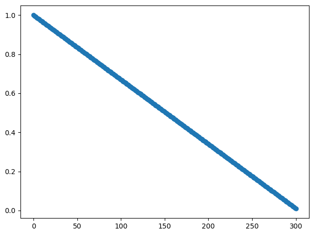

+ 余弦衰减学习率

```python
y1 = 1
y2 = lrf
# x 是当前的 epoch, steps 是总的 epochs
lf = lambda x: ((1 - math.cos(x * math.pi / steps)) / 2) * (y2 - y1) + y1
scheduler = lr_scheduler.LambdaLR(optimizer, lr_lambda=lf)
```

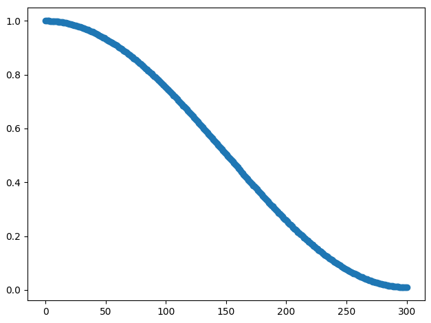

# 7 模型设置

## 7.1 指数移动平均 EMA

+ 用于更新权重

```python
from copy import deepcopy
import math
import torch

def is_parallel(model):
    # Returns True if model is of type DP or DDP
    return type(model) in (nn.parallel.DataParallel, nn.parallel.DistributedDataParallel)


def de_parallel(model):
    # De-parallelize a model: returns single-GPU model if model is of type DP or DDP
    return model.module if is_parallel(model) else model

def copy_attr(a, b, include=(), exclude=()):
    # Copy attributes from b to a, options to only include [...] and to exclude [...]
    for k, v in b.__dict__.items():
        if (len(include) and k not in include) or k.startswith('_') or k in exclude:
            continue
        else:
            setattr(a, k, v)

class ModelEMA:
    """ Updated Exponential Moving Average (EMA) from https://github.com/rwightman/pytorch-image-models
    Keeps a moving average of everything in the model state_dict (parameters and buffers)
    For EMA details see https://www.tensorflow.org/api_docs/python/tf/train/ExponentialMovingAverage
    """

    def __init__(self, model, decay=0.9999, tau=2000, updates=0):
        # Create EMA
        self.ema = deepcopy(de_parallel(model)).eval()  # FP32 EMA
        # if next(model.parameters()).device.type != 'cpu':
        #     self.ema.half()  # FP16 EMA
        self.updates = updates  # number of EMA updates
        self.decay = lambda x: decay * (1 - math.exp(-x / tau))  # decay exponential ramp (to help early epochs)
        for p in self.ema.parameters():
            p.requires_grad_(False)

    def update(self, model):
        # Update EMA parameters
        with torch.no_grad():
            self.updates += 1
            d = self.decay(self.updates)

            msd = de_parallel(model).state_dict()  # model state_dict
            for k, v in self.ema.state_dict().items():
                if v.dtype.is_floating_point:
                    v *= d
                    v += (1 - d) * msd[k].detach()

    def update_attr(self, model, include=(), exclude=('process_group', 'reducer')):
        # Update EMA attributes
        copy_attr(self.ema, model, include, exclude)
```

```python
# 只在单卡，或DDP中的master中使用 ema 
ema = ModelEMA(model) if RANK in {-1, 0} else None
```

## 7.2 DP

+ 只在单卡，并且有GPU时设置。

```python
model = torch.nn.DataParallel(model)
```

## 7.3 DDP

```python
if check_version(torch.__version__, '1.11.0'):
	model = DDP(model, device_ids=[LOCAL_RANK], output_device=LOCAL_RANK, static_graph=True)
else:
	model = DDP(model, device_ids=[LOCAL_RANK], output_device=LOCAL_RANK)
```


## 7.4 SyncBatchNorm

+ 只在 DDP 时设置

```python
model = torch.nn.SyncBatchNorm.convert_sync_batchnorm(model).to(device)
```


# 8 恢复训练

```python
# Optimizer
if ckpt['optimizer'] is not None:
	optimizer.load_state_dict(ckpt['optimizer'])
	best_fitness = ckpt['best_fitness']

# EMA
if ema and ckpt.get('ema'):
	ema.ema.load_state_dict(ckpt['ema'].float().state_dict())
	ema.updates = ckpt['updates']

# Epochs
start_epoch = ckpt['epoch'] + 1
```


# 9 数据增强

+ 数据格式： U 版的label格式为 `category_idx, x_center / img_width, y_center / img_height, width / img_width, height / img_height` 。即归一化的 xywh。

+ 读取的图像的高宽都需要大于 9 个像素:

  ```python
  assert (shape[0] > 9) & (shape[1] > 9), f'image size {shape} <10 pixels'
  ```

## 9.1 Rectangular Training

+  `opt.rect` 控制，训练时默认为 `False` ，测试时默认为 `True`。如果使用 `mosaic`或 `mixup`，则不使用 `rectangular training` 。

+ 工作流程：

  + 对于一个 batch 的图像，首先计算该 batch 内所有图像的高宽比 `aspect_ratio = h / w`  。

  + 按照 `aspect_ratio` 进行升序排序，保证高宽比相似的图像在顺序上相邻。减少后续每个 batch 选择一个固定的高宽比时对图像形变的影响。因此，在 `Rectangular Training` 的情况下，训练过程中不 shuffle ，并且不设置 `image_weights`。即，不能有任何改变图像顺序的操作。

  + 考虑两种极端情况：

    + 当前 batch 的所有图像都是一个横着的长条，即 `h / w` 非常都比较小 `< 1` 。即，`max(aspect_ratio) < 1`。
    + 当前 batch 的所有图像都是一个竖着的长条，即 `h / w` 非常都比较大 `> 1` 。即，`min(aspect_ratio) > 1`。

  + 对于上述两种极端情况进行判断：

    + 对于 `max(aspect_ratio) < 1` 的。即，该 batch 内的所有图像的 `h / w` 都是小于1的，意味着所有图像都是横着的长条。此时，该 batch 应该用最方正的（`aspect_ratio`最大，即最接近1）的，还是 `aspect_ratio` 最小，即最细长的作为当前 batch 的输入尺寸？举个例子：

      
  
      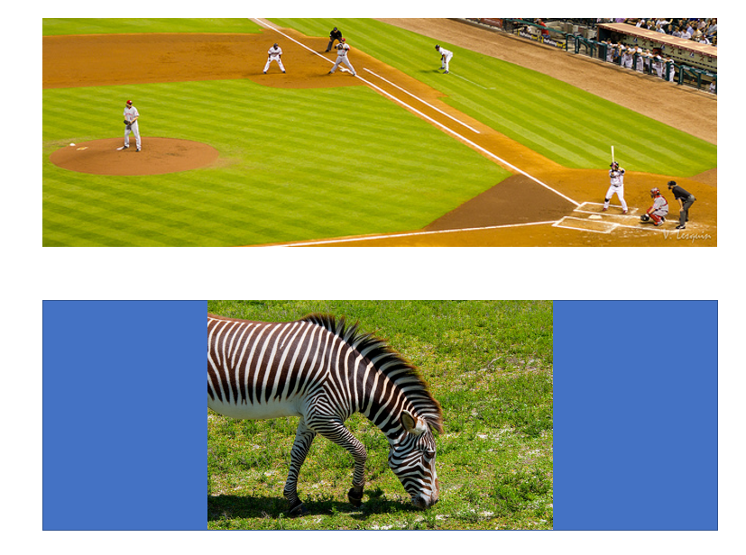
  
      显然，使用最细长的图像作为输入分辨率的话，会使得其他图像的尺寸过小。而使用最方正的图像作为输入分辨率，会使得所有图像，特别是 padding 的像素尽可能少，并且图像的尺寸在该盒子下也尽可能大。

      因此，对于横着的长条，把 `max(aspect_ratio)` 的图像的最长边 resize 到 `img_size` ，最短边等比例缩放，并把该尺寸作为当前 batch 的输入尺寸。

      ```python
      # h / w = aspect_ratio
      weight_ratio = 1
      height_ratio = 1 * max(aspect_ratio) = max(aspect_ratio)
      ```

    + 同上，对于 `min(aspect_ratio) > 1` 的，则把高宽比最小（最接近1），也是最方正的图像作为当前 batch 的盒子。当然，需要把该图像的最长边缩放到 640，最短边等比例缩放。

      ```python
      # h / w = aspect_ratio
      height_ratio = 1
      weight_ratio = 1 / min(aspect_ratio)
      ```
  
  + 对于不是极端情况的，即 batch 内的数据即有横着的长条，又有竖着的长条，则不好确认图像的缩放比例。U 版代码中对该情况下的高宽缩放比例均设置为1，即：
  
    ```python
    height_ratio = 1
    weight_ratio = 1
    ```
  
  + 对于上述三种情况，确定了高宽比例之后，就按照设定的输入图像尺寸进行缩放：
  
    ```python
    new_height = height_ratio * img_size
    new_width = weight_ratio * img_size
    ```
  
  + 最后，计算出来当前 batch 用来装图像的盒子之后，还需要保证该盒子的尺寸为 **网络下采样倍数** 的整数倍:
  
    ```python
    shape = [new_height, new_width]
    batch_shapes = np.ceil(np.array(shape) * img_size / stride).astype(np.int) * stride
    ```
    
  + 但是，代码实现还需要加一个 pad （仅在测试时，使得测试时的图像分辨率稍大一些）：
  
    ```python
    shape = [new_height, new_width]
    batch_shapes = np.ceil(np.array(shape) * img_size / stride + pad).astype(np.int) * stride
    # 其中，pad = 0.0 if train else 0.5
    ```

+ 上述过程的流程就是。首先，把 该 batch 内的所有图像中的最方正（不管是横着的长条还是竖着的长条）的图像的最长边 resize 到输入图像分辨率，最短边按比例缩放 `(640, 427, 3)`：


+ 普通情况下，需要 padding 到 $640 \times 640$ 。但是，这种情况需要补充大量的 Padding，引入了大量的冗余信息，以及不必要的计算、存储资源开销。：

  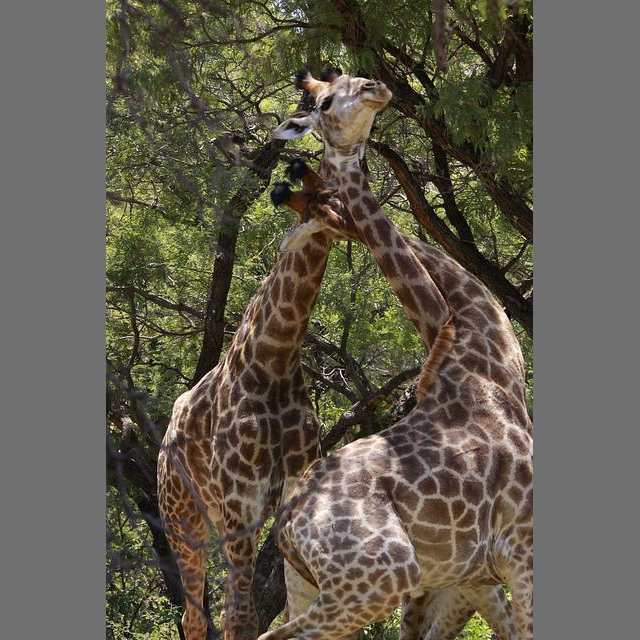

+ 因此，Rectangular Training 的策略是，首先把所有数据集中的图像按照高宽比进行排序，使得形状相近的图像排在一起，保证其尽可能的都在同一个 batch 内。然后，在当前 batch 的所有图像中，选择一个最方正的图像，把其最长边 resize 到 640， 最短边等比例缩放。之后，使用尽可能少的像素来 padding 最短边两侧，使其成为下采样倍数的整数倍 `(640, 448, 3)`：

  

+ 对于该 batch 内的其他图像，都按照从最方正的图像中计算出来的尺寸，把最长边缩放到该 batch 的盒子的最长边 :

  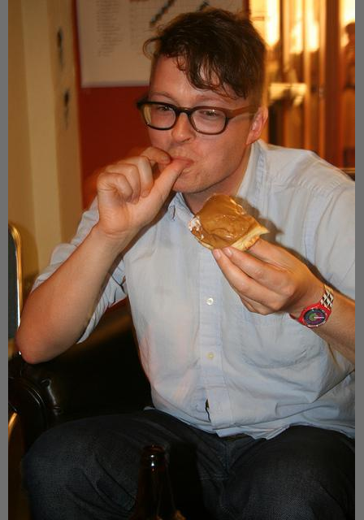

+ 实际测试 U 版 YOLO 使用 Rectangular Training 的 一个 epoch （batchsize=4）的效果:

  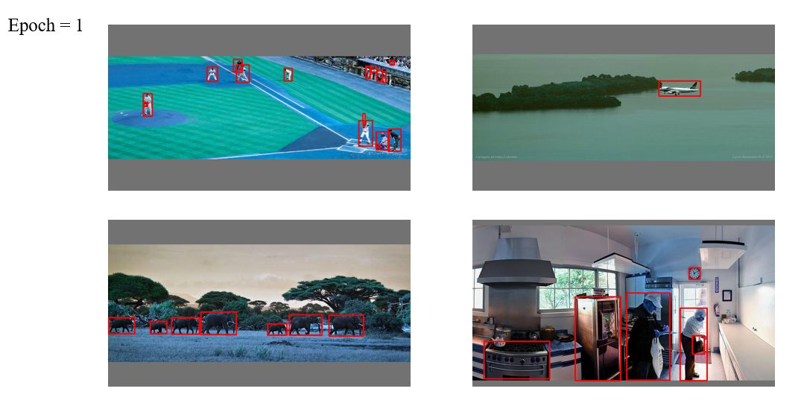

  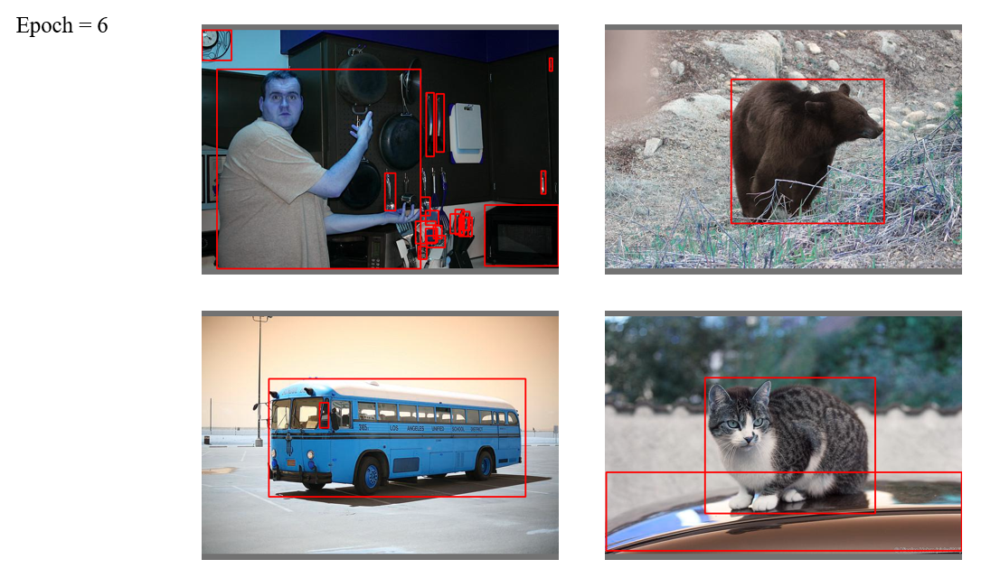

  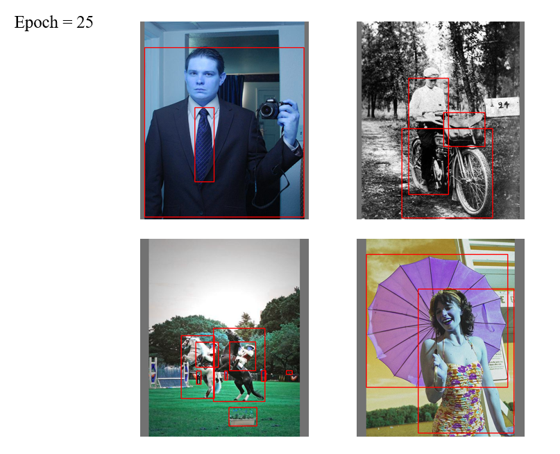

  可以发现：

  + Rectangular Training 时，首先是按照高宽比升序排序的（横条在前，竖条在后）。
  + 每个 batch 一个输入图像分辨率，不同 batch 的输入分辨率不同。
  + 每个 batch 的输入分辨率，按照当前 batch 中最方正的图像的尺寸确定。
  + 每个 batch 的所有图像，都是把最长边 resize 到该 batch 的输入尺寸。

## 9.2 缓存

   为了加快后续epochs的数据读取速度，需要进行缓存。分为两种 : `disk` 和 `ram` 。默认为 `ram` 。

  + disk

    ```python
    self.npy_files = [Path(f).with_suffix('.npy') for f in self.im_files]
    for i in range(n) : # n 是训练集所有样本的数量
    	f = self.npy_files[i]
        if not f.exists():
        	np.save(f.as_posix(), cv2.imread(self.im_files[i]))
    ```

    即，如果设置缓存 `opt.cache_images = 'disk'` 的话，就只把图像读出来，并且保存成 `nps` 文件。

  + RAM

    + 首先，创建变量 `self.ims = [None] * n`  , `self.im_hw0 = [None] * n` , `self.im_hw = [None] * n ` 。分别用于在内存中存储 `图像`，`图像原始的大小`，`图像缩放后的大小`。

    + 之后，读取图像。如果 `.npy` 存在的话，就从 `.npy` 中读取，如果不存在的话再用 `cv2` 读取：

      ```python
      self.npy_files = [Path(f).with_suffix('.npy') for f in self.im_files]
      self.im_files = [‘.../1.jpg’, ‘.../2.jpg’, ‘.../3.jpg’]
      for i in range(n):
          fn = self.npy_files[i]
          f = self.im_files[i]
          
          if fn.exists():
              im = np.load(fn)
          else:
              im = cv2.imread(f)
          
          h0, w0 = im.shape[:2]  # original image height and width
          r = self.img_size / max(h0, w0)  # 把最长边缩放到 self.img_size 的大小 640，计算缩放比例
          
      	if r != 1:  # if sizes are not equal
              # Important Trick !
      		interp = cv2.INTER_LINEAR if (self.augment or r > 1) else cv2.INTER_AREA
      		im = cv2.resize(im, (int(w0 * r), int(h0 * r)), interpolation=interp)
          
          self.ims[i] = im
          self.im_hw0[i] = (h0, w0) # original image height and width
          self.im_hw[i] = im.shape[:2] # 缩放后的图像的 height and width
          
      ```

      上述代码中有一个比较重要的 Trick :

      + 在图像缩放中，如果需要放大图像，则用 `cv2.INTER_LINEAR` 或 `cv2.INTER_CUBIC` 。但是 `cv2.INTER_CUBIC` 会慢一些。
      + 在图像缩放中，如果需要缩小图像，则用 `cv2.INTER_AREA`

## 9.3 Mosaic

Mosaic 比较简单，即挑选出4张图像，拼接成为新的1张图像，如下图所示：

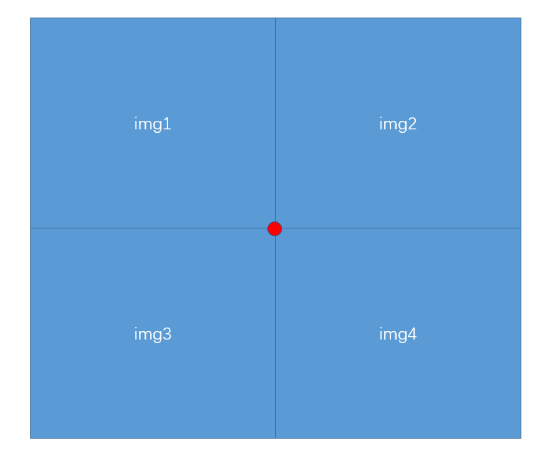

考虑两个问题：

+  **新图像的尺寸是多少？** 如果按照设置的 `img_size = 640` ，则拼接之后的新图像的尺寸就是 `1280` ，实际测试发现，该情况下测试时应该使用 `640` 的分辨率。

+ **四个图像的角点一定在中心位置吗？**

  + 为了增强模型的鲁棒性，中心位置坐标采取了随机选择的方式。

  + 但是，如果选择的位置不合适（如非常靠近边缘），则会导致部分图像的面积过小。因此实际操作时需要限制中心点的范围。U 版 YOLO 的方法如下图所示：

    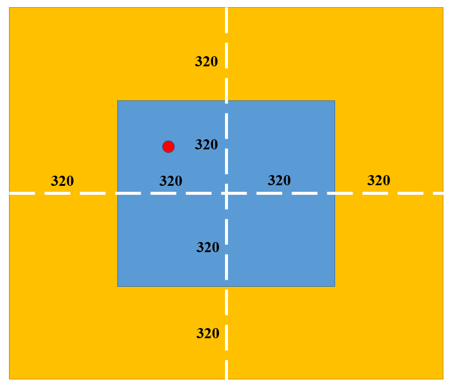

+ 对于第一个问题。假设设置的输入图像分辨率为 `640`，那么拼接之后的图像是 `1280` 吗？如果是，那么测试时又该用多少分辨率的图像呢？
+ 对于第二个问题。


+ 选择当前图像的索引，并且再随机选择3张图像的索引：

  ```python
  # self.indices = range(n) # [0, 1, 2, ..., n-1]
  indices = [index] + random.choices(self.indices, k=3)
  ```

+ Shuffle 选择的4个索引

  ```python
  random.shuffle(indices)
  ```

+ 假设设置的输入图像分辨率为 $640$ ，则从 $320 - 960$ 的范围内随机选择一个坐标作为4张图像拼接的中心点：

  ```python
  img_size = 640
  mosaic_border = [-img_size // 2, -img_size // 2]
  yc, xc = (int(random.uniform(-x, 2 * img_size + x)) for x in mosaic_border)
  ```

  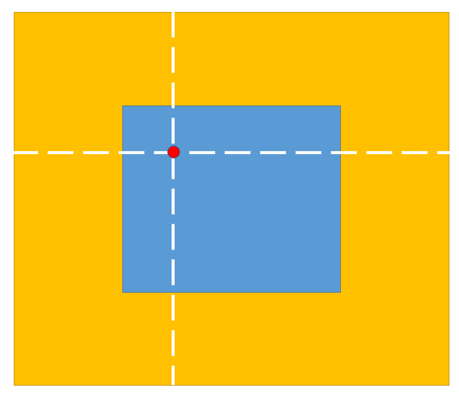

+ 创建1个空的新图像，并使用默认值 `114` 进行填充。

  ```python
  img4 = np.full((img_size * 2, img_size * 2, 3), 114, dtype=np.uint8)
  ```

+ 处理4张图像，计算每张图像的位置，以及坐标需要平移的位置（下方为 Mosaic 数据增强的完整代码）。

  ```python
  def mosaic4(images_labels, input_size):
      mosaic_border = [-input_size // 2, -input_size // 2]
      yc, xc = (int(random.uniform(-x, 2 * input_size + x)) for x in mosaic_border)
  
      random.shuffle(images_labels)
  
      img4 = np.full((input_size * 2, input_size * 2, 3), 114, dtype=np.uint8)
      label_xyxy4 = []
      label_category4 = []
      for idx in range(len(images_labels)):
          image = images_labels[idx][0]
          label_xyxy = images_labels[idx][1]
          label_category = images_labels[idx][2]
  
          # Resize max side to input_size
          image, label_xyxy = ResizeByMax(image, label_xyxy, input_size)
          h, w = image.shape[:2]
  
          if idx == 0:  # top left
              # 计算 img4 上的坐标
              xmin1, ymin1, xmax1, ymax1 = max(xc - w, 0), max(yc - h, 0), xc, yc
              # 计算图像需要裁剪的坐标
              xmin2, ymin2, xmax2, ymax2 = w - (xmax1 - xmin1), h - (ymax1 - ymin1), w, h
              # 平移坐标
              label_xyxy[:, [0, 2]] = label_xyxy[:, [0, 2]] + (xmax1 - w)
              label_xyxy[:, [1, 3]] = label_xyxy[:, [1, 3]] + (ymax1 - h)
          elif idx == 1:  # top right
              # 计算 img4 上的坐标
              xmin1, ymin1, xmax1, ymax1 = xc, max(yc - h, 0), min(xc + w, input_size * 2), yc
              # 计算图像需要裁剪的坐标
              xmin2, ymin2, xmax2, ymax2 = 0, h - (ymax1 - ymin1), xmax1 - xmin1, h
              # 平移坐标
              label_xyxy[:, [0, 2]] = label_xyxy[:, [0, 2]] + (xc + w - w)
              label_xyxy[:, [1, 3]] = label_xyxy[:, [1, 3]] + (yc - h)
          elif idx == 2:  # bottom left
              # 计算 img4 上的坐标
              xmin1, ymin1, xmax1, ymax1 = max(xc - w, 0), yc, xc, min(yc + h, input_size * 2)
              # 计算图像需要裁剪的坐标
              xmin2, ymin2, xmax2, ymax2 = w - (xmax1 - xmin1), 0, w, ymax1 - ymin1
              # 平移坐标
              label_xyxy[:, [0, 2]] = label_xyxy[:, [0, 2]] + (xc - w)
              label_xyxy[:, [1, 3]] = label_xyxy[:, [1, 3]] + (yc + h - h)
          elif idx == 3:  # bottom right
              # 计算 img4 上的坐标
              xmin1, ymin1, xmax1, ymax1 = xc, yc, min(xc + w, input_size * 2), min(yc + h, input_size * 2)
              xmin2, ymin2, xmax2, ymax2 = 0, 0, xmax1 - xmin1, ymax1 - ymin1
              # 平移坐标
              label_xyxy[:, [0, 2]] = label_xyxy[:, [0, 2]] + (xc + w - w)
              label_xyxy[:, [1, 3]] = label_xyxy[:, [1, 3]] + (yc + h - h)
  
          img4[ymin1:ymax1, xmin1:xmax1] = image[ymin2:ymax2, xmin2:xmax2]
          label_xyxy4.append(label_xyxy)
          label_category4.append(label_category)
  
      label_xyxy4 = np.concatenate(label_xyxy4, axis=0)
      label_category4 = np.concatenate(label_category4, axis=0)
  
      # 限制边框坐标
      label_xyxy4 = label_xyxy4.clip(0, 2 * input_size - 1)
      
      return img4, label_xyxy4, label_category4
      
  ```
  
  ## 9.4 MixUP
  
+ U 版 YOLOv5 只在使用 Mosaic 的情况下才使用 MixUP 。

+ 首先，按照当前 `__getitem__` 的 `idx` 得到一个 Mosaic 图像。

+ 之后，再随机选择 4 张图像再得到一个 Mosaic 图像。

+ 两张图像的像素按比例融合。**需要注意：类别不按比例调整。**

+ ```python
  def mixup(img1, label_xyxy1, label_category1, img2, label_xyxy2, label_category2):
      # Applies MixUp augmentation https://arxiv.org/pdf/1710.09412.pdf
      r = np.random.beta(32.0, 32.0)  # mixup ratio, alpha=beta=32.0
      mix_img = (img1 * r + img2 * (1 - r)).astype(np.uint8)
  
      label_xyxy = np.concatenate((label_xyxy1, label_xyxy2), axis=0)
      label_category = np.concatenate((label_category1, label_category2), axis=0)
      return mix_img, label_xyxy, label_category
  ```

## 9.4 普通数据增强

+ 如果不使用 Mosaic 的话，则按照普通数据增强进行处理。

+ Rectangular Training 仅在该情况下可能使用。

+ 首先，调整图像尺寸

  + 如果使用 Rectangular Training，则使用其计算的当前 batch 的输入图像分辨率 `new_shape`。
  + 如果不使用 Rectangular Training，则使用设置的 `input_size = 640` 作为输入图像分辨率 `new_shape`。
  + 按照 `new_shape` 对输入图像进行缩放和 padding 

  ```python
  # 1. 获得计算出来的输入图像分辨率。要么是Rectangular Training，要么是 input_size=640 。
  new_shape = (new_shape, new_shape) # hw
  # 2. 获得图像的实际分辨率
  shape = img.shape[:2]  # hw
  # 3. 把输入图像的最长边 resize 到 new_shape 对应的该边的尺寸。这里需要特别注意，将会在后续进行详细介绍。
  ratio = min(new_shape[0] / shape[0], new_shape[1] / shape[1])  # hw
  # 4. 该条仅对测试有用：仅向下 resize 图像，不向上 resize 图像。即，训练时 scaleup = True, 测试时 scaleup = False 。
  if not scaleup:  # only scale down, do not scale up (for better val mAP)
      ratio = min(ratio, 1.0)
  # 5. 按照计算出的缩放比例进行缩放
  resized_width, resized_height = int(round(shape[1] * ratio)), int(round(shape[0] * ratio))
  # 6. 把图像缩放到应该缩放的尺寸
  if shape != (resized_height, resized_width):  # resize
      img = cv2.resize(img, (resized_width, resized_height), interpolation=cv2.INTER_LINEAR)
  # 7. 计算需要 padding 的大小
  paddind_w, paddind_h = new_shape[1] - resized_width, new_shape[0] - resized_height  # wh padding
  # 8. 按照中心 padding，即上下、左右各 Padding 一般
  paddind_w /= 2
  paddind_h /= 2
  # 9. padding 计算还存在问题：如果 padding = 7, 那么每边只能一边是3，一边是4。怎么计算？(左方上方是3，右方下方是4)
  paddind_top, paddind_bottom = int(round(paddind_h - 0.1)), int(round(paddind_h + 0.1))
  paddind_left, padding_right = int(round(paddind_w - 0.1)), int(round(paddind_w + 0.1))
  # 10. Padding
  img = cv2.copyMakeBorder(img, paddind_top, paddind_bottom, paddind_left, padding_right, cv2.BORDER_CONSTANT, value=(114, 114, 114))  # add border
  ```

+ **按照最长边缩放图像的方法** 

  + 之前习惯的写法是

    ```python
    input_size = 640
    img_height, img_width = image.shape[:2]
    ratio = input_size / max(img_height, img_width)
    
    resized_height, resized_width = int(img_height * ratio), int(img_width * ratio)
    ```

  + 但是这种写法存在一种问题，即如果输入尺寸不是 `(input_size, input_size)` 的话，如 `(320, 640)` 的话，怎么按照最长边缩放？

  + 因此，首先还是考虑 `(input_size, input_size)` 这种缩放后图像是方形的情况，可以写成以下代码：

    ```python
    input_height = 640
    input_width = 640
    img_height, img_width = image.shape[:2]
    ratio = min(input_height / img_height, input_width / img_width)
    
    resized_height, resized_width = int(img_height * ratio), int(img_width * ratio)
    ```

    这里有一个逻辑题：

    $min(640 / h, 640 / w)$ 等价于？ 

    + $640 / min(h, w)$
    + $640 / max(h, w)$

    $640 / h$ 约小，证明 $h$ 越大。因此 $min(640 / h, 640 / w)$ 就是按最长边进行缩放的缩放比例。等价于 $640 / max(h, w)$

  + 那么回到输入尺寸不是 `(input_size, input_size)` 的情况，如 `(input_size1, input_size2)` 。则 `ratio = min(input_height / img_height, input_width / img_width)` 就是把最接近目标尺寸的边缩放到目标尺寸，另外一个边等比例缩放。该方法也可以理解为：

    + 目标尺寸的高宽比 $P = H / W$

    + 图像的高宽比为 $P' = h / w$

    + 如果 $P' > P$ ，则按照图像的高对齐。

      $P = 640 / 608 = 1.05$ ，$P' = 640 / 427 = 1.499 > P$ ，则把图像的高对齐：

      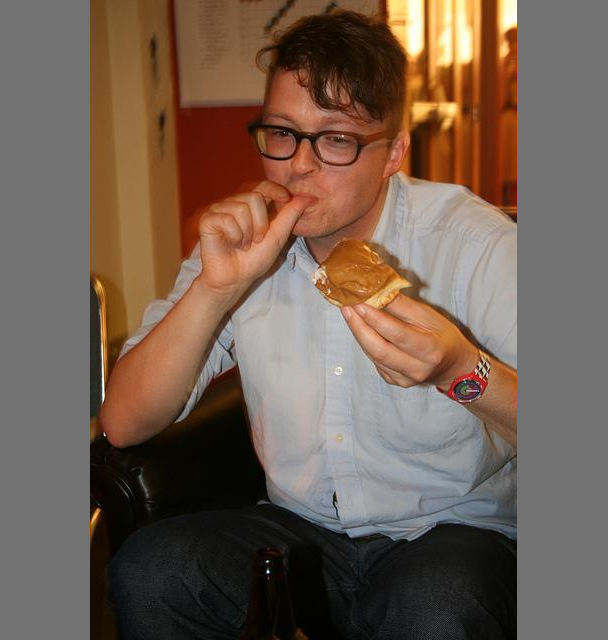

    + 如果 $P' < P$ ，则按照图像的宽对齐。

      $P = 640 / 320 = 2$ ，$P' = 640 / 427 = 1.499 < P$ ，则把图像的宽对齐：

      

+ random_perspective

+ albumentations

  ```python
  class Albumentations:
      # YOLOv5 Albumentations class (optional, only used if package is installed)
      def __init__(self):
          self.transform = None
          try:
              import albumentations as A
              check_version(A.__version__, '1.0.3', hard=True)  # version requirement
  
              T = [
                  A.Blur(p=0.01),
                  A.MedianBlur(p=0.01),
                  A.ToGray(p=0.01),
                  A.CLAHE(p=0.01),
                  A.RandomBrightnessContrast(p=0.0),
                  A.RandomGamma(p=0.0),
                  A.ImageCompression(quality_lower=75, p=0.0)]  # transforms
              self.transform = A.Compose(T, bbox_params=A.BboxParams(format='yolo', label_fields=['class_labels']))
  
              LOGGER.info(colorstr('albumentations: ') + ', '.join(f'{x}' for x in self.transform.transforms if x.p))
          except ImportError:  # package not installed, skip
              pass
          except Exception as e:
              LOGGER.info(colorstr('albumentations: ') + f'{e}')
  
      def __call__(self, im, labels, p=1.0):
          if self.transform and random.random() < p:
              new = self.transform(image=im, bboxes=labels[:, 1:], class_labels=labels[:, 0])  # transformed
              im, labels = new['image'], np.array([[c, *b] for c, b in zip(new['class_labels'], new['bboxes'])])
          return im, labels
  ```

+ HSV color-space

  ```python
  ```


+ 数据增强逻辑：

```python
if train:
    if mosaic:
        mosaic4
        copy_paste
        random_perspective
        if mixup:
            mixup
    else:
		if rect:
			shuffle = False
            input_shapes = cal_batch_shapes
        letterbox
        random_perspective
        albumentations
        hsv
        Flip-H
        Flip-V
else:
    mixup=False
    rect=True
    letterbox(scaleup=True) # if not scaleup
```


# 10 Loss

## 10.1 匹配 target 和 anchor

+ YOLOv3 使用 IOU 满足阈值来匹配 target 和 anchor
+ YOLOv5 直接计算 target 的 w 和 h，以及 anchor 的 w 和 h 的比值来匹配：
  + $ratio_w = \frac{target_w}{anchor_w}$ 需要比较接近。如果 $ratio_w > 1$ ，则 $ratio_w$ 越小越匹配。反之，如果 $ratio_w < 1$ 则越大越接近。
  + $ratio_h = \frac{target_h}{anchor_h}$ 同理。
+ 上述过程不知道 $ratio$ 到底是 大于 1 的还是小于 1的（也可以知道，分情况讨论，但是比较麻烦）。因此需要想办法转换一下：
  + 能不能都转换成 大于 1的情况？那么 $ratio$ 越小，说明两者越接近：
    + 如果本来 $ratio$ 就是大于 1 的，那么万事大吉，什么也不用干。
    + 如果本来 $ratio$ 是小于 1 的，那么用 $ratio = 1 / ratio$ 来将其转换成为大于 1 的。
    + 但是，代码写成 $ratio = 1 / ratio$ 的话，本来大于 1 的现在就变成小于 1 的了。
    + 所以：
      + 本来的 $ratio$ 大于 1 ，$1 / ratio < 1$ ，取最大值 $max(ratio, 1 / ratio)$  还是原来的 $ratio$ 。
      + 本来的 $ratio$ 小于1 ，$1/ratio > 1$ ，取最大值 $max(ratio, 1/ratio)$ 就得到了 $1 / ratio$ 。
    + 这样，就可以全部用 大于1，越小越接近来判断了。
  + 既然越小越接近，那么我们定义两者是否匹配的话，可以设置一个上限。即，不超过该上限的都视作成功匹配：
    + 该过程种， w 需要满足成功匹配， h 也需要满足成功匹配。两者都匹配的话，才可以说该 target 和 该 anchor 匹配。
    + 因此，取两者的最大值，如果两者的最大值都不超过上限，则说明匹配了。
    + U 版 中设置上限为 $4$ 。

## 10.2 中心点及网格

+ YOLOv3 中，计算 target 的中心点落在哪个网格，则该网格负责预测。但是会造成正样本过少的问题。

+ YOLOv5 对于1个 target 都使用 3 个 （也可能1个）网格负责预测。

+ 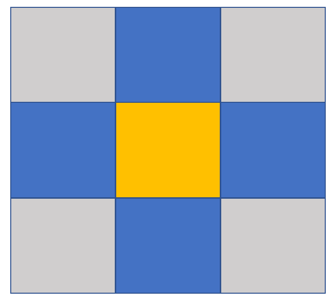

  1. 物体中心点落在哪个网格内，则该网格负责预测 （图中黄色网格）
  2. （可能）再由图中4个蓝色网格中的两个负责预测（只可能为（上左，上右，下左，下右）两个网格）。
  3. 中心点  1 个 + （可能）蓝色2个 = 3个 （或1个）

+ 怎么确定该由哪两个蓝色网格来预测呢？

  + 把中心点网格等分成4份，物体中心点更靠近哪一侧，则该测的两个网格也负责预测该物体。（和中心网格一起组成3个预测的网格）

    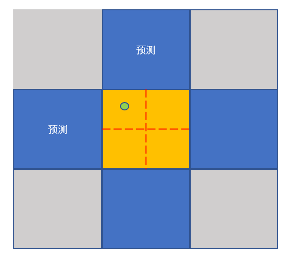

  + 但是，如果物体的中心点刚好落在了网格的正中间，则只由中心网格负责预测。（只有中心点1个网格负责预测）

    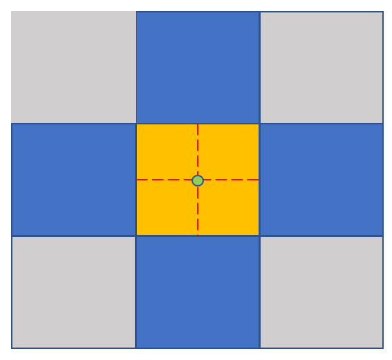

+ 为什么要这么做？

  + 增加正样本的数量
  + 如果物体中心点落在了靠近中心网格边缘的地方，即相较于网格左上角的坐标的偏移量接近0或1。如果使用 sigmoid 来回归，则需要网络的输出特别大或特别小，导致中心点落在靠近网格边缘处的点不容易被预测。

+ 3个网格负责预测，那么每个网格的 xy 的偏移量 gt 怎么确定？

  + 中心网格的偏移量就直接取小数部分。

  + 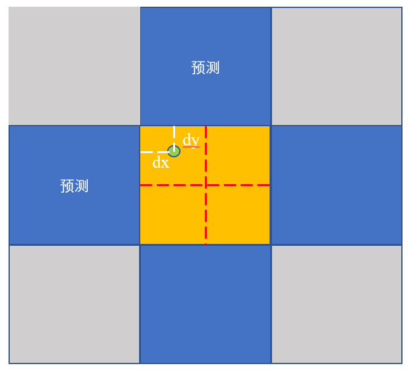

    + 对于左侧网格，此时的 dx,dy分别为 1+dx, dy，但是也可以发现，1+dx的最大值为1.5 。
    + 对于上侧网格，此时的 dx, dy 分别为 dx, 1+dy，且 1+dy 的最大值为 1.5 。

  + 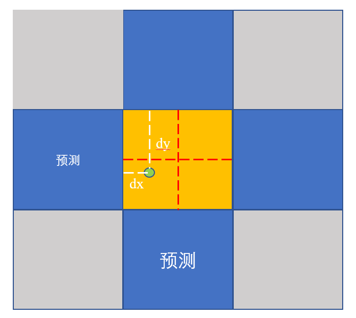

    + 左侧网格的偏移量为 1+dx, dy
    + 下侧网格的偏移量为 dx, dy-1<0，且 dy-1 最小为 -0.5 。

  + 其他几侧同理，汇总如下：

    + 上方为 dx, 1+dy。
    + 下方为 dx, dy - 1 。
    + 左侧为 1+dx, dy 。
    + 右侧为 dx - 1, dy。
    + 可以发现，现在偏移量的取值范围是 -0.5 至 1.5 。因此需要调整 sigmoid 为 2*sigmoid - 0.5 。

    

    


# 11 测试策略

## 11.1 输入图像分辨率

+ 原则：尽可能少的 paddind 以提升推理速度：

  + 按照训练时的 Rectangular Training 和 图像缩放策略，确定图像缩放比例和 paddind 大小。

  + 该 paddind 大小可能对单张图像来说还是大，因此为了 paddind 最少的像素，并且保证输入尺寸还是下采样倍数的整数倍，采用的方法是：

    ```python
    paddind_w, paddind_h = np.mod(paddind_w, stride), np.mod(paddind_h, stride)
    ```

    
