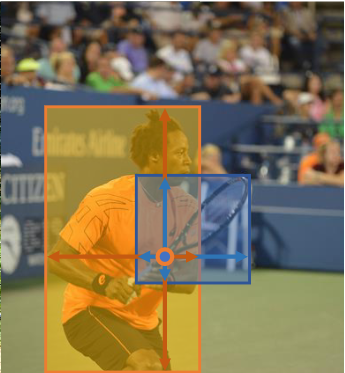
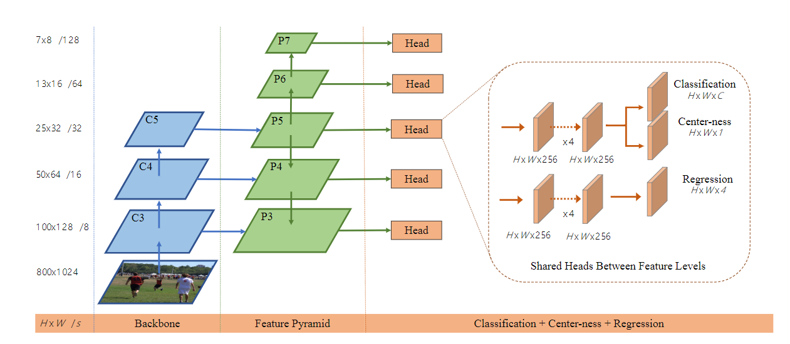
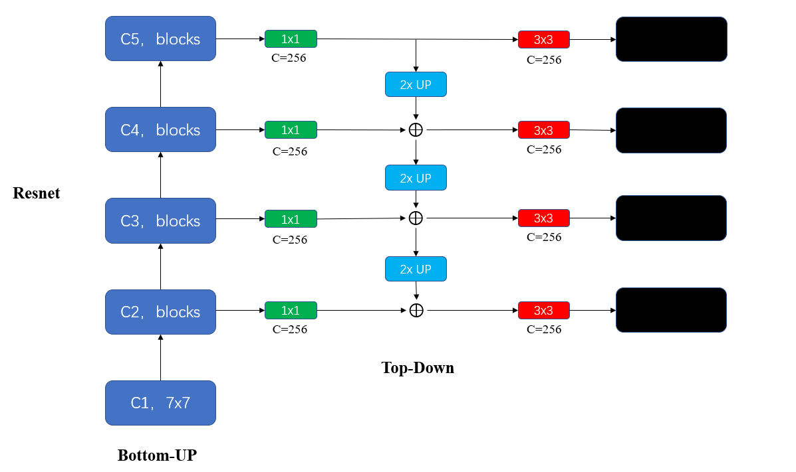
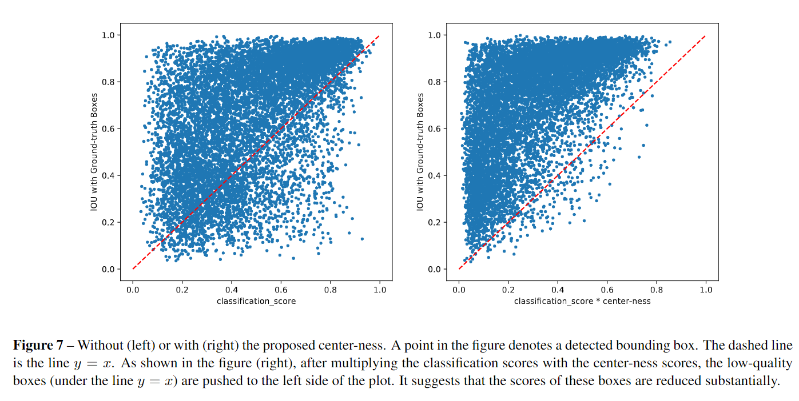

`FCOS: Fully Convolutional One-Stage Object Detection`

**F**ully **C**onvolutional **O**ne-**S**tage Object Detector (FCOS) 

# 1 Motivation && Contribution

+ 现有方法依赖于一组提前定义的 anchors ，并认为 anchors 是这些检测器成功的主要原因。
+ 然而 anchor-based 方法面临以下缺点：
  + 检测效果对anchor boxes 的尺寸，比例非常敏感，因此需要仔细的调整。
  + 由于 anchor 的 scales 和 aspect ratios 是固定的，因此模型对形状变化较大的物体，特别是小物体，很难处理。
  + 这些网络的通用性较差，因为需要在不同数据集上重新定义 anchors
  + 为了获得更高的recall，需要尽可能密集的在不同位置使用anchors。并且，其中大部分anchors都是负样本，加剧了正负样本比例不平衡的问题。
  + anchors需要更多的额外计算量，如计算IOU

# 2 FOCS

## 2.1 定义

+ $F_i \in \mathbb{R}^{H \times W \times C}$ 表示第 $i$ 层的 feature map

+ $s$ 表示下采样倍数

+ gt bbox 表示为 $\{B_i\}$ ，其中 $B_i = (x_0^i, y_0^i, x_1^i, y_1^i, c^i) \in \mathbb{R}^4 \times \{1, 2,... C\}$ 。其中，xyxy表示top-left, right-bottom的坐标

+ 特征图 $F_i$ 上的点 $(x, y)$ 映射回输入图像，以接近感受野中心为目标的话，应该映射到 $(\lfloor \frac{s}{2} \rfloor + xs, \lfloor \frac{s}{2} \rfloor + ys)$ ：

  + 考虑一个极端例子帮助理解：输入 $32 \times 32$ 的图像，下采样倍数 $s=32$，得到一个 $1 \times 1$ 的 feature map，如果想映射回去，特征图上的这个点映射到 $32 \times 32$  的哪个点上去呢？直接映射到 $(0 \times 32, 0\times32)$ 也可以，但为什么不映射到其他点呢？
  + 如果以感受野中心去映射，那么很自然的就出来了上述公式：$(\lfloor \frac{s}{2} \rfloor + xs, \lfloor \frac{s}{2} \rfloor + ys)$ 
  + 即，映射到原图上距离感受野中心最近的位置。

+ 如果图像上的一个点 $(x, y)$ 落在了任意一个 gt bbox 的 $w \times h$ 的区域内，在该点就作为正样本。即 gt bbox 的 $w \times h$ 中的任意一个点 ($w \times h$ 个点) 都是正样本。各个点的类别就是 gt bbox 的类别。

+ 有了这些正样本点之后，还需要回归 $t^* = (l^*, t^*, r^*, b^*)$ ，分别表示该点距离 gt bbox 的四个边界（left, top, right, bottom）的距离：

  + $l^* = x - x_0$
  + $t^* = y - y_0$
  + $r^* = x_1 - x$
  + $b^* = y_1 - y$

+ 显然，gt bbox 可能有重叠的区域，重叠区域内的点应该算做是哪个目标的呢？

  + 如下图所示，显然选择面积最小的 gt 框更合理（本人认为有两个原因：1. 面积小的框的点本来就少，这样划分可以提高召回；2. 该点距离面积小的框的边界更近，更容易收敛）

    

可以发现，按照上述定义，正样本的数量显然明显多于 anchor-based 方法，召回更高。作者认为这是 FCOS 比 anchor-based 的效果更好的原因。

## 2.2 网络输出

网络输出一个 80 维的向量 $p$ ，表示分类概率。以及一个 4 维的向量 $t = (l, t, r, b)$ 表示边框坐标。

+ $p$ 是一个多标签任务。即， C 个二分类。
+ 在 backbone 后面加 4 个卷积层，分别作为分类和回归分支。

## 2.3 损失函数

每个点 $(x, y)$ 上都计算：
$$
L(\{p_{x, y}\}, \{t_{x, y}\}) = 
\frac{1}{N_{pos}} \sum_{x, y} L_{cls} (p_{x, y}, x_{x, y}^*) + \\
\lambda 
\frac{1}{N_{pos}} \sum_{x, y} \mathbb{1}(c^*(x,y) \gt 0) L_{reg} (t_{x, y}, t_{x, y}^*)
$$
其中：

+ $L_{cls}$ 是 Focal loss
+ $L_{reg}$ 是 IOU Loss
+ $N_{pos}$ 表示正样本的数量
+ 论文中，$\lambda = 1$
+ 只有正样本才计算回归loss
+ 需要注意，由于距离都是正数，因此在回归和预测的过程中使用了exp 映射。即，网络输出的是 $x$ ，但参与Loss计算的是 $exp(x)$ 。由于使用的是 IOU loss，所以就不需要计算 log 。

## 2.4 推理

+ 在特征图 $F_i$ 上的每个点，都预测 4+C 维的 vectors
+ 选择 $p_{xy} \gt 0.05$ 的作为正样本 
+ $x_0 = x - l$ ，....

## 2.5 FPN for FCOS

加入FPN主要为了解决两个问题：

+ 下采样倍数大时，特征图上的点都映射到输入图像上的感受野中心区域附近了，其他位置上没有点了。
+ 多个 gt bbox 重合的区域内的点无法准确指定到其中具体的哪个 gt bbox 上。

FPN + FCOS 的流程为：

+ 使用 backbone 的 $P_3, P_4, P_5$ 3个特征图，Followed by a $1\times 1$ 的卷积（FPN原论文的结构）：

  

+ $P_6$ 和 $P_7$ 分别是在 $P_5$ 和 $P_6$ 上加一个步长为2的卷积，下采样得到的。

+ 5个level的特征图的下采样倍数分别为 $8, 16, 32, 64, 128$

+ Head 在所有层共享权重，这样即节省了参数量，又 improving the detection performance

+ 然而，不同层的点的回归的范围不一样。如：$P3$ 的回归范围是 $[0, 64]$ ，$P_4$ 的回归范围是 $[64, 128]$ 。如果所有层都共享 Head 的话，肯定是不合理的：

  + 因此，如果坚持使用共享 Head，只需要让网络在每层的输出 $x$ 比较接近就行。然后每层再对比较接近的 $x$ 进行缩放，达到该层的距离范围。即，每个距离都缩放为 $exp(s_i x)$ ，其中 $s_i$ 是第 $i$ 层用于缩放的一个可训练的标量。

正负样本匹配规则：

+ 在所有 level 的特征图上都计算每个 gt bbox 的 $l^*, t^*, r^*, b^*$ 。
+ 核心思想是，在当前特征图上预测 $l^*, t^*, r^*, b^*$ 都比较合适，那么当前层负责预测。如果$l^*, t^*, r^*, b^*$ 过大或过小，说明当前层不适合预测，则在当前层上把这些点（即使其被gt bbox覆盖了）设置为负样本。即：
  + 每个特征图上，被任意 gt bbox 覆盖的区域内的所有点都作为正样本。
  + 然后，计算这些点到 gt bbox 的$l^*, t^*, r^*, b^*$，如果某个点的 $max(l^*, t^*, r^*, b^*) > m_i$ 或者 $min(l^*, t^*, r^*, b^*) < m_{i-1}$ ，则该点在当前层移出正样本，作为负样本
  + 其中 $m_i$ 表示第 $i$ 层的特征图负责回归的最大的距离。$m_2, m_3, m_4, m_5, m_6, m_7$ 分别设置为 $0, 64, 128, 256, 512, \infty$
+ 在这种情况下，不同尺度的 gt bbox 会被不同的层预测。即使还存在一个点同时被多个 gt bbox 覆盖的情况，仍然指定为面积最小的 gt 框作为target。实验表明，多级预测可以很大程度上缓解模糊问题

## 2.6 Center-ness for FCOS

由于预测时同样也是在特征图的每个点上都预测，因此会出现大量低质量的点。为了抑制这些点，本文在不引入额外超参的情况下提出了 Center-ness:

+ 加入一个单层的分支，和分类分支并联，用于预测 center-ness

+ center-ness 的定义为：

  + gt bbox 覆盖的所有点中，不同点的质量也是不同的。即，距离 gt bbox中心约近的点越好，越靠近边缘的点的质量越差。

  + 距离中心点近，表现为左右距离相等，上下距离相等。即，比值接近1

  + 距离中心点远，min(左右) / max(左右) 会小于1，且越小表示距离边界越近，距离中心点越远

  + 因此, gt center-ness 表示为：
    $$
    centerness^* = 
    \sqrt{
    \frac{min(l^*, r^*)}{max(l^*, r^*)} 
    \times
    \frac{min(t^*, b^*)}{max(t^*, b^*)} 
    }
    $$

  + 使用根号的原因是为了减慢 centerness的衰减速度。

  + Center-ness 使用二分类交叉熵训练。

  + 测试时，把 centerness 的预测值乘上预测概率值作为最终的分数。

实验结果如下图所示，使用 center-ness之后，预测类别概率高，但实际上和 gt bbox 的 IOU 却很低的点大部分都被过滤掉了。留下来的点中， IOU 低的点，一般概率值也小，很容易被 NMS 过滤掉。

# 3 训练

+ ResNet50 作为 backbone
+ SGD 训练 90 k 个 iters for COCO
+ 初始学习率 0.01，bs=16，学习率在 60K 和 80K 时衰减10倍
+ weight decay设置为1e-4，momentum设置为0.9
+ 输入分辨率最短边resize到800，并且最长边小于等于1333
+ 其他训练超参和RetinaNet相同，论文中没有提数据增强？

# 4 推理

+ 后处理超参与 RetinaNet 相同。并且作者认为如果仔细的调参的话，效果能更好。