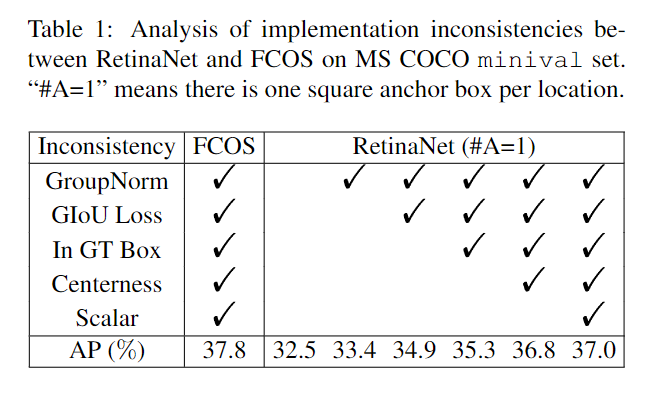
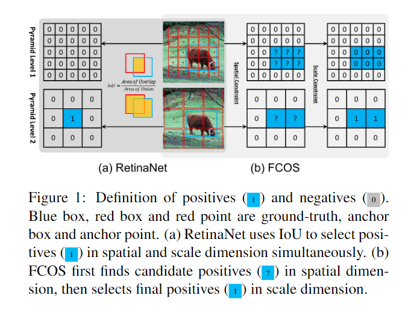
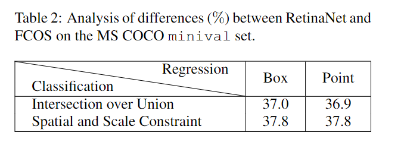
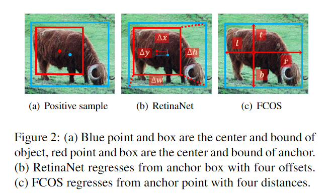
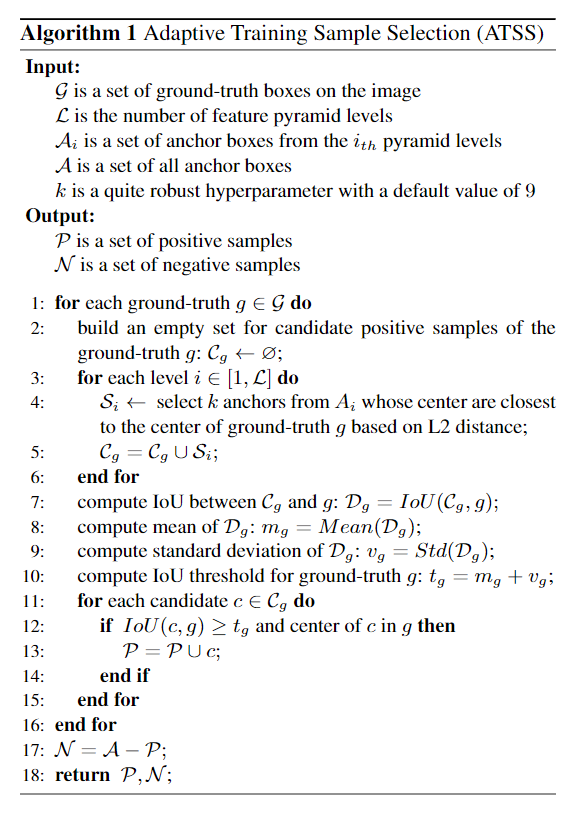
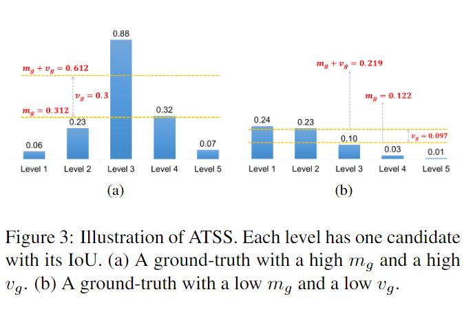
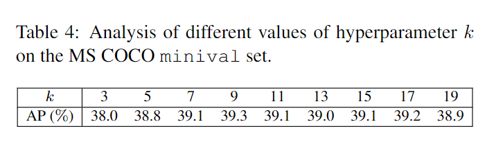
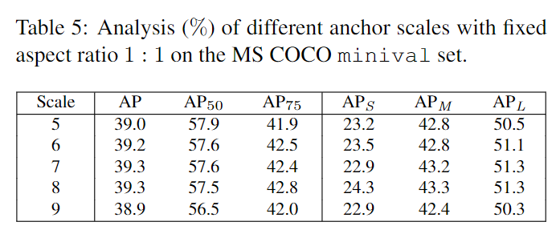
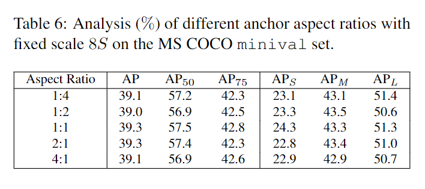

`Bridging the Gap Between Anchor-based and Anchor-free Detection via Adaptive Training Sample Selection`

# 1 动机

由于FPN和Focal Loss，最近anchor-free的目标检测方法已经开始流行。本文的目标是研究anchor-based 和 anchor-free 的主要差异，并提出如何定义正负训练样本来弥补anchor-base和anchor-free的差距。

Anchor-free 的方法可以分为两类：

+ 基于定位几个预定义的关键点和边界的方法 (Cornernet等)，本文称这种方法为 keypoint-based methods 。
+ 基于区域中心点和距离边界的4个距离的方法。本文称之为 center-based methods。

-based 和 -free 的方法主要有三个不同之处：

+ 每个位置上的anchors (anchor-box, anchor-point) 的数量。如anchor-based通常在每个位置预测几个anchor-box，但是FCOS只又1个anchor-point。
+ 正负样本的定义不同。anchor-based方法通常使用IoU来定义正负样本。FCOS使用空间和形状来选择样本。
+ 回归的基准不同。anchor-based通常基于anchor-box来进行回归，而 FCOS 基于anchor-point。

作者发现，如果对-based和-free的方法挑选相同的正负样本，则最终的性能没有显著的差距。因此，如何挑选正负训练样本需要进一步研究。本文提出了一种新的自适应训练样本选择 (Adaptive Training Sample Selection, ATSS) 方法。

# 2 Anchor-based 和  Anchor-free 的差异分析

+ 使用RetinaNet v.s. FCOS进行对比

+ 使用 MS COCO 数据集进行训练，minival来验证。
+ 使用ResNet-50作为backbone，5层金字塔特征。
+ 最短边缩放到800，最长边缩放到小于等于1333。
+ SGD训练90K个iters，动量0.9，1e-4权重衰减，batch-size=16。
+ 初始学习率1e-2，在60K和80K时衰减0.1。
+ 测试时按照训练策略相同的方法缩放图像
+ score threshold为 5e-2，最多检测1000个预测框
+ NMS IoU threshold = 0.6，NMS保留100个预测框

## 2.1 实验结果

+ 两种模型的每个位置都只匹配一个anchor，FCOS v.s. RetinaNet = 37.1% v.s. 32.5%
+ FCOS使用GIoU损失函数，FCOS v.s. RetinaNet = 37.8% v.s. 32.5%

上述实验中，-free比-based更优，是因为每个位置只匹配一个anchor，但是FCOS是专门为这种方法设计的，比如GN, GIoU，ceterness等等。

+ 如果让 RetinaNet 也对齐FCOS的这些策略，FCOS v.s. RetinaNet = 37.8% v.s. 37.0%

在对齐了上述方法之后，-based 和 -free 就只有两个地方不同了：

+ 分类子任务，比如定义正负样本的方式
+ 回归子任务，比如是基于anchor-box回归还是基于anchor-point回归

## 2.2 分类子任务

如上图所示：

+ RetinaNet使用IoU来定义正负样本，如大于阈值的是正样本，小于阈值的是负样本。

+ FCOS使用空间和尺度约束来划分正负样本。首先，吧在gt范围内的anchor-point作为候选正样本。然后，基于尺度范围，在不同的尺度上把不同尺度的候选样本划分为正负样本。

两种不同方法产生的正负样本也不同，如下表所示：

+ 如果使用FCOS的正负样本选择机制，RetinaNet 的 AP 从37.0提升至37.8
+ 试过使用RetinaNet的正负样本选择机制，FCOS的AP从37.8降低到36.9

上述实验证明正负样本定义是十分重要的。

## 2.3 回归子任务

-based 和 -free 的回归方法的差异如上图所示：

+ RetinaNet基于 anchor-box开始回归，预测anchor和 gt的四个偏移量
+ FCOS从anchor-point开始回归，回归anchor-point和四个边界的距离ltrb

然而，由上表2的两行也可以发现，如果对齐了正负样本分配策略，-box和-point的两种方法的AP都相同了。说明回归子任务不是敏感的差异。

# 3 ATSS

+ 对于每个 gt ，按照所有anchor和gt的中心点的L2距离，在每个 level 的 feature 上都各自挑选 k 个距离最近的候选 anchor-box/point。 （假设由 L个level的金字塔特征，则每个gt共挑选出来 $L \times k$ 个候选anchor）
+ 对于每个候选anchor，计算其与对应的gt的IoU (anchor-free的方法也指定一个anchor的高宽, 如5，5) 。每个 gt 共有 $L \times k$ 个 IoU
+ 计算每个gt 的 $L \times k$ 个 IoU 的均值和标准差 $\mu, \sigma$ ，并得到 IoU 阈值 $\mu + \sigma$
+ 按照每个gt自己的 IoU 的阈值，在其 $L \times k$ 个候选anchor中挑选出 IoU 大于阈值的 anchors作为正样本，其余作为负样本。（需要注意算法的第12行，正样本的 IoU 不仅要大于阈值，并且还要保证anchor的中心点在gt的RoI区域内）

## 3.1 为什么使用均值和标准差的和作为IoU阈值

+ 如上图a所示，更大的IoU的均值表示质量更好的候选框
+ 如上图b所示，更低的标准差表示更高质量的候选框
+ 不同level上的标准差越大，说明有某一层的anchor的质量和其他level上的anchor的质量差距较大，说明存在一层特别合适的level来检测该gt。如上图(a) 的level3所示。
+ 不同level上的标准差越小，说明多个level的特征上的anchor对于该gt的质量都差不多，如上图b所示。

统计发现，按照 $\mu + \sigma$ 挑选，每个 gt 大约有 $0.2 \times kL$ 个正样本，并具有尺度不变性，感受野不变性和位置不变性。相反的，RetinaNet 和 FCOS 都对大目标产生了更多的候选正样本，对小目标是不公平的。

# 4 实验

## 4.1 不同的 k

## 4.2 Anchor的尺度

## 4.3 Anchor的高宽比

