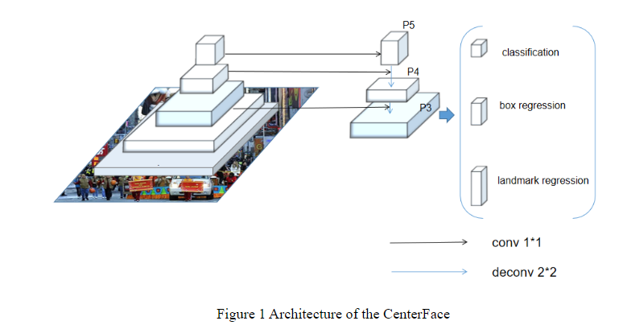

`CenterFace: Joint Face Detection and Alignment Using Face as Point`

# 1 Motivation && Contribution

+ anchor-based 方法的检测器通常需要大量密集的 anchors 来提高召回，此外 anchor 是一个超参，通常只适用于一个特定的数据集，通用性较差。
+ 再有 state-of-the-art 方法使用 VGGs， ResNets， 参数量和计算量都太大

因此，本文提出了一种 simpler and more effective face detection and alignment method, called  CenterFace：

+ anchor-free 的，把人脸检测转化成了一种标准的关键点估计问题，使用更大的输出分辨率（下采样步长只有4）
+ 基于多任务学习策略，网络同时预测预测人脸的 boxes，以及5个关键点
+ 使用了特征金字塔结构，来准确并快速的检测人脸

# 2 CenterFace

## 2.1 Mobile Feature Pyramid Network

+ 使用 MobileNetV2作为backbone
+ 使用 FPN 作为 neck, 使用 3 个不同尺度 $P_3 , P_4, P_5$ ，每两个尺度之间下采样2倍。所有level的通道数都是24

## 2.2 Face as Point

+ 令 $[x_1, y_1, x_2, y_2]$ 表示一个人脸边框
+ 中心点坐标为 $[\frac{(x_1 + x_2)}{2}, \frac{(y_1 + y_2)}{2}] $ 
+ 输入图像为 $I \in \mathbb{R}^{W\times H \times 3}$ 
+ 对于下采样步长为 $R$ 的特征图，本文的目标时预测一个热力图 $Y \in [0, 1]^{\frac{W}{R} \times \frac{H}{R}}$ ，$\hat{Y}_{x,y} = 1$ 表示该点是一个人脸的中心点，$\hat{Y}_{x,y} = 0$ 表示该点是背景

特点：

+ 实时
+ 高准确率
+ 在语义图上学习 face existing 概率