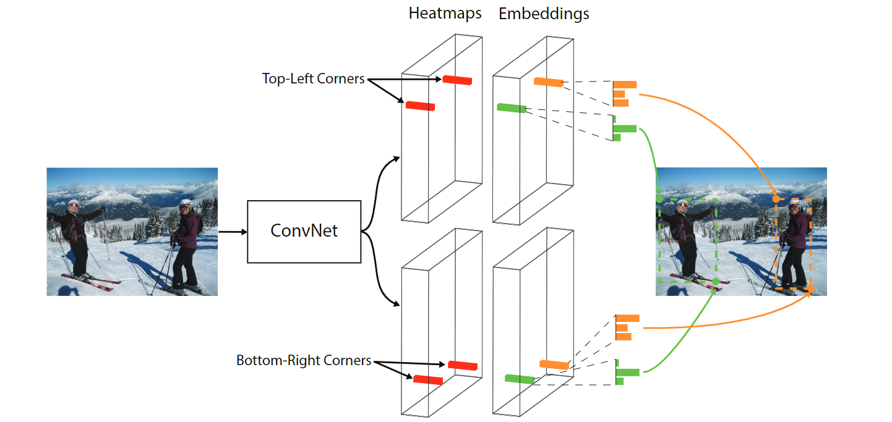
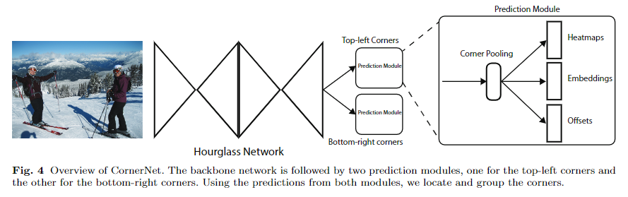
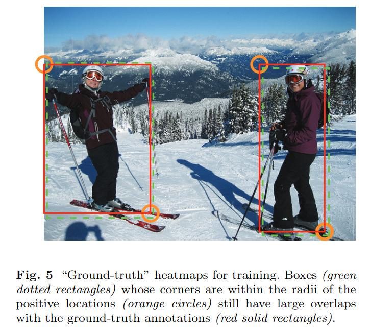

`CornerNet: Detecting Objects as Paired Keypoints`

## 1 Motivation && Contribution

使用 anchors 有两个缺点：

+ 通常需要大量的 anchors，如 RetinaNet 共有100k个anchors。然而最终只有很少一部分anchors能够与gt的overlap足够大，导致了严重的正负样本不平衡，并减慢了训练速度
+ anchors 需要很多超参进行选择，如多少个，尺寸，高宽比。如果再结合多尺度，这些超参就会变得更复杂

因此本文提出了 CornerNet ：

+ one-stage
+ anchor-free
+ 通过一组关键点（左上，右下）来表示 gt bbox 的坐标
+ 在一个热力图上预测所有物体的左上角关键点，在一个热力图上预测所有物体的右下角坐标
+ 每个corner都预测一个编码向量，通过计算两个点的编码向量的距离，把属于同一个物体的 左上-右下 一对坐标进行分组
+ 为了帮助网络更好的定位边框的角，提出了 corner pooling
+ 同时，网络也预测偏移量，用于显式的调整 corner 的位置

# 2 CornerNet

## 2.1 检测 Corners

+ 预测两组热力图，一个用于左上角，一个用于右下角
+ 没组热力图都包含 $C$ 个通道，$C$ 是类别数量。每个热力图的尺寸都是 $H \times W$ 。
+ 需要注意的是，$C$ 个通道中没有 background 类别
+ 热力图的每个通道都是只有 01 的二值化mask，表示对于当前类别来说，某个位置是不是物体的 corner

那么如何指定 ground-truth ? 直观想法是把 gt bbox 的 corner 的位置指定为1，其余位置设置为0。但是 CornerNet 是按照距离 corner 的距离来在一个半径范围内逐渐减小 gt mask 的值。这是由于尽管一个 corner 并不是 gt，但是如果他距离 gt 足够近（如下图所示，橙色是gt, 绿色是距离gt比较近的点），该点仍然和 gt 具有较大的 IoU，把其与其他不是 gt 的点一视同仁的当作负样本处理显然不合理。

此外，如果只把 gt 的 corner 当作正样本，其他点都当作负样本，也会导致正样本的数量过少。

因此，对于一个物体，(左上，右下) 形成的框与 gt 框的 IoU 大于等于 t，就不算负样本，本文的 $t = 0.3$ 。