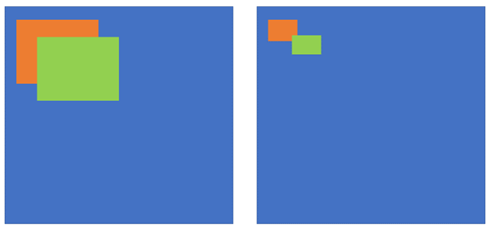

# 1 训练

+ 使用 AlexNet 在 ImageNet-1000 上进行图像分类的预训练。

+ 在 VOC （N=20）上进行 $N + 1$ （背景）类的图像分类的微调（替换掉 AlexNet 的最后一个全连接层，但仍然使用softmax）：

  + 使用 Selective Search 挑选出2000个Region Proposals。

  + 使用 Softmax 分类器 + SGD 进行微调:

    + 指定每一个 Region Proposal 的类别：
      + 如果一个Region Proposal 和任意一个Ground-truth box的 $IoU \ge 0.5$ ，则指定该Region Proposal的类别为Ground-truth的类别。
      + 如果一个Region Proposal 和所有的 Ground-truth box的 $IoU < 0.5$ ，则指定该Region Proposal的类别为背景。

    + 每个 Batch 挑选出来32个正样本，96个负样本进行训练，即 $bs=128$ 。

    + 对于挑选出的128个样本，由于FC层需要固定尺度的输入，因此把每个 Region Proposal都Resize到 $227\times 227$ 。此外，在 Resize 之前，每个Region Proposal实际上是向四周扩展了 $p=16$ 个像素的（为了边界框回归）。

    + 使用 SGD + Softmax 微调 AlexNet-(N+1)。

  + 训练 SVM：

    + 指定每一个 Region Proposal 的类别：
    
      + Ground-truth 为正样本。
    
      + 如果一个Region Proposal 和所有的 Ground-truth box的 $IoU < 0.3$ ，则指定该Region Proposal的类别为背景。
    
      + 如果一个Region Proposal 和所有的 Ground-truth box的 $0.3 \le IoU \lt 1$ ，则忽略该 Region Proposal。
    
    + 使用所有 Positive 和 Negative 的样本（没有忽略样本，也不按比例挑选）训练SVM：
    
      + 使用微调后的 AlexNet 提取的4096维的特征向量训练 SVM 。
    
      + 由于不挑选一定比例的正负样本，因此训练数据非常大。所以采用了 Negative Mining 方法。
    
  + 定位（在SVM训练完成之后）：
  
    + 对于 SVM 分类为正样本的 Region Proposal，并且该Region Proposal 与 Ground-truth 的 IoU 大于 0.6 。把 Pool5 的特征拿出来，Flatten。
  
    + 使用一个线性层 （FC） 得到  $d_x, d_y, d_w, d_h$ 。
  
    + 对于 Ground-truth 的 $G_x, G_y,G_w,G_h$ 和 Region Proposal 的 $P_x, P_y, P_w, P_h$ ：
      $$
      t_x = \frac{G_x - P_x}{P_w} \\
      t_y = \frac{G_y - P_y}{P_h} \\
      t_w = log(\frac{G_w}{P_w}) \\
      t_h = log(\frac{G_h}{P_h}) \\
      $$
  
    + 使用 MSE 计算loss，该过程不改变 backbone 的权重。
  
    

# 2 测试

+ 使用 Selective Search 算法选出来2000个候选框。

+ 每个候选框扩充四周的16个像素，并Resize到227。之后使用 AlexNet 提取特征。

+ 使用 SVM 进行分类。

+ 对于预测为物体的Region Proposal，使用边界框回归来修正边界：
  $$
  G_x = d_xP_w + P_x \\
  G_y = d_yP_h + P_y \\
  G_w = exp(d_w) P_w \\
  G_h = exp(d_h) P_h \\
  $$
  

# 3 Issue

## 3.1 为什么不按照实际的正负样本比例进行微调？

`We bias the sampling towards positive windows because they are extremely rare compared to background` 

因为正样本的比例非常小，会导致模型过分倾向于将所有Region Proposal都预测成负样本。

## 3.2 为什么在Softmax和SVM的过程中，正负样本的定义不同？

+ 正样本：
  + 训练 FC+Softmax 需要更多的样本以防止过拟合，而实际中的正样本非常少，因此使用了更加宽松的阈值来挑选正样本，这种方式把正样本的数量大约扩大了 30 倍。
  + 训练SVM时，SVM适合小样本训练，因此对正负样本的限制更加严格（找到更多支持向量）。
  + 训练SVM时，实验发现在 ${0, 0.1, ..., 0.5}$ 中，使用 0.3 作为阈值更好。使用 0.5 时mAP 降低了 $5\%$ ，使用 0 时 mAP 降低了 $4\%$ 。

## 3.3 为什么不直接使用Softmax进行分类，而是使用SVM呢？

+ 首先是 mAP 从 $54.2\%$ 下降到了 $50.9\%$ 。
+ 其次，作者认为是以下两个方面的共同作用：
  + 训练 Softmax 时，只要 IoU 大于等于 0.5 就认为是正样本并分配类别标签，会导致定位的精度下降。
  + 训练 Softmax 时，正负样本是随机采样的，而 SVM 使用的确实难例（支持向量）。因此 SVM 的决策边界更准确。
+ 作者认为，如果加入额外的微调，Softmax 和 SVM 的性能差距可能会消失。

## 3.4 为什么使用 Pool5 的特征进行定位？

因为输入图像的尺寸固定为 $227 \times 227$ ，而 Pool5 中心位置的感受野为 $195 \times 195$ ，基本上可以获得全局的视野。

## 3.5 为什么定位使用Pool5的特征，而SVM却使用第二个全连接层（fc7）的特征？

+ 实验发现，使用 fc7 的特征相较于使用 Pool5 的特征又提升。
+ 作者认为 Pool5 包括之前的卷积层提取的特征是通用的，而对于特定领域的分类需要额外的分类器（全连接层）提取特征。
+ 本人认为，Pool5 的特征更好的保留了空间信息。

## 3.6 为什么边界框回归使用线性层？

+ 首先，存在等价无穷小：
  $$
  \lim_{x \to 0} \frac{log(1 + x)}{x} = 1
  $$

+ 对于边界框回归，以宽度回归为例：
  $$
  t_w = log(\frac{G_w}{P_w}) = log(\frac{G_w + P_w - P_w}{P_w}) = log(1 + \frac{G_w - P_w}{P_w})
  $$
  当 Region Proposal 的宽度和真实框的宽度非常接近时，即 $G_w \approx P_w$ 时，$G_w - P_w \approx 0$ :
  $$
  t_w \approx \frac{G_w - P_w}{P_w}
  $$
  即:
  $$
  G_w \approx t_w P_w + P_w
  $$
  
+ 预测时，我们的目标是从一个特征向量 $F$，变换成为 $G_w$ 。

  + 首先使用线性层（权重为 $A$）对特征进行变换（考不考虑偏置都一样），得到 $d_w$ / $t_w$ 
  
  $$
  d_w = AF
  $$
  
  + 之后，如果 $G_w \approx P_w$ ，则：
    $$
    G_w \approx t_w P_w + P_w = P_wAF + P_w
    $$
  
  + 其中，Region Proposal 的 $P_w$ 是常量，权重 $A$ 是常量。因此上式形如 $G_w = ax + b$ ，其中 $x = F$ 。
  
  + 即，从特征 $F$ 到预测高宽 $G_w$ 的变换是一个线性变换。因此可以使用线性层。
  
+ 对于 x 和 y 的原理同上。

## 3.7 为什么训练边界框回归时的 IoU 阈值设置为0.6呢？

如 **3.6**  介绍，只有候选框和真实框的高宽非常接近时，才可以使用线性层进行线性变换。

## 3.8 为什么边界框回归需要使用相对坐标差，以及log高宽的比值？

+ x 和 y 除以宽高的原因是因为 **进行尺度归一化，解决输入图像的尺寸大小不等的问题**：

  + 原因一：**避免不同尺度的物体计算 loss 是的差异**：

    

    如上图所示左图的定位效果明显比右图更好，而如果直接利用坐标相减 $G_x - P_x$，反而左图的 Loss 更大。即会导致小目标的检测效果下降。因此需要除以预测框的宽高进行归一化。

  + 原因二：**保证回归器具有尺度同变性** ：

    

    如上图所示，两张图像内容相同，但尺度不同。由于最大池化，卷积网络具有尺度不变性，因此最终提取的特征是相同的：

    ```python
    import torch
    import torch.nn as nn
    
    class Model(nn.Module):
    
        def __init__(self):
            super(Model, self).__init__()
            self.conv = nn.Conv2d(in_channels=3, out_channels=1, kernel_size=(3, 3), stride=(2, 2), padding=(1, 1))
            self.pooling = nn.AdaptiveMaxPool2d(8)
    
        def forward(self, x):
            out = self.conv(x)
            out = self.pooling(out)
            return out
    
    img1 = torch.ones(size=(1, 3, 224, 224), dtype=torch.float32)
    img2 = torch.ones(size=(1, 3, 56, 56), dtype=torch.float32)
    
    model = Model()
    
    out1 = model(img1)
    out2 = model(img2)
    print(out1)
    print(out2)
    
    '''
    tensor([[[[0.5085, 0.5085, 0.5085, 0.5085, 0.5085, 0.5085, 0.5085, 0.5085],
              [0.5085, 0.5085, 0.5085, 0.5085, 0.5085, 0.5085, 0.5085, 0.5085],
              [0.5085, 0.5085, 0.5085, 0.5085, 0.5085, 0.5085, 0.5085, 0.5085],
              [0.5085, 0.5085, 0.5085, 0.5085, 0.5085, 0.5085, 0.5085, 0.5085],
              [0.5085, 0.5085, 0.5085, 0.5085, 0.5085, 0.5085, 0.5085, 0.5085],
              [0.5085, 0.5085, 0.5085, 0.5085, 0.5085, 0.5085, 0.5085, 0.5085],
              [0.5085, 0.5085, 0.5085, 0.5085, 0.5085, 0.5085, 0.5085, 0.5085],
              [0.5085, 0.5085, 0.5085, 0.5085, 0.5085, 0.5085, 0.5085, 0.5085]]]],
           grad_fn=<AdaptiveMaxPool2DBackward>)
    tensor([[[[0.5085, 0.5085, 0.5085, 0.5085, 0.5085, 0.5085, 0.5085, 0.5085],
              [0.5085, 0.5085, 0.5085, 0.5085, 0.5085, 0.5085, 0.5085, 0.5085],
              [0.5085, 0.5085, 0.5085, 0.5085, 0.5085, 0.5085, 0.5085, 0.5085],
              [0.5085, 0.5085, 0.5085, 0.5085, 0.5085, 0.5085, 0.5085, 0.5085],
              [0.5085, 0.5085, 0.5085, 0.5085, 0.5085, 0.5085, 0.5085, 0.5085],
              [0.5085, 0.5085, 0.5085, 0.5085, 0.5085, 0.5085, 0.5085, 0.5085],
              [0.5085, 0.5085, 0.5085, 0.5085, 0.5085, 0.5085, 0.5085, 0.5085],
              [0.5085, 0.5085, 0.5085, 0.5085, 0.5085, 0.5085, 0.5085, 0.5085]]]],
           grad_fn=<AdaptiveMaxPool2DBackward>)
    '''
    ```

    假设左右两个图像的真实值的 x 坐标分别为 $x_1$ 和 $x_2$，候选框的 x 坐标分别为 $p_1$ 和 $p_2$ 。pool5提取的特征都为 $F$ ，线性层为 $H$ 。则：

    + $ H(F) = x_1 - p_1 $
    + $ H(F) = x_2 - p_2 $

    但是显然 $x_1 - p_1 \ne x_2 - p_2$ 。因此直接相减是不成立的。所以，除以各自候选框的高宽进行尺度归一化才能够保证上述两个式子恒等。

     

+ w 和 h 计算比值并 log 的原因是：

  + 最终 exp  计算能够保证高宽的非负性。同时，相较于ReLU等限制预测值的符号，使用 Log-exp变换可以使用线性层进行回归任务。
  + 与 x 和 y 相同，直接计算 $w_1 - p_1$ 和 $w_2 - p_2$ 不具有尺度同变性。

## 3.9 测试时为什么不多次迭代边界框回归和SVM分类？

即，SVM预测的正样本，使用边界框回归。再使用SVM预测，再使用边界框回归。如此多次迭代。

不这样做时因为作者发现多次迭代并没有改善结果。

## 3.10 如果多个SVM都预测为正样本，怎么办？

选得分最高的。
