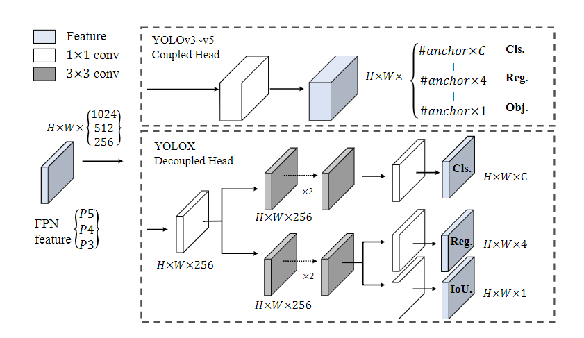
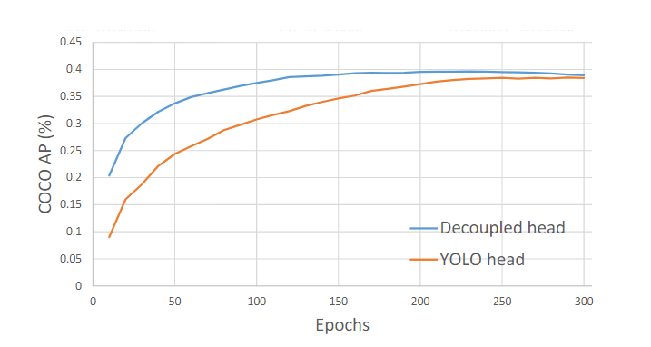

YOLOX 是 anchor-free 的，包含：

+ 一个解耦的 head
+ SimOTA
+ 选择 YOLOv3 作为基线模型 (由于v4和V5都是基于 anchor-based 过度优化的)

# 1 训练

+ total 300 epochs, 5 warm-up epochs on COCO tarin2017
+ SGD, momentum =0.9, weight decay = 5e-4
+ 默认lr=0.01，实际 $lr = lr \times Batchsize / 64$ 
+ bs = 128, GPUs = 8
+ inputsize = [448, 832, strde=32]
+ EMA
+ cosine lr schedule
+ IoU loss for reg branch
+ BCE for cls and objectness branch
+ HFlip, ColorJitter
+ 没有使用 RandomResizedCrop，由于 Mosaic 中包含了 RandomResizedCrop

# 2 解耦头

YOLO系列通常只有一个头，通过 head 的通道维度同时预测分类和回归：



YOLOX 发现解耦 head 能够极大提升收敛速度



解耦头的结构：

+ 白色卷积是一个共享的 $1 \times 1$ 的卷积，用于减少通道维度
+ 之后两个并联的 $3 \times 3$ 的卷积
+ 最后 $1 \times 1$ 的卷积进行预测

# 3 数据增强

使用了 Mosaic 和 MixUP 强数据增强。最后 15 个 epoch 去掉这两个强数据增。**在使用了强数据增强之后，发现在 Imagenet 预训练并没有提升，因此 YOLOX 是直接从头训练的。**

# 4 SimOTA

## 4.1 候选正样本

1. anchor-point 在 gt 的 bbox 范围内的作为候选正样本。
2. 以 gt 中心点为中心，在特征尺度上，分别向上下左右扩展 2.5 个位置。该区域内的所有 anchor-point 都作为候选正样本。
3. 得到两组mask : 满足1 or 满足 2 ，满足 1 and 满足 2
4. 注意：计算和 gt 的位置的中心点坐标，不是 predict 的，而是 anchor-point 的。并且和感受野中心对齐：$cx = [0, 1, 2, w-1]* stride + 0.5 * stride $

## 4.2 计算 Cost

1. 计算 gt 和 predict 的 cost:
   $$
   c_{ij} = L_{ij}^{cls} + \lambda L_{ij}^{reg}
   $$

其中 ，$\lambda = 3$：

+ reg loss: 计算候选正样本和 gt 的iou，之后计算 $L_{ij}^{cls} = -log(iou)$ 。

+ cls loss : 计算候选正样本的预测分数 cls_pred = cls_pred.sigmoid() * objectness.sigmoid(), $L_{ij}^{cls} = BCE(cls_pred, gt)$ 。这里使用了 autocast:

  ```python
  with torch.cuda.amp.autocast(enabled=False):
  	# 预测的每个类别的分数 * conf ---------- [num_gt, 555, 1]
  	cls_preds_ = (
                  cls_preds_.float().unsqueeze(0).repeat(num_gt, 1, 1).sigmoid_()
                  * obj_preds_.float().unsqueeze(0).repeat(num_gt, 1, 1).sigmoid_()
              )
  	# 潜在正样本的预测类别和其对应的gt的类别的BCE.sum(-1) ----- [num_gt, 555]
  	pair_wise_cls_loss = F.binary_cross_entropy(
                  cls_preds_.sqrt_(), gt_cls_per_image, reduction="none"
              ).sum(-1)
  ```

+ $$
  cos = cost_{cls} + 3 \times cost_{iou} + 1000 \times (is\_in\_box\_and\_center =False)
  $$

+ 即，不是同时落在 gt bbox 内和 中心点范围内的，cost 加1000。**这并不意味着 （落在 gt bbox内 或 中心点半径内）的框就不选了，而是优先选择同时落在两者的，如果同时满足两者的cost比较大，那么就从 “或” 中的候选正样本去选。**

## 4.3 Dynamic K

+ 首先确定固定的 $k = 10$

+ 从所有候选正样本（“或”中的正样本，而不是只有 "and"） 中 gt 和 pred 的 IoU 中。给每个 gt 选择出来 $top_k$ 的 IoU （只要 IoU 的值）

+ 根据 $top_k$ 的 IoU 的 sum ，作为动态的 Dynamic K （最小是1）：

  ```python
  dynamic_ks = torch.clamp(topk_ious.sum(1).int(), min=1)
  ```

+ 从 cost 中，给每个 gt 选择出来对应的对应的 $top_k$ 小的 cost ，拿到这些 cost 的索引，即 anchor-point 的索引。

  ```python
  for gt_idx in range(num_gt):
  	_, pos_idx = torch.topk(
  	# 上面动态计算出来每个gt需要选几个anchor之后，从cost中选择cost最小的k个anchor，负责预测该gt
  	cost[gt_idx], k=dynamic_ks[gt_idx], largest=False)
  	# gt_idx是行索引,表示第i个gt，pos_idx是列索引，表示第j个候选框。ij=1表示第i个gt和第j个候选框成功匹配了
  	matching_matrix[gt_idx][pos_idx] = 1
  ```

+ 一个 anchor 只能匹配一个 gt ，按照 cost 去重

