`You Only Look One-Level Feature`

# 1 动机

FPN为什么有效？通常认为有两个原因：

+ 多尺度特征融合。融合低分辨率和高分辨率的特征，能够获得更好的特征表示。
+ 分治。在不同level上检测不同尺度的物体。

YOLOF 设计了多个实验来证明FPN为什么有效，包括：

+ MiMo (FPN)
+ SiMo
+ MiSo
+ SiSo

如下图所示：

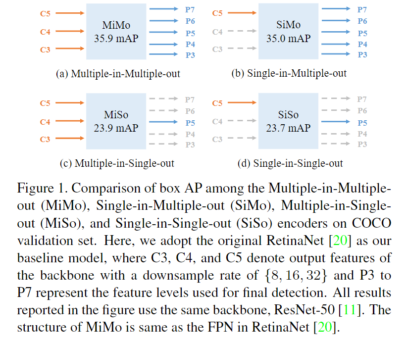

意外的事，SiMo 只使用了 C5 (下采样32倍) 的特征，却获得了与 FPN 不到 1mAP 的差距。但是 SiMo 并没有融合多个不同尺度的特征。此外， MiSo 和  SiSo，虽然 MiSo 融合了多个尺度的特征，但是却和 FPN 有 $\ge 12$ 的 mAP 差距。

这个现象表明：

+  C5 的特征已经具有足够的上下文信息来检测不同尺度的物体了。因此 SiMo 才能够和 FPN 具有接近的表现。
+ 多尺度特征融合 （MiSo） 远没有分治有效。

---

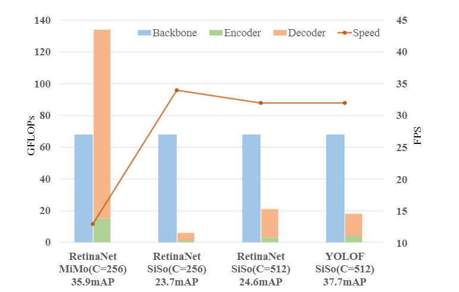

然而，不管输入时多尺度融合还是单尺度，只要输出时多尺度，都会导致额外的计算开销和内存，降低了检测器的速度。本文设计出了一种只使用单尺度输出，但是几乎不影响效果的方案 (You Only Look **One-Level** Feature, YOLOF)。YOLOF 只使用 32 倍下采样的特征来检测物体。但是这样就成了 SiSo 了，为了消除 SiSo 和 MiMo 的差距，本文所作的工作主要有以下两点：

+ 设计了一个 encoder，用于提取多尺度的上下文信息（但输出只有1个尺度），用于弥补单尺度缺乏多层特征的缺点。
+ 之后，为了解决单尺度的正样本远没有多尺度丰富的问题（sparse anchors），设计了一个 uniform matching 样本分配机制。

# 2 本文方法

从 SiMo 能够获得和 FPN 接近的效果，可以知道 C5 特征已经包含了足够的上下文信息，能够用来检测不同物体。

SiSo 已经被证明效果非常差了，作者认为有两个原因：

+ C5 特征的感受野十分有限，无法检测不同尺度的物体。如下图所示，C5 可能只能覆盖 (a) 中的尺度的物体，再大就没办法覆盖了。

  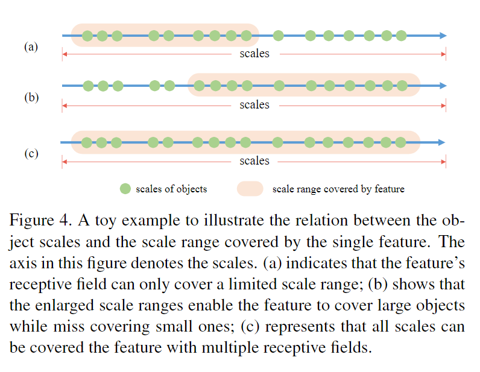

+ 只使用一个尺度，anchor的数量急剧减少 (about 100k 减少至 5k)，能够匹配到的正样本的数量也急剧减少。从而出现sparse anchors 和样本不平衡的问题。

下面就需要解决这两个问题。

## 2.1 受限的感受野

既然感受野受限，如上图 (a) 所示，那么再堆叠几个卷积或下采样不是就可以了么？但是如图 (b) 所示，尝试直接增大感受野，最终获得的还是一个固定的感受野，现在变成能检测大物体，但不能检测小物体了。

本文使用残差链接，在C5的基础之上，使用多个串联的堆叠的 空洞卷积，每个空洞卷积都能在前一个的基础上增大感受野。由于使用了残差链接，等价于把C5和后面几个空洞卷积的特征加起来了，作者说这样就能够使得输出特征具有多尺度感受野的信息，如上图 (c) 所示。

```
 Then, we combine the originalscale range and the enlarged scale range by adding the cor-responding features, resulting in an output feature with mul-tiple receptive fields covering all object scales (Figure4(c))
```

**存疑：为什么 C5 的感受野能够检测小物体？在 FPN 中，使用 C3, C4，C5 三层特征，并没有比C5感受野更大的特征了，但是却不影响大尺度的物体的检测。是不是说明 C5 已经足够检测大物体了，此时网络缺少的应该是小目标，但是本文却继续增大感受野，也没有办法解决小目标的感受野的问题啊？？？**


具体的，用于在 C5 后面增大感受野的卷积的结构为：

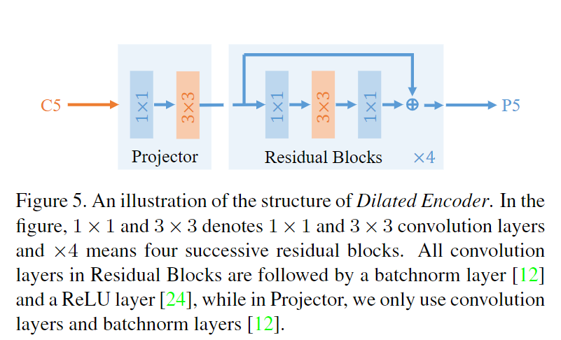

+ 一个 projector : 包含一个 $1 \times 1$ 的卷积用于变换通道维度（C5的2048到512），再跟上一个 $3 \times 3$ 的卷积用于重整语义信息。这两个卷积后面都各自跟了一个 BN，但是没有激活函数。
+ 之后，堆叠了 k 个标准的 bottleneck blocks，每个 block 都是 $1 \times 1 + 3\times 3 + 1\times 1$ + 残差连接的结构。3个卷积后面都各自跟了一个 BN + ReLU。需要注意，最后一个激活是在 skip connection 之前，即残差加完了之后就直接输出了。
+ 本文的结构 k = 4, 4个 residual blocks 的 dilated ratio 分别为  [2,4,6,8] 或 [4,8,12,16] 。此外，还有 k 更大的结构，能够涨点，但也耗时。

## 2.2 平衡正样本的数量

大目标的IoU通常比小目标更好，因此在使用 IoU 划分正负样本的方法中，通常大目标更容易被划分到更多的 anchors 。如果 anchor 的数量本来就不多，则小目标就更难划分到 anchor 了，导致模型更关注大物体，而忽略了小目标。如下图所示：

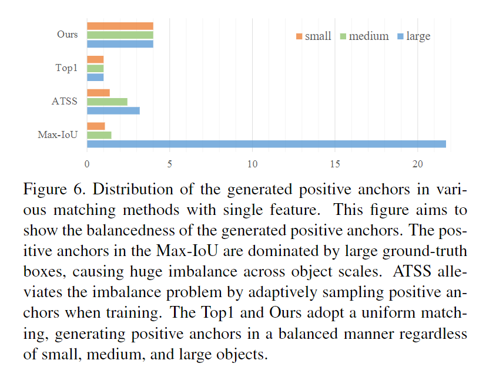

为了解决这个问题，本文提出了一种 Uniform Matching 的标签分配机制。

## 2.3 Uniform Matching

如上图所示，Uniform Matching 的目标是让每个 gt 都匹配到相同的 anchors，即 Uniform 。匹配方式如下：

+ 对于 预测值 和 gt，计算 predict_cxcywh 和 targets_cxcywh 的坐标点的欧式距离（不是 iou，也不是中心点距离，就直接是坐标的欧式距离）:

  ```python
  cost_bbox = torch.cdist( 
      bbox_xyxy_to_cxcywh(bbox_pred), 
      bbox_xyxy_to_cxcywh(gt_bboxes), 
      p=1) 
  C = cost_bbox
  C = C.view(bs, num_queries, -1).cpu()
  ```

+ 对于 anchor 和 gt (YOLOF是 anchor-based 检测器)，计算 anchor_cxcywh 和 targets_cxcywh 的坐标点的欧式距离（不是 iou，也不是中心点距离，就直接是坐标的欧式距离）:

  ```python
  cost_bbox_anchors = torch.cdist( 
      bbox_xyxy_to_cxcywh(anchor), bbox_xyxy_to_cxcywh(gt_bboxes), p=1) 
  C1 = cost_bbox_anchors
  C1 = C1.view(bs, num_queries, -1).cpu()
  ```

+ 从 predict 和 target 的坐标的欧式距离中取出 topk 个样本作为正样本：

  ```python
  index = torch.topk( 
      C,  
      k=self.match_times, 
      dim=0, 
      largest=False)[1] 
  ```

+ 从 anchor 和 target 的坐标的欧式距离中取出 topk 个样本作为正样本：

  ```python
  index1 = torch.topk(C1, k=self.match_times, dim=0, largest=False)[1] 
  ```

+ 此时，每个 gt 共匹配了 $2 \times topk$ 个样本。

+ 堆叠  $2 \times topk$  个样本：

  ```python
  indexes = torch.cat((index, index1), 
                      dim=1).reshape(-1).to(bbox_pred.device) 
  ```

+ 计算所有 预测框 和 gt 的 IoU，并计算出 predict 和 任意的 gt 的最大 IoU

  ```python
  pred_overlaps = self.iou_calculator(bbox_pred, gt_bboxes) 
  pred_max_overlaps, _ = pred_overlaps.max(dim=1) 
  ```

  如果一个 predict 没有被选为正样本，但是该 predict 和某个 gt 的 IoU 大于0.75了，则该 predict 为忽略样本。（这种情况在大目标中容易出现，大目标本身就比较容易回归，一个大目标很容易出现大于 k 个能够匹配的预测框）

+ 计算所有 anchor 和 gt 的 IoU，并计算出 anchor 和 任意的 gt 的最大 IoU

  ```python
  anchor_overlaps = self.iou_calculator(anchor, gt_bboxes) 
  anchor_max_overlaps, _ = anchor_overlaps.max(dim=0) 
  ```

  如果一个 anchor 被选为正样本了，但是该 anchor 和任意 gt 的最大 IoU 小于 0.15，则该anchor不合适作为正样本，认为是忽略样本。
  
+ 看代码和论文，是没有去重操作的。

# 3 Loss

+ 分类使用  Focal Loss
+ 回归使用 GIoU Loss

```python
loss_cls=dict( 
    type='FocalLoss', 
    use_sigmoid=True, 
    gamma=2.0, 
    alpha=0.25, 
    loss_weight=1.0), 
loss_bbox=dict(type='GIoULoss', loss_weight=1.0)) 
```


# 4 实验

## 4.1 空洞卷积和 Uniform Matching

+ 不适用 Uniform Matching，Middle 和 Small 的 AP 下降的最严重

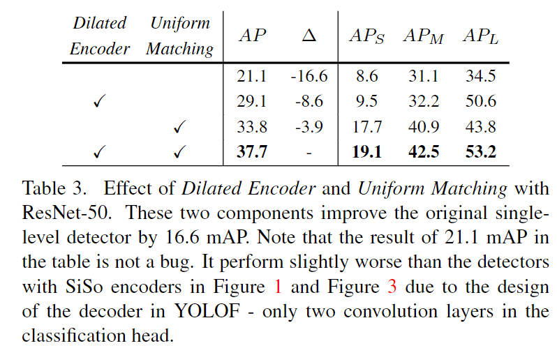

## 4.2 额外使用多少个ResBlocks

+ 使用 4 个最好

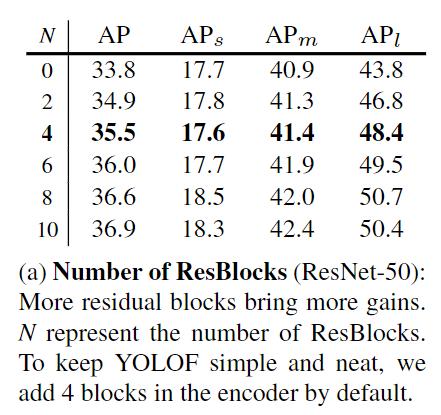

## 4.3 空洞卷积的膨胀率

+ 2，4，6，8最好

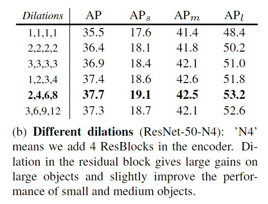

## 4.4 额外的ResBlock是否使用shortcut

+ 不管膨胀率是多少，移除shortcut之后，性能都会显著降低。这是由于shortcut结合了不同尺度的特征。

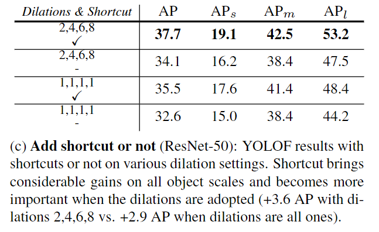

## 4.4 Uniform Matching中，每个gt匹配多少个正样本

+ k = 4 最好。

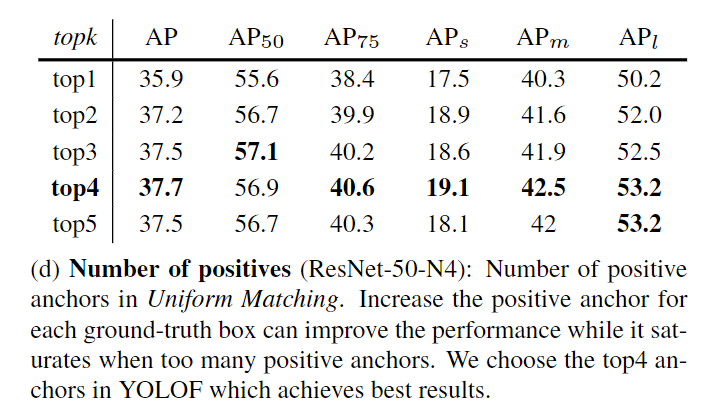

## 4.5 对比其他 Assigner

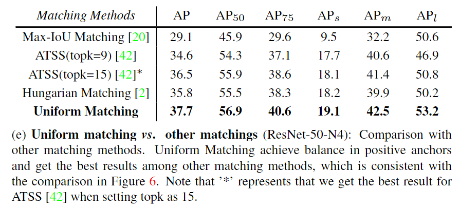
