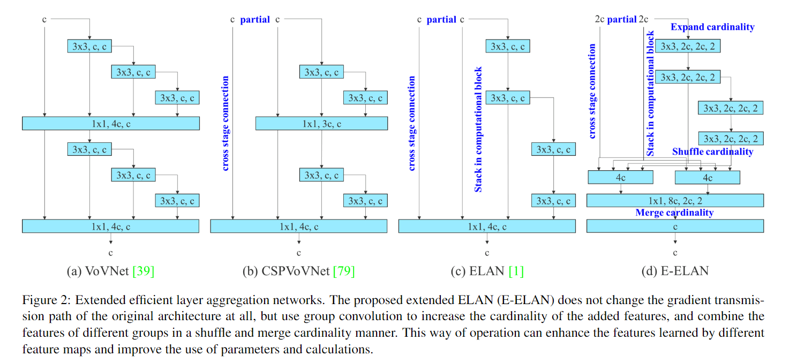
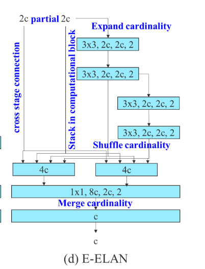
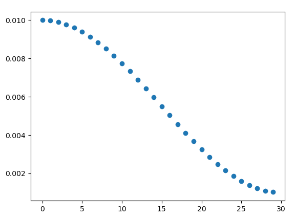
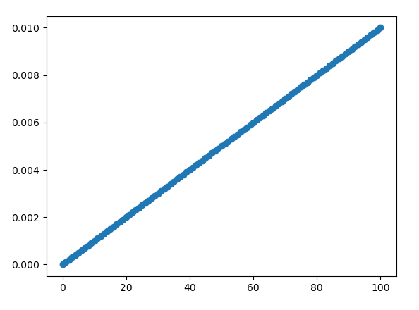
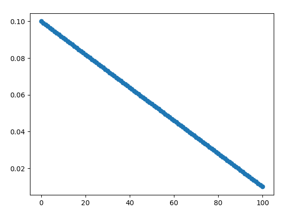
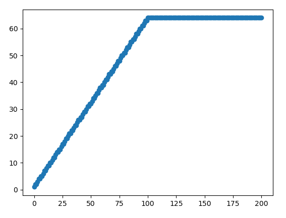
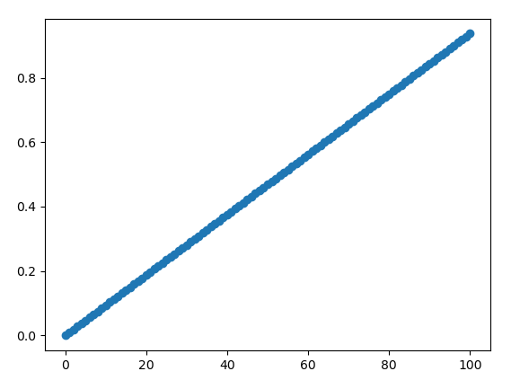
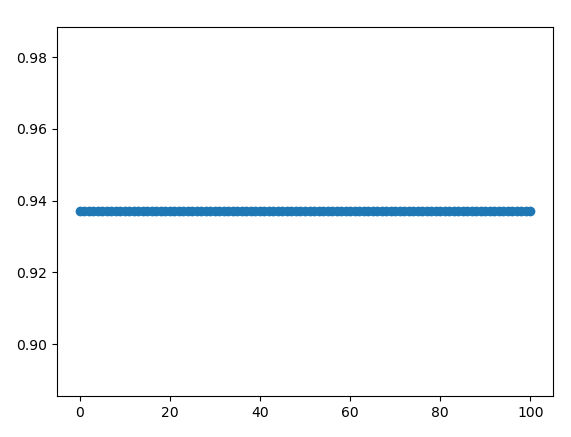

`YOLOv7: Trainable bag-of-freebies sets new state-of-the-art for real-time object detectors`

code : [WongKinYiu/ yolov7](https:// github.com/ WongKinYiu/ yolov7)

---

YOLOv7超过了所有已知的检测器，无论是速度还是精度。主要贡献包括：

+ 设计了几种可训练的 bag-of-freebies，可以在保证推理速度不变的情况下，显著增强检测精度。
+ 发现了两个新的问题：
  + 如何使用重参数化结构代替原有的模块
  + 动态标签指定策略如何处理不同的输出层
+ 提出了 "extend" 和 "compound scaling" 方法，可以有效的利用参数和计算量
+ 本文的方法可以有效的减少40%的参数量和50%的计算量

---

本文不会研究自监督学习或蒸馏方法，因为需要额外的数据或大模型。

# 1 Related Work

## 1.1 实时目标检测

目前主要的实时目标检测都是基于 YOLO 或 FCOS 的。

一个算法要想具有实时目标检测，需要具有以下特性：

+ 更快和更强大的网络结构
+ 更高效的特征融合方法 (Neck)
+ 更准确地检测方法 (Head)
+ 更鲁棒的损失函数
+ 更有效的标签分配方法
+ 更有效的训练方式

本文主要关注 **更鲁棒的损失函数 更有效的标签分配方法 更有效的训练方式** 三点。

## 1.2 模型重参数化

模型重参数化方法可以分为两类：

+ Model-level
  + 训练多个相同的模型，之后平均不同模型的权重
  + 训练多个相同的模型，加权平均不同模型的权重
+ Module-level
  + 把一个模块分成多个相同或不同的模块分支，并在测试时聚合多个分支为一个完全等价的模块

然而，不是所有的重参数化方法都能够完美的应用到不同的网络架构中。本文研究了新的重参数化模块，并针对不同的网络结构设计了相关的应用策略。

## 1.3 模型缩放

模型缩放通常使用不同的缩放因子：

+ 输入图像分辨率
+ 网络深度
+ 网络宽度
+ stages (FPN的level)

NAS是最常用的方式来缩放模型，但是NAS的缺点是需要非常昂贵的计算量。然而我们发现，几乎所有的模型缩放方法都独立的分析不同的缩放因子，甚至复合的缩放方法也独立分析每个因子 (如densenet等concat的方法，在深度加深的同时，宽度也会加深)。由于本文提出的方法的网路结构是concat-based的，因此本文设计了一种新的复合缩放方法。

# 2 网络结构

## 2.1 E-ELAN

绝大多数的高效网络结构设计无外乎考虑以下几点：

+ 参数量
+ 计算量
+ 计算密度
+ 从MAC的角度考虑：
  + 输入输出通道的比例（相等最好）
  + 分支数量（越少越好）
  + element-wise操作 （CPU是越少越好, GPU未测试）
+ 激活函数 （ReLU最好，clip 不利于量化）
+ 梯度路径，使不同layer的特征具有多样性：
  + E-ELAN

E-ELAN 包含：

+ Expand : 输入通道是 C，每个分支的通道数是 2C

# 3 训练策略

## 梯度累计

+ 梯度累计固定为64，搭配默认的学习率等超参设置
+ warmup时，梯度累计从0线性增长至64
+ 正常训练时，梯度累计固定为64

以 warmup 100 iters 为例：

## 学习率

+ warmup的学习率线性变化

+ 正常训练的学习率余弦衰减 

  

## warmup

以warmup=100为例：

+ 除了bias之外的学习率从0线性增长至初始学习率 (0.01)

  

+ bias 的学习率从 0.1 线性下降至 0.01

  

+ 梯度累计从0线性增长至64

  

+ 动量使用线性增长，从初始动量线性增长至正常动量：

  

  但是yolov7中设置的初始动量等于正常动量，因此在yolov7中，动量在warmup的过程中没有变化，就是正常动量：

  