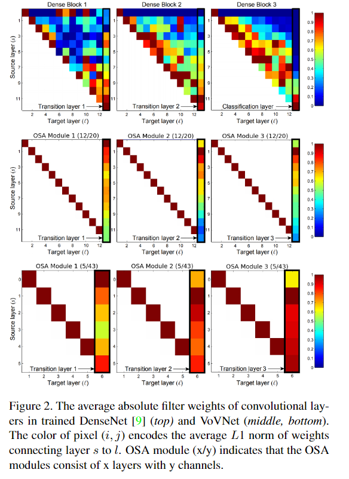
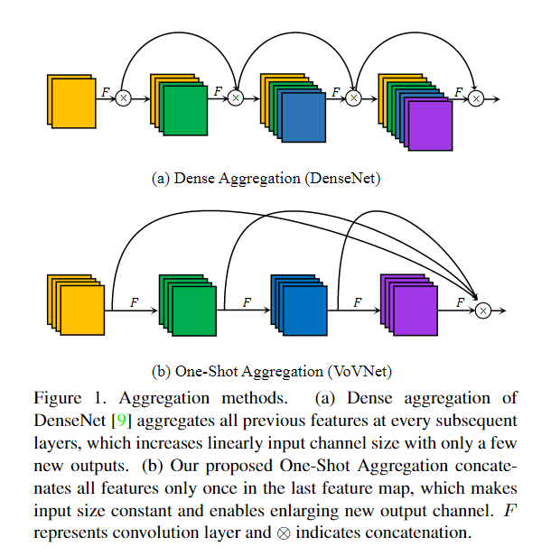
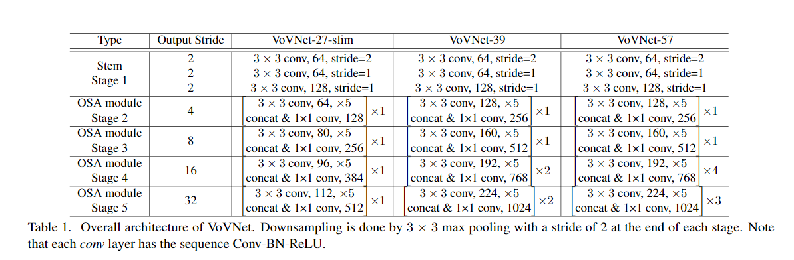
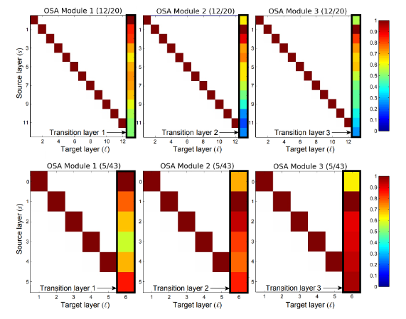
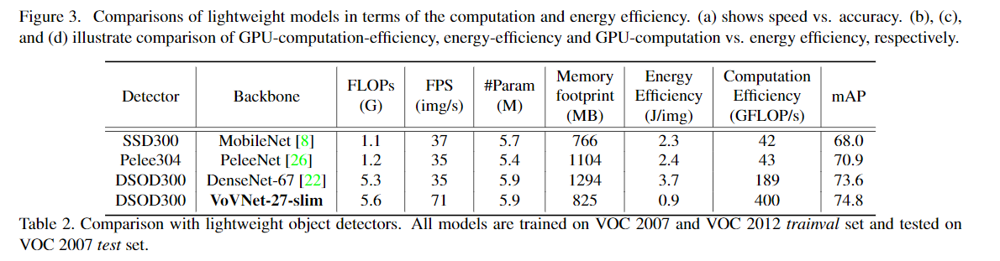

`An Energy and GPU-Computation Efficient Backbone Network for Real-Time Object Detection`

# 1 动机

DenseNet使用dense connection聚合具有多种感受野的特征，表现出了较好的性能。然而，尽管DenseNet的特征重用来产生强语义特征只引入了少量的额外参数和计算量，但是concat会严重降低运行速度。

我们发现线性增长的输入通道会导致巨大的MAC，导致了计算瓶颈和更多的功耗。因此，本文提出了 VoVNet，由 One-shot Aggregation (OSA) 组成。

OSA 不仅能够产生DenseNet一样具有多种感受野的多样性特征，同时也解决了dense connection导致的低效问题。

为了验证VoVNet的有效性，我们设计了一个轻量级的VoVNet和一个大型的VoVNet。VoVNet-based 检测器比DenseNet-based 快2倍，功耗降低了1.6x - 4.1x。

# 2 Introduction

DenseNet-based detector 比 ResNet-based detector 好的原因是：

+ conncat 操作相较于element-wise addition，能够保留更加原始的特征。
+ 具有不同感受野的抽象特征能够获得不同尺度的视觉信息，这对于检测器识别不同尺度的物体是十分重要的。
+ Densenet 比 Resnet 更能够累积不同感受野的特征。

DenseNet慢有两个原因：

+ Dense conn 需要较大的MAC，用于访存中间特征
+ DenseNet的通道数线性增长，使用 $1 \times 1$ 的卷积作为bottleneck，这对于GPU的并行计算不友好。因为都是小算子，无法最大化的利用GPU的计算能力。

# 3 影响高效网络设计的因素

一些方法通常考虑FLOPs和参数量，然而这是不准确的：

+ ShuffleNet v2 和 MobileNet v2，但是 Shufflenet v2 在GPU上的速度更快
+ SENet比AlexNet的参数量少50倍，但是SENet的功耗更高

本文考虑的因素包括 MAC 和 GPU计算效率

## 3.1 Memory Access Cost

模型参数两和MAC不成正比的原因为：

内存占用包括网络参数和中间特征图两部分。如果中间特征图变大，MAC也会变大，而参数量是不变的。网络每层的MAC计算方式为：
$$
MAC = hw(c_i + c_o) + k^2 c_i c_o
$$
其中，$k ,h,w, c_i, c_o$ 分别表示卷积核尺寸，特征图高宽，输入、输出通道数。

## 3.2 GPU计算效率

一些轻量级模型通过减少FLOPs来减少计算时间的关键思路是：认为不同浮点操作的计算速度都相同。

然而，在GPU中这个结论并不成立。这是由于GPU的并行处理机制。输入tensor越大，GPU能够把大tensor分成多个并行计算的小tensor，如果每个小tensor都能够充分利用各个GPU cores, bingo!!! 

然而，如果输入tensor不够大，比如堆叠多个小卷积替代一个大卷积，每个小卷积虽然能够并行的处理，但是每个GPU cores 的计算能力都没有被充分利用。即使多个小卷积，也是串行计算的，每层的卷积都没有充分利用GPU的计算能力。不如使用一个大卷积，一次性的，更充分的利用GPU的计算能力。

因此，使用更紧凑的网络，更少的网络层。能使用大卷积就不使用小卷积（自认为也需要合理设置）。

GPU的计算效率虽然没法根据网络参数量，计算量，输入输出大小定量的计算，但是本文采用了

FLOP/s （FLOP per Second）来衡量。

+ FLOPs : Float Opertations，总的浮点计算量，越小越好
+ FLOPS : Float Operations per Second，每秒的浮点计算次数，越大越好

# 4 本文方法

## 4.1MAC的下限

DenseNet不同layer的通道数线性增加，则 $MAC = hw(c_i + c_o) + k^2 c_i c_o$ ，令 $h,w,k$ 为常数，$c_i, c_o$ 为变量。

---

均值不等式：
$$
(a+b)^2 = a^2 + b^2 - 2ab \ge 0 \\
a^2 + b^2 \ge 2ab
$$

---

所以:
$$
MAC = hw(c_i + c_o) + k^2 c_i c_o \\
= \sqrt{(hw)^2(c_i+c_o)^2} + k^2c_ic_o \\
= \sqrt{(hw)^2(c_i^2+c_o^2 + 2c_ic_o)} + k^2c_ic_o \\
$$
由于
$$
c_i^2+c_o^2 \ge 2c_ic_o
$$
所以
$$
c_i^2+c_o^2 + 2c_ic_o = (c_i + c_o)^2 \ge 4c_ic_o \\
$$
所以
$$
MAC = \sqrt{(hw)^2(c_i^2+c_o^2 + 2c_ic_o)} + k^2c_ic_o \\
= \sqrt{(hw)^2(c_i+c_o)^2} + k^2c_ic_o \\
\ge \sqrt{(hw)^2(4c_ic_o)} + k^2c_ic_o \\
$$
该层的计算量为：
$$
B = k^2hwc_ic_o
$$
替换 MAC 得到：
$$
MAC = 2\sqrt{(hw)^2(c_i+c_o)^2} + \frac{B}{hw} \\
\ge \sqrt{(hw)^2(4c_ic_o)} + \frac{B}{hw} \\
$$
由于当且仅当 $c_i = c_o$ 时：
$$
(c_i + c_o)^2 = (2x)^2 = 4x^2 = 4c_ic_o = 4x^2 \\
$$
即，$MAC$ 取下限 $\sqrt{(hw)^2(4c_ic_o)} + \frac{B}{hw}$

所以，在FLOPs $B = k^2hwc_ic_o$固定时，当且仅当 $c_i = c_o$ 时，MAC取最小值。

然而，由于DenseNet的输入输出通道线性增加，因此计算效率较低。并且，DenseNet使用 1x1的卷积压缩特征，同样是GPU inefficient的。

## 4.2 网络结构

如下图所示：

+ 通过计算各层归一化的weights的L1 norm，即绝对值。表明transition layer对浅层特征的权重是非常低的。如第一行，横轴transition layer=12，纵轴source layer=1时，对应的归一化L1 norm的值基本上接近0，表明source layer=1对深层transition layer的贡献非常低。
+ 需要注意。通过实验证明，如果浅层特征直接连接到输出层，而不使用Dense连接的话，CIFAR-10的准确率会掉1.2%，但仍然比resnet50高。

因此，本文提出了一种 One-shot Aggregation (OSA)模块，只在最后一层聚合一次特征。如下图(b)所示。

+ 每个卷积都有两个通路。一个连接到相邻的下一层，用于产生更大的感受野；另一个连接到输出特征图。

整体的网络结构如下表所示。

可以发现，OSA Module 的数量相对还是比较少的。之所以可以使用较少的block的原因分析如下：

如下图所示，OSA模块中，深层的特征对聚合层的权重小于浅层特征，意味着可以去掉部分深层网络层，即减少OSA模块的数量。

# 5 实验

