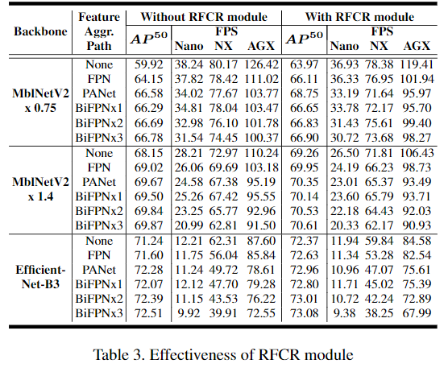
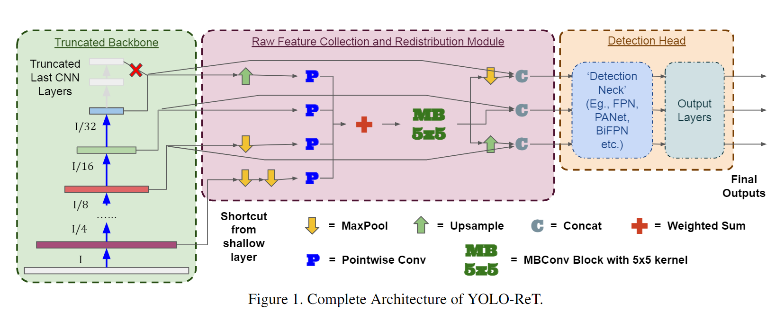
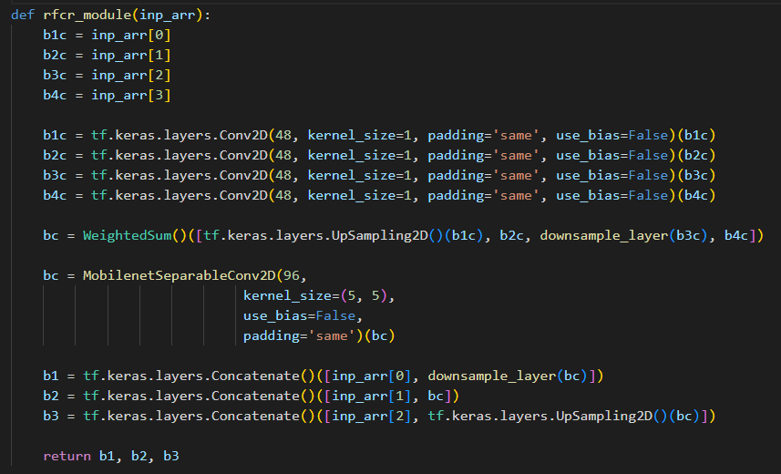
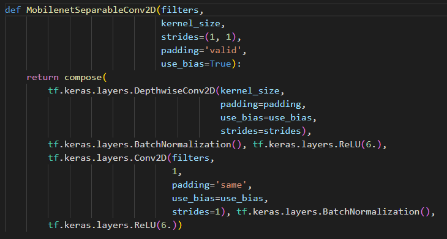
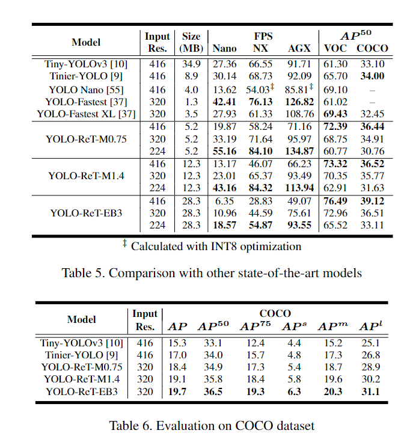

# 1 动机

- 多尺度特征交互是现在目标检测模型的关键。然而，现有方法倾向于设计越来越复杂的多尺度特征交互模块，效率较低。
- 大多数方法使用top-down和bottom-up的方法来collect特征，这些方法无法利用非相邻尺度的特征交互。
- 现有方法的特征交互方法被输出特征尺度所限制（如YOLOv3是由3个尺度的输出），因此缺乏重要的low-level特征。

因此本文设计了一个特征collect和re-distribution模块：

+ 提出了一个轻量级的 Raw Feature Collection and redistribution (RFCR) 模块，可以高效的聚合多尺度特征。此外，RFCR模块和最终输出head的层数无关，能够更好的利用多尺度特征融合。

# 2 方法

## 2.1 Raw Feature Collection and Redistribution (RFCR)

+ 现有方法的多尺度特征交互可以分为top-down和bottom-up的方法，这些方法只关注两个相邻的特征尺度at a time。缺乏大量的特征交互的可能性，并使得不同尺度的信息交互的传播变得困难。

+ 此外，BiFPN虽然能够虽短浅层特征到深层特征的路径，但是如果堆叠大量的上采样下采样层（如, BiFPNx3），模型的性能会发生退化：

  

+ 受NAS-FPN的期房，本文提出了一种轻量级的特征collect和redistribution模块。该模块融合原始的backbone的多尺度特征，之后通过重分布的方式来恢复空间特征尺度。因此任意尺度的特征都可以直接与其他尺度直接连接。
+ RFCR层不包含任何重量的计算和参数。
+ **需要注意，RFCR层不能代替如FPN等多尺度融合模块**。RFCR只是为了提供一种在如FPN等多尺度特征融合模块之前的一个轻量级的特征预处理方法，用于提高准确率。

网络结构如下图所示：

主要思想为：把backbone的多个level的特征通过1次或多次下采样/上采样，都升维/降维到相同尺度，使用element-wise加法加到一起，再使用1个5x5的卷积，之后再通过下采样/上采样，从聚合后的特征中恢复出原始空间维度。**最后，送到FPN和Head中。**

+ 为了保证计算效率，backbone的特征都首先使用 1x1的卷积降维通道（至48）。
+ 之后，使用 最大池化，最近邻插值来进行下采样/上采样。
+ 之后，使用weighted-sum来聚合不同尺度的特征
+ 然后，使用一个5x5的mobilenet conv block。这是由于不同尺度直接聚合时，容易出现特征语义不匹配的问题，并且也存在局部空间位置不匹配的问题。因此使用5x5较大的卷积核来增大感受野。实验发现，使用更大的7x7的卷积核没有进一步改善性能。
+ 之后，特征通过上采样/下采样恢复空间维度，并送到FPN和Head中。

源码时TF实现：

其中，5x5的MBConv：

# 3 实验

## 3.1 训练细节

+ 数据增强使用了几何增强，如随机裁剪，旋转，反转，缩放等。以及色彩增强，如HSV，亮度等。
+ 使用自监督训练，余弦衰减学习率。
+ GIoU loss。
+ 首先冻结预训练层，使用0.001的初始学习率训练其他层100epochs。之后，解冻所有网络层，并使用0.0001的初始学习率微调150epochs。
+ 输入分辨率时320x320

## 3.2 实验结果

+ INT8量化损失没有问题
+ 效果比Tiny-YOLOv3好。