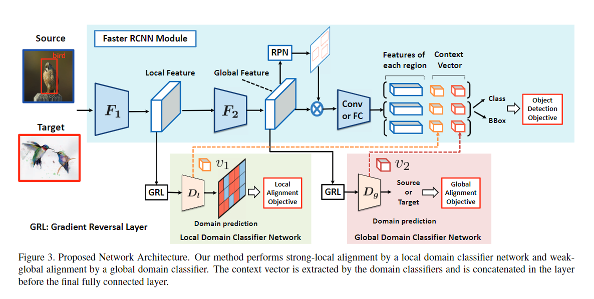
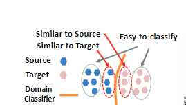
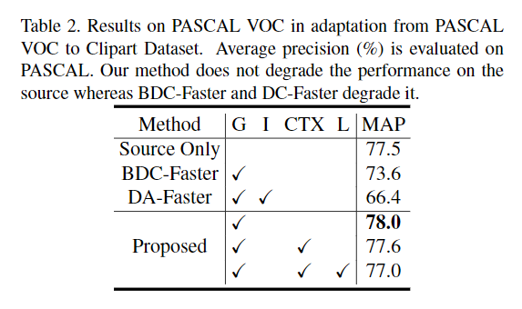

`Strong-weak distribution alignment for adaptive object detection`

# 1 动机

对抗损失（Adversarial loss）在图像分类中展现出了显著的改进。但是在目标检测中，匹配整张图像的分布却不work，这是由于源目图像通常存在不同的场景分布，以及不同的目标组合。此外，对局部特征（如纹理，颜色）的强匹配在图像分类中没有问题，并不改变category-level的语义，但是目标检测中却不行。

因此，本文提出了一种强局部对齐（strong local alignment）和弱全局对齐（weak global alignment）。本文的主要贡献是弱对齐模型，更对的关注图像中全局相似的对抗对齐损失(adversarial alignment loss)，并减少全局不相似的特征。此外，本文设计了仅关注具有局部感受野的特征，并进行强领域对齐。

# 2 方法

模型结构如上图所示：

+ 在较浅层进行强局部对齐
+ 在稍微深的网络层进行弱全局对齐

## 2.1 Weak Global Feature Alignment

假设使用一个领域分类器，用于区分一个样本是来自于源域还是目标域，需要注意：

+ 该分类器越容易区分这个样本是来自哪个域，说明这个样本的分布非常远离两个域的边界
+ 分类器越分不出一个样本是来自哪个域，说明这个样本越接近边界

因此，更需要关注的是靠近边界处的样本，即分类比较困难的样本。

定义：

+ 源域的图像 $x^s$ 和边界框 $y^s$ 组成的标签对集合为 $\{X_s, Y_s\}$ 

+ 无标签的目标域的图像 $x^t$组成的集合为 $X_t$ 

+ 全局特征提取器 $F$，如上图结构图所示，由于提取的是全局特征，因此 $F = F1 + F2$

+ 领域分类器（Domain Classifier）$D_g$ 用于预测全局特征的所属domain

+ 源域标签定义为 0，目标域标签定义为 1

+ 网络 $R$ 使用全局特征提取器 $F$ 提取的特征进行目标检测（分类+回归）

+ 检测损失为 
  $$
  L_{cls}(F, R) = - \frac{1}{n_s} \sum_{i=1}^{n_s} L_{det} (R(F(x_i^s)), y_i^s)
  $$
  其中，$L_{det}$ 是目标检测的损失，$n_s$ 表示源域的样本数量。

**需要注意：我们的目标并不是通过训练使得 $F$ 输出的特征能够很好的让 $D_g$ 分类，而是需要让特征能够很好的用于目标检测任务。** 

现有方法通常使用交叉熵损失来作为领域分类器的损失函数。但是如下图所示：

+ 需要肯定的是，CE Loss对于置信度越高的样本（越远离边界，越易分样本），Loss会越小。
+ 但是，即使是比较小的Loss，也会让域分类器 $D_g$ 和特征提取器 $F$ 产生相对较大的梯度。因此特征提取器会更加倾向于提取满足域分类的特征，从而影响目标检测的效果。
+ 本文提出的Weak Global特征对齐的思想就是：
  + 对于易分的样本（分布差异较大），不强迫其分布接近，避免强行改变特征分布从而影响检测的效果。对应上图，置信度高的样本需要比CE更小的Loss。
  + 对于难分的样本（分布差异接近），就可以相对的使其分布更加接近。由于本来分布就比较接近，所以对后续检测的影响也会稍微小一些。

为了满足上述思路，Focal Loss就是一种选择，并且如上图loss曲线所示，是满足要求的。由于定义了源域的标签是1，目标域的标签是0，因此两个Loss为：
$$
L_{global}^{source} =   - \frac{1}{n_s} \sum_{i=1}^{n_s} (1 - p_s)^{\gamma} log (p_s)
$$
其中， $p_s = D_g(F(x_i^s))$ 表示源域的预测分数。
$$
L_{global}^{target} =   - \frac{1}{n_t} \sum_{i=1}^{n_t} (1 - p_t)^{\gamma} log (p_t)
$$
其中， $p_t = D_g(F(x_i^t))$ 表示源域的预测分数。

最终弱全局特征对齐的Loss为
$$
L_{global}(F, D_g) = \frac{1}{2} (L_{global}^{source} + L_{global}^{target})
$$
特征提取器$F$ 是较深的网络，关注的是全局特征。但是如上分析，并不会对易分样本（分布差距大）产生足够强的影响。

## 2.2 Strong Local Feature Alignment

定义：

+ 强局部领域分类器 $D_l$ ，更加关注局部特征而不是全局特征。$D_l$是窗口为$1 \times 1$ 的全卷积网络。
+ 如网络结构图所示，2.1节中的特征提取器是$F = F_1 + F_2 $。而在$F_1$提取的浅层特征就是本小节$D_l$ 的输入。
+ $F_1$ 的输出特征的空间分辨率为 $H, W$ 
+ $D_l$ 输出局部（逐像素）的predict map，高宽与$F_1$输出特征相同。

如果使用逐像素的交叉熵，容易使训练不稳定，因此本文使用最小二乘（MSE）计算逐像素的分类损失（实验也证明这个损失函数最好）。本节的损失函数如下：
$$
L_{loc}^{source} = \frac{1}{n_sHW} \sum_{i=1}^{n_s} \sum_{i=w}^{W} \sum_{h=1}^{H} p_{s}^{2}
$$
其中，$p_{s} = D_l(F_1(x_i^s))_{wh}$  ，表示$D_l$ 输出的源域图像的逐像素的概率值。源域的标签是0，为了使损失最小，预测概率也需要是0。
$$
L_{loc}^{target} = \frac{1}{n_tHW} \sum_{i=1}^{n_t} \sum_{i=w}^{W} \sum_{h=1}^{H} (1 - p_{t})^2
$$
其中，$p_{t} = D_l(F_1(x_i^t))_{wh}$  ，表示$D_l$ 输出的目的域图像的逐像素概率值。

最终的Loss为两部分的均值：
$$
L_{loc}(F, D_g) = \frac{1}{2} (L_{loc}^{source} + L_{loc}^{target})
$$
回过头梳理一下弱全局特征对齐，以及强局部对齐：

+ 弱全局特征对齐和强局部特征对齐都是判别器。一个用于判别深层网络的全局特征，一个用于判别浅层网络的局部特征。
+ 整个backbone $F$ 相当于生成器，需要尽可能的混淆源目特征分布。
+ 强弱两个判别器的损失越小，说明源目特征分布差别越大，说明生成器的效果越差。因此判别器的损失需要取反方向。对应结构图中的GRL (Gradient Reverse Layer)，用于反转梯度。

最终的损失由目标检测损失和对抗损失两部分组成：
$$
L_{adv}(F, D) = L_{loc}(F1, D_l) + L_{global}(F, D_g)
$$

$$
L_{all} = L_{cls}(F, R) - \lambda L_{adv}(F, D)
$$

其中，$\lambda$ 平衡检测损失和对抗训练损失。

# 3 实验

## 3.1 训练

+ 0.001训练50k iters，0.0001训练20k iters。
+ 超参 $lambda=1.0, \gamma = 5.0$ 

## 3.2 不相似数据集

源数据集：Pascal VOC

目标数据集：Watercolor datasets

+ 只使用由Focla Loss的全局特征对齐 (G) 的效果就增长了约 10.8% （25.6->36.4）
+ 使用强局部对齐 (L) 和 CTX （论文中用于双阶段检测，笔记中就没有写）也能进一步提升mAP

+ 对抗训练之后，不仅目标域的效果变好了（Table 1），并且源域的效果也基本上没有退化。

## 3.3 相似领域的自适应

