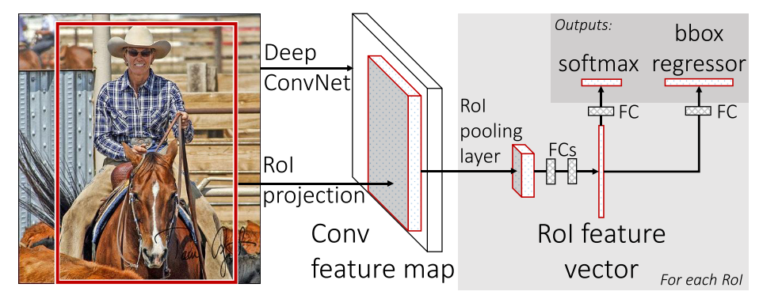

# 1 网络结构

## 1.1 Backbone

+ 使用VGG-16 作为 backbone 提取整张图像的特征。VGG-16包含13个卷积层，5个最大池化层和3个全连接层。
+ 把 VGG-16 的最后一个最大池化层替换成为 RoI Pooling，输出特征图的大小固定为 $h = w = 7$ 。
+ 把 VGG-16 的最后一个1000-way 的全连接替换成为两个并联的全连接，一个作为分类器，一个作为回归器。

## 1.2 Neck (RoI Pooling)

对于 Region Proposal 在VGG最后一个卷积层输出上裁剪出来的特征图 $H \times W$ ，RoI Pooling 使用最大池化输出固定的 $h \times w = 7\times 7$ 的输出特征图：

+ 将输入特征图分成 $h \times w$ 个 sub-windows。每个sub-window的尺寸大约为 $\frac{H}{h} \times \frac{W}{w}$。
+ 在每个sub-window中进行最大池化。 
+  RoI Pooling 相当于只有一种尺度的 SPP。

## 1.3 Head (Fast)

+ RoI Pooling 输出的每个特征向量输入到 VGG-16 的前两个全连接层中，并最终分别使用两个并行的全连接，一个作为分类器+softmax产生 $K=N+1$ 个类别的分类概率，另一个作为边界框回归器产生 4 数值，表示边界框的位置。

# 2 训练

+ 使用 Selective Search 算法在每张图像中产生2000个 Region Proposals。

+ 图像进行 $p=0.5$ 的水平翻转，此外没有其他数据增强。

+ 设置 $N = 2$ ，从每张图像中分别采样出 $64$ 个 Region Proposals 。即，一共采样出 $R = N \times 64 = 128$ 个 Region Proposals：

  + 实际的 Batch Size 是 $BS = R = 128$ 。
  + 定义正负样本：
    + 每张图像中，$64$ 个 Region Proposal 中的正负样本比例为 $1 : 3$ ：
      + 如果一个 Region Proposal 与任意一个真实框的 $IoU \ge 0.5$ ，则定义为正样本。
      + 如果一个 Region Proposal 与所有真实框的 $0.1 \le IoU \lt 0.5$ ，则作为负样本。
      + 如果一个 Region Proposal 与所有真实框的 $IoU < 0.1$ ，则可以作为难例挖掘的样本。

+ 使用 SGD 联合训练分类器和回归器，其中分类器就是 FC+softmax，不再使用 SVM。

+ $loss = loss_{cls} + \lambda [u\ge 1] loss_{loc} $ ：

  + $loss_{cls} = -log(p)$ 。即交叉熵损失，其他项被 ylogp 的 y=0消掉了，没有label smooth。 

  + $loss_{loc} = smooth_{L_1}$ ，只计算正样本的定位损失。由于负样本的类别定义为 $0$ ，因此公式中表示为 $[u \ge 1]$ ：
    $$
    smooth_{L_1} = 
    \begin{align*}
    \begin{split}
    \left \{
     
    \begin{array}{ll}
        0.5x^2                 & |x| \lt 1\\
        |x| - 0.5     & otherwise\\
    \end{array}
     
    \right.
    \end{split}
    \end{align*}
    $$

  + $\lambda$ 控制分类损失和回归损失的平衡。所有实验中均设置 $\lambda = 1$ 。

+ 超参数：

  + 权重初始化：分类、回归层的参数，初始化为0均值，标准差分别为 0.01 和 0.001。
  + 初始学习率：0.01。其中，所有的权重的学习率乘以1，所有偏置的学习率乘以2。初始学习率衰减到 1e-4，并在1e-4上继续训练10k个iter。
  + 优化器：SGD, momentum=0.9，weight_decay = 5e-4。
  + Iters : 30k个 min-batch for VOC。
  + 训练时使用了多尺度输入图像分辨率的策略 $\{480, 576, 688, 864, 1200\}$。 

# 3 Issue

## 3.1 Smooth L1 相较于 MAE 和 MSE 有什么优点？

+ MSE (L2 Loss) 对离群点更敏感。当 Region Proposal 和真实框差距较大时， MSE 容易导致梯度爆炸，需要小心的调整学习率。相对来说， L1 更鲁棒。

