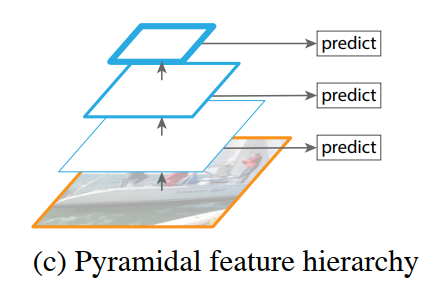

# 1 动机

+ 使用单分辨率（本人理解为每次输入一种分辨率的特征进行训练）的输入图像，并获得单个尺度的输出特征

  

  + 虽然多分辨率训练增强了模型在各种输入尺度下的鲁棒性，但是金字塔结构的特征图相较于该方法能够获得多尺度、具有不同等级的更丰富语义的特征图。

+ 一次性使用多个分辨率的输入图像提取特征

  

  + 对不同分辨率的输入图像提取特征增加了时间和内存需求
  + 且卷积网络的不同阶段已经存在内在的多尺度、具有金字塔形状的特征了。

+ 使用一个分辨率的输入图像，获得不同尺度的输出特征

  

  + 不同等级的特征图存在较大的语义差异（gap）。高分辨率的特征图的特征语义较低，损害了特征图的表达能力。


本文旨在设计出一种特征金字塔结构，保证不同尺度的特征都具有较强的语义：

+ 联合低分辨率，但具有较高语义等级的特征，以及高分辨率，但具有弱语义等级的特征。
+ 设计出一种自顶向下 （Top-down）的通路，和一种横向链接（Lateral connections）


# 2 网络结构


## 2.1 Bottom-Up

+ 使用ResNet作为骨干网络，ResNet包含一个 $7 \times 7$ 的大卷积，和四个残差块（C2, C3, C4, C5）。下采样倍数分别为 2, 4, 8, 16, 32。
+ 选择 C2, C3, C4, C5 四个残差块的输出。不选择  C1 ($7 \times 7$) 的原因是因为语义等级太低，且需要占用较大的内存（特征图的分辨率很大）。
+ Bottom-Up Pathway 中的特征的语义等级较低，但是由于具有更多原始像素信息，更加利于定位任务。

## 2.2 Top-Down 和 Lateral Connection

+ 对于经过横向连接传过来的特征图，首先使用 $1\times 1$ 的卷积降低通道维度为固定的 256 （保证后续全连接有固定维度输出）

  ```
  The upsampled map is then merged with the corresponding bottom-up map (which undergoes a 1×1 convolutional layer to reduce channel dimensions) by element-wise addition.
  
  # which 指代前面的 "corresponding bottom-up map"
  ```

+ 使用空间上采样操作（最近邻插值）。并和对应相等的 Bottom-Up Pathway 中的特征使用横向连接的方式进行element-wise 的 addition 相加。

+ 两个Pathway 的特征相加之后，使用一个 $3\times 3$ 的卷积来获得最终的特征图，这是为了减少不同语义之间的特征融合出现的混叠效应（Aliasing effect）。

+ 所有的额外层都没有使用非线性操作，这是由于实验发现使用非线性操作之后没什么用。

Pytorch中的FPN的 $1 \times 1$ 和 $3 \times 3$ 的定义如下：


## 2.3 Classifiers/Regressors

+ 所有尺度都共用一个分类器和一个回归器。
+ 由于共享，因此特征的通道维度需要一致，文中设置为 256 。


# 3 FPN for RPN

+ 在使用 FPN 的 RPN 中，仍然是使用一个 $3 \times 3$ 的卷积，跟上两个 $1 \times 1$ 的卷积做二分类和anchors回归

+ RPN 中的 anchors 具有多个 scales 和 aspect ratios，为了覆盖不同尺度的物体。

+ 但是在 FPN 中，没有必要在所有尺度上都使用 多个尺度 的 anchors。

  ```
  Because the head （指的是两个1x1的卷积） slides densely over all locations in all pyramid levels, it is not necessary to have multi-scale
  anchors on a specific level.
  ```

  

+ 作为替代， FPN 分别在 P2, P3, P4, P5, P6 （等等？上文不是说只有 P12345？哪来的 P6？先别急） 上使用 $scales = {32^2, 64^2, 128^2, 256^2, 512^2}$ ，但是 aspect ratio 仍然在每层都有3种 $aspect = {1:2, 1:1, 2:1}$ 。因此，所有层总共有15种 anchors 。

+ 在每层上，anchor和 gt bbox 的 IoU 匹配规则不变（0.7 for fg, 0.3 for bg）。

+ 需要注意的是，anchors 按照面积被分别分配在了不同的 pyramid level 上，但是在 RPN 中， GT Box 并不按照其尺度进行匹配。即，任意一层的任意 anchor 都可以与全部 GT Box 进行匹配。

  ```
  Note that scales of ground-truth boxes are not explicitly used to assign them to the levels of the pyramid; instead, ground-truth boxes are associated with anchors, which have been assigned to pyramid levels.
  ```

  

+ 所有 levels 都共用一个 RPN 的 $3 \times 3$ 的卷积和两个 $1 \times 1$ 的卷积。如果每个levels都单独使用一个，作者实验发现结果差不多。

  ```
  We note that the parameters of the heads are shared across all feature pyramid levels; we have also evaluated the alternative without sharing parameters and observed similar accuracy
  ```

  从这个现象中也可以发现，不同 level 的金字塔特征的语义是类似的。如果没有 横向连接和自顶向下的连接，那么每个level的特征的语义肯定不是类似的，肯定是从低级到高级。

  

和 Faster 中的 RPN 不同的是，对于超出图像边界的 anchors，FPN 保留下来参与训练了。

```
For all RPN experiments (including baselines), we include the anchor boxes that are outside the image for training, which is unlike [29] where these anchor boxes are ignored
```

  

# 4 FPN for Fast R-CNN

+ Fast R-CNN 接收一系列 RoI 作为输入（from RPN or SS）。

+ 对于 RoI ，需要指定到不同的 level上

  ```
  To use it with our FPN, we need to assign RoIs of different scales to the pyramid levels
  ```

  

+ 具体的，对于宽度和高度为 $w$ 和 $h$ 的 RoI ，通过下式将其指定到 $P_k$ （$P_2, P3, P_4, P_5, P_6$）上。
  $$
  k = floor(k_0 + log_2(\sqrt{wh}/224))
  $$
  其中：

  + 224表示backbone在ImageNet中预训练的尺寸
  + $k_0$ 表示原始的 Fast R-CNN使用backbone的哪一个level作为输出。如，以Faster-Resnet50为例，使用 C4 (Res4) 作为输出（下采样16倍）,则 $k_0 = 4$ 
  + 

+ 所有层共用一套 Fast 的 Head。

+ 使用 $7 \times 7$ 的 RoI Pooling

+ 在Faster 最终的两个全连接（一个分类器一个回归器）之前，加入了两个 $1024$ 的 FC + ReLU。

  ```
  we simply adopt RoI pooling to extract 7×7 features, (each followed by ReLU) before the final classification and bounding box regression layers. These layers are randomly initialized, as there are no pre-trained fc layers available in ResNets. Note that compared to the standard conv5 head, our 2-fc MLP head is lighter weight and faster.
  ```

  

# 3 Issues

## 3.1 混叠效应 （Aliasing effect）

指的是什么？怎么引起的？有什么问题？怎么解决？

