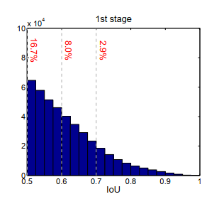
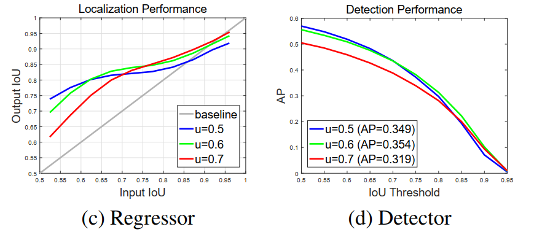
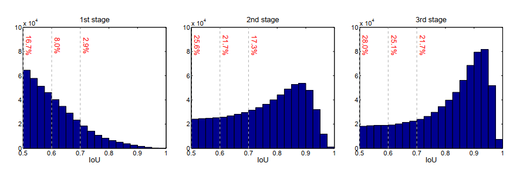
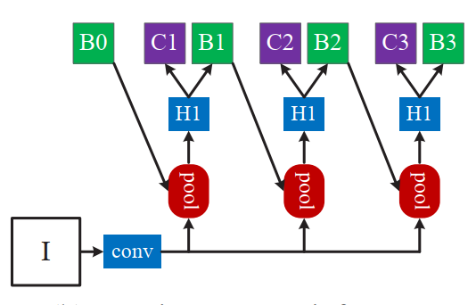
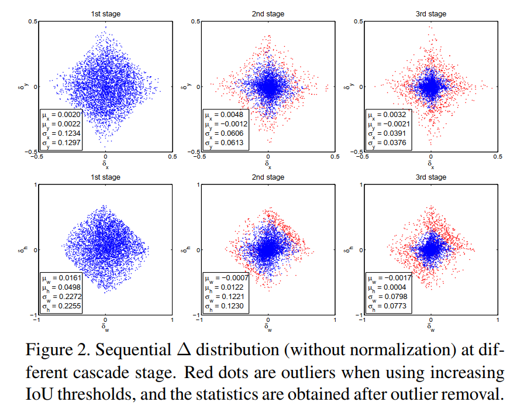
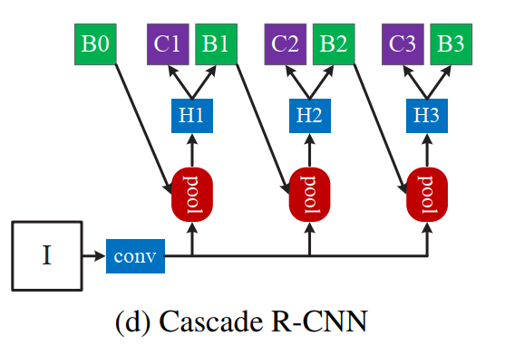

# 1 背景

在RCNN系列的目标检测算法中，都需要依赖于Region Proposal进行边界框定位。在训练过程中，如何指定一个 Region Proposal 是正例还是负例，需要计算其与GT BBOX的 IoU。在这个过程中，用于指定正负例的 IoU 的阈值应该如何设定呢？

+ 在 Fast RCNN 中，规定 $IoU \ge 0.5$ 的为正样本
+ 在 Faster RCNN 中：
  + RPN 阶段规定 $IoU \gt 0.7$ 的为正样本
  + Fast 阶段规定 $IoU \ge 0.5$ 的为正样本

思考一个问题，在训练过程中 $IoU$ 的阈值越高，那么找出来的正样本也就越接近于 GT，但是实际上为什么大多数方法都使用较低的 0.5 作为阈值呢？作者认为有两个原因，并且都通过实验进行了验证：

**问题一：使用更大的 $IoU$ 作为阈值，虽然挑选出来的 Proposals 更准确，但作为正样本的 Proposal 的数量会呈指数级别的下降。导致正负样本比例严重不平衡，产生过拟合的问题。**

上图表示 RPN 阶段输出的 Region Proposals 和 GT BBOX 的 IoU 分布情况。可以发现，RPN 阶段产生的 Proposals 还是不太准确的，$IoU \ge 0.7$ 的 Proposals 仅仅占了很少一部分。此时如果使用比较大的 $IoU$ 阈值来挑选正负样本，则会导致挑选出来的正样本非常少，并进一步导致网络倾向于预测负样本，产生过拟合的问题。

**问题二：训练过程中使用更高的 $IoU$ 阈值虽然能够使得正样本的质量更高，但是测试的过程中是没有办法挑选高质量的 Proposals 的，导致训练时都是高质量的 Proposals， 但测试时会有大量低质量的 Proposals。而网络在训练过程中仅具有对高质量框的较好的回归和分类能力，对低质量框的输出结果就变得不可预测了（用大量狗和少量猫的图像训练了一个特征提取器，现在却突然要提取大量猫的特征）。这就会导致训练和测试过程中出现 mismatch 的问题。**

左图的红绿蓝三条线表示训练 Fast 阶段时用于指定正负样本的 IoU 阈值，横轴表示一个 Proposal 在输入 Fast 之前和 GT BBox 的 IoU，纵轴表示该 Proposal 在经过 Fast 的边界框回归之后，与 GT BBox 的 IoU 。可以发现两个现象：

+ Fast 阶段的边界框回归器都能够提升 Proposal 与 GT BBox 的 $IoU$ 。即，回归器在不同的挑选正负样本的 IoU 阈值下都具有一定的回归能力，使得边界框定位更准确。 

+ 当输入 Proposal 的 $IoU$ 阈值与 Fast 阶段挑选正负样本的 $IoU$ 阈值比较接近时，回归效果最好。如，当输入 Proposal 与 GT BBox 的 IoU 较低时（左图横坐标在 $0.5 - 0.6$ 左右时），以 $IoU = 0.5$ 作为挑选正负样本的阈值的回归器的输出结果更精确；当输入 IoU 在中等区间（$0.6 - 0.75$ 左右时），阈值为 $0.6$ 的回归器的效果更好；当阈值大于 $0.75$ 时，阈值为 $0.7$ 的回归器的效果更好。

因此左图说明了两个问题：

+ 不管以任何阈值来挑选正负样本的回归器，都能使输入的 Proposal 的边界框定位更准确。
+ 当输入 Proposal 与 GT BBox 的 IoU，和回归器训练时挑选正负样本时的 IoU 更接近时，回归的效果更好。即，避免了 mismatch 问题。

从右图中仍然能够得到类似结论，右图中的红绿蓝三条曲线仍然表示以不同 $IoU$ 作为挑选正负样本的三种不同的回归器，横轴表示计算 AP 时所用的 $IoU$ 阈值，纵轴表示 $AP$ 评价指标。可以发现，在计算 AP 时使用较低的 IoU 阈值时，与低精度的回归器学习到的数据分布更接近，AP更高（蓝线）。

为了解决上述两个问题，并使得目标检测的结果更好，本文提出了一种 Cascade 级联的 Cascade RCNN网络。基本思路如下：

+ 既然回归器在训练过程中用低 IoU 来挑选正负样本时，在测试时也会对质量较低的 Proposal 的回归效果更好。那么我们第一步就使用较低的阈值（0.5）来挑选正负样本，训练出一个回归器 H1。
+ 经过回归器回归之后的 Proposal ，其质量会变得更好了，此时我们再用一个较高的阈值 （0.6）来训练第二个回归器 H2。
+ 经过 H2 回归之后的 Proposal，质量更进一步提高了，此时我们再用一个更高的阈值（0.7）来训练第三个回归器 H3。

这种方法也能够通过上面的左图来说明其合理性，当输入 Proposal 与 GT BBox 的 IoU较低时（0.5-0.6），输出之后的 IoU 能够提升到0.75以上，因此下一个阶段用更严格的阈值来挑选更准确的 Proposal 也不会出现 mismatch 的问题。此外，如下图所示，再经过 H1 第一个阶段之后，高质量的 Proposal 所占的比例也会显著提高，因此也不会出现正负样本不平衡导致的过拟合问题：

**思考：**

为什么需要级联的训练3个回归器，而不是就用一个回归器，把上一次的输出作为输入，再把这一次的输出再作为输入，不断迭代呢？如下图所示？

这是因为每一次迭代的过程中，Proposal的质量都会提高，而一个回归器在训练的过程中只使用一种阈值来挑选正负样本，会导致 Proposal 质量较高时出现 mismatch的问题。反之，如果训练过程中回归器挑选正负样本的阈值较高，则会出现正负样本分布不平衡导致的过拟合问题。此外，不同阶段的边界框的分布也存在较大差异，仅使用一个回归器的拟合效果也不足：

# 2 方法

+ 训练时：loss = rpn + H1 + H2 + H3

  `In total, Cascade R-CNN have four stages, one RPN and three for detection with U = {0.5, 0.6, 0.7}`

+ RPN采样的阈值与Faster相同

  `The sampling of the first detection stage follows [Fast, Faster]  `

+ 测试时：只要H3的输出

+ RPN输入anchors个候选框，采样256个（同Faster）计算loss。但是，anchors个候选框都要经过回归之后和NMS，送到 H1，H1再使用0.5进行挑选。

+ H1 按照 Fast 采样128 个候选框计算loss。但是，输入的候选框仍然全部都要经过回归之后和NMS，送到H2，H2再使用0.6进行挑选。H2到H3相同，输入到H3的仍然是H2经过回归和NMS之后的全部候选框。

  `In the following stages, resampling is implemented by simply using the regressed outputs from the previous stage, as in Section 4.2.  `

  `it is possible to keep the set of positive examples of the successive stages at a roughly constant size, even when the detector quality (IoU threshold) is increased  `

