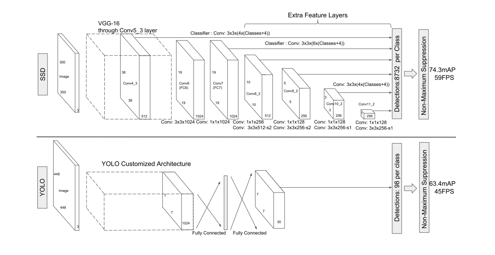

# 1 网络结构

+ 使用 conv4_3，conv7 (fc7)，conv8_2，conv9_2，conv10_2 和 conv11_2 的特征图来预测定位和置信度。
+ 其中，conv4_3，conv10_2 和 conv11_2 只使用 4 种 default boxes (移除掉 aspect ratio 为 3 和 1/3 的两种)，其他层使用全部的 6 种 default boxes 。

## 1.1 Backbone

+ VGG-16
+ pool5 ( $2\times 2, s=2$ ) 替换成 ($3 \times 3, s=1$)
+ 移除掉所有的dropout层
+ 移除掉fc8 (fc-1000) 
+ 把 fc6 和 fc7 替换成卷积层。

## 1.2 Multi-scale Feature Maps

+ 在多个不同尺度的特征图上进行检测

## 1.3 Convolutional Predictors for Detection

+ 对于每一个尺度的特征图 ( 空间分辨率为 $m \times n$, 通道数为 $p$ ) ，分别（不同尺度特征图的通道数、default boxes的数量都不一定相等）使用一个 $ 3 \times 3 \times p$ 的卷积核在特征图的每个位置上都预测 $c = N + 1$ 个 score 和 4 个坐标偏移量。即，每个特征图上的输出为 $(c + 4)kmn$ ，其中，$c$ 为类别数加背景，$k$ 为 Default Boxes 的数量。
+ YOLO V1 与之不同的是，YOLO V1 使用的是全连接层 for detection 。

## 1.4 Default Boxes and Aspect Ratios

+ Default Boxes 的概念类似于 Faster R-CNN 的 anchor boxes 。不同之处在于，SSD 在不同尺度的特征图上使用不同 Scales 的 Default Boxes。

+ 假设有 $m$ 个不同尺度的特征图，每个特征图上 Default Boxes 的 Scales 计算如下：
  $$
  s_k = s_{min} + \frac{s_{max} - s_{min}}{m - 1} (k - 1) , k \in [1, m]
  $$
  其中， $s_{min} = 0.2$ ，$s_{max} = 0.9$ 。即，假设输入图像的分辨率是 $300 \times 300$ (SSD300)，则最浅层的特征图（识别小目标, $k = 1$）上的 Default Boxes 的 scale 为 $300 \times s_{min} = 60$​ ，最深层的特征图（识别小目标, $k = m$）上的 Default Boxes 的 scale 为 $300 \times s_{max} = 270$ 。

+ Aspect Ratios 设置为 $a_r \in \{ 1, 2, 3, \frac{1}{2}, \frac{1}{3} \}$ 。

+ 因此，每个 Default Box 的宽高分别为 ： $w_k = s_k \sqrt{a_r}$  , $h_k = s_k / \sqrt{a_r}$ 。

+ 此外，对于 $a_r = 1$ 的 aspect ratio，还加入了一个额外的 scale 为 $\sqrt{s_k s_{k+1}}$ 的 default box。即，总共有6个default box。

+ 每个 default box 的中心在网格的中心，对应到特征图上即为 $x + 0.5$ 。

 ## 1.5 Hard Negative Mining

+ 由于多个尺度上产生多种 default boxes，导致负样本过多。相较于使用全部负样本，SSD 首先按照置信度的loss从高到底进行排序，然后挑选损失最高的default boxes，并保证正负样本的比例为 $3:1$ 。
+ 该方法能够加速训练，并使训练过程更稳定。

# 2 训练

+ 匹配 Default Boxes 和 Ground Truth ：

  + 和 Ground Truth 的 IoU 最大的 default box。

  + $jaccard \_ overlap > 0.5$ ，这里的 jaccard overlap 就是 IoU 。这种方式能够允许多个 default boxes 同时预测一个 gt 框，能够简化学习问题。
  
+ 定位loss是smooth l1，分类loss是交叉熵。
  
+ 使用faster的相对位移计算损失。

## 2.1 VOC 2007

+ conv4_3 上的 scale=0.1。从conv4_3之后的其他5层，开始smin=0.1,smax=0.9, $k \in [1, 5]$ 。即，conv4_3 是不用公式计算的。 

+ 使用 1e-3 学习率训练40k个iters，之后使用1e-4和1e-5的学习率继续训练10k个iters。

 ## 2.2 VOC2012

+ 07++12

+ 使用 1e-3 学习率训练60k个iters，之后使用1e-4的学习率继续训练20k个iters。

+ 其他参数和voc2007相同。

## 2.3 COCO

+ smin = 0.15，smax=0.9。conv4_3 = 0.07 (21pixels for 300)。
+ 使用 1e-3 学习率训练160k个iters，之后使用1e-4的学习率继续训练40k个iters，再使用 1e-5训练40k个iters。

# 3 Issue

## SSD 为什么在速度上有优势？

+ `The fundamental improvement in speed comes from eliminating bounding box proposals and the subsequent pixel or feature resampling stage.`
+ `especially using multiple layers for prediction at different scales—we can achieve high-accuracy using relatively low resolution input, further increasing detection speed`

## SSD 和 YOLO V1 的差别

+ ssd是多分类，而yolo是多标签
+ backbone不同
+ yolov1没有使用anchor，后续使用anchor的yolo是通过聚类获得的。
+ 边界框的回归方式
+ ssd使用了不同尺度的feature map
+ yolo把特征图分成网格，而ssd的default box和faster类似，可以到处跑。
+ yolo只在网格内预测，对密集的小物体不好。
+ yolo使用全连接层预测，利用率更多的全局信息，因此对背景的误识别率更低。
