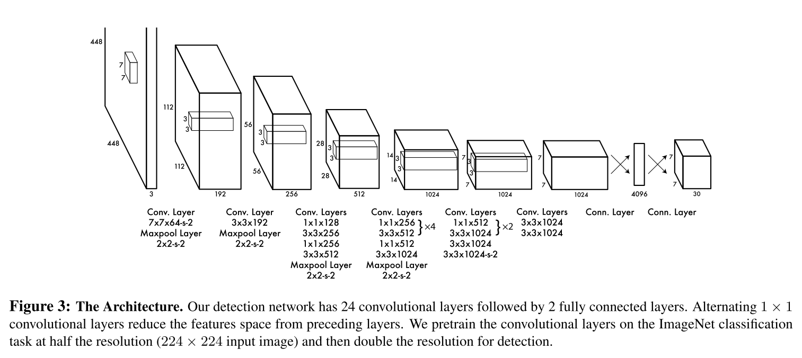
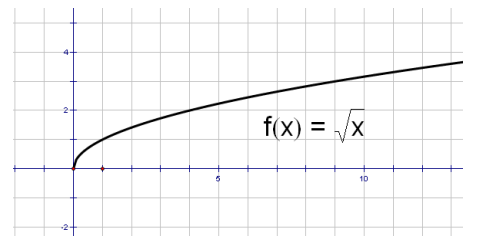

# 1 网络结构

+ 包含24个卷积层和2个全连接层。
+ Fast YOLO 只用了 9 个卷积层，并且卷积核的个数也更少。所有训练核测试的参数 between YOLO and Fast YOLO 都相同。
+ 边界框的高宽按照图像的高宽进行归一化，边界框的中心点坐标使用相对于网格左上角的偏移量，并按照网格的尺寸进行归一化。因此，xywh都是 [0, 1]。
+ 除了最后一个全连接层不适用激活函数，其他所有层都是用 Leaky ReLU， $\alpha = 0.1$ 。
+ 为了防止过拟合，在第一个全连接层后面使用 0.5 的 dropout。

# 2 工作流程

+ 把输入图像分成 $S \times S$ 个网格，如果一个物体的中心落在了某个网格内，则该网格负责检测该物体。

+ 每个网格预测 $B$ 个 bounding box 和 置信度，置信度表示bbox包含一个物体的概率。置信度定义为真实框和预测框的 IoU

+ 每个bounding box包含5个预测结果：$x,y,w,h$ 以及 confidence 。$x, y$ 表示中线点相较于网格的偏移量，$w, h$ 表示物体的宽高相较于整张图像的归一化尺寸。

+ 每个网格除了预测 $B$ 个bounding box之外，还预测C个类别的条件概率 $Pr(Class_i | Object)$ 。需要注意的是，尽管一个网格预测多个bbox，但仅预测一组类别概率：

  一个bbox是某个类别的条件概率为：该bbox是物体，在该bbox是物体的条件之下，属于某个类别：
  $$
  P_i = P(object) * P(class_i | object)
  $$

+ 一个网格只负责预测一个物体，但是一个网格中有两个 bounding box，这两个 bounding box 中只有和该物体的IoU最大的 bounding box 才作为负责预测的 bounding box：
  + 这样做的目的是，能够使得一个网格内的两个bounding box，能够分工合作，面对具有不同尺寸，高宽比的物体，具有specialization专业化，能够改进召回率（预测的框更多了）。

# 3 Loss

+ x, y, w, h, 置信度和分类 的回归都使用 sum square error 。存在的问题：

  + 虽然 sum square error 很容易被优化，但是不符合 mAP 的目标。
  + 同等对待了定位误差和分类误差，which may not be ideal (理想) 。

+ 大多数网格都不包含任何物体，回导致这些网格的 confidence scores 趋近于0，并且这些网格的confidence loss 压倒了那些包含物体的网格。

+ 对大物体和小物体的loss计算相同，且 SSE 对小物体不友好。

+ 为了解决上述问题：

  + 给定位损失更大的权重 $\lambda_{coord} = 5$

  + 给不包含任何物体的网格的 confidence 更小的权重 $\lambda_{noobj} = 0.5$ 

  + 对于 w 和 h 的回归误差的计算，使用 $\sqrt{w}, \sqrt{h}$ 平方根进行计算。

    

+ 最终的 loss :
  $$
  loss = loss_{xy} + loss_{wh} + loss_{confidence}^{obj} + loss_{confidence}^{noobj} + loss_{class} = \\
  \lambda_{coord} \sum_{i=0}^{S^2} \sum_{j=0}^{B} \mathbb{1}_{ij}^{obj} [(x_i - \hat{x_i}) ^ 2 + (y_i - \hat{y_i}) ^ 2] \\
  + \lambda_{coord} \sum_{i=0}^{S^2} \sum_{j=0}^{B} \mathbb{1}_{ij}^{obj} [(\sqrt{w_i} - \sqrt{\hat{w_i}}) ^ 2 + (\sqrt{h_i} - \sqrt{\hat{h_i}}) ^ 2] \\
  + \sum_{i=0}^{S^2} \sum_{j=0}^{B} \mathbb{1}_{ij}^{obj} (C_i - \hat{C_i}) ^ 2 \\
  + \lambda{noobj} \sum_{i=0}^{S^2} \sum_{j=0}^{B} \mathbb{1}_{ij}^{noobj} (C_i - \hat{C_i}) ^ 2 \\
  + \sum_{i=0}^{S^2} \mathbb{1}_{i}^{obj} \sum_{c \in classes} (p_i(c) - \hat{p_i}(c)) ^ 2
  $$
  其中，$\mathbb{1}_{ij}^{obj}$ 为指示函数，表示第 $i$ 个 grid cell 中的第 $j$ 个 bounding box 负责预测物体（计算损失）。 

# 4 训练

+ 只使用前20个卷积层，加上avg pooling和全连接层在imagenet-1000上预训练，分辨率为224。
+ 之后，移除掉 avg pooling 和全连接层，加上yolo中剩下的4个卷积层和两个全连接层，使用随机初始化来初始化权重。
+ 目标检测时的分辨率为448，为了获得更加细粒度的信息。
+ 随机缩放和最多占原始图像20%的位移。也随机调整 exposure and saturation of the image by up to a factor of 1.5 in the HSV color space 。

## 4.1 VOC

+ $S = 7$, $B = 2$， $C = 20$ （不预测背景的概率）。
+ 因此最终一共预测出 $7 \times 7 \times (2 \times (4 + 1) + 20) = 7 \times 7 \times 30$ 个向量。
+ 训练135个epochs for 07++12 . bs = 64, momentum=0.9, weight_decay=5e-4。
+ 第一个epoch，从1e-3到1e-2。如果从大学习率开始，模型会发散 due to 不稳定的梯度。
+ 之后使用 1e-2 训练 75 个 epochs，然后使用 1e-3 训练 30 个epochs，最后使用 1e-4训练 30个 epochs 。

# 5 Issue
## 5.1 YOLO V1 的局限性

+ YOLO 对小目标，特别是成群的小目标的效果不好。

## 5.2 YOLO 对背景的误分类低于Faster

+ 由于YOLO使用全局特征（全连接，且不是 ROI Pool）进行回归。
