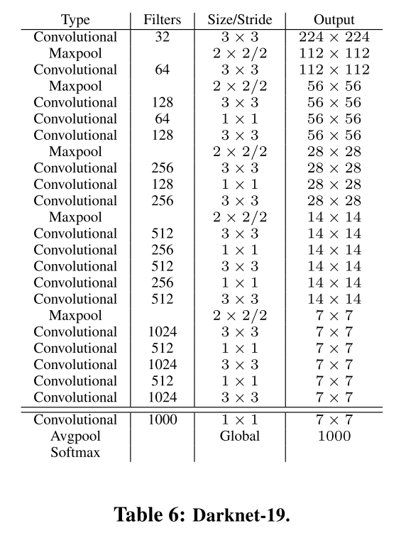

# 1 YOLO V1 存在的问题

+ 相较于 Faster ，V1 的定位误差更大。
+ 相较于 Region Proposal-based 模型， V1 的召回率更低。

# 2 YOLO V2 所作的改进

+ 使用 Batch Normalization，因此移除掉了 Droupout 。mAP 提升了 $2\%$ 。

+ 使用 448 的分辨率在 ImageNet 上进行 10 个 epochs 的微调。之后再使用 448 的分辨率微调 detection 。相较于直接使用 ImageNet 上 224 分辨率的预训练模型，该方法提升了 $4\%$ 的 mAP 提升。 

+ 使用 416 的分辨率代替 448，目的是为了保证最终的特征图上有奇数个网格。对于大物体来说，通常占据了图像的中心部分，奇数个网格能够保证使用更加中心的网格来预测大物体。而偶数个网格通常是中心周围的 4 个网格中的某一个网格来负责预测，偏移量更大。

+ 使用 32 倍 的下采样，对于 416 的输入图像分辨率，输出特征图的尺寸是 $13 \times 13$ 。相较于 V1 ($448$ 下采样到  $7$ ，$64$ 倍下采样)， V2 具有更大的特征图的分辨率。即，相较于 V1 , V2 移除了一个下采样层。该方法对细粒度的小物体更友好。

+ 使用 Anchor Boxes 。预测 offsets 而不是直接预测坐标，能够降低网络的学习难度：

  + 对每个 Anchor Boxes 都单独预测 x, y, w, h, confidence, classes 。而不再是每个网格只预测一组 classes 。
  + 使用 Anchor Boxes 之后，相较于 V1 只预测 $7 \times 7 \times 2 = 98$ 个框，V2 预测了超过1000个框，极大提升了召回率 (从 $81 \%$ 提升至 $88 \%$) 。但是，mAP 却有所下降 (从 $69.5$ 下降至 $69.2$) ，然而，尽管mAP下降了，但是召回率提升意味着模型具有很大的改进空间。

+ 使用 K-Means 聚类确定 Anchors 的尺寸：

  + 尽管手工选择的尺寸也可以通过调整对应的坐标来进行定位，但是如果使用更好的先眼眶，能够使网络学习的任务更简单。

  + 使用 IoU 距离来进行 K-Means 聚类。如果使用欧氏距离，对小框的误差较大：
    $$
    d(box, centroid) = 1 - IoU(box, Centroid)
    $$

  + 选择聚类 $k = 5$ ，作为平衡模型复杂度和召回率的结果。

+ 相较于其他基于 Anchor 的方法，作者认为其在训练早期存在模型不稳定的问题：

  + 主要有中心点坐标 $x, y$ 的定位不稳定导致：$G_x = d_x P_w + P_x$ 。当 $d_x$ 等于 -1 时，中心点坐标在图上就会左移一个 $P_w$ 的位置，且 $d_x$ 的值并没有任何约束，因此一个位置上的 anchor 可能会移动到任意位置，而不管到底是图像中的哪个位置预测了这个框。 此外，在随机初始化的模型中，通常需要很长时间才能够使得该偏移量稳定到一个合理的区间。

  + 为了解决该问题，作者依然延续了 V1 的回归方法。即，xy的预测值限定在了 $0-1$ 之间：
    $$
    G_x = sigmoid(d_x) + C_x \\
    G_y = sigmoid(d_y) + C_y
    $$
    其中，$C_x, C_y$ 是网格相较于图像左上角的偏移量。即计算出的 $P_x, P_y$ 是 网格相较于图像的偏移量 + anchor 相较于网格的偏移量。

  + $w, h$ 的回归延续了 Faster 的方式 （按照论文中的介绍，没有按照图像尺寸进行归一化）：
    $$
    G_w = P_w e^{d_w} \\
    G_h = P_h e^{d_h} 
    $$
  
  + confidence的标签值的计算方式和 V1 相同。
  
+ 使用 Passthrough 层来融合更大分辨率 ($26 \times 26$) 的多尺度特征，通过 concat 来进行特征拼接。把 $26 \times 26 \times 512$ 的特征变成 $13 \times 13 \times 2048$ 的特征。

+ 多尺度训练。由于V2移除掉了全连接层，全部使用卷积层和池化层，因此可以使用多尺度训练来使得模型更鲁棒。每 10 个 batches，随机从 ${320, 352, ..., 608}$ 中选择一个分辨率，步长是 $32$ 。

+ 使用 Darknet-19 作为 Backbone （19 个卷积层，5个最大池化层）：

  + 全部使用 $3 \times 3$ 的卷积核。

  + 当分辨率减半时（池化），double the channel 维度。

    

# 3 训练

## 3.1 ImageNet 预训练

+ $epochs  = 160$, $init_lr = 0.1$, $weight\_decay = 5e-4$ , $momentum=0.9$
+ polynomial rate decay with  $power = 4$
+ 数据增强：
  + 随机裁剪
  + 随机旋转
  + 随机色度、饱和度和曝光度偏移
+ 首先使用 224 的分辨率按照上述设置进行训练。
+ 之后使用 448 的分辨率按照上述设置再训练 10 epochs，初始学习率设置为 $1e-3$ 。

## 3.2 目标检测

+ 移除掉最后一个卷积层（$1\times 1 \times 1000$），替换成为一个 $3 \times 3 \times 1024$ 的卷积层。
+ 添加一个 $1 \times 1$ 的卷积层，获得最终输出的维度。（对于VOC, 在 5 个 anchors 的情况下，输出维度为 $5 \times (4 + 1 + 20) = 125$） 。
+ 训练 160 epochs，初始学习率为 1e-3，在第 10, 60, 90 个 epochs 时分别减小10倍。
+ $weight\_decay = 5e-4$ , $momentum=0.9$
+ 数据增强和 YOLO V1 和 SSD 类似。
+ 在 COCO 和 VOC 上的训练策略相同。
