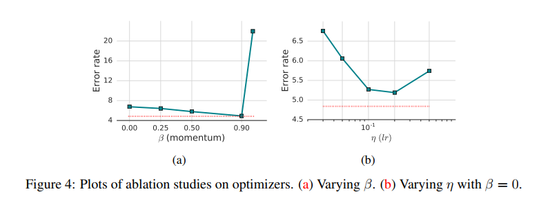

**FixMatch: Simplifying Semi-Supervised Learning with Consistency and Confidence**  

伪标签 pseudo-labeling，通常也叫做 self-training。

# 1 动机

+ 深度学习模型在大数据集上使用更多标签数据能够获得更强的性能。然而，标注数据显著增加了成本，并且需要人类劳动，特别是需要专业的人类先验知识的情况。
+ 半监督学习提供了一种利用大量无标签数据的方法，成本较低。

# 2 定义

对于 L 个类别的分类任务：

+ 有标签的样本 $X = \{(x_b, p_b), b \in (1, 2, 3,..., B)\}$ 。其中，$x_b$ 是样本， $p_b$ 是onehot标签， $B$ 是样本数量。
+ 无标签的样本 $U = \{u_b, b \in (1, 2, 3, ..., \mu B)\}$ 。其中，$u_b$ 是样本，$\mu B$ 是无标签的样本个数，$\mu$ 用来调节有标签的样本和无标签的样本的相对数量。
+ 定义 $p_m(y|x)$ 表示网络预测的softmax概率分布。
+ 定义概率分布 $p$ 和 $q$ 的交叉熵为 $H(p, q)$ 。
+ 定义对 $x$ 的强数据增强为 $\Alpha (x)$ ，弱数据增强为 $\alpha (x)$ 。 

# 3 现有方法

现有半监督学习可以分为两类：

+ consistency regularization，一致性正则
+ pseudo-labeling 伪标签

## 3.1 一致性正则

该方法通过随机修改输入或模型结构，并假设两种方式的输出结果应该非常相似：
$$
loss_1 = \sum_{b=1}^{\mu B} || p_m(y|\alpha(u_b)) - p_m(y|\alpha(u_b)) ||^2_{2}
$$
需要注意，$\alpha$ 弱数据增强具有随机性，不同模型结构（dropout，backbone）得到的 $p_m$ 也具有随机性，因此上式中的两项是不同的值。此外，该方法还需要同时使用有监督的分类损失，和上式来共同训练。

基于该方法，出现了一些扩展的方法：

+ 使用对抗样本，代替 $\alpha$ 
+ 使用移动平均来计算上式中的一个 $p_m$ ，更稳定。
+ 使用交叉熵，而不是上式的 l2 损失，来衡量两个概率分布的差异性。
+ 使用更强的数据增强，代替上式中的弱数据增强。

## 3.2 伪标签

伪标签的思想是让模型自己给没有标注的数据打上标签。通常指打硬标签，如argmax，仅保留概率最大的（需要超过预定义的阈值）。

假设模型对无标签数据的预测概率分布为 $q_b$ ，伪标签为 $\hat{q_b} = argmax(q_b)$ 。需要注意的是，当且仅当$q_b$ 中的最大概率（对应伪标签的类别）大于阈值 $\tau$ 时，伪标签才成立，才计算loss：
$$
\frac{1}{\mu B} \sum_{b=1}^{\mu B} \mathbb{1}(max(q_b) \ge \tau) H(\hat{q_b}, q_b)
$$

# 4 FixMatch

该方法包括两个 Loss：

+ 对于有标签的数据 $x_b$，就使用正常的交叉熵损失：
  $$
  l_s = \frac{1}{B} \sum_{b=1}^{B} H(p_b, p_m(y | \alpha(x_b)))
  $$

+ 重点是对于没有标签的数据 $u_b$ ：

  + 首先，用弱数据增强得到 $\alpha(u_b)$ 。为什么用弱数据增强，而不是直接使用 $u_b$ ？弱数据增强也就是如以0.5的概率水平翻转等方法。

  + 使用弱数据增强的 $u_b$ ，让模型预测，得到一个概率分布 $q_b = p_m(y | \alpha(u_b))$

  + 然后，使用argmax获得伪标签 $\hat{q_b} = arg max(q_b)$ 

  + 之后，再对 $u_b$ 使用强数据增强，得到 $\Alpha(u_b)$ ,同样让模型预测一个概率分布 $p_m(y | \Alpha(u_b))$

  + 最后，还是计算交叉熵损失：
    $$
    l_u = \frac{1}{\mu B} \sum_{b=1}^{\mu B} \mathbb{1}(max(q_b) \ge \tau)H(\hat{q_b}, p_m(y | \Alpha (u_b)))
    $$

+ 当然，对于伪标签生成的标签，无法判断其准确程度，因此需要对 $l_u$ 进行加权，最终的 loss 为：
  $$
  l = l_s + \lambda_u l_u
  $$
  $\lambda_u$ 是一个超参，表示对 $l_u$ 的缩放因子。

# 数据增强

+ 弱数据增强：0.5的水平翻转，0.125的垂直翻转
+ 强数据增强：Cutout，RandAugment , CTAugment  

# 实验

+ 超参：

  + $\lambda_{u} = 1$
  + $init\_lr = 0.03$
  + $\beta = 0.9$
  + $\tau = 0.95$
  + $\mu = 7$
  + $B=64$
  + $total\_step = 2^{20}$

  

  **需要仔细调参，包括动量！！！！**

# 其他发现

+ 使用伪标签时，正则项是非常重要的，本文仅使用了权重衰减。

+ 发现 Adam 的效果较差，因此使用了 SGD。

+ 使用余弦衰减学习率：
  $$
  lr = init\_lr \times cos(\frac{7\pi \times  current\_step}{total\_step})
  $$

+ 使用EMA。

