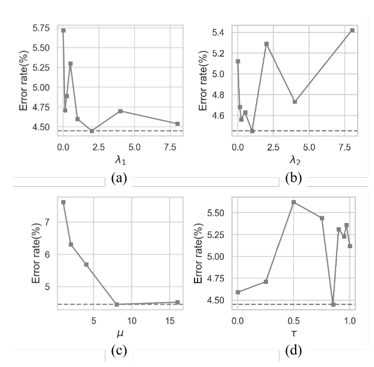

`CLS: Cross Labeling Supervision for Semi-Supervised Learning`

# 2 定义

对于 $C$ 个类别的分类任务：

- 有标注的样本集合 $X_l = \{(x_i, y_i)\}^{N_l}_{i=1}$ 。其中，$y_i \in \{1, ..., C\}$ 表示类别索引，$N_l$ 表示样本数量。
- 无标签的样本集合 $X_u = \{x_i\}^{N_u}_{i=1}$  。其中，$N_u$ 表示样本数量。

# 3 现有方法

## 3.1 伪标签

### 3.1.1 硬标签 Hard labeling

硬标签也分为三种：

- 直接选择概率最大的类别作为伪标签：$\tilde{y_i} = \arg \underset{j \in \{1, ..., C\}} {max} {f(x_i;\theta)_j}$ 。其中，$f(x_i;\theta)_j$ 表示预测的第 $j$  个类别的概率值。
- 选择概率最大的类别作为伪标签，但是也要求最大的概率值大于一定阈值：$\tilde{y_i} = \mathbb{1} (\underset{j \in \{1, ..., C\}} {max} {(f(x_i;\theta)_j\ge \gamma) })$。其中，$\gamma \in [0, 1]$ 表示一个置信度阈值。
- 以上两种方法都最终获得一个 one-hot 标签。与之不同的是，还有一种 multi-hot 方法，即能够生成多标签：$\tilde{y_{ij}} = \mathbb{1}  {(f(x_i;\theta)_j\ge \gamma)}, {for} {j=1,2,...,C}$ 。  

### 3.1.2 软标签 Soft labeling

硬标签获得的伪标签中，要么是0，要么是1。而软标签则通过重整概率分布的方式，生成伪标签：
$$
\tilde{y_{ij}} = \frac{(f(x_i; \theta)) ^ \frac{1}{\epsilon}}{ \sum^{C}_{j'=1} (f(x_i; \theta)_{j'})^{\frac{1}{\epsilon}} }, for \quad j=1,2,...,C
$$
其中，$\epsilon$ 是一个超参，用于调整软标签的 softness 。当 $\epsilon \to 0$ 时，软标签退化为硬标签。

## 3.2 互补标签

伪标签如果不准确的话，容易导致模型性能的退化。因此，互补标签相较于伪标签，描述了某个样本不属于某一类别，能够有效防止模型过拟合噪声数据，并且能够加快收敛速度：
$$
\bar{y_i} = \arg \underset{j \in \{1, ..., C\}} {min} {f(x_i;\theta)_j}
$$

# 4. Cross Labeling Supervision

## 4.1 Weighted Labeling

错误标注的标签会导致性能退化，因此本文首先使用了一种样本重加权的方法 sample re-weighting。

该方法基于准确的标签通常具有低熵的直观假设。如，相较于 $[0.45, 0.55]$ 的预测概率分布，$[0.01, 0.99]$ 更可能是准确的标签。因此，需要给低熵的预测更大的权重，给高熵的预测更小的权重。

本文提出了一种自适应的采样权重：
$$
w_i = 1 - \frac{H(f(x_i; \theta))}{log(C)}
$$
其中，$H(\cdot)$ 表示预测概率分布 $f(x_i; \theta)$ 的熵：
$$
H(f(x_i;\theta)) = -\sum_{j=1}^{C} f(x_i; \theta)_j log(f(x_i; \theta)_j)
$$
并且，$H(f(x_i;\theta))$ 的值域范围为 $[0, log(C)]$ 。因此， $w_i$ 的值域范围是 $[0, 1]$ 。

## 4.2 Loss

### 4.2.1 伪标签+权重

$$
L_P(\theta, x_i, w_i, \tilde{y_i}) = -w_i \sum_{j=1}^{C} \tilde{y_{ij}}logf(x_i;\theta)_j
$$

$$
L_N(\theta, x_i, w_i, \tilde{y_i}) = -w_i \sum_{j=1}^{C} \bar{y_{ij}}log(1 - f(x_i;\theta)_j)
$$

### 4.2.2 Cross Labeling by Co-Training

联合训练的目的是为了缓解确认偏差（Confirmation bias）。

+ 既然是联合训练，就需要两个网络。需要注意，两个网络的参数不同，分别为 $\theta_1$ 和 $\theta_2$ 。

+ 和 FixMatch 相同，对于无标签的样本，每个网络首先使用弱数据增强生成伪标签：
  $$
  \tilde{y_i ^b} = \arg \underset{j \in \{1, ..., C\}} \max f(x_i + \xi_2; \theta^b)
  $$

  $$
  \bar{y_i ^b} = \arg \underset{j \in \{1, ..., C\}} \min f(x_i + \xi_2; \theta^b)
  $$

  $$
  w_i^b = 1 - \frac{H(f(x_i + \xi_2; \theta^b))}{log(C)}
  $$

  其中，$b \in \{1, 2\}$ 表示两个分支网络，$\xi_2$ 表示弱数据增强。

+ 有了弱数据增强获得的伪标签，互补标签，以及权重之后。两个网络分支首先对无标签数据 $X_u^B \subseteq X_u$ 使用强数据增强，并各自独立计算自己的 Loss:
  $$
  L_{self}^{b} (X_u^B) = \frac{1}{B} \sum_{x_i \in X_u^B} L_P(\theta^b, x_i+ \xi_1, w_i^b, \tilde{y_i^b}) + L_N(\theta^b, x_i+ \xi_1, w_i^b, \bar{y_i^b})
  $$
  其中， $\xi_1$ 表示强数据增强， $B$ 表示无标签数据的batch-size。

+ 上阶段使用弱数据增强作为伪标签，如果标签错误，则每个网络即使使用强数据增强，也是强制使其向错误的概率分布拟合，会导致确认偏差（confirmation bias）的问题。

+ 为了缓解确认偏差的问题，该方法使用了两个不同初始化的独立网络分支，能够融合两个协同的网络学习到的 knowledge。如，用第二个网络预测的伪标签，让第一个网络去学习，反之亦然。然而这样也存在一个显著问题，如果第二个网络预测的标签是错误的，则就会影响第一个网络的性能，此外，由于两个网络不同，具有差异性，强制使其预测概率分布也会影响模型性能。因此，本文仅在两个分支间使用高质量的伪标签（$w_i > \tau$），用于和另一个分支进行联合训练：

  + 第一个网络对无标签数据 $x_i$ 使用强数据增强，得到 $x_i + \xi_1$ 。之后第一个网络预测出伪标签 $L_P$ 和互补标签 $L_N$，并且当且仅当 $w_i \gt \tau$ 时，才让第二个网络对同样的强数据增强 $x_i + \xi_1$ 预测出概率分布并以第一个网络的伪标签/互补标签计算loss，并更新第二个网络的参数 $\theta_2$ ：
    $$
    L_{CO}^2 (X_u^B) = \frac{1}{B} \sum_{x_i \in X_u^B} \mathbb{1}(w_i^1 \gt \tau) L_P (\theta^2, x_i + \xi_1, w_i^1, \tilde{y_i ^1}) + \mathbb{1}(w_i^1 \gt \tau)L_N (\theta^2, x_i + \xi_1, w_i^1, \bar{y_i ^1})
    $$
    其中，$w_i^1, \tilde{y_i ^1}, \bar{y_i ^1}$ 是第一个网络的，表示第一个网络对 $x_i + \xi_1$ 预测的伪标签，互补标签，以及标签权重。而 $L_P$ 和 $L_N$ 中的参数 $\theta^2$ 表示损失函数的优化目标伪第二个网络的参数。

  + 与上式相同，第二个网络同样也需要对强增强数据做出预测，并选择高质量的样本让第一个网络学习。

+ 上述方法包含两部分：

  + 每个网络独自利用伪标签，和互补标签计算loss。需要注意的是，在该阶段，无论伪标签/互补标签的质量如何，都使用全部未标注的数据计算loss，只不过根据其权重 $w_i$ 进行loss的缩放。
  + 每个网络挑选出高质量的 伪标签，互补标签，让另一个网络进行学习，实现联合训练，并且在该过程中能够充分利用融合两个网络的各自学习到的具有差异性的知识，缓解确认偏差的问题。（第一个网络认为一张狗的图像是猫，并且有很高的概率，然而可能第二个网络并不这样认为。因此第一个网络在学习到第二个网络的伪标签/互补标签之后，可能能够学习到差异性的知识，缓解确认偏差）。

+ 上述过程都是未标注数据的学习，对于有标签的数据的学习，两个分支都独立使用交叉熵进行loss计算：
  $$
  L_{sup}^{b} (X_l^B) = \frac{1}{B} \sum_{(x_i, y_i) \in X_l^B} \sum_{j=1}^{C} y_{ij}logf(x_i; \theta^b)_j
  $$

+ 综上所述，每个分支的loss都包括三个部分：

  + 有标签数据计算的loss $L_{sup}^b(X_l^B)$ ，$b \in \{1, 2\}$。
  + 无标签数据计算的经过权重加权的loss $L_{self}^b(X_u^B)$ 。
  + 两个网络从对方接受到的无标签，但是高质量的数据计算的 Loss $L_{CO}^b (X_u^B)$

+ 最终汇总所有 loss ：
  $$
  L^b = L_{sup}^b(X_l^B) + \lambda_1 L_{self}^b(X_u^{\mu B}) + \lambda_2 L_{CO}^b (X_u^{\mu B})
  $$
  其中，$\lambda_1$ 和 $\lambda_2$  是一个trade-off 因子， $\mu B$ 用于调节一个 batch 内，有标签的数据和无标签数据的比例。如下图所示，超参对错误率的影响较大，需要认真调参。

  

