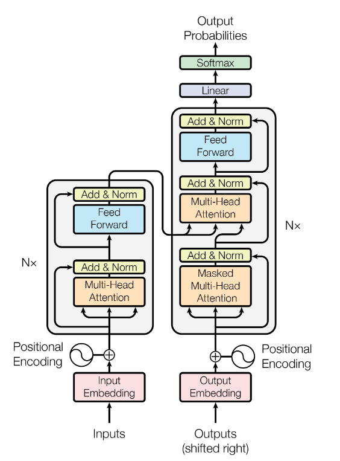
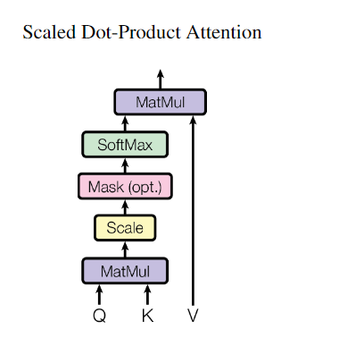
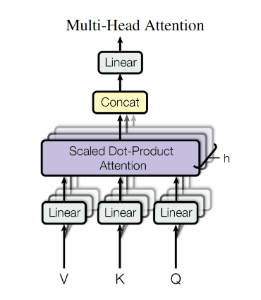
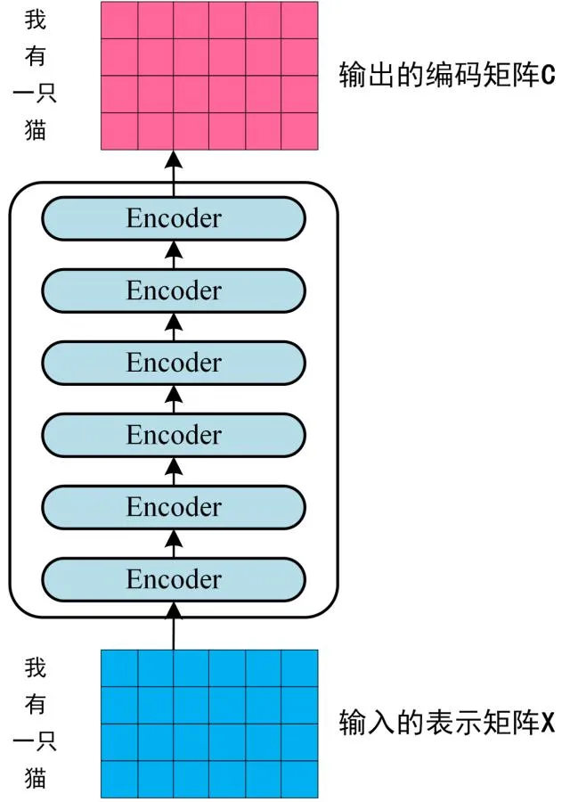
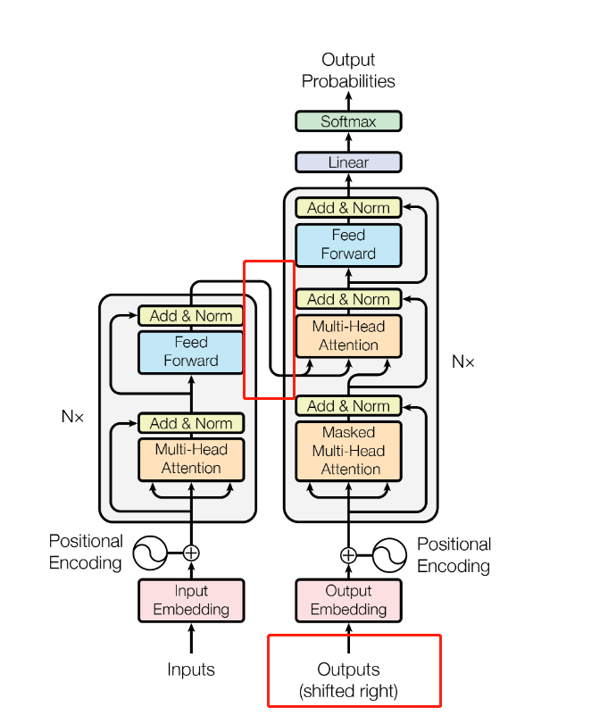

`Attention is All You Need`

# 1 模型结构

大多数序列模型都是 encoder-decoder 结构：

- Encoder 把输入序列（$x_1, x_2, ..., x_n$）映射为连续的表示 $z = (z_1, z_2, ..., z_n)$ 
- 对于给定的 $z$，Decoder 生成输出序列 $(y_1, y_2, ..., y_m)$ 

Transformer 同样使用 Encoder-Decoder 的结构，再encoder和decoder中使用堆叠的 self-attention 以及 point-wise的全连接层。结构如下图所示：

## 1.1 Encoder and Decoder Stacks

### 1.1.1 Encoder

- 编码器有 $N=6$ 个相同的堆叠的网络层。

- 每个网络层都有两个子层：
  - Multi-Head Self-attention mechanism（多头注意力机制）
  - position-wise fully connected feed-forward network
  - 在每个子层內部使用残差连接，加上一个归一化层 (Layer Normal)
  - 因此，每个子层的输出为 $LN(x + Sublayer(x))$
- 为了便于残差连接，所有的子层，以及 Embedding Layer 的输出维度都是 512 维

### 1.1.2 Decoder

- 解码器同样由 $N = 6$ 个完全相同的网络层组成，
- 每个网络层除了具有 Encoder 中的两个子层之外，还插入了一个第三个子层：
  - 第三个子层是一个多头注意力，作用于编码器的输出。
- 类似于编码器，解码器中也在每个子层内部使用了残差连接，以及一个LN层

## 1.2 Attention

注意力的作用可以表述为：映射 Query 以及一组 Key-Value 至 输出。Q, K, V 都是向量。输出通过对 Value 的加权和来获得，其中权重是通过Query和对应的Key计算得到的。

### 1.2.1 Scaled Dot-Product Attention

- 输入由 $d_k$ 维的 Q和K，以及 $d_v$ 维的 V 组成。
- 计算Q和所有K的点积，并除以 $\sqrt{d_k}$ ，并使用 softmax 函数来获得 V 的权重。

最终的输出可以表示为：
$$
Attention(Q, K, V) = softmax(\frac{QK^T}{\sqrt{d_k}})V
$$

- Dot-Product注意力机制的优点：计算更快和Space-efficient，due to 可以表示为高度的优化的矩阵乘法。

- 之所以名称为 Scaled Dot-Product，是由于相较于一般的矩阵内积，该注意力有一个缩放参数 $\frac{1}{\sqrt{d_k}}$

  - 这是由于，当两个维度较大的向量点乘时（$x_1y_1 + x_2y_2 + .... + x_ky_k$） ，如果维度 $k$ 非常大，则最终的值也会变大，在使用softmax时，会获得非常小的梯度，因此对内积结果进行了缩放

  - softmax输入变大，梯度变小的解释：

    - Softmax
      $$
      softmax = \frac{e^{x_i}}{\sum_{j=1}^{n}e^{x_j}}
      $$

    - 对 $x_i$ 的梯度包含两部分（$=i, \ne i$）：
      $$
      G_i = \frac{e^{x_i} \sum{e^{x_j}} - e^{x_i} e^{x_i}}{(\sum{e^{x_j}})^2}
      = \frac{e^{x_i} (\sum{e^{x_j} - e^{x_i}})}{\sum{e^{x_j}} \sum{e^{x_j}}}
      = softmax(x_i) (1 - softmax(x_i))
      \\ \\
      G_j = \frac{0 \sum{e^{x_j}} - e^{x_i} e^{x_j}}{(\sum{e^{x_j}})^2}
      = - softmax(x_i) softmax(x_j)
      \\ \\
      $$

    - 当 $x_i$ 过大时，$softmax(x_i)$ 趋近于1，则 $1 - softmax(i)$ 趋近于0。解释了 $G_i$ 的梯度消失的问题。

    - 对于 $G_j$ 的梯度消失，解释如下：

      - 假设 $Q, K$ 为相互独立的随机变量，由于经过了归一化层，则两个随机变量的均值为 0， 方差为1
      - 两个 $d_k$ 维的独立随机变量相乘，则 $QK^T$ 的均值为 0，方差为 $d_k$ 。若 $d_k$ 较大，则方差变大。经过指数函数缩放之后，则 $G_j$ 中的 $softmax(x_i)$ **更容易** 接近0，或 $softmax(x_j)$ **更容易**接近 0，使得 $G_j$ **更容易** 趋近于0，导致梯度消失，更难训练。

    - 其中，两个独立随机变量的期望方差计算推导：

      - 公式一 ：$E(XY) = E(X)E(Y) + Cov(X, Y)$ 。证明如下：
        $$
        Cov(X, Y) = E[ ( (X - EX) (Y-EY) ) ^ 2 ]
        \\
        = E[ XY - XEY - YEX + EXEY ]
        \\
        =E[XY] - E[X]E[Y] - E[X]E[Y] + E[X]E[Y]
        \\
        = E[XY] - E[X]E[Y]
        $$

      - 公式二 ：$D(X) = E(X^2) - E(X)^2$。证明如下：
        $$
        D(X) = E[ (X - E(X))^2 ]
        \\
        = E[ X^2 + E(X)^2 - 2XE(X) ]
        \\ 
        = E(X^2) + E(X)^2 - 2E(X)E(X)
        \\
        = E(X^2)-E(X)^2
        $$

      - 公式三：$D(XY) = D(X)D(Y) + D(X)E(Y)^2 + D(Y)E(X)^2$ 。证明如下：
        $$
        D(XY) = E(X^2Y^2) - E(XY)^2
        $$
        其中：
        $$
        E[X^2Y^2] = Cov(X^2, Y^2) + E[X^2]E[Y^2]
        \\
        E[XY] = Cov(X, Y) + E[X]E[Y]
        $$
        当 $X, Y$ 相互独立时，$Cov(X, Y) = Cov(X^2, Y^2) = 0$。则：
        $$
        D(XY) = Cov(X^2, Y^2) + E[X^2]E[Y^2] - (Cov(X, Y) - E[X]E[Y])^2
        \\
        = E[X^2]E[Y^2] - (E[X]E[Y])^2
        \\
        = (D(X) + E[X]^2)(D(Y) + E[Y]^2) - (E[X]E[Y])^2
        \\
        = D(X)D(Y) + D(X)E(Y)^2 + D(Y)E(X)^2 + E[X]^2E[Y]^2 - (E[X]E[Y])^2
        \\
        = D(X)D(Y) + D(X)E(Y)^2 + D(Y)E(X)^2
        $$

      - 公式四：$D(X + Y) = DX + DY + 2Cov(X, Y)$ 。证明如下：
        $$
        D(X + Y) = E[ ((X+Y) - E(X+Y) )^2 ]
        \\
        =E[ (X+Y-EX - EY)^2 ]
        \\
        =E[   ((X - EX) + (Y - EY))  ^2         ]
        \\
        = E[      (X-EX)^2 + (Y-EY)^2 + 2(X-EX)(Y-EY)       ]
        \\
        = E[ DX + DY + 2Cov(X, Y) ]
        \\
        = DX + DY + 2Cov(X, Y)
        $$

      - 已知 $E(X) = E(Y) = 0, D(X) = D(Y) = 1$  。令 $Z = XY^T = \sum{x_iy_i}$ 

        - 计算 $E(Z)$ ：
          $$
          E(XY^T) = E(Z) = E(\sum{x_iy_i}) 
          \\
          = \sum{E(x_iy_i)}
          \\
          = \sum{E(x_i)E(y_i)+Cov(x_i, y_i)}
          $$
          若 $x_i, y_i$ 相互独立，则 $Cov(x_i, y_i) = 0$

          则:
          $$
          E(Z) = E(XY^T) = \sum{E(x_i)E(y_i)} = 0
          $$

        - 计算 $D(Z)$：
          $$
          D(Z) = D(XY^T) = D(\sum{x_iy_i}) = D(\sum{z_i})
          \\
          = D(z_1 + z_2 + ... + z_n) = D(z_1) + D(z_2) + ... + D(z_n) + 2Cov(z_1, z_2), + 2Cov(z_1, z_3) + ...
          \\
          = \sum{D(z_i)} + 2\sum \sum Cov(z_i, z_j)
          $$
          需要注意，此处 $x_i, y_i$ 仍为随机变量，而不是常数。因此 $z_i = x_iy_i$ 为随机变量。假设 $z_i$ 之间相互独立，则 $2\sum \sum Cov(z_i, z_j) = 0$ 。因此：
          $$
          D(Z) = D(XY^T) = D(\sum{x_iy_i}) = D(\sum{z_i}) = \sum{D(z_i)} = \sum{D(x_iy_i)}
          $$
          又因为当 $X, Y$ 相互独立时， $D(XY) = D(X)D(Y) + D(X)E(Y)^2 + D(Y)E(X)^2$ 。并且已知 $E(X) = E(Y) = 0$ ，$D(X) = D(Y) = 1$ ，因此 $D(XY) = D(X)D(Y)$ 。所以：
          $$
          D(Z) = D(XY^T) = D(\sum{x_iy_i}) = \sum{D(x_iy_i)} 
          \\
          = \sum{D(x_i)D(y_i)} = d_k
          $$

- 因此，本文对 $Z = XY^T$ 缩放 $\frac{1}{\sqrt{d_K}}$ 倍，则：
  $$
  D(\frac{1}{\sqrt{d_k}} Z) = \frac{1}{d_k} d_k = 1
  $$
  即，保证 Attention 的输出仍为0均值，单位方差的特征向量，模型更容易收敛。

### 1.2.2 Multi-Head Attention

在 1.2.1 节中，使用 Scaled Self-Attention 可以由输入的 Q, K计算 V 的权重，并通过对 V 加权求和获得 Attention(Q, K, V)。

然而，作者发现下方过程的效果更好：

- 对 Q, K, V 分别使用 $d_k, d_k, d_v$ 维 的 Linear 操作进行特征变换，并计算 Scaled Dot-Product Attention，得到一个 $d_v$ 维的输出特征。
- 使用 $h$ 个这样的过程，得到 $h$ 个 $d_v$ 维度的特征，之后 Concat 起来，并再使用一个 Linear 来获得最终的输出。

该过程可以表示为：
$$
MultiHead(Q, K, V) = Concat(head_1, head_2, ..., head_h) W^O
$$
其中，$head_i$ 为：
$$
head_i = Attention(QW_i^Q, KW_i^K, VW_i^V)
$$
其中， $W_i^Q \in \mathbb{R}^{d_{model} \times d_k}， W_i^K \in \mathbb{R}^{d_{model} \times d_k}, W_i^V \in \mathbb{R}^{d_{model} \times d_k} , W^O \in \mathbb{R}^{hd_v \times d_{model}}$ 为可学习参数。$h$ 个头共有 $h$ 个不同的 $W_i^Q, W_i^K, W_i^V$ 。

本文中，$h = 8$ ， $d_k = d_v = d_{model} / h = 64$ 。由于减少了 $d_k, d_v$ 的维度，总的计算开销和单个头的相似。

### 1.2.3 Application of Attention 

Transformer 使用多头注意力时，有3种不同的形式：

- **Encoder-Decoder 的 Attention 层中使用多头注意力** 。$Q$ 来自前一层的 decoder 层，$K, V$ 来自 encoder 的输出
- **Encoder** 的 $Q, K, V$ 都来自于前一层的输出。
- **Decoder** 的 $Q, K, V$ 

# 2 整体流程梳理

假设有一个 S2S 的中文翻译成英文的任务，输入是中文 ：我有一只猫，输出是英文 ：I have a cat 。Transformer的数据流为：

## 2.1 Input Embedding + Position Encoding

- 对于输入的中文 ：“我有一只猫” ，首先需要编码成词向量 (Input Embedding)，至于如何把汉字编码成向量，有多种方法，如 Word2Vec, Glove等算法预训练得到，也可以在Transformer中训练得到。

- 之后通过位置编码 (Position Encoding) 引入位置信息。
- 假设把每一个中文字符都编码成 $1 \times 256$ 的特征，则获得输入矩阵 $X \in \mathbb{R}^{4\times 256}$ 

## 2.2 Encoder 

暂时不考虑每个Encoder Block具体的计算过程，而是把Encoder看作一个整体，则Encoder的作用就是把输入的 $X \in \mathbb{R}^{4\times 256}$ 最终表示成一个中间特征 $C \in \mathbb{R}^{4\times 512}$ ，其中 $512$ 是论文中的设定的值。 

- 不同于RNN，Transformer的每个Encoder Block不是表示不同的step，而是类似堆叠多个卷积提取更抽象的特征的过程。因此 $n$ 个堆叠的Encoder blocks 最终只有最后一个 Encoder block 输出 $C$ ，其他的 Encoder block 的输出只作为下一个 Encoder block 的输入。

## 2.3 Decoder

Encoder 的输出 $C$ 会交给 Decoder 来翻译成英语 "I have a cat" 。这个过程的文字描述如下：

- 首先，需要翻译出第一个单词 " I "
- 之后，把已经翻译出的单词 "I" 作为 Decoder 的 “Outputs + Output Embedding + Position Encoding” 产生新的输入，翻译出 "have" 
- 之后，把已经翻译出的单词 "I have" 作为 Decoder 的 “Outputs + Output Embedding + Position Encoding” 产生新的输入，翻译出 "a" 
- 之后，把已经翻译出的单词 "I have" 作为 Decoder 的 “Outputs + Output Embedding + Position Encoding” 产生新的输入，翻译出 "cat" 

可以发现，Encoder 阶段，“我有一只猫” 一次性 （并行） 的构建成了一个矩阵 $X \in \mathbb{R}^{4\times 256}$  作为输入，并获得特征 $C$ 。但是在 Decoder 阶段，输出确实串行的，每次只输出一个单词，并把当前的输出和所有更早的输出放在一起作为输出下一个单词的输入。为什么会这样呢：

- 由于输入是已知的且固定的，如一段话，一句话。单词个数可能是10个，也可能是100个，或者1个，但是无论如何，我们都是直道这段话具体是有几个单词的，所以能够一起编码，并行的获得特征 $C$ 

- 但是对于输出，我们却不知道究竟要输出几个单词。如翻译 “一杯水”，输入是3个单词，但是输出 "a bottle of water" 却是4个单词。其他更复杂的句子可能输入和输出的单词个数差距会更大，因此要 Decoder 每次只输出一个单词，是串行的过程，直至翻译结束。那么怎么知道翻译结束呢？

- 其实对于 Decoder 输出每一个单词的过程，都有两个输入，一个是 Encoder 的输出特征 $C$ ，一个是之前已经输出的Outputs （如，翻译 "cat" 的时候，Outputs是 "I + have + a"），如下图所示。

  - 从Encoder拿来的  $C$ 是与翻译第几个单词无关的，如翻译  “I” 是，$C$ 是 Encoder的输出，翻译 "cat" 时，输入仍然是完全相同的 encoder 的输出 $C$ 。
  - 翻译 "have" 时，Outputs 是 "I" 。翻译 "a" 时，Outputs 是 "I have"。那么翻译第一个单词 "I" 时，Outputs是什么呢？当然此时 Outputs 也必须是一个字符，并且也能够编码成词向量，这个字符称为起始字符。不过这个字符在中文字典和英文字典中都找不到这个字，可以把它理解成你自己造出来的一个字，你用这个字告诉Transformer翻译开始了，Transformer拿着你造出来的这个表示任务开始的字符以及$C$ ，就翻译出了第一个字符 "I" 
  - 如果理解了开始字符，那么就好理解结束字符了。你通过开始字符告诉模型开始翻译了，模型通过输出结束字符告诉你，翻译完成了。至于模型什么时候输出结束字符，是不确定的，这也就解决了输入输出的文字的长度不相等的问题了。即，模型在 Decoder 中想输出多长就输出多长，反正是串行的过程，每次只输出一个单词，直至输出结束字符就表示输出完了。
  - 模型怎么知道开始字符，并输出结束字符？当然是在训练的过程中教给模型的。
  - 需要注意，在每次翻译下一个字符是，起始字符也是需要拼接在Outputs中的。如，翻译 "cat" 时，Outputs时 "<s>  I have a"

  

- 