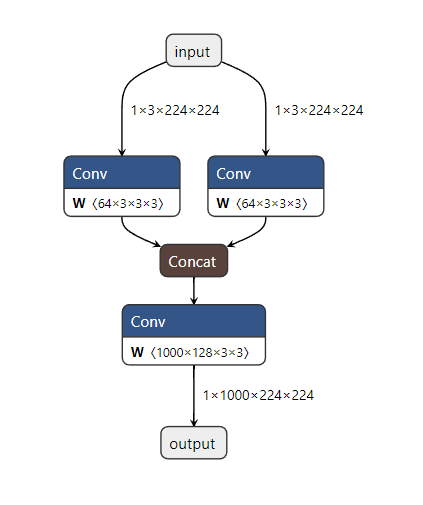

Netron 用于可视化模型，官方 Github 连接： [lutzroeder/Netron](https://github.com/lutzroeder/Netron)

Netron 支持  ONNX, TensorFlow Lite, Caffe, Keras, Darknet, PaddlePaddle, ncnn, MNN, Core ML, RKNN, MXNet, MindSpore Lite, TNN, Barracuda, Tengine, CNTK, TensorFlow.js, Caffe2 和 UFF。

Netron 实验支持 PyTorch, TensorFlow, TorchScript, OpenVINO, Torch, Vitis AI, kmodel, Arm NN, BigDL, Chainer, Deeplearning4j, MediaPipe, ML.NET 和 scikit-learn。

# 1 Pytorch User

## 1.1 Environment

+ Python==3.7.0
+ torch==1.8.1

## 1.2 Get Start

```sh
pip install netron
```

## 1.3 Verify

测试模型：

```python
import torch
import torch.nn as nn

class Model(nn.Module):

    def __init__(self):
        super(Model, self).__init__()

        self.conv1 = nn.Conv2d(3, 64, (3, 3), (1, 1), (1, 1), bias=False)
        self.conv2 = nn.Conv2d(3, 64, (3, 3), (1, 1), (1, 1), bias=False)

        self.conv3 = nn.Conv2d(128, 1000, (3, 3), (1, 1), (1, 1), bias=False)

    def forward(self, x):

        conv1 = self.conv1(x)
        conv2 = self.conv2(x)

        cat = torch.cat([conv1, conv2], 1)

        out = self.conv3(cat)

        print(out.size())
        return out

model = Model()
# img = torch.ones([1, 3, 224, 224])
# model(img)

torch.save(model.state_dict(), './ttt.pth')

import netron
netron.start(f'./ttt.pth')
```

### 1.3.1 直接运行

运行 Netron:

```python
import netron
netron.start(f'./best.pth')
```

输出：

```python
Serving './best.pth' at http://localhost:8080
```

之后在浏览器打开连接即可查看

然而，这种方式无法显式残差连接等并联结构。

### 1.3.2 转 ONNX 之后再运行

```python
model = Model()
img = torch.ones([1, 3, 224, 224]) # 随便写就行
input_names = ['input']
output_names = ['output']

torch.onnx.export(model, img, 'ttt.onnx', input_names=input_names, output_names=output_names, verbose='True')

import netron
netron.start(f'./ttt.onnx')
```



这种方式对一些Pytorch较新的算子不支持，如 `nn.SiLU` ，换成 `Sigmoid` 之后可视化的模型正常。

# Online User

1. 浏览器打开：

[https://lutzroeder.github.io/netron/](https://lutzroeder.github.io/netron/)

2. 点击 `Open Model...`
3. 选择模型文件
