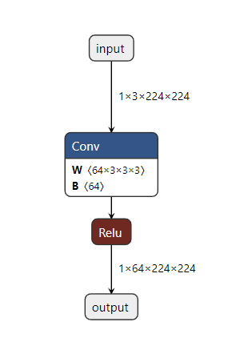
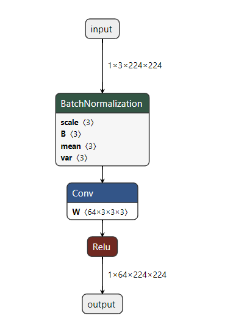
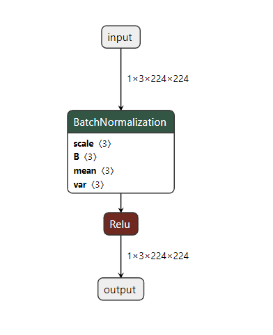

# 1 介绍

Pytorch 提供了导出 ONNX 的函数接口，无需安装额外包，并且使用 Pytorch 自带的导出 ONNX 的方式也是ONNX官方使用的方式。Pytorch 导出 ONNX 及推理的示例详见 Pytorch 文档 [EXPORTING A MODEL FROM PYTORCH TO ONNX AND RUNNING IT USING ONNX RUNTIME](https://pytorch.org/tutorials/advanced/super_resolution_with_onnxruntime.html)


更多 ONNX 提供的 Pytorch 推理、训练文档，参考ONNX官方文档 [Accelerate PyTorch](https://onnxruntime.ai/docs/tutorials/accelerate-pytorch/)

## 1.1 背景

ONNX (Open Neural Network Exchange) 是一个开源生态系统，提供针对AI模型的开源格式，包括深度学习和传统机器学习。ONNX定义了一中可扩展的计算图模型，以及内建操作和标准数据类型。 当前主要关注推理能力的需求。

# 2 Demos

## 2.0 安装 `ONNX` 和 `ONNX Runtime`

```bash
pip install onnx onnxruntime # CPU版本
pip install onnx onnxruntime-gpu # GPU版本

print(onnxruntime.get_device())
```

## 2.1 图像超分辨率

该示例来源于 `Pytorch` 文档 ： [super_resolution_with_onnxruntime](https://pytorch.org/tutorials/advanced/super_resolution_with_onnxruntime.html)

### 2.1.1 定义模型

```python
# Super Resolution model definition in PyTorch
import torch.nn as nn
import torch.nn.init as init


class SuperResolutionNet(nn.Module):
    def __init__(self, upscale_factor, inplace=False):
        super(SuperResolutionNet, self).__init__()

        self.relu = nn.ReLU(inplace=inplace)
        self.conv1 = nn.Conv2d(1, 64, (5, 5), (1, 1), (2, 2))
        self.conv2 = nn.Conv2d(64, 64, (3, 3), (1, 1), (1, 1))
        self.conv3 = nn.Conv2d(64, 32, (3, 3), (1, 1), (1, 1))
        self.conv4 = nn.Conv2d(32, upscale_factor ** 2, (3, 3), (1, 1), (1, 1))
        self.pixel_shuffle = nn.PixelShuffle(upscale_factor)

        self._initialize_weights()

    def forward(self, x):
        x = self.relu(self.conv1(x))
        x = self.relu(self.conv2(x))
        x = self.relu(self.conv3(x))
        x = self.pixel_shuffle(self.conv4(x))
        return x

    def _initialize_weights(self):
        init.orthogonal_(self.conv1.weight, init.calculate_gain('relu'))
        init.orthogonal_(self.conv2.weight, init.calculate_gain('relu'))
        init.orthogonal_(self.conv3.weight, init.calculate_gain('relu'))
        init.orthogonal_(self.conv4.weight)

# Create the super-resolution model by using the above model definition.
torch_model = SuperResolutionNet(upscale_factor=3)
```

### 2.1.2 模型权重

由于 ONNX 主要关注推理过程，因此需要模型的预训练权重。对于 **2.1.1** 中的模型，可以自己预训练，或直接下载预训练权重 : [pretrained weights](https://s3.amazonaws.com/pytorch/test_data/export/superres_epoch100-44c6958e.pth) 。需要注意，提供的预训练权重仅为实现该流程所需，没有进行仔细的训练。

下载完预训练权重之后（或不下载）:

```python
weights = torch.load(r'./superres_epoch100-44c6958e.pth')
torch_model.load_state_dict(weights, strict=True)
```

### 2.1.3 导出 ONNX 模型

```python
# set the model to inference mode
torch_model.eval()
# Input to the model
batch_size = 1    # just a random number
x = torch.randn(batch_size, 1, 224, 224, requires_grad=True)
torch_out = torch_model(x)

# Export the model
torch.onnx.export(torch_model,               # model being run
                  x,                         # model input (or a tuple for multiple inputs)
                  "super_resolution.onnx",   # where to save the model (can be a file or file-like object)
                  export_params=True,        # store the trained parameter weights inside the model file
                  opset_version=10,          # the ONNX version to export the model to
                  do_constant_folding=True,  # whether to execute constant folding for optimization
                  input_names = ['input'],   # the model's input names
                  output_names = ['output'], # the model's output names
                  dynamic_axes={'input' : {0 : 'batch_size'},    # variable length axes
                                'output' : {0 : 'batch_size'}})
```

需要注意：

+ 执行 `torch。onnx.export()` 的时候将会执行模型，并用于记录计算输出所用的操作。因此需要提供一个输入的 Tensor `x` 。
+ `x` 的值可以是任意随机数，只要保证 `x` 具有正确的数据类型和尺寸即可。
+ 需要特别注意的是，一旦指定了 `x` 的尺寸之后，ONNX 的计算图也就随之固定了，以后就不能再更改了。除非特别指定某个维度为 `dynamic_axes`。如上述示例中指定 `batch_size` 为动态的维度。

上述示例代码中， `torch.onnx.export()` 的参数包括：

+ `export_params` : 是否存储训练好的参数（即已加载的参数）
+ `opset_version` ：输出的 ONNX 模型的版本
+ `do_constant_folding` ：

### 2.1.4  验证 ONNX 模型

**Optional** ：

该步骤只是为了验证 ONNX 模型的结构，并确认模型具有合法的结构。

```python
import onnx

onnx_model = onnx.load("super_resolution.onnx")
onnx.checker.check_model(onnx_model)
```

### 2.1.5 运行 ONNX 模型

运行 ONNX 模型需要使用  ONNX 的 `Runtime` ，在 **2.0 安装 `ONNX` 和 `ONNX Runtime `** 中我们已经 `pip` 安装了 `runtime` ，因此可以使用他的 Pytohon API 接口进行推理。

需要注意：

+ 本小节为 ONNX 模型的推理过程，该过程一般与之前的步骤是独立的过程，或者是运行在其他设备上的。然而本小节仅为了介绍ONNX模型的运行过程，因此就继续在同一台设备上进行运行。

加载推理数据：

需要注意的是，虽然我们的 ONNX 模型是从 `pytorch` 导出的，但是推理时仍使用 `numpy` 格式的数据。此外，输入数据的尺寸与 `torch.onnx.export()` 中 `x` 的尺寸需要保持相同（`dynamic_axes` 可以不同）。


```python
import numpy as np
import cv2

img = cv2.imread(r'./cat.jpg')
img = cv2.resize(img, (224, 224))
img = cv2.cvtColor(img, cv2.COLOR_BGR2YCrCb)

img_y = img[:, :, 0:1]
img_cb = img[:, :, 1:2]
img_cr = img[:, :, 2:3]

img_y = img_y.transpose([2, 0, 1])[None, ...].astype(np.float32) / 255.
```

为了运行 ONNX 模型，需要创建一个推理时的 Session，并提供配置参数（本小节仅使用默认的配置参数）。

```python
import onnxruntime

ort_session = onnxruntime.InferenceSession("super_resolution.onnx", providers=['CUDAExecutionProvider'])
# providers=['TensorrtExecutionProvider', 'CUDAExecutionProvider', 'CPUExecutionProvider']
```

执行推理：

```python
ort_inputs = {ort_session.get_inputs()[0].name: img_y}
ort_outs = ort_session.run(None, ort_inputs) # 返回一个列表
```

后处理：

```python
img_out_y = ort_outs[0]

img_out_y = np.uint8((img_out_y[0, ...].transpose([1, 2, 0]) * 255.).clip(0, 255))
img_cb = cv2.resize(img_cb, img_out_y.shape[:2])[..., None]
img_cr = cv2.resize(img_cr, img_out_y.shape[:2])[..., None]

final_img = np.concatenate([img_out_y, img_cb, img_cr], 2)
final_img = cv2.cvtColor(final_img, cv2.COLOR_YCrCb2BGR)

cv2.imshow('img', np.uint8(final_img))
cv2.waitKey()
```


# 3 ONNX不支持的操作

## 3.1 nn.SiLU

把 `torch.nn.SiLU()` 替换为：

```python
class SiLU(nn.Module):
    def __init__(self):
        super(SiLU, self).__init__()

    def forward(self, x):
        return torch.sigmoid(x) * x
```


## 3.2 Conv+BN

错误代码如下：

```python
import torch
import torch.nn as nn

class Model(nn.Module):

    def __init__(self):
        super(Model, self).__init__()

        self.conv = nn.Conv2d(3, 64, (3, 3), (1, 1), (1, 1), bias=False)
        self.bn = nn.BatchNorm2d(64)
        self.relu = nn.ReLU()


    def forward(self, x):
        conv = self.conv(x)
        bn = self.bn(conv)
        out = self.relu(bn)

        return out


model = Model()
img = torch.ones([1, 3, 224, 224]) # 随便写就行
input_names = ['input']
output_names = ['output']

torch.onnx.export(model, img, 'ttt.onnx', input_names=input_names, output_names=output_names, verbose='True')

import netron
netron.start(f'./ttt.onnx')
```

当使用 Netron 可视化时，发现使用 `ConvBlock3x3` 构建的网络层中没有 `BN` ：



而如果在 `Conv` 之前使用 `BN` ，则就没有该问题:

```python
import torch
import torch.nn as nn

class Model(nn.Module):

    def __init__(self):
        super(Model, self).__init__()

        self.bn = nn.BatchNorm2d(3)
        self.conv = nn.Conv2d(3, 64, (3, 3), (1, 1), (1, 1), bias=False)
        self.relu = nn.ReLU()


    def forward(self, x):
        bn = self.bn(x)
        conv = self.conv(bn)
        out = self.relu(conv)

        return out


model = Model()
img = torch.ones([1, 3, 224, 224]) # 随便写就行
input_names = ['input']
output_names = ['output']

torch.onnx.export(model, img, 'ttt.onnx', input_names=input_names, output_names=output_names, verbose='True')

import netron
netron.start(f'./ttt.onnx')
```



或着不使用 `Conv`，也没有该问题：

```python
import torch
import torch.nn as nn

class Model(nn.Module):

    def __init__(self):
        super(Model, self).__init__()

        self.bn = nn.BatchNorm2d(3)
        self.relu = nn.ReLU()


    def forward(self, x):
        bn = self.bn(x)
        out = self.relu(bn)

        return out


model = Model()
img = torch.ones([1, 3, 224, 224]) # 随便写就行
input_names = ['input']
output_names = ['output']

torch.onnx.export(model, img, 'ttt.onnx', input_names=input_names, output_names=output_names, verbose='True')

import netron
netron.start(f'./ttt.onnx')
```



**但是，这个现象可能是由于 Netron 和 ONNX 不兼容导致的，并不影响 ONNX 推理。实际测试发现，ONNX 模型输出与 Pytorch 模型输出一致。 **
