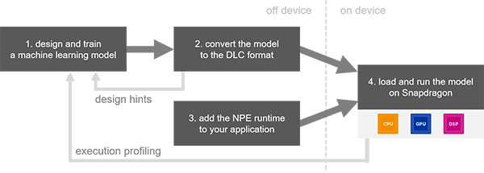

# 1 Introduction

[Qualcomm Neural Processing SDK for AI](https://developer.qualcomm.com/software/qualcomm-neural-processing-sdk) 是 Qualcomm AI Stack 的一部分。能够帮助开发者在高通骁龙设备上优化训练好的神经网络模型的性能。可以在设备上部署神经网络模型，而不需要链接到云端进行计算。支持 Caffe/Caffe2, ONNX, TensorFlow。

Qualcomm Neural Processing SDK 提供了模型转换和运行的工具。支持卷积神经网络和自定义的网络层。

---

该SDK提供了：

+ Android 和 Linux 的神经网络模型执行的 runtimes
+ cceleration support for Qualcomm® Hexagon™ DSPs, Qualcomm® Adreno™ GPUs and Qualcomm® Kryo™, CPUs[1](https://developer.qualcomm.com/software/qualcomm-neural-processing-sdk#footnotes)
+ 支持 Caffe, Caffe2, ONNX 和 TensorFlow 格式的模型
+ 用于模型转换的 Desktop 工具
+ 瓶颈识别的性能基准
+ 示例代码和介绍
+ HTML的文档

---

为了方便开发者，Qualcomm Nerual Processing SDK 没有定义一个特殊的神经网络的库，相反，可以让开发者自由的使用 Caffe, Caffe2, ONNX 和 TensorFLow 进行开发。工作流程如下图所示：



+ 构建并训练一个机器学习模型
+ 把模型转换成 `.dlc` (Deep Learning Container) 格式的中间文件，能够在骁龙NPE runtime 中运行。
+ 模型转换工具会输出一些统计信息，包括不支持的网络层，没有加速的网络层。因此开发者可以调整初始模型的设计。

---

当然，使用该 SDK，也需要一些预备知识：

+ 应该知道如何设计和训练一个模型，或者已经有一个预训练模型的文件了。
+ 深度学习框架应该使用的是 Caffe, Caffee2, ONNX 或 TensorFlow。
+ 能够使用 JAVA 开发 Android APPs，或为 Android, Linux 开发本地应用程序。
+ 有一个 Ubuntu 14.04 的开发环境
+ 有一个支持测试的设备

# 2 Getting Started

## 2.1 System Requirements

+ Ubuntu 18.04
+ (Optional) Android Studio
+ Android SDK  (install via Android Studio or as stand-alone)
+ Android NDK (android-ndk-r17c-linux-x86) (install via Android Studio SDK Manager or as stand-alone)
+ Caffe/Caffe2, TensorFlow, ONNX, TensorFlow Lite 中的一种深度学习框架
+ Python3.6 only ：
  - numpy v1.16.5
  - sphinx v2.2.1
  - scipy v1.3.1
  - matplotlib v3.0.3
  - skimage v0.15.0
  - protobuf v3.6.0
  - pyyaml v5.1

## 2.2 安装Java

```bash
sudo apt update
sudo apt install openjdk-17-jdk
sudo apt install openjdk-17-jre
```

验证：

```bash
java --version
```

## 2.3 安装 Android Studio 或 Command Line Tools

1. 在 https://developer.android.com/studio#downloads 下载
2. 按照 https://developer.android.com/studio/command-line/sdkmanager 配置，并使用sdkmanager

### 2.3.1 安装Android NDK

下载 Command Line Tools 并解压，创建目录之后，就可以安装 Android NDK了：

1. 列出已安装和可用的软件包: 

   ```bash
   /root/android_sdk/cmdline-tools/latest/bin/sdkmanager --list --channel=0
   ```

   + `/root/android_sdk/cmdline-tools/latest/bin/sdkmanager` 是下载下来的 command line tools 中的 `bin/sdkmanager` 的路径
   + `--channels`  ： `0 (stable), 1 (beta), 2 (dev), or 3 (canary)`

   ```
   ndk;21.4.7075529                                                                         | 21.4.7075529 | NDK (Side by side) 21.4.7075529
     ndk;22.0.7026061                                                                         | 22.0.7026061 | NDK (Side by side) 22.0.7026061
     ndk;22.1.7171670                                                                         | 22.1.7171670 | NDK (Side by side) 22.1.7171670
     ndk;23.0.7599858                                                                         | 23.0.7599858 | NDK (Side by side) 23.0.7599858
     ndk;23.1.7779620                                                                         | 23.1.7779620 | NDK (Side by side) 23.1.7779620
     ndk;23.2.8568313                                                                         | 23.2.8568313 | NDK (Side by side) 23.2.8568313
     ndk;24.0.8215888                                                                         | 24.0.8215888 | NDK (Side by side) 24.0.8215888
     ndk;25.0.8775105                                                                         | 25.0.8775105 | NDK (Side by side) 25.0.8775105
   ```

   

2. 选择左侧的软件包：

   ```bash
   /root/android_sdk/cmdline-tools/latest/bin/sdkmanager --install "ndk;25.1.8937393"
   ```

## 2.4 安装 ONNX/TensorFlow/Caffe

以 ONNX 为例

```bash
pip install onnx
```

## 2.5 下载SNPE并配置

1. 下载 Qucalcomm Neural Processing SDK ： [latest version of the SDK](https://developer.qualcomm.com/software/qualcomm-neural-processing-sdk/tools).

2. 解压 ：如 `unzip snpe-1.66.0_3729.zip`

3. 安装 SNPE SDK 的依赖：

   ```bash
   sudo apt-get install python3-dev python3-matplotlib python3-numpy python3-protobuf python3-scipy python3-skimage python3-sphinx wget zip
   ```

   + 验证所有的依赖都已成功安装：

     ```bash
     bash ./snpe-1.66.0.3729/bin/dependencies.sh
     ```

     如果在Docker内运行，可能会出现 `./snpe-1.66.0.3729/bin/dependencies.sh: line 47: sudo: command not found` ，则 Vim `dependencies.sh` ，删除掉sudo 即可。

     如果有没安装的依赖，如 `libc++1-9` ，运行 `dependencies.sh` 之后会自动安装。

   + 验证 Python 的依赖都已成功安装：

     ```bash
     source ./snpe-1.66.0.3729/bin/check_python_depends.sh
     ```

     可能会出现只支持Python3.6版本的情况，那就重装Python吧~

4. 初始化 Qualcomm Neural Processing SDK 的环境：

   ```bash
   cd ./snpe-1.66.0.3729
   export ANDROID_NDK_ROOT=/root/android_sdk/ndk/25.1.8937393
   ```

5. 基于选择的 ML 框架（ONNX/TensorFlow/Caffe），配置SDK的环境

   由于在 2.4小节 中安装的是 ONNX，因此此处以 ONNX 为例。其他深度学习框架的配置相同，此处仅导入python包的安装位置即可：

   + 查看 ONNX/TensorFlow/Caffe 的安装路径：

     ```bash
     pip show -f onnx | grep Location
     ```

     对于TensorFlow/Caffe，只需要把 onnx 替换成其他名称即可。输入如下：

     ```
     Location: /usr/local/lib/python3.6/site-packages
     ```

   + 配置 SDK 的环境：

     ```bash
     source bin/envsetup.sh -o /usr/local/lib/python3.6/site-packages/onnx
     ```

     输出包括 NDK 的路径和 ONNX 的路径：

     ```
     [INFO] Setting ONNX_HOME=/usr/local/lib/python3.6/site-packages/onnx
     [INFO] Found ANDROID_NDK_ROOT at /root/android_sdk/ndk/25.1.8937393
     ```


## 2.6 把模型转换为 DLC 格式

本节介绍官方文档的实现方式。官方文档的实现除了转换模型，还下载了一些测试数据。

   + 测试demo都在 `./snpe-1.66.0.3729/models` 中

   + 如果测试 `caffe` ，使用 `alexnet` ：

     ```bash
     python ./models/alexnet/scripts/setup_alexnet.py -a ./temp-assets-cache -d
     ```

   + 如果测试 `tensorflow`，使用 `inception_v3`
   
     ```bash
     python ./models/inception_v3/scripts/setup_inceptionv3.py -a ./temp-assets-cache -d
     ```
   
   + 如果测试 `onnx`，使用 `VGG`：
   
     ```bash
     python ./models/VGG/scripts/setup_VGG.py -a ./temp-assets-cache -d
     ```
   
     可能会出现 `packaging`，`PIL` ，`onnx-simplifier` 等python包没有安装的情况，用 `pip` 安装即可，之后再重新运行：
   
     ```
     ...
     下载 vgg.onnx
     ...
     
     INFO: Converting /home/snpe-1.66.0.3729/models/VGG/onnx/vgg16.onnx to SNPE DLC format
     2022-10-03 22:30:49,654 - 214 - INFO - Successfully simplified the onnx model!
     
     2022-10-03 22:33:45,096 - 219 - WARNING - WARNING_GEMM: GEMM operation is not supported in the general case, attempting to interpret as FC
     2022-10-03 22:33:47,473 - 219 - WARNING - WARNING_GEMM: GEMM operation is not supported in the general case, attempting to interpret as FC
     2022-10-03 22:33:47,848 - 219 - WARNING - WARNING_GEMM: GEMM operation is not supported in the general case, attempting to interpret as FC
     2022-10-03 22:33:50,534 - 214 - INFO - INFO_DLC_SAVE_LOCATION: Saving model at /home/snpe-1.66.0.3729/models/VGG/dlc/vgg16.dlc
     2022-10-03 22:35:41,211 - 214 - INFO - INFO_CONVERSION_SUCCESS: Conversion completed successfully
     INFO: Setup VGG completed.
     ```


## 2.7 使用 SNPE 命令行推理


```bash
snpe-net-run --container dlc/vgg16.dlc --input_list data/cropped/raw_list.txt
```

其中，路径需要对应一下。这种方式官方文档没有介绍。且 VGG 的推理为 float 推理，没有进行量化。

## 2.8 可视化推理结果

这种方式官方文档没有介绍。官方文档使用的是 Android APP，但没有提供 ONNX 的示例。

```bash
cd ./snpe-1.66.0.3729/models/VGG/scripts
python show_vgg_classifications.py -i ../data/cropped/raw_list.txt -o ../output/ -l ../data/synset.txt
```

输出如下所示，概率最高的为 tabby cat：

```
root@21305bcb6b1e:/home/snpe-1.66.0.3729/models/VGG/scripts# python show_vgg_classifications.py -i ../data/cropped/raw_list.txt -o ../output/ -l ../data/synset.txt
Classification results
probability=0.351833 ; class=n02123045 tabby, tabby cat
probability=0.315166 ; class=n02123159 tiger cat
probability=0.313086 ; class=n02124075 Egyptian cat
probability=0.012995 ; class=n02127052 lynx, catamount
probability=0.003528 ; class=n02129604 tiger, Panthera tigris
```