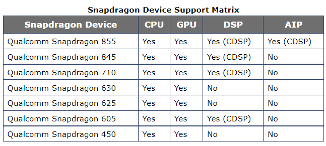
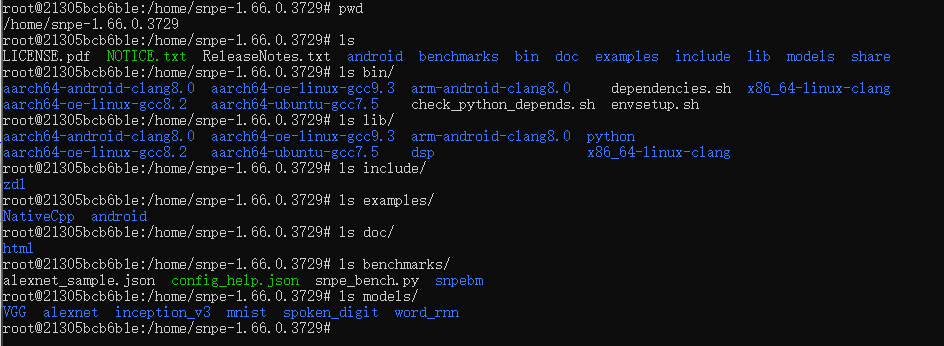
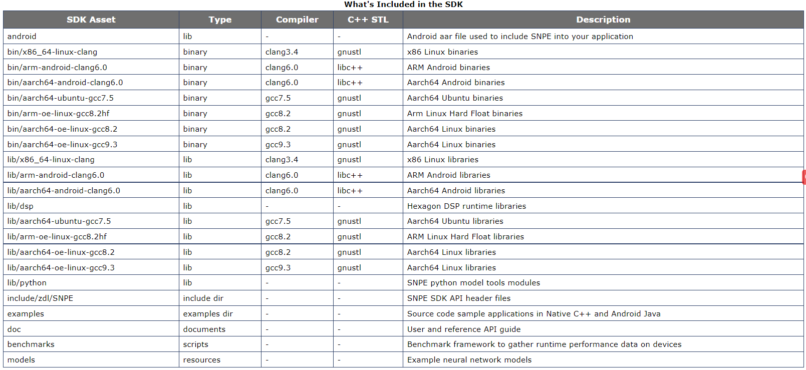
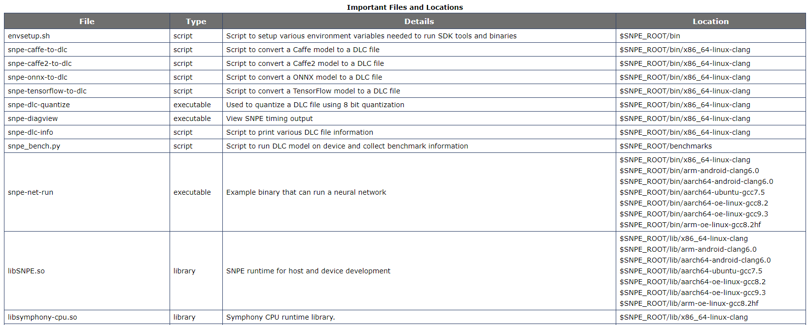
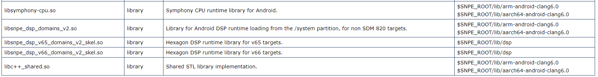
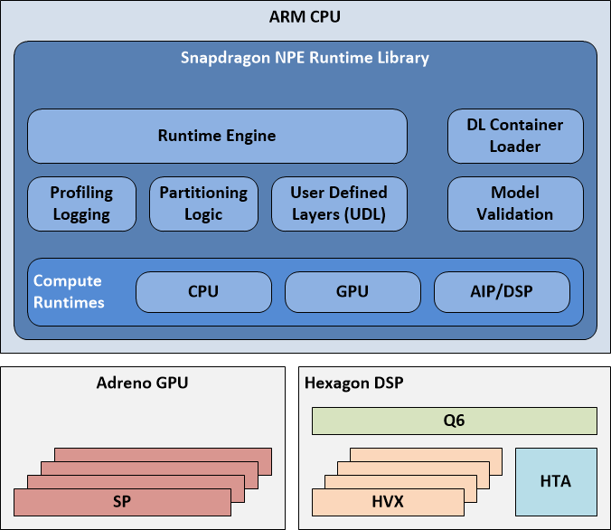
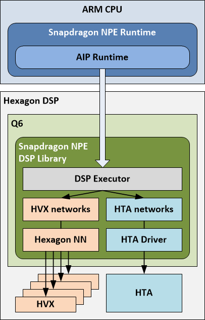

官方文档 ：[**Snapdragon Neural Processing Engine SDK Reference Guide**](https://developer.qualcomm.com/sites/default/files/docs/snpe/index.html)

文档提供了 Snapdragon Neural Processing Engine (SNPE) 软件开发工具包 (Software Development Kit, SDK) 的用户指导，以及 API 。


# 1 介绍

SNPE 是高通骁龙软件加速的运行时 (runtime)，用于运行深度神经网络。使用 SNPE 可以：

+ 运行任意的深度神经网络
+ 在 Snapdragon CPU, Adreno GPU，和 Hexagon DSP 上运行网络
+ 在 x86 的 Ubuntu 上 Debug 网络运行
+ 把 Caffe, Caffe2, ONNX，TensorFlow 模型转换成 SNPE 的 Deep Learning Container （DLC）文件
+ 量化 DLC 文件为 8 位定点数，用于在Hexagon DSP 上运行
+ 使用 SNPE 工具来 Debug 和分析网络的性能
+ 通过 C++ 或 Java 把网络合并到应用或其他代码中

## 1.1 工作流


+ 模型使用 SNPE 支持的深度学习框架进行训练 (Caffe, Caffe2, ONNX, TensorFlow) 。
+ 在训练完成后，把模型转换成为可以被加载到 SNPE 运行时的 DLC 文件。

DLC 文件可以在骁龙加速的计算核心中用于前向传播。

基础的 SNPE workflow 仅包含几个过程：

+ 把模型转换成可以被加载到 SNPE 的 DLC 文件
+ 在 Hexagon DSP 上运行的话，可以选择量化 DLC 文件
+ 准备模型的输入数据
+ 使用 SNPE 运行时加载并运行模型

## 1.2 SNPE支持的骁龙设备



## 1.3 SNPE 文件结构





其中，有几个用于转换模型至 DLC，量化，设置环境 (如JAVA, NDK) , 运行 snpe 模型等比较重要的文件及路径：





# 2 概述

## 2.1 骁龙 SNPE Runtime



上图介绍了 骁龙SNPE 运行时的一些组件。其中：

+ `DL Container Loader` ：加载由 `snpe-framework-to-dlc` (如， `snpe-onnx-to-dlc`) 转换工具创建的 DLC 。
+ `Model Validation` ：验证加载的 DLC 是否被 runtime 支持，可以查阅支持哪些网络层 [Supported Network Layers](https://developer.qualcomm.com/sites/default/files/docs/snpe/network_layers.html#network_layers) 
+ `Runtime Engine` ：在请求的 runtime(s) 上运行加载的模型，包括收集分析信息
+ `Partioning Logic` ：处理模型，包括验证所需的目标layers，并根据 runtime 把模型划分为子网络。如果 CPU Fallback 启用，分区器将把模型划分成 runtime 支持的层，以及不支持的层（运行在CPU）。

+ `Compute Runtimes` ：
  + `CPU Runtime` ：在CPU上运行模型，支持 32 位浮点数，或 8位量化执行
  + `GPU Runtime` ：在GPU上运行模型，支持混合或全部的 16 位浮点模式 
  + `DSP Runtime` ：利用Q6和Hexagon NN在Hexagon DSP上运行模型，在HVX上执行。支持8位量化执行
  + `AIP Runtime` ：利用Q6、Hexagon NN和HTA在Hexagon DSP上运行模型。支持8位量化执行。

## 2.2 AIP Runtime

AIP (AI Processor) 运行时是将Q6、HVX和HTA的软件抽象为单个实体(AIP)，用于跨所有三者执行模型。



如果把模型加载到 SNPE，并选择 AIP runtime 作为运行时，该模型将会部分运行在 HTA，部分运行在 HVX。该过程通过 Q6 进行策划。

为了在HTA上执行模型的部分，模型需要离线分析，相关部分的二进制文件需要嵌入到DLC中。

如上图所示，骁龙NPE在DSP上有一个 libary ，负责与 AIP Runtime 进行通信。该 libary包括：

+ `DSP Executor` ：管理模型在 HTA 和 HVX 上的执行。同时该 Executor 有一个模型描述，包含那些模型在 HTA 上运行，那些在 HVX 上运行。
+ `HTA Driver` ：用于运行在 HTA 上的子网络
+ `Hexagon NN`：用于运行使用 HVX 的子网络

DSP Executor 在各自的核心上执行子网，并根据需要协调缓冲区交换和格式转换，以返回正确的输出到运行在ARM CPU上的Snapdragon运行时(如果需要，包括反量化)。

# 3 配置SNPE

## 3.1 环境

+ 当前 SNPE SDK 仅限制使用 Ubuntu，特别是 Ubuntu 18.04
+ SNPE SDK 需要 Caffe, Caffe2, ONNX, Pytorch, TensorFlow, TFLite:
  1. Instructions for Caffe: [Caffe and Caffe2 Setup](https://developer.qualcomm.com/sites/default/files/docs/snpe/setup_caffe.html)
  2. Instructions for TensorFlow: [TensorFlow Setup](https://developer.qualcomm.com/sites/default/files/docs/snpe/setup_tensorflow.html)
  3. Instructions for ONNX: [ONNX Setup](https://developer.qualcomm.com/sites/default/files/docs/snpe/setup_onnx.html)
  4. Instructions for TFLite: [TFLite Setup](https://developer.qualcomm.com/sites/default/files/docs/snpe/setup_tflite.html)
  5. Instructions for PyTorch: [PyTorch Setup](https://developer.qualcomm.com/sites/default/files/docs/snpe/setup_pytorch.html)

+ 需要 Python3.6
  + `/usr/bin/python` 和 `python` 需要指向 `Python3` ：
+ (可选) Android SDK （SDK version 23 and build tools version 23.0.2），用于构建与 Android APK 一起发布的 SNPE SDK：
+ SDK Android binaries hi用 clang 构建，需要 libc+++shared.so
+ (可选) Android NDK （android-ndk-r17c-linux-x86）。用于构建原生 CPP 样例。

## 3.2 配置 SPNE SDK 的环境及依赖

参考 `2-qucalcomm_neural_processing_sdk.md` 。其中 ONNX 的版本：

- onnx v1.3.0
- onnx v1.6.0
- numpy v1.16.5
- protobuf v3.6.0

Pytorch, Cafe, TFLite 等配置参考文档。

# 4 支持的网络层

参考文档 ：[**Supported Network Layers**](https://developer.qualcomm.com/sites/default/files/docs/snpe/network_layers.html) 

其中，ONNX 支持的网络层参考文档：[**Supported ONNX Ops**](https://developer.qualcomm.com/sites/default/files/docs/snpe/supported_onnx_ops.html)

# 5 模型转换

## 5.1 ONNX模型转换

文档 ： [**ONNX Model Conversion**](https://developer.qualcomm.com/sites/default/files/docs/snpe/model_conv_onnx.html)

`snpe-onnx-to-dlc` 工具能够把一个序列化的 ONNX 模型等价转换为 DLC 。

使用实例：

```bash
snpe-onnx-to-dlc --input_network models/bvlc_alexnet/bvlc_alexnet/model.onnx
                 --output_path bvlc_alexnet.dlc
```

`snpe-onnx-to-dlc` 是一个命令行工具，参数可以参考 [snpe-onnx-to-dlc]( https://developer.qualcomm.com/sites/default/files/docs/snpe/tools.html#tools_snpe-onnx-to-dlc)

需要注意， `SNP runtime` 和 `snpe-onnx-to-dlc` 都不支持动态 tensor 。

# 6 模型量化

`snpe-framework-to-dlc` 转换的 DLC 模型都是非量化的。如果需要进行量化，需要使用 `snpe-dlc-quantize` 工具。如：

```bash
snpe-dlc-quantize --input_dlc inception_v3.dlc --input_list image_file_list.txt --output_dlc inception_v3_quantized.dlc
```

其中，由于需要校准 int8，因此需要一些输入图像，--input_list 保存的是一些图像的路径。格式如：

```
/home/snpe-1.66.0.3729/models/VGG/data/cropped/kitten.raw
/home/snpe-1.66.0.3729/models/VGG/data/cropped/kitten.raw
/home/snpe-1.66.0.3729/models/VGG/data/cropped/kitten.raw
/home/snpe-1.66.0.3729/models/VGG/data/cropped/kitten.raw
...
```

实验发现，提供 5-10 个输入数据通常就足够了。如果想要获得更鲁棒的量化结果，建议提供50-100个样例。

`snpe-dlc-quantize` 的其他参数参考：[snpe-dlc-quantize](https://developer.qualcomm.com/sites/default/files/docs/snpe/tools.html#tools_snpe-dlc-quantize)

关于 SPNE 量化的具体实现细节，可以参考 `4-quantized_and_non_quantized.md` 

# 7 数据格式

在 SNPE 中，图像必须是 `(bs, H, W, C)` 的格式。这是由于在前向传播的过程中，通道维度是变化最快的，需要在内存中连续。

其中，通道的顺序（如 RGB或BGR）需要与训练时保持一致。

