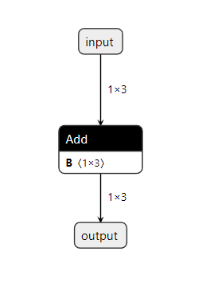

# 1 介绍

本节将演示如何使用c++和Python api来实现最常见的深度学习层。它展示了如何使用深度学习框架构建的现有模型，并使用提供的解析器构建 `TensorRT` 引擎。开发人员指南还提供了对常见用户任务的逐步指导，如创建一个 `TensorRT` 网络定义，调用 `TensorRT` 构建器，序列化和反序列化，以及如何向引擎提供数据和执行推断;同时使用c++或Python API。

Developer Guider 是比较全面和细致的文档 ：https://docs.nvidia.com/deeplearning/tensorrt/developer-guide/index.html#overview

## 1.1 示例

NVIDIA TensorRT 官网提供了多种 demos，参考 [Sample Support Guide](https://docs.nvidia.com/deeplearning/tensorrt/sample-support-guide/index.html) 。

如：

+ [“Hello World” For TensorRT](https://docs.nvidia.com/deeplearning/tensorrt/sample-support-guide/index.html#mnist_sample)
+ [Building A Simple MNIST Network Layer By Layer](https://docs.nvidia.com/deeplearning/tensorrt/sample-support-guide/index.html#mnistapi_sample)
+ [“Hello World” For TensorRT From ONNX](https://docs.nvidia.com/deeplearning/tensorrt/sample-support-guide/index.html#onnx_mnist_sample)
+ [Building And Running GoogleNet In TensorRT](https://docs.nvidia.com/deeplearning/tensorrt/sample-support-guide/index.html#googlenet_sample)
+ [Performing Inference In INT8 Precision](https://docs.nvidia.com/deeplearning/tensorrt/sample-support-guide/index.html#int8_api_sample)
+ ... 

## 1.2 互补的 GPU 特性

[Multi-Instance GPU](https://docs.nvidia.com/datacenter/tesla/mig-user-guide/index.html) （MIG），能够使用户直接划分一个物理 GPU 为多个更小的 GPUs 。对于GPU利用率低的 TensorRT应用程序，MIG可以在对延迟影响很小或没有影响的情况下产生更高的吞吐量。


## 1.3 互补的软件

+  [NVIDIA Triton](https://docs.nvidia.com/deeplearning/triton-inference-server/user-guide/index.html) ：是一个推理服务器，是一个高级库，提供了跨 CPU 和 GPU 的优化推理。它提供了启动和管理多个模型的功能，以及用于服务推理的 REST 和 gRPC 端点。
+ [NVIDIA DALI](https://docs.nvidia.com/deeplearning/dali/user-guide/docs/#nvidia-dali-documentation)
+ [TensorFlow-TensorRT (TF-TRT)](https://docs.nvidia.com/deeplearning/frameworks/tf-trt-user-guide/index.html) 
+ [Torch-TensorRT (Torch-TRT)](https://developer.nvidia.com/blog/accelerating-inference-up-to-6x-faster-in-pytorch-with-torch-tensorrt/)  ：是一个 Python-TensorRT 编译器，能够转换 PyTorch 模型到 TensorRT engine。示例参考 [Examples for Torch-TRT](https://github.com/pytorch/TensorRT/tree/master/notebooks)
+ [TensorFlow-Quantization toolkit](https://github.com/NVIDIA/TensorRT/tree/main/tools/tensorflow-quantization) 
+ [PyTorch Quantization Toolkit](https://docs.nvidia.com/deeplearning/tensorrt/pytorch-quantization-toolkit/docs/userguide.html)
+  [PyTorch Automatic SParsity (ASP)](https://github.com/NVIDIA/apex/tree/master/apex/contrib/sparsity) 


## 1.4 ONNX

ONNX 是最主流的一种其他框架导入为 TensorRT 的一种中间格式。

需要注意的是，以 PyTorch 为例：

+ PyTorch 导出为 ONNX，需要 ONNX 支持 PyTorch 的算子
+ ONNX 导出为 TensorRT，需要 TensorRT 支持 ONNX 的算子 ： [Supported ONNX Operators](https://github.com/onnx/onnx-tensorrt/blob/main/docs/operators.md)

为了简化 TensorRT 的工作流程，一个好的习惯是在导出 ONNX 模型之后，对 ONNX 使用  [Polygraphy](https://docs.nvidia.com/deeplearning/tensorrt/developer-guide/index.html#polygraphy-ovr) 

来折叠常量，删除不使用的节点，并对节点进行拓扑排序。在形状是静态已知的情况下，它还可以简化涉及形状操作的子图。如，`output = input + ((a + b) + d)` 的操作，使用 `netron` 可视化，如下图所示：


显然， `a, b, d` 都是常量，可以进行常量折叠，即 `x = a + b + d` ，之后再执行 `output = input + x` 。为了实现常量折叠，可以使用:

```bash
pip install nvidia-pyindex
pip install polygraphy
pip install importlib_metadata
pip install onnx_graphsurgeon
```

```bash
polygraphy surgeon sanitize model.onnx --fold-constants -o folded.onnx
```



## 1.5 精度

TensorRT 支持 `FP32` , `FP16` ,`INT8` ，`Bool` 和 `INT32` 的数据类型。

又两种方法配置精度：

+ 在模型级别使用 `BuilderFlag` 控制整个模型的精度。
+ 单独给某些层配置特殊的精度。


## 1.6 DLA

TensorRT支持NVIDIA的深度学习加速器(Deep Learning Accelerator, DLA)，这是一个专用的推理处理器，存在于许多支持TensorRT层子集的NVIDIA soc上。TensorRT允许你在DLA上执行一部分网络，其余的在GPU上执行;对于可以在任意设备上执行的层，您可以在构建器配置中按层选择目标设备。

[Working with DLA](https://docs.nvidia.com/deeplearning/tensorrt/developer-guide/index.html#dla_topic) 


# 2 TensorRT 操作的两个阶段

## 2.1 Build

`Builder` 负责优化一个模型，并产生一个 `Engine` 。为了 build 一个 engine，必须：

+ 创建一个网络结构定义。如最常用的 ONNX ，在这个阶段，必须定义输入输出tensors，用于绑定输入输出buffers。
+ 指定 builder 的配置参数。如精度等。该过程通常需要花费几分钟或更多时间。
+ 调用 builder 来创建 engine。如折叠常量等。

需要注意

+ 由于 TensorRT 针对硬件和指令集来优化一些操作，如卷积，int8等。因此，在不同的GPU上创建的 engines 通常是不能用于其他 GPU 的。

## 2.2 Runtime

通常执行以下两个步骤：

+ Deserialize a plan to create an engine.
+ Create an execution context from the engine.

然后反复执行：

+ Populate input buffers for inference.

+ Call enqueue() or execute() on the execution context to run inference.


# 3 Python API

详见 Python API 笔记


 