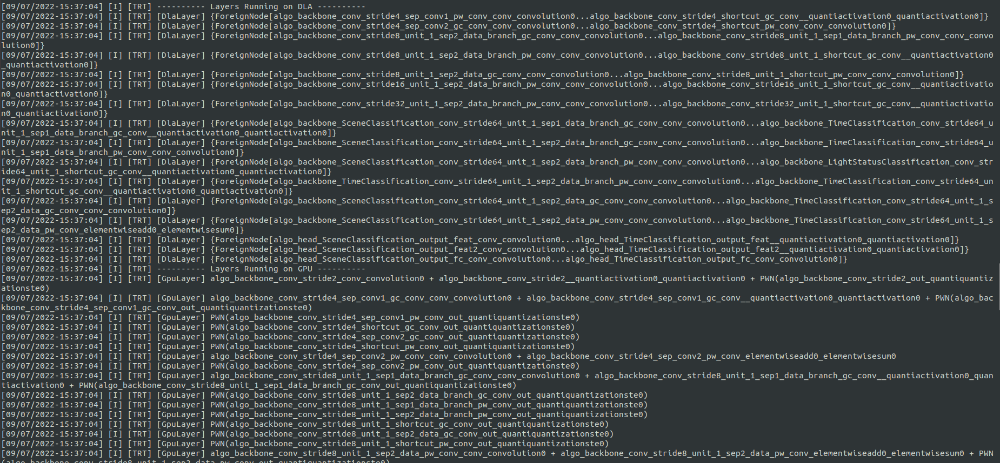
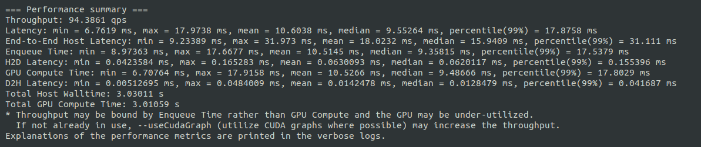

# TensorRT working with DLA

NVIDIA DLA (Deep Learning Accelerator) 是一个深度学习的加速引擎。

官方文档 ： https://docs.nvidia.com/deeplearning/tensorrt/developer-guide/index.html#dla_topic

示例：https://github.com/NVIDIA-AI-IOT/jetson_dla_tutorial

工作原理，当构建DLA模型时，TensorRT builder 解析网络并调用DLA编译器来编译网络为 DLA 可加载的格式。

# 2 Demo

本节将在Jetson Orin 平台使用 DLA 开发一个神经网络的加速示例。DLA 可以运行通用的深度学习推理算子，比如巻积。

为了更好的说明如何使用DLA，本节示例将介绍一个完成的建模过程，包括使用pytorch从设计/训练模型开始，到转换模型为int8精度，再到验证模型。

## 2.1 定义一个 Pytorch 模型

为了更好的展示如何处理DLA不支持的层，下方代码中使用了一个 GroupNorm Normalization Layer：

```python
class ModelGN(nn.Module):
    def __init__(self, num_classes):
        super().__init__()
        self.cnn = nn.Sequential(
            nn.Conv2d(3, 64, kernel_size=3, stride=2, padding=1),
            nn.GroupNorm(8, 64),
            nn.ReLU(),
            nn.Conv2d(64, 128, kernel_size=3, stride=2, padding=1),
            nn.GroupNorm(8, 128),
            nn.ReLU(),
            nn.Conv2d(128, 256, kernel_size=3, stride=2, padding=1),
            nn.GroupNorm(8, 256),
            nn.ReLU(),
            nn.Conv2d(256, 512, kernel_size=3, stride=2, padding=1),
            nn.GroupNorm(8, 512),
            nn.ReLU()
        )
        self.pool = nn.AdaptiveAvgPool2d((1, 1))
        self.linear = nn.Linear(512, num_classes)

    def forward(self, x):
        x = self.cnn(x)
        x = self.pool(x)
        x = x.view(x.shape[0], -1)
        x = self.linear(x)
        return x

model_gn = ModelGN(num_classes=10).cuda().eval()
```

为了走同流程，这里将直接使用随即初始化参数，不再训练。

## 2.2 导出ONNX模型

为了在 DLA 上运行模型，需要使用 TensorRT 神经网络推理库。这里导出 ONNX 模型的最终目的还是为了构建 TensorRT engine：

```python
data = torch.zeros(1, 3, 32, 32).cuda()

torch.onnx.export(model_gn, data, 'model_gn.onnx',
    input_names=['input'],
    output_names=['output'],
    dynamic_axes={
        'input': {0: 'batch_size'},
        'output': {0: 'batch_size'}
    }
)
```

**需要注意，这里使用了动态的bs维度。如果这里设置静态维度，则测试时也只能使用静态维度。**

## 2.3 构建 TensorRT Engine

+ 命令行工具：

  ```bash
  trtexec --onnx=model_gn.onnx --shapes=input:32x3x32x32 --saveEngine=model_gn.engine --exportProfile=model_gn.json --int8 --useDLACore=0 --allowGPUFallback --useSpinWait --separateProfileRun --exportProfile=model_gn.json > model_gn.log
  ```

  其中：

  + `-- exportProfile` :  The path to output a JSON file containing layer granularity timings.

  + `--useDLACore=0 ` :  可选项 ：{0 : dla1, 1 : dla1, -1 : gpu}
  + `--allowGPUFallback` : 对于 DLA 不支持的网络层，允许在 GPU 上运行
  + `separateProfileRun` : Synchronize GPU events, for improved profiling stability.
  + `--separateProfileRun` : Perform a separate run for layer profiling.
  + `-- shapes` : 输入维度（input是导出onnx的 input_names）。其中，若导出 ONNX 时没有设置动态维度的位置，此处必须保持和导出 ONNX 时相同的维度。

**NOTE : 如果 导出 ONNX 时设置的是动态维度，则上述命令行不能使用 --shapes**

需要特别注意：由于不同硬件平台支持的量化和算子是不同的，因此这一步需要在具有DLA的平台上构建 TensorRT engine。输出日志类似：

```
[03/31/2022-14:34:54] [I] [TRT] ---------- Layers Running on DLA ----------
[03/31/2022-14:34:54] [I] [TRT] [DlaLayer] {ForeignNode[Conv_0]}
[03/31/2022-14:34:54] [I] [TRT] [DlaLayer] {ForeignNode[Relu_10...Conv_11]}
[03/31/2022-14:34:54] [I] [TRT] [DlaLayer] {ForeignNode[Relu_21...Conv_22]}
[03/31/2022-14:34:54] [I] [TRT] [DlaLayer] {ForeignNode[Relu_32...Conv_33]}
[03/31/2022-14:34:54] [I] [TRT] [DlaLayer] {ForeignNode[Relu_43]}
[03/31/2022-14:34:54] [I] [TRT] ---------- Layers Running on GPU ----------
[03/31/2022-14:34:54] [I] [TRT] [GpuLayer] SHUFFLE: Reshape_2 + (Unnamed Layer* 7) [Shuffle]
[03/31/2022-14:34:54] [I] [TRT] [GpuLayer] PLUGIN_V2: InstanceNormalization_5
[03/31/2022-14:34:54] [I] [TRT] [GpuLayer] SHUFFLE: (Unnamed Layer* 12) [Shuffle] + Reshape_7
[03/31/2022-14:34:54] [I] [TRT] [GpuLayer] SCALE: 71 + (Unnamed Layer* 16) [Shuffle] + Mul_8
[03/31/2022-14:34:54] [I] [TRT] [GpuLayer] SCALE: 72 + (Unnamed Layer* 19) [Shuffle] + Add_9
[03/31/2022-14:34:54] [I] [TRT] [GpuLayer] SHUFFLE: Reshape_13 + (Unnamed Layer* 29) [Shuffle]
```



其中，可以看到支持在 DLA 上运行的操作和在GPU上运行的操作（DLA不支持的操作会fell back到GPU）。其中 DLA 上运行的日志有一个 `ForeignNode` ，表示连续多个子图都在 DLA 上运行，中间没有被不支持的操作所隔断的。

同时，运行上述命令行构建工具，也会输出每秒运行多少个batch:



```
[03/31/2022-15:12:38] [I] === Performance summary ===
[03/31/2022-15:12:38] [I] Throughput: 305.926 qps
```

- **Latency: min = 0.54895** **ms****, max = 13.481 ms, mean = 5.28364 ms, median = 5.1907 ms, percentile(99%) = 8.7981 ms** 为时延

- **Throughput: 203.462** **qps** 表示吞吐量（每秒运行多少个 batch，由于在 1.2 小节中，构建 TensorRT Engine 的 --shapes 中的 batch_size 设置为了32，因此每秒共推理了 $$ 203.462 \times 32$$  个样本）

- 对于时延，吞吐量以及其他信息的解释，详见 [Command-Line Programs](https://docs.nvidia.com/deeplearning/tensorrt/developer-guide/index.html#command-line-programs)

# 3 DLA 支持的Layers 和 限制

## 3.1 限制

+ 最大的 batch-size 为 4096
+ 不支持动态维度
+ 运行时的 bs 维度必须和构建时相等
+ 如果任何中间层不能在 DLA 上运行，并且启用了 GPUFallback，TensorRT可以将一个网络分成多个DLA loadables
+ 在每个 core 上，DLA最多可以加载 16 个 DLA loadables
+ 需要注意，DLA 中所指的 bs 不是设置的 bs，而是除了 CHW 之外的所有维度的乘积。如 $NTCHW$ 的 bs 计算为 $NT$ 。

## 3.2 支持的网络层

## 3.2.1 卷积和全连接层

+ 只支持两个空间维度
+ FP16 和 FP8 都支持
+ 每个维度的 kernel size 必须在 $[1, 32]$ 区间内
+ Padding 必须在 $[0, 31]$ 区间内
+ Padding 的尺寸必须小于该层对应的 kernel dimension
+ Stride 必须在 $[1, 8]$ 区间内
+ 输出特征图的维度必须在 $[1, 8192]$ 区间内
+ goups 必须在 $[1, 8192]$ 区间内 for operations using the formats `TensorFormat::kLINEAR` ,`TensorFormat::kCHW16` 和 `TensorFormat::kCHW32` 
+ goups 必须在 $[1, 4]$ 区间内 for operations using the formats `TensorFormat::kDLA_HWC4` 
+ 空洞卷积（ratio）必须在 $[1, 32]$ 区间内

### 3.2.2 反卷积层

+ 只支持两个空间维度
+ FP16 和 FP8 都支持
+ 每个维度的 kernel size 必须在 $[1, 32]$ 区间内， 除了 $1 \times [64, 96, 128]$ 和 $[64, 96, 128] \times 1$ 
+ TensorRT has disabled deconvolution square kernels and strides in the range $[23 - 32]$ on DLA as they significantly slow down compilation
+ padding 必须是0
+ Grouped deconvolution must be 1
+ Dilated deconvolutions must be 1
+ 输入输出通道维度必须在 $[1, 8192]$ 区间内

### 3.2.3 池化层

+ 只支持两个空间维度
+ FP16 和 FP8 都支持
+ 支持的操作： kMAX, kAVERAGE
+ kernel size 必须在 $[1, 8]$ 之间
+ Padding 必须在 $[0, 7]$ 之间
+ 步长必须在 $[1, 16]$
+  With INT8 mode, input and output tensor scales must be the same

### 3.2.4 激活函数

+ 只支持两个空间维度
+ FP16 和 FP8 都支持
+ 支持 ReLU, Sigmoid, TanH, Clipped ReLU, Leaky ReLU:
  + 不支持负斜率
  + Clipped ReLU 支持的值域必须在 $[1, 127]$
  + 使用 INT8 模式时，在计算TanH, Sigmoid 时，自动转为 FP16 推理

### 3.2.5 Parametric ReLU

+ Slopes input must be a build time constant and have the same rank as the input tensor.

### 3.2.6 ElementWise

+ 只支持两个空间维度
+ FP16 和 FP8 都支持
+ 支持 Sum, Sub, Product, Max, Min

### 3.2.7 Scale Layers

+ 只支持两个空间维度
+ FP16 和 FP8 都支持
+ 支持 Uniform, Per-Channel 和 ElementWise
+ Only scale and shift operations are supported

### 3.2.8 LRN (Local Response Normalization)

+ Allowed window sizes are 3, 5, 7, or 9.
+ Normalization region supported is ACROSS_CHANNELS.
+ LRN INT8 is supported by auto-upgrading to FP16.

### 3.2.9 Concatenation

+ DLA supports concatenation only along the channel axis.
+ Concat must have at least two inputs.
+ All the inputs must have the same spatial dimensions.
+ With INT8 mode, the dynamic range of all the inputs must be the same.
+ With INT8 mode, the dynamic range of output must be equal to each of the inputs.

### 3.2.10 Resize

+ The number of scales must be exactly 4.
+ The first two elements in scales must be exactly 1 (for unchanged batch and channel dimensions).
+ The last two elements in scales, representing the scale values along height and width dimensions, respectively, must be integer values in the range of [1, 32] in nearest-neighbor mode and [1, 4] in bilinear mode.

### 3.2.11 Unary Layer

+ Only the ABS operation is supported.

### 3.2.12 Slice Layer

+ Only supports FP16 precision.
+ Supports batch sizes up to general DLA maximum.
+ All input non-batch dimensions must be in the range [1, 8192].
+ Only supports 4-D inputs and slicing at CHW dimensions.
+ Only supports static slicing, so slice parameters have to be provided statically either using TensorRT ISliceLayer setter APIs or as constant input tensors.

### 3.2.13 Softmax Layer

+ Only supported on NVIDIA Orin™, not Xavier™.
+ All input non-batch dimensions must be in the range [1, 8192].
+ Only supports FP16 precision.
+ Internally, there are two modes, and the mode is selected based on the given input tensor shape:
  + The accurate mode is triggered when all non-batch, non-axis dimensions are 1.
  + The optimized mode allows the non-batch, non-axis dimensions to be greater than 1 but restricts the axis dimension to 1024 and involves an approximation that may cause a small error in the output. The magnitude of the error increases as the size of the axis dimension approaches 1024.

## 3.3 NVIDIA Orin 上的限制

+ 由于NVIDIA Orin和 Xavier DLA在硬件上的差异，NVIDIA Orin上的FP16卷积操作的延迟可能会增加2倍
+ On NVIDIA Orin, DLA stores weights for non-convolution operations (FP16 and INT8) inside a loadable as FP19 values (which use 4 byte containers). The channel dimensions are padded to multiples of either 16 (FP16) or 32 (INT8) for those FP19 values. Especially in the case of large per-element Scale, Add, or Sub operations, this can inflate the size of the DLA loadable, inflating the engine containing such a loadable. Graph optimization may unintentionally trigger this behavior by changing the type of a layer, for example, when an ElementWise multiplication layer with a constant layer as weights is fused into a scale layer.

# 4 GPU Fallback Mode

如果被标记为在DLA上运行的层不能在DLA上运行，则GPUFallbackMode设置生成器使用GPU。由于以下原因导致DLA上无法运行层:

+ DLA不支持的 layer 操作
+ 指定的参数超出了DLA的支持范围
+ 给定的bs大小超过了最大允许的DLA批大小
+ 网络中的层的组合会导致内部状态超出DLA能够支持的范围
+ 平台上没有 DLA engines

# 5 IO 格式

[I/O Formats on DLA](https://docs.nvidia.com/deeplearning/tensorrt/developer-guide/index.html#restrictions-with-dla)

# 6 DLA 标准模式

[DLA Standalone Mode](https://docs.nvidia.com/deeplearning/tensorrt/developer-guide/index.html#dla-standalone-mode)

# 7 Customizing DLA Memory Pools

[Customizing DLA Memory Pools](https://docs.nvidia.com/deeplearning/tensorrt/developer-guide/index.html#customize-dla-mem-pools)

# 8 稀疏性

[Sparsity on DLA](https://docs.nvidia.com/deeplearning/tensorrt/developer-guide/index.html#dla-sparsity)