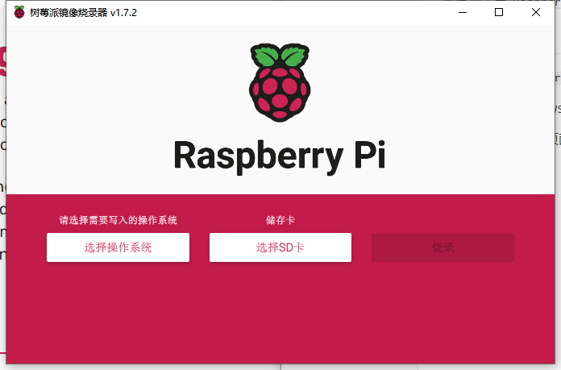
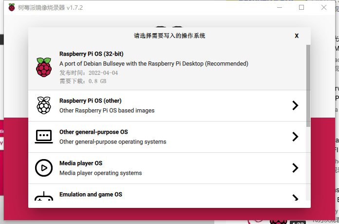
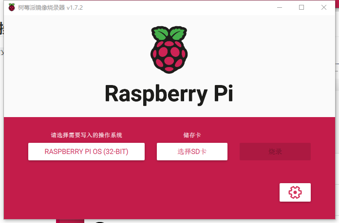
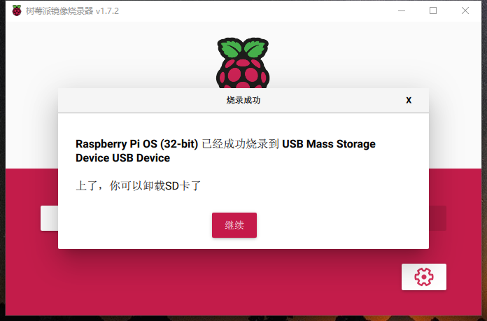

# 1 介绍

[树莓派官网](https://www.raspberrypi.com/software/)

## 2 安装系统

树莓派需要 `Raspberry Pi OS` ，过去叫做  `Raspbian`，时官方支持的操作系统。

## 2.1 安装 Raspberry Pi Imager

下载并安装 `Raspberry Pi Imager` ，并通过其安装操作系统。

下载地址 （windows） : [imager_latest.exe](https://downloads.raspberrypi.org/imager/imager_latest.exe)

安装之后并打开，页面如下所示：

## 2.2 选择操作系统

选择 `Paspberry Pi OS (32-bit)`

## 2.3 预设置

点击右下角的设置图标并按照自己的实际需求进行设置，如：

+ 设置开启 SSH服务
+ 设置用户名和密码
+ 配置WIFI
+ 语言、时区设置

## 2.4 选择 SD 卡

单击选择即可

## 2.5 写入镜像

点击 “烧录”，需要下载并烧录，等待一段时间。

## 2.6 完成

拔出SD卡，插入到树莓派中，开机即可。
